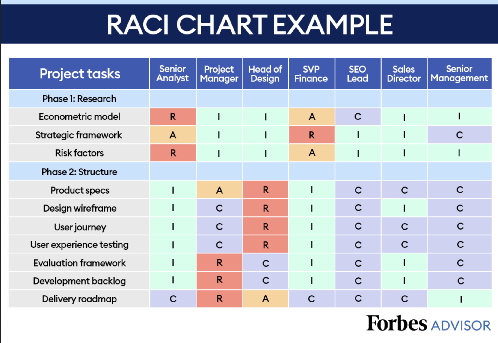

= Project Management

== Agile Reflection

* How has your team incorporated Agile methodology last sprint.

* What worked well with Agile last sprint?

* What did not work well with Agile last sprint?

* What actions can be taken to improve Agile in the future.

== RACI

RACI explained its simple yet powerful - The most watched RACI video on YouTube 

++++

<iframe width="560" height="315" src="https://www.youtube.com/embed/1U2gngDxFkc" title="YouTube video player" frameborder="0" allow="accelerometer; autoplay; clipboard-write; encrypted-media; gyroscope; picture-in-picture; web-share" allowfullscreen></iframe>

++++

=== What is RACI

RACI matrix or chart is a project management tool that is used to clarify roles and responsibilities within a project. RACI stands for Responsible, Accountable, Consulted, and Informed.

=== Responsible
The person or group responsible for completing a specific task or deliverable. They are responsible for doing the work.

=== Accountable
This role delegates,reviews, and ensure the project meets expectations and deadlines. This person responsible for the task's success or failure. There should be only one "A" assigned to each task. 

=== Consulted
Individuals or groups that need to be consulted for their expertise, input, or feedback during the task's execution. These stakeholders are not directly responsible for the task but may offer valuable insights.

=== Informed
Individuals or groups that need to be informed about the progress or results of the task but don't need to be actively involved in its execution.

=== Why use RACI

Have you ever been on a team where:

"There was an important job to be done and Everybody was sure that Somebody would do it. Anybody could have done it, but Nobody did it. Somebody got angry about that because it was Everybody’s job. Everybody thought Anybody could do it, but Nobody realized that Everybody couldn’t do it.It ended up that Everybody blamed Somebody when Nobody did what Anybody could have."
-- Charles Osgood, Everybody, Somebody, Anybody, and Nobody

==== Benefits of using RACI

* Clarifies Roles & Responsibilities

* Promotes Accountability

* Facilitates Decision-Making

* Reduces Conflict and Confusion

Read more the benefits of RACI https://pmo.its.uconn.edu/2017/05/01/the-benefits-of-raci-charting/[UCONN The Benefits of RACI Charting]

=== How to incorporate RACI into Agile

Your team was task with creating a 

++++

<iframe src="https://miro.com/app/live-embed/uXjVMyjEwyI=/?moveToViewport=-1093,-966,2173,1356&embedId=333717965918" scrolling="no" allow="fullscreen; clipboard-read; clipboard-write" allowfullscreen width="768" height="432" frameborder="0"></iframe>

++++

++++

<iframe src="https://miro.com/app/embed/uXjVMyjEwyI=/?pres=1&frameId=3458764560263151081&embedId=876648915234" scrolling="no" allow="fullscreen; clipboard-read; clipboard-write" allowfullscreen width="768" height="432" frameborder="0"></iframe>

++++