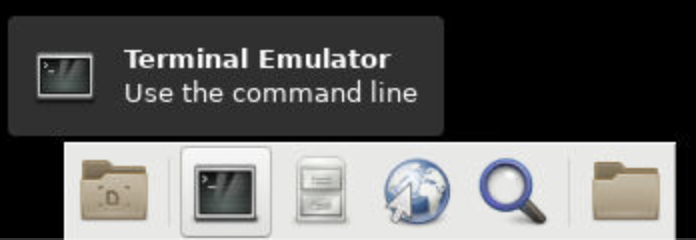

= Anvil Windows VM
The instructions below detail the process of setting up a Windows VM on the Brown high performance computing cluster at Purdue and linking that VM to the secured directories on Anvil. 

== Build the Windows VM
. Connect to https://www.rcac.purdue.edu/compute/brown[Purdue's Brown HPC homepage] and select `Remote Desktop`.
+
image::brown_1.png[The picture shows 3 icons with different options to interact with the Brown HPC. The first is Gateway. The second is Remote Desktop. The third is Jupyter Hub. Each option has a smaller button under it titled Launch, width=792, height=500, loading=lazy, title="Brown HPC Website at Purdue."]
+
. Log-in with multi-factor authentication (Duo).
.. Note: If you're not able to log in, it's probably because you don't have a Brown account. Please email us (datamine-help@purdue.edu) with your Purdue username (not ACCESS username), and then we will add you to our TDM allocation in Brown.
. Once the Remote Desktop session is loaded click the `Terminal Emulator` icon at the bottom of the screen.
+

+
. In the terminal run the command `cd /scratch/brown/<user ID>`.
** Be sure to replace the <user ID> with your ID.
** For example, I would type `cd /scratch/brown/dglass`.
. In this new directory run the command `cp /scratch/brown/dglass/windows-gis.qcow2 .`. 
** Be sure to include the period at the end of the command. 
** This is a large file so it will take 5 to 10 minutes to copy. 
. Now we have our base Windows VM. In order to use it to connect to data on Anvil we have to set up SSH keys. 

== SSH Key Configuration
. Navigate back to your Remote Desktop session (not the Windows VM). 
. In your Remote Desktop session open a new `Terminal Emulator`. 
** If you still have your terminal open you can also run `cd` to go back to your home directory.
. In the `Terminal Emulator` run `cd .ssh`.
** If this errors, run `mkdir .ssh`to create your `.ssh` directory. 
** After that you can run `cd .ssh` again. 
. Once you are in the `.ssh` directory run `ssh-keygen –a 100 –t ed25519 –f ~/.ssh/id_ed25519 –C “anvil_key”`
+
[TIP]
.SSH Key Settings
====
After you run the `ssh-keygen` command above you can hit enter through all of the prompts. 

You *don't* need to set a password for the SSH key.

This command will create the SSH keys that we will use to connect to Anvil.
====
+
. After the `ssh-keygen` command is finished run `cat id_ed25519.pub` and copy the output. 
* We have the SSH key created! Now we need to add it to Anvil. 
. In the `Remote Desktop` session select the earth icon to open a web browser. 
+
image::brown_browser.png[The image shows a trey of different options when logged in to the Remote Desktop session. The second option from the right is a small blue and grey image of the earth with a white mouse curor over it., width=792, height=500, loading=lazy, title="Web Browser."]
+
. In the browser navigate to `ondemand.anvil.rcac.purdue.edu`.
** If the browser warns you of a potential security risk select `Advanced...` and then click `Accept the Risk and Continue`.
. Log-in to Anvil with your ACCESS ID and password. 
. Inside Anvil open a terminal by selecting `Clusters` and then `_Anvil Shell Access`.
+
image::anvil_terminal.png[The image shows a dark grey bar at the top of a web page with many options. The 4th option from the left reads "Clusters" and when hovered over shows and option for Anvil Shell Access., width=792, height=500, loading=lazy, title="Web Browser."]
+
. In the terminal session run `cd .ssh`.
** If the `.ssh` directory does not exist run the `mkdir .ssh` command and then run `cd .ssh` again. 
. Inside the `.ssh` directory run `vi authorized_keys`.
. This will open up a text editor that requires specific commands to make changes:
.. In the open file type `i` to go into insert mode. This will allow you to add new text. 
.. Use `cntrl+v` to paste the SSH key that you copied from the `id_ed25519.pub` file on Brown. 
.. Be sure that the key is copied into a new line within the file. 
.. Hit the `escape` key to leave insert mode then type `:wq` to write and quite the file. 
* You can now close the browser session on Brown. 

== Connect to Anvil with the Windows VM

[TIP]
.Changing VM Settings
====
If you're having trouble viewing items in the Windows VM it can be helpful to change the resolution. 

To do this, right-click on the desktop of the Windows VM and choose `Display Settings`.

Inside the `Display Settings` screen you can scroll down and select `Advanced Display Settings` to change the resolution.
====

* Now we are on to the last step. Connecting our Windows VM on Brown to our data on Anvil. 
. In the `Remote Desktop` session on Brown select `Applications` in the upper-left, followed by `Cluster Software`, and then `Windows 10`.
+
image::brown_cluster.png[The image shows a nested menu on the Brown Remote Desktop session. The options Application, Cluster Software, and then Windows 10 are highlighted with the user's cursor., width=792, height=500, loading=lazy, title="Launching a Cluster."]
+
. Once the Windows VM launched in the `Image Selection` screen select the `Saved Image` option. 
+
image::image_selection.png[The image shows a menu with 3 options. Two are Windows server versions and the third is Saved Image which is highlighted., width=792, height=500, loading=lazy, title="Saved Image Selection."]
+
. On the following selection screen choose your saved `.qcow2` image and click OK.
+
image::image_selection2.png[The image shows a menu with 2 options. They are both files with the qcow2 extension. The file titled windows-gis.qcow2 is highlighted., width=792, height=500, loading=lazy, title="Specific Image."]
+
. When the `Mount Selection` window appears, select the path `/home/<user ID>` and select OK. 
+
image::mount_selection.png[The square menu shows a list of potential file paths with the title mount select. The path that contains home and the user's ID is highlighted for selection., width=792, height=500, loading=lazy, title="Path Mount."]
+
* After the path is selected the Windows VM will open. 
* The Windows VM already had the `SSHFS-Win Manager` application installed. 
* This is the application that we will use for our last step to connect to our data on Anvil. 

== SSHFS on the Windows VM
. Open the `SSHFS-Win Manager` application by selecting the app in the task bar. The app has a blue cloud over a blue drive shaped rectangle. 
+ 
image::sshfs.png[The task bar of the Windows server is displayed. The second icon from the left is selected. The icon is a blue cloud above a blue rectangle and displays SSHFS-Win when the cursor is over it., width=792, height=500, loading=lazy, title="SSHFS-Win."]
+
. In the `SSHFS-Win` application select the `Add Connection` icon. 
+
image::add_connection.png[The SSHFS-Win application is open. Displaying any existing connections and a list of options along the right side of the window. The first option in the menu is highlighted titled add connection., width=792, height=500, loading=lazy, title="Add a New Connection."]
+
. In the new connection information add the fields below:
.. NAME: `anvil_mount`
.. IP/HOST: `anvil.rcac.purdue.edu`
.. USER: ACCESS ID
+
[TIP]
.Finding your ACCESS ID
====
If you don't know your ACCESS ID log-in to ondemand.anvil.rcac.purdue.edu and check the user icon in the upper-right corner.

The ACCESS ID will start with an `x-`.
====
+
.. AUTHENTICATION METHOD: `Private Key (file)`
.. KEY FILE:
... Click on the browse icon.
... In the file explorer click `Desktop` then `My Cluster Scratch`.
... Click the explorer bar next to`qemu` and add `\.ssh` to the path. Hit enter after it has been added. 
+
image::ssh_path.png[The image shows the file explorer window with a file path across the top and a listing of available files in the main section of the screen. The cursor is editing the file path at the top of the window to navigate to the .ssh folder on Brown., width=792, height=500, loading=lazy, title="Update File Path."]
+
... After you hit enter you should now see the `id_ed25519` SSH files that we created earlier. 
... Be sure to select the file that *does not* have the `.pub` extension.
.. PATH: `/anvil/projects/tdm/corporate`
. Click `Save`
. Once the connection information has been saved, click the disconnected plug icon to connect. 
+
image::check_connection.png[The image shows the new connection added to the SSHFS application. To the right of the connection name there is a grey circle with a disconnected plug logo. The user's cursor is highlighting the plug to connect., width=792, height=500, loading=lazy, title="Check SSH Connection."]
+
. If the connection icon turns green and the logo shows as connected then you are successful!
* Once it's connected Windows will act like the SSH connection is a local drive. 
* This means that you can install programs like PowerBI, Tableau, or ArcGIS Pro on the Windows VM and connect them to the SSH drive. 

[IMPORTANT]
.Submitting and Issue
====
If you have any issues please submit a ticket to The Data Mine team by emailing datamine-help@purdue.edu.
====
