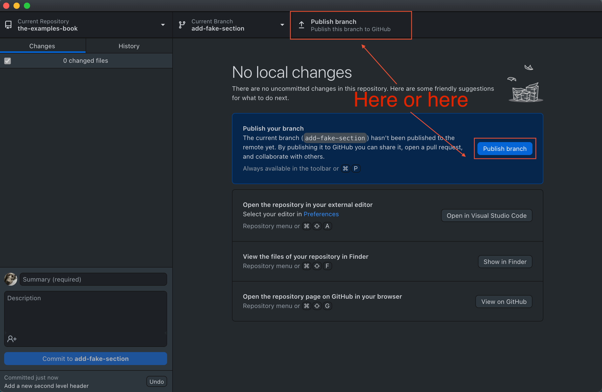
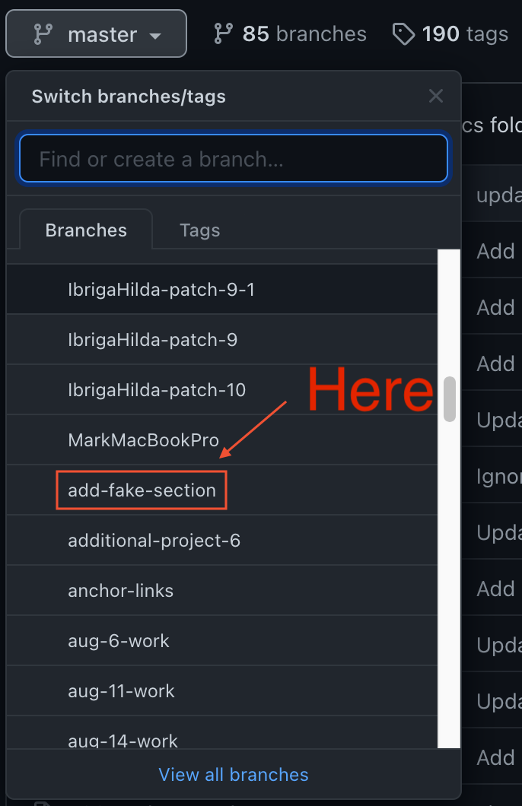

--- 
title: "The Examples Book"
site: "bookdown::bookdown_site"
documentclass: book
bibliography: [book.bib, packages.bib]
biblio-style: apalike
link-citations: yes
# url: 'https\://datamine.purdue.edu/examples/'
# cover-image: "images/cover.png"
github-repo: kevinamstutz/the-examples-book
apple-touch-icon: "images/touch-icon.png"
favicon: "images/favicon.ico"
description: "A book of supplemental examples for The Data Mine at Purdue University."
output:
  bookdown::pdf_book:
    number_sections: no
    includes:
      in_header: "box.tex"
  bookdown::epub_book:
    number_sections: no
  bookdown::gitbook:
    number_sections: no
    md_extensions: +raw_html
knit: (function(inputFile, encoding) {
  bookdown::render_book("index.Rmd", encoding = encoding,
  output_dir = "docs", output_format = "bookdown::gitbook") })
---

```{r, echo=F}
# This code chunk is not displayed. The purpose of this code chunk is to download and load 
# the datasets used throughout the book a single time, in a single place. A list of 
# the datasets names is in datasets.md in the root directory in the repo.
options(timeout = 180)
library(data.table)

# transactions_5000 <- data.frame(fread("http://llc.stat.purdue.edu/5000_transactions.csv", nrows=1000000))
transactions_5000 <- data.frame(fread("5000_transactions.csv"))

grades <- read.csv("grades.csv")

# taxi_201906 <- data.frame(fread("http://llc.stat.purdue.edu/yellow_tripdata_2019-06.csv", nrows=1000000))
taxi_201906 <- data.frame(fread("yellow_tripdata_2019-06.csv"))

flights_sample <- read.csv("flights_sample.csv")
```

# Introduction {#introduction}

**[Click here for video](https://cdnapisec.kaltura.com/p/983291/sp/98329100/embedIframeJs/uiconf_id/29134031/partner_id/983291?iframeembed=true&playerId=kaltura_player&entry_id=1_i7x6tz4r&flashvars[streamerType]=auto&amp;flashvars[localizationCode]=en&amp;flashvars[leadWithHTML5]=true&amp;flashvars[sideBarContainer.plugin]=true&amp;flashvars[sideBarContainer.position]=left&amp;flashvars[sideBarContainer.clickToClose]=true&amp;flashvars[chapters.plugin]=true&amp;flashvars[chapters.layout]=vertical&amp;flashvars[chapters.thumbnailRotator]=false&amp;flashvars[streamSelector.plugin]=true&amp;flashvars[EmbedPlayer.SpinnerTarget]=videoHolder&amp;flashvars[dualScreen.plugin]=true&amp;flashvars[Kaltura.addCrossoriginToIframe]=true&amp;&wid=1_5ixg4x2u)**

This book contains a collection of examples that students can use to reinforce topics learned in The Data Mine seminar. It is an excellent resource for students to learn what they need to know in order to solve The Data Mine projects.

## How to contribute {#how-to-contribute}

There are a variety of ways to make a contribution to this book. For simplicity, we will illustrate the method that we find most user friendly.

### Setup GitHub Desktop and clone the repository

The first step in making a contribution to The Examples Book is to setup and install GitHub Desktop and clone our repository. These steps only need to be performed once on a system to have things configured to make contributions.

1. Setup GitHub Desktop following the directions [here](#github-desktop-install).
2. When you are presented with the following screen, select "Clone a Repository from the Internet...":


3. Click on the "URL" tab, and fill in the first field with "TheDataMine/the-examples-book". In the second field, enter the location where you'd like the repository to be cloned to. Note that this directory _must_ be an empty directory. In this example, the repository will be cloned into `/Users/kamstut/projects/the-examples-book`. The result will be that the folder, `/Users/kamstut/projects/the-examples-book`, will contain all of the files and folders from the repository. Click "Clone".


4. Upon completion, you will be presented with the following screen. Congratulations, you've successfully setup GitHub Desktop and cloned The Examples Book repository.


### Making a contribution

1. At this point in time, your current _branch_ will be the `master` branch. [Create a new _branch_](#github-desktop-create-new-branch) with whatever name you'd like. For example, `fix-spelling-errors-01` or `add-fake-section`.

**Important note:** Think of a _branch_ as a copy of the repository. Typically, a new branch is created for each feature of a project. In the case of our book, this could be an article or a project. Changes are made to the files within the branch, committed, a pull request is made, the changes are reviewed, and then the branch is _merged_ into the `master` branch (which holds our source of truth, final, or deployed code).

2. Open up RStudio. Click on `File > Open Project...`, navigate an click on the project folder, in this case, `/Users/kamstut/projects/the-examples-book`. Click "Open".

**Important note:**

There are currently 13 `.Rmd` files that can be modified to make additions or changes to the book:

- `index.Rmd`
- `01-scholar.Rmd`
- `02-data-formats.Rmd`
- `03-unix.Rmd`
- `04-sql.Rmd`
- `05-r.Rmd`
- `06-python.Rmd`
- `07-tools.Rmd`
- `08-faqs.Rmd`
- `09-projects.Rmd`
- `10-fall2020-projects.Rmd`
- `11-corporate-partners.Rmd`
- `12-contributors.Rmd`

The content in the book starts in `index.Rmd` and continues sequentially, file by file. The preceding numbers indicate the order in which Bookdown will render the content. Each individual `.Rmd` file creates a single HTML file, and a top-level section of the book. If you wanted to add a section for `Julia` under the `python` section, for example, you would need to create a new RMarkdown file called `07-julia.Rmd`, and rename the following RMarkdown files accordingly (`08-tools.Rmd`, `09-faqs.Rmd`, etc.).

First level markdown headers starting with `#` are rendered into top-level menu items in the left-hand table of contents. Second level markdown headers starting with `##` are rendered into secondary menu items nested beneath the preceding first level markdown headers. Similarly, third level markdown headers starting with `###` are rendered into tertiary menu items nested beneath the preceding second level markdown headers.

In the following example, "First second level header" _and_ "Second second level header" would be nested under "First level header", and "First third level header" would be nested under "First second level header":

````
# First level header

## First second level header

### First third level header

## Second second level header
````

At this time only the first three levels of headers are rendered in the table of contents. Level 4-6 headers only have a visual effect and automatic anchor links.

3. Make modifications or additions to any of the 13+ `.Rmd` files. As you make changes, these changes will be shown in GitHub Desktop. Here, we've made a single addition of `## Test change` to `01-scholar.Rmd`. 


4. The next step is to _commit_ your changes. Think of a _commit_ as a local save that has an associated title (required) and description (optional). Here is an example.


5. Once you are pleased with your modifications, you need to publish your branch. To do so click on "Publish branch". This uploads your branch, in our case `add-fake-section`, to our _remote_ repository, or the repository that GitHub is hosting. What you are working on in your computer is referred to as your _local_ repository. Typically, you will make changes to a _local_ repository and _push_ those changes to the _remote_ repository.



**Important note:**

In fact, if you navigate to https://github.com/TheDataMine/the-examples-book, you will see that the branch, `add-fake-section` is now visible online.



6. Excellent. The next step is to [create a pull request](#github-desktop-pull-request). To do so, click the "Create Pull Request" button on GitHub Desktop. This should launch your browser and you should be presented with a page that looks similar to the following. On this page, you will be able to provide a title and description for the request. Note that the description is markdown friendly (clicking "Preview" allows you to see the rendered result). In addition, you can assign a reviewer, add labels, etc. At a minimum, you should add a title and description. Once satisfied, click "Create pull request".


**Important note:** Prior to this terms like _commit_, _branch_, _local_, _remote_, etc., have been generic. Those terms apply to `git`, in general. A _pull request_ is a GitHub specific term and not all `git` cloud providers use the same terminology. For example, GitLab uses the term _merge request_.

7. At this point in time, the repository owner will be notified, changes will be reviewed, and eventually merged. Once merged, changes are launched to the website within about 10 minutes. Please note you can continue to make changes and commit to your branch at any time. Changes will automatically be included in your pending pull request.
