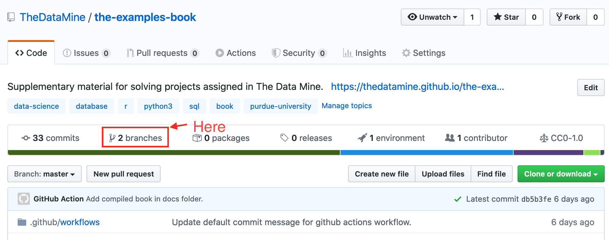
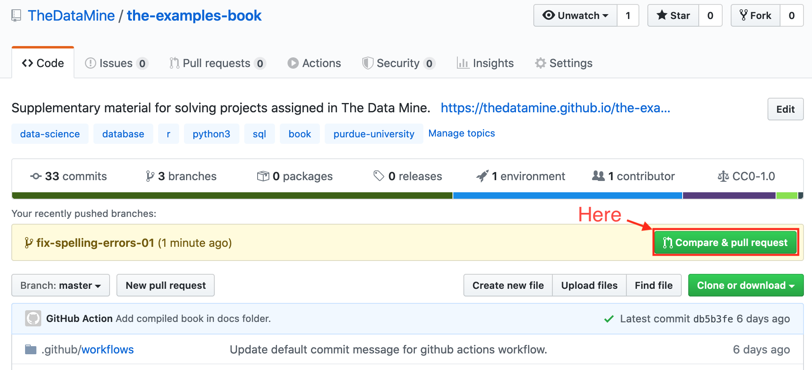
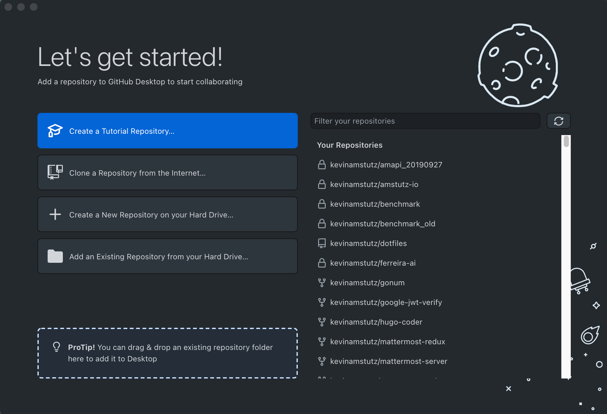
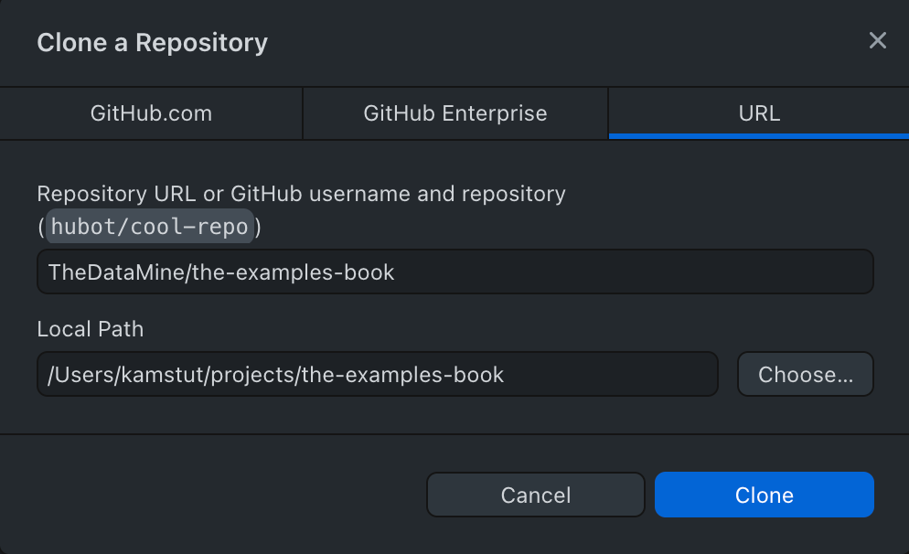
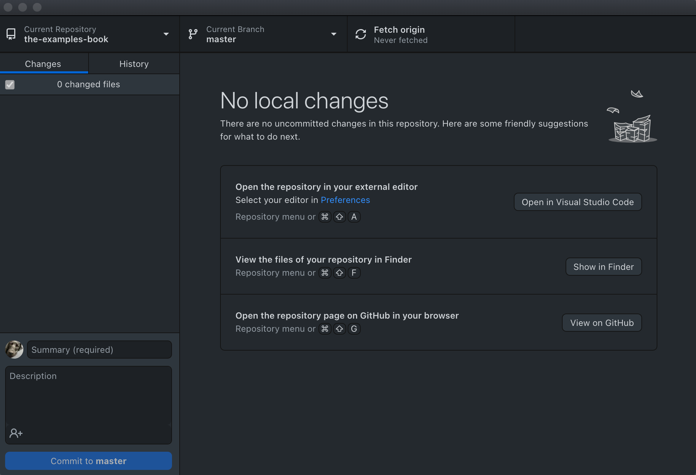
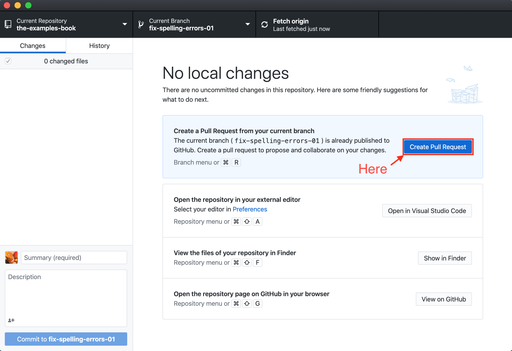
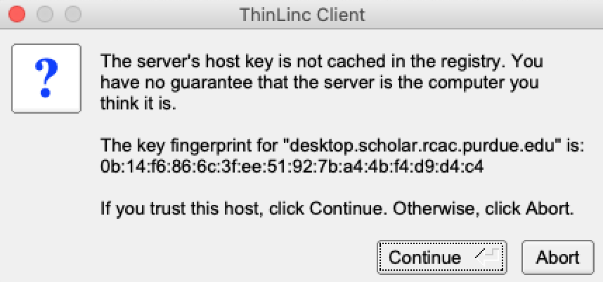
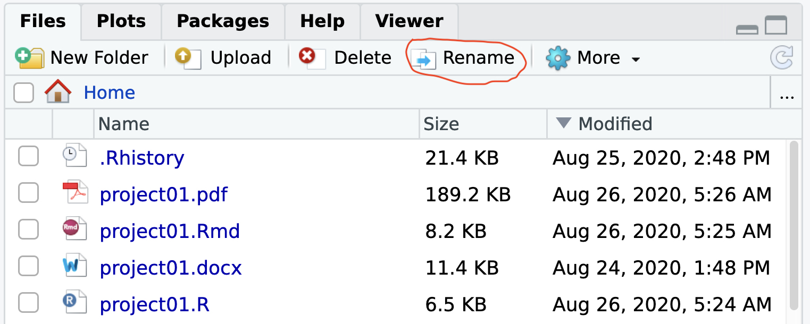

--- 
title: "The Examples Book"
site: "bookdown::bookdown_site"
documentclass: book
bibliography: [book.bib, packages.bib]
biblio-style: apalike
link-citations: yes
# url: 'https\://datamine.purdue.edu/examples/'
# cover-image: "images/cover.png"
github-repo: kevinamstutz/the-examples-book
apple-touch-icon: "images/touch-icon.png"
favicon: "images/favicon.ico"
description: "A book of supplemental examples for The Data Mine at Purdue University."
output:
  bookdown::pdf_book:
    number_sections: no
    includes:
      in_header: "box.tex"
  bookdown::epub_book:
    number_sections: no
  bookdown::gitbook:
    number_sections: no
    md_extensions: +raw_html
knit: (function(inputFile, encoding) {
  bookdown::render_book(inputFile, encoding = encoding,
  output_dir = "docs", output_format = "all") })
---

<script type="application/json" class="js-hypothesis-config">

{"showHighlights": false}

</script>

<script src="https://hypothes.is/embed.js" async></script>

# Introduction {#introduction}

<iframe id="kaltura_player" src="https://cdnapisec.kaltura.com/p/983291/sp/98329100/embedIframeJs/uiconf_id/29134031/partner_id/983291?iframeembed=true&playerId=kaltura_player&entry_id=1_i7x6tz4r&flashvars[streamerType]=auto&amp;flashvars[localizationCode]=en&amp;flashvars[leadWithHTML5]=true&amp;flashvars[sideBarContainer.plugin]=true&amp;flashvars[sideBarContainer.position]=left&amp;flashvars[sideBarContainer.clickToClose]=true&amp;flashvars[chapters.plugin]=true&amp;flashvars[chapters.layout]=vertical&amp;flashvars[chapters.thumbnailRotator]=false&amp;flashvars[streamSelector.plugin]=true&amp;flashvars[EmbedPlayer.SpinnerTarget]=videoHolder&amp;flashvars[dualScreen.plugin]=true&amp;flashvars[Kaltura.addCrossoriginToIframe]=true&amp;&wid=1_5ixg4x2u" allowfullscreen webkitallowfullscreen mozAllowFullScreen allow="autoplay *; fullscreen *; encrypted-media *" sandbox="allow-forms allow-same-origin allow-scripts allow-top-navigation allow-pointer-lock allow-popups allow-modals allow-orientation-lock allow-popups-to-escape-sandbox allow-presentation allow-top-navigation-by-user-activation" frameborder="0" title="Kaltura Player"></iframe>

This book contains a collection of examples that students can use to reinforce topics learned in The Data Mine seminar. It is an excellent resource for students to learn what they need to know in order to solve The Data Mine projects.

## How to contribute {#how-to-contribute}

Contributing to this book is simple:


### Small changes and additions

If you have a small change or addition you'd like to make to the book, the easiest way to quickly contribute would be the following method.

1. Navigate to the page or section that needs to be edited
2. Click on the "Edit" button towards the upper left side of the page:


3. You'll be presented with the respective RMarkdown file. Make your modifications.
4. In the "Commit changes" box, select the radio button that says _Create a **new branch** for this commit and start a pull request._ Give your pull request a title and a detailed description. Name the new branch, and click on "Propose file change".
5. You've successfully submitted a pull request. Our team will review and merge the request shortly thereafter.

### Larger changes or additions

If you have larger changes or additions you'd like to make to the book, the easiest way is to edit the contents of the book on your local machine. 

#### Using `git` in the terminal

1. Setup `git` following the directions [here](#git-install).
2. Start by opening up a terminal and [configuring `git` to work with GitHub](#configure-git).
3. Navigate to the directory in which you would like to clone the-examples-book repository. For example, if I wanted to clone the repository in my `~/projects` folder, I'd first execute: `cd ~/projects`. 
4. [Clone the repository](#git-clone-repository). In this example, let's assume I've cloned the repository into my `~/projects` folder.
5. Navigate into the project folder:

```bash
cd ~/projects/the-examples-book
```

6. At this point in time your current branch should be the `master` branch. You can verify by running:

```bash
git branch
```

**Note:** The highlighted branch starting with "*" is the current branch.

or if you'd like just the name of the branch:

```bash
git rev-parse --abbrev-ref HEAD
```

7. [Create a new branch](#git-create-new-branch) with whatever name you'd like, and check that branch out. For example, `fix-spelling-errors-01`.

8. Open up RStudio. In the "Files" tab in RStudio, navigate to the repository. In this example, we would navigate to `/Users/kamstut/Documents/GitHub/the-examples-book`. Click on the "More" dropdown and select "Set As Working Directory". 
9. If you do not already have `renv` installed, install it by running the following commands in the console:

```r
install.packages("renv")
```

10. Restore the environment by running the following commands in the console:

```r
renv::restore()
```

11. In order to compile this book, you must have LaTeX installed. The easiest way to accomplish this is to run the following in the R console:

```r
install.packages("tinytex")
library(tinytex)
tinytex::install_tinytex()
```

12. In addition, make sure to install both `pandoc` and `pandoc-citeproc` by following the instructions [here](https://pandoc.org/installing.html).

13. Modify the `.Rmd` files to your liking. 
14. Click the "Knit" button to compile the book. The resulting "book" is within the "docs" folder.

**Important note:** If at any point in time you receive an error saying something similar to "there is no package called `my_package`, simply install the missing package, and try to knit again:

```r
install.packages("my_package")
library(my_package)
```

15. To test the book out, navigate to the "docs" folder and open the `index.html` in the browser of your choice. 
16. When you are happy with the modifications you've made, [commit your changes](#git-commit-changes) to the repository.
17. You can continue to make modifications and commit your changes locally. When you are ready, you can [push your branch](#git-push-local-commits) to the remote repository (github.com).
18. At this point in time, you can confirm that the branch has been succesfully pushed to github.com by navigating to the repository on github, and click on the "branches" tab:



19. Next, [create a pull request](). Note that a "Pull Request" is a GitHub-specific concept. You cannot create a pull request using `git`. Navigate to the repository https://github.com/thedatamine/the-examples-book, and you should see a message asking if you'd like to create a pull request:



20. Leave a detailed comment about what you've modified or added to the book. You can click on "Preview" to see what your comment will look like. [GitHub's markdown](https://help.github.com/en/github/writing-on-github/basic-writing-and-formatting-syntax) applies here. Once satisfied, click "Create pull request". 

21. At this point in time, the repository owners will receive a notification and will check and potentially merge the changes into the `master` branch.


#### Using GitHub Desktop

1. Setup GitHub Desktop following the directions [here](#github-desktop-install).
2. When you are presented with the following screen, select "Clone a Repository from the Internet...":


3. Click on the "URL" tab:



4. In the first field, enter "TheDataMine/the-examples-book". This is the repository for this book.
5. In the second field, enter the location in which you'd like the repository to be cloned to. In this example, the repository will be cloned into `/Users/kamstut/Documents/GitHub`. The result will be a new folder called `the-examples-book` in `/Users/kamstut/Documents/GitHub`. 
6. Click "Clone".
7. Upon completion, you will be presented with a screen similar to this:



8. At this point in time, your current branch will be the `master` branch. [Create a new branch](#github-desktop-create-new-branch) with whatever name you'd like. For example, `fix-spelling-errors-01`.
9. Open up RStudio. In the "Files" tab in RStudio, navigate to the repository. In this example, we would navigate to `/Users/kamstut/Documents/GitHub/the-examples-book`. Click on the "More" dropdown and select "Set As Working Directory". 
10. If you do not already have `renv` installed, install it by running the following commands in the console:

```r
install.packages("renv")
```

11. Restore the environment by running the following commands in the console:

```r
renv::restore()
```

12. In order to compile this book, you must have LaTeX installed. The easiest way to accomplish this is to run the following in the R console:

```r
install.packages("tinytex")
library(tinytex)
tinytex::install_tinytex()
```

13. In addition, make sure to install both `pandoc` and `pandoc-citeproc` by following the instructions [here](https://pandoc.org/installing.html).

14. Modify the `.Rmd` files to your liking. 
15. Click the "Knit" button to compile the book. The resulting "book" is within the "docs" folder.

**Important note:** If at any point in time you receive an error saying something similar to "there is no package called `my_package`, simply install the missing package, and try to knit again:

```r
install.packages("my_package")
library(my_package)
```

16. To test the book out, navigate to the "docs" folder and open the `index.html` in the browser of your choice. 
17. When you are happy with the modifications you've made, [commit your changes](#github-desktop-commit-changes) to the repository.
18. You can continue to make modifications and commit your changes locally. When you are ready, you can [publish your branch](#github-desktop-publish-branch):


19. Upon publishing your branch, within GitHub Desktop, you'll be presented with the option to [create a pull request](#github-desktop-pull-request):



20. At this point in time, the repository owners will receive a notification and will check and potentially merge the changes into the `master` branch.

<!--chapter:end:index.Rmd-->

# Scholar {#scholar}

## Connecting to Scholar {#connecting-to-scholar}

There are a variety of ways to connect to Scholar; however, the primary method (and maybe the only method) we will use this semester is [RStudio Server Pro](#rstudio-server-pro). To see how one may approach solving a project this semester, watch Dr. Ward connect to RStudio Server Pro and demonstrate how to compile a project [here](#templates).

### RStudio Server Pro {#rstudio-server-pro}

**Getting started with Scholar and RStudio: part I**
<iframe id="kaltura_player" src="https://cdnapisec.kaltura.com/p/983291/sp/98329100/embedIframeJs/uiconf_id/29134031/partner_id/983291?iframeembed=true&playerId=kaltura_player&entry_id=1_vw9pj4ip&flashvars[streamerType]=auto&amp;flashvars[localizationCode]=en&amp;flashvars[leadWithHTML5]=true&amp;flashvars[sideBarContainer.plugin]=true&amp;flashvars[sideBarContainer.position]=left&amp;flashvars[sideBarContainer.clickToClose]=true&amp;flashvars[chapters.plugin]=true&amp;flashvars[chapters.layout]=vertical&amp;flashvars[chapters.thumbnailRotator]=false&amp;flashvars[streamSelector.plugin]=true&amp;flashvars[EmbedPlayer.SpinnerTarget]=videoHolder&amp;flashvars[dualScreen.plugin]=true&amp;flashvars[Kaltura.addCrossoriginToIframe]=true&amp;&wid=1_0gmky2np" allowfullscreen webkitallowfullscreen mozAllowFullScreen allow="autoplay *; fullscreen *; encrypted-media *" sandbox="allow-forms allow-same-origin allow-scripts allow-top-navigation allow-pointer-lock allow-popups allow-modals allow-orientation-lock allow-popups-to-escape-sandbox allow-presentation allow-top-navigation-by-user-activation" frameborder="0" title="Kaltura Player"></iframe>

**Getting started with Scholar and RStudio: part II**
<iframe id="kaltura_player" src="https://cdnapisec.kaltura.com/p/983291/sp/98329100/embedIframeJs/uiconf_id/29134031/partner_id/983291?iframeembed=true&playerId=kaltura_player&entry_id=1_tfix4qd2&flashvars[streamerType]=auto&amp;flashvars[localizationCode]=en&amp;flashvars[leadWithHTML5]=true&amp;flashvars[sideBarContainer.plugin]=true&amp;flashvars[sideBarContainer.position]=left&amp;flashvars[sideBarContainer.clickToClose]=true&amp;flashvars[chapters.plugin]=true&amp;flashvars[chapters.layout]=vertical&amp;flashvars[chapters.thumbnailRotator]=false&amp;flashvars[streamSelector.plugin]=true&amp;flashvars[EmbedPlayer.SpinnerTarget]=videoHolder&amp;flashvars[dualScreen.plugin]=true&amp;flashvars[Kaltura.addCrossoriginToIframe]=true&amp;&wid=1_ugceh28o" allowfullscreen webkitallowfullscreen mozAllowFullScreen allow="autoplay *; fullscreen *; encrypted-media *" sandbox="allow-forms allow-same-origin allow-scripts allow-top-navigation allow-pointer-lock allow-popups allow-modals allow-orientation-lock allow-popups-to-escape-sandbox allow-presentation allow-top-navigation-by-user-activation" frameborder="0" title="Kaltura Player"></iframe>

1. Open a browser and navigate to https://rstudio.scholar.rcac.purdue.edu/.
2. Enter your Purdue Career Account credentials (using BoilerKey, namely, your 4 digit code, then a comma, and then a BoilerKey numerical sequence).
3. Congratulations, you should now be able to create and run R scripts on Scholar!

## Other ways to connect

These are some other ways to connect to Scholar. Please feel free to explore; however, note that, at this time, there is no real reason to connect using these methods. You are encouraged to use [RStudio Server Pro](#rstudio-server-pro), and go through the video provided [here](#templates) to get started.

### ThinLinc web client {#connecting-with-thinlinc-webclient}

1. Open a browser and navigating to https://desktop.scholar.rcac.purdue.edu/.
2. Login with your Purdue Career Account credentials (using BoilerKey, namely, your 4 digit code, then a comma, and then a Boilerkey numerical sequence).
3. Congratulations, you should now be connected to Scholar using the ThinLinc web client.

### ThinLinc client {#connecting-with-thinlinc-client}

1. Navigate to https://www.cendio.com/thinlinc/download, and download the ThinLinc client application for your operating system. 
2. Install and launch the ThinLinc client:

3. Enter your Purdue Career Account information (using BoilerKey, namely, your 4 digit code, then a comma, and then a Boilerkey numerical sequence), as well as the server: `desktop.scholar.rcac.purdue.edu`.
4. Click on "Options..." and fill out the "Screen" tab as shown below:

5. Click "OK" and then "Connect". **Make sure you are connected to Purdue's VPN using AnyConnect before clicking "Connect"!**
6. If you are presented with a choice like below, click "Continue".

7. Congratulations, you are now successfully connected to Scholar using the ThinLinc client.

**NOTE: If you do accidentally get stuck in full screen mode, the F8 key will help you to escape.**

**NOTE: The very first time that you log onto Scholar, you will have an option of “use default config” or “one empty panel”. PLEASE choose the “use default config”.**

### SSH {#connecting-with-ssh}

#### Windows {#connecting-to-scholar-ssh-windows}

#### MacOS {#connecting-to-scholar-ssh-macos}

#### Linux {#connecting-to-scholar-ssh-linux}

### JupyterHub {#jupyterhub}

1. Open a browser and navigate to https://notebook.scholar.rcac.purdue.edu/.
2. Enter your Purdue Career Account credentials (using BoilerKey, namely, your 4 digit code, then a comma, and then a Boilerkey numerical sequence).
3. Congratulations, you should now be able to create and run Jupyter notebooks on Scholar!

## Resources {#scholar-resources}

<!--chapter:end:01-scholar.Rmd-->

# Unix {#unix}

## Getting started {#unix-getting-started}

We made a video to remind people about how to get comfortable with UNIX commands:

<iframe id="kaltura_player" src="https://cdnapisec.kaltura.com/p/983291/sp/98329100/embedIframeJs/uiconf_id/29134031/partner_id/983291?iframeembed=true&playerId=kaltura_player&entry_id=1_9mz5s0wd&flashvars[streamerType]=auto&amp;flashvars[localizationCode]=en&amp;flashvars[leadWithHTML5]=true&amp;flashvars[sideBarContainer.plugin]=true&amp;flashvars[sideBarContainer.position]=left&amp;flashvars[sideBarContainer.clickToClose]=true&amp;flashvars[chapters.plugin]=true&amp;flashvars[chapters.layout]=vertical&amp;flashvars[chapters.thumbnailRotator]=false&amp;flashvars[streamSelector.plugin]=true&amp;flashvars[EmbedPlayer.SpinnerTarget]=videoHolder&amp;flashvars[dualScreen.plugin]=true&amp;flashvars[Kaltura.addCrossoriginToIframe]=true&amp;&wid=1_0y4x1feo" width="400" height="285" allowfullscreen webkitallowfullscreen mozAllowFullScreen allow="autoplay *; fullscreen *; encrypted-media *" sandbox="allow-forms allow-same-origin allow-scripts allow-top-navigation allow-pointer-lock allow-popups allow-modals allow-orientation-lock allow-popups-to-escape-sandbox allow-presentation allow-top-navigation-by-user-activation" frameborder="0" title="Kaltura Player"></iframe>

This is the easiest book for learning this stuff; it is short and gets right to the point:

https://go.oreilly.com/purdue-university/library/view/-/0596002610

you just log in and you can see it all; we suggest Chapters 1, 3, 4, 5, 7 (you can basically skip chapters 2 and 6 the first time through).

It is a very short read (maybe, say, 2 or 3 hours altogether?), just a thin book that gets right to the details.

Zoe Yang asked us about the difference in these 5 words: bash/Linux/terminal/shell/UNIX.  Here you go:

UNIX(Unix) and Linux are operating systems, just like Mac OS X and Windows 10 are operating systems.  There are many variants.  Within Linux, the main different is the kernel (the main piece of code that makes things work) and sometimes the default configurations, like the GUI (i.e., the way stuff looks when you log in and see your desktop and interact with the windows and folders and files).  UNIX dates back to the 1970's, and was from AT&T Bell Labs, and then people decided to make lots and lots of variants of this, and hence, the many flavors of Linux.

OK?  The terminal is an application that runs in UNIX or Linux.  It is the thing that you open and type things into it, and you see the output.

It is hard to tell the difference between the terminal and the shell.  The shell is the way that you interact with UNIX/Linux directly (without pointing and clicking).  You can tell the shell directly what you want to do with the files on the computer, for instance.  You might think that the terminal and the shell are the same thing, but they are not quite.  There are lots of different types of shells that can run in the terminal.  To see which one you are using, you can type:

`echo $SHELL`

By default, it will say:

`/bin/bash`

There are other shells in your `/bin` directory.  `bash` (Bourne Again SHell) is the default one.  Many people consider this to be the "best" shell, or at least, the one that people know the most.  Others are Bourne (`sh`), Korn (`ksh`), Z shell (`zsh`), C shell (`csh`), TENEX C shell (`tcsh`), and dozens more.  Any of these shells would run in the terminal, just like `bash` does, and you might not even realize at the start which shell you are using, unless you type the command mentioned above:

`echo $SHELL`

They each have differences, but some of the differences are small.  Again, `bash` is still the default on most Linux operating systems.  A big recent change is that Mac OS Catalina just started using `zsh` instead of `bash` as the default shell but it is just because of a licensing issue, and Dr Ward thinks that Mac users who open the terminal and use the shell are very likely to switch from `zsh` back to `bash`.  That's what Dr Ward did immediately when Apple made this change to `zsh`, i.e., he switched back to `bash`.

Wow, sorry for the long-winded answer.


## Standard utilities {#unix-utilities}

### `man` {#man}

`man` stand for manual and is a command which presents all of the information you need in order to use a command. To use `man` simply execute `man <command>` where command is the command for which you want to read the manual. 

You can scroll up by typing "k" or the up arrow. You can scroll down by typing "j" or the down arrow. To exit the man pages, type "q" (for quit).

#### How do I show the man pages for the `wc` utility?
<details>
    <summary>Click here for solution</summary>
```{bash, eval=F}
man wc
```
</details>

### `cat` {#cat}

`cat` stands for concatenate and print files. It is an extremely useful tool that prints the entire contents of a file by default. This is especially useful when we want to quickly check to see what is inside of a file. It can be used as a tool to output the contents of a file and immediately pipe the contents to another tool for some sort of analysis if the other tool doesn't natively support reading the contents from the file.

A similar, but alternative UNIX command that incrementally shows the contents of the file is called `less`. `less` starts at the top of the file and scrolls through the rest of the file as the user pages down.

### `head` {#head}

`head` is a simple utility that displays the first _n_ lines of a file, or input.

#### How do I show the first 5 lines of a file called `input.txt`?
<details>
    <summary>Click here for solution</summary>
```{bash, eval=F}
head -n5 input.txt
```

Alternatively:
```{bash, eval=F}
cat input.txt | head -n5
```

</details>

### `tail` {#tail}

`tail` is a similar utility to `head`, that displays the last _n_ lines of a file, or input.

#### How do I show the last 5 lines of a file called `input.txt`?
<details>
    <summary>Click here for solution</summary>
```{bash, eval=F}
tail -n5 input.txt
```

Alternatively:
```{bash, eval=F}
cat input.txt | tail -n5
```

</details>


### `ls` {#ls}

`ls` is a utility that lists files and folders. By default, `ls` will list the files and folders in your current working directory. To list files in a certain directory, simply provide the directory to `ls` as the first argument.

#### How do I list the files in my `$HOME` directory?
<details>
    <summary>Click here for solution</summary>
```{bash, eval=F}
ls $HOME

# or

ls ~
```
</details>

#### How do I list the files in the directory `/home/$USER/projects`?
<details>
    <summary>Click here for solution</summary>
```{bash, eval=F}
ls /home/$USER/projects
```
</details>

#### How do I list all files and folders, including hidden files and folders in `/home/$USER/projects`?
<details>
    <summary>Click here for solution</summary>
```{bash, eval=F}
ls -a /home/$USER/projects
```
</details>

#### How do I list all files and folders in `/home/$USER/projects` in a list format, including information like permissions, filesize, etc?
<details>
    <summary>Click here for solution</summary>
```{bash, eval=F}
ls -l /home/$USER/projects
```
</details>

#### How do I list all files and folders, including hidden files and folders in `/home/$USER/projects` in a list format, including information like permissions, filesize, etc?
<details>
    <summary>Click here for solution</summary>
```{bash, eval=F}
ls -la /home/$USER/projects

# or

ls -al /home/$USER/projects

# or

ls -l -a /home/$USER/projects
```
</details>

### `du` {#du}

`du` is a tool used to get file space usage.

#### Examples

##### How do I get the size of a file called `./metadata.csv` in bytes?

<details>
    <summary>Click here for solution</summary>
```{bash, eval=T}
du -b ./metadata.csv
```
</details>

##### How do I get the size of a file called `./metadata.csv` in kilobytes?

<details>
    <summary>Click here for solution</summary>
```{bash, eval=T}
du -k ./metadata.csv
```
</details>

##### Why is the result of `du -b ./metadata.csv` divided by 1024 not the result of `du -k ./metadata.csv`?

<details>
    <summary>Click here for solution</summary>
    
`du` reports disk usage by default not necessarily actual size. File systems typically divide a disk into _blocks_. When a program tells the file system it wants say 3 bytes of space, if the block size is 1024 bytes, the file system may allocate 1024 bytes of space to store the 3 bytes of data. To see the apparent size, do this:

```{bash, eval=T}
du -b ./metadata.csv
du -k --apparent-size ./metadata.csv
```
</details>

### `cp` {#cp}

`cp` is a utility used for copying files an folders from one location to another.

#### How do I copy `/home/$USER/some_file.txt` to `/home/$USER/projects/same_file.txt`?
<details>
    <summary>Click here for solution</summary>
```{bash, eval=F}
cp /home/$USER/some_file.txt /home/$USER/projects/same_file.txt

# If currently in /home/$USER
cd $HOME
cp some_file.txt projects/same_file.txt

# If currently in /home/$USER/projects
cd $HOME/projects
cp ../some_file.txt .
```
</details>

### `mv` {#mv}

`mv` very similar to `cp`, but rather than copy a file, `mv` moves the file. Moving a file removes it from its old location and places it in the new location.

#### How do I move `/home/$USER/some_file.txt` to `/home/$USER/projects/same_file.txt`?
<details>
    <summary>Click here for solution</summary>
```{bash, eval=F}
mv /home/$USER/some_file.txt /home/$USER/projects/same_file.txt

# If currently in /home/$USER
cd $HOME
mv some_file.txt projects/same_file.txt

# If currently in /home/$USER/projects
cd $HOME/projects
mv ../some_file.txt .
```
</details>

### `touch` {#touch}

`touch` is a command used to update the access and modification times of a file to the current time. More commonly, it is used to create an empty file that you can add contents to later on. To use this command, type `touch` followed by the file name (with the intended file path added when necessary).

### `mkdir` {#mkdir}

`mkdir` is the command to create a directory. It is simple to use, just type `mkdir` followed by a path to the new directory.

#### Examples

##### How do I create a new directory called `my_directory` in the current directory?

<details>
    <summary>Click here for solution</summary>
```{bash, eval=F}
mkdir my_directory
```
</details>

##### How do I create a new directory called `my_directory` in the parent directory?

<details>
    <summary>Click here for solution</summary>
```{bash, eval=F}
mkdir ../my_directory
```
</details>

##### How do I create a set of two new nested directories in the current directory?

<details>
    <summary>Click here for solution</summary>
```{bash, eval=F}
# You can either make the directories one at a time like this:
mkdir first_dir
cd first_dir
mkdir second_dir

# Or, you can use the -p option:
mkdir -p first_dir/second_dir
```
</details>

### `rm` {#rm}

`rm` is the command to remove files or directories. You can find the available options by checking its [manual page](#man). 

#### Examples

##### How do I remove a folder called `my_folder` and all of its contents recursively. Assume `my_folder` is in `/home/user/projects`.

<details>
    <summary>Click here for solution</summary>
```{bash, eval=F}
rm -r /home/user/projects/my_folder
```
</details>

##### How do I remove all files in a folder ending in `.txt`? Assume we are looking at files in `/home/user/projects`.

<details>
    <summary>Click here for solution</summary>
```{bash, eval=F}
rm /home/user/projects/*.txt
```
</details>

### `rmdir` {#rmdir}

`rmdir` is a tool to remove empty directories. Simply type `rmdir` followed by the path to the empty directory you'd like to remove. Note that this command only removes empty directories. For this reason, `rm` is better suited to remove directories with content.

### `pwd` {#pwd}

`pwd` stands for print working directory and it does just that -- it prints the current working directory to standard output.

### `type` {#type}

`type` is a useful command to find the location of some command, or whether the command is an alias, function, or something else.

#### Where is the file that is executed when I type `ls`?
<details>
    <summary>Click here for solution</summary>
```{bash, eval=T}
type ls
```
</details>

### `uniq` {#uniq}

`uniq` reads the lines of a specified input file and compares each adjacent line and returns each unique line. Repeated lines in the input will not be detected if they are not adjacent. What this means is you must sort prior to using `uniq` if you want to ensure you have no duplicates.

### `wc` {#wc}

You can think of `wc` as standing for "word count". `wc` displays the number of lines, words, and bytes from the input file.

#### How do I count the number of lines of an input file called `input.txt`?
<details>
    <summary>Click here for solution</summary>
```{bash, eval=F}
wc -l input.txt
```
</details>

#### How do I count the number of characters of an input file called `input.txt`?
<details>
    <summary>Click here for solution</summary>
```{bash, eval=F}
wc -m input.txt
```
</details>

#### How do I count the number of words of an input file called `input.txt`?
<details>
    <summary>Click here for solution</summary>
```{bash, eval=F}
wc -w input.txt
```
</details>

### `ssh` {#ssh}

#### `mosh` {#mosh}

### `scp` {#scp}

### `cut` {#cut}

`cut` is a tool to cut out parts of a line based on position/character/delimiter/etc and directing the output to stdout. It is particularly useful to get a certain column of data.

#### How do I get the first column of a csv file called 'office.csv`?

<details>
    <summary>Click here for solution</summary>
```{bash, eval=F}
cut -d, -f1 office.csv
```
</details>

#### How do I get the first and third column of a csv file called 'office.csv`?

<details>
    <summary>Click here for solution</summary>
```{bash, eval=F}
cut -d, -f1,3 office.csv
```
</details>

#### How do I get the first and third column of a file with columns separated by the "|" character?

<details>
    <summary>Click here for solution</summary>
```{bash, eval=F}
cut -d '|' -f1,3 office.csv
```
</details>

### `awk` {#awk}

`awk` is a powerful programming language that specializes in processing and manipulating text data. 

In awk, a command looks something like this:

`awk -F, 'BEGIN{  }  {  }  END{  }'`

The delimiter is specified with the `-F` option (in this case our delimiter is a comma). The BEGIN chunk is run only once at the start of execution. The middle chunk is run once per line of the file. The END chunk is run only once, at the end of execution.

The BEGIN and END portions are always optional. 

The variables: `$1`, `$2`, `$3`, etc., refer to the 1st, 2nd, and 3rd fields in a line of data. For example, the following would print the 4th field of every row in a csv file:

```{bash, eval=F}
awk -F, '{print $4}'
```

`$0` represents the entire row.

`awk` is very powerful. We can achieve the same effect as using `cut`:

```{bash, eval=F}
head 5000_products.csv | cut -d, -f3

# or

head 5000_products.csv | awk -F, '{print $3}'
```

#### Examples

##### How do I print only rows where the `DAYOFWEEK` is `5`?

<details>
    <summary>Click here for solution</summary>
```{bash, eval=T}
head metadata.csv | awk -F, '{if ($3 == 5) {print $0}}'
```
</details>

##### How do I print the first, fourth, and fifth columns of rows where the `DAYOFWEEK` is `5`?

<details>
    <summary>Click here for solution</summary>
```{bash, eval=T}
head metadata.csv | awk -F, '{if ($3 == 5) {print $1, $4, $5}}'
```
</details>

##### How do I print only rows where `DAYOFWEEK` is `5` OR `YEAR` is `2015`?

<details>
    <summary>Click here for solution</summary>
```{bash, eval=T}
head metadata.csv | awk -F, '{if ($3 == 5 || $7 == 2015) {print $0}}'
```
</details>

##### How do I print only rows where `DAYOFWEEK` is `5` AND `YEAR` is `2015`?

<details>
    <summary>Click here for solution</summary>
```{bash, eval=T}
head metadata.csv | awk -F, '{if ($3 == 5 && $7 == 2015) {print $0}}'
```
</details>

##### How do I get the average of values in a column containing the max temperature, `WDWMAXTEMP`?

<details>
    <summary>Click here for solution</summary>
```{bash, eval=T}
# Here NR represents the number of rows
head metadata.csv | awk -F, '{sum = sum + $19}END{print "Average max temp: " sum/NR}'

# Or alternatively we could track the number of rows as we go
head metadata.csv | awk -F, '{sum = sum + $19; count++}END{print "Average max temp: " sum/count}'
```
</details>

##### How do I get counts of each unique value in a column, `SEASON`?

<details>
    <summary>Click here for solution</summary>
```{bash, eval=T}
cat metadata.csv | awk -F, '{seasons[$8]++}END{for (season in seasons) {print season, seasons[season]}}'
```
</details>

### `sed` {#sed}

### `grep` {#grep}

It is very simple to get started searching for patterns in files using `grep`.

#### How do I search for lines with the word "Exact" in the file located `/home/john/report.txt`?
<details>
    <summary>Click here for solution</summary>
```{bash, eval=F}
grep Exact /home/john/report.txt

# or

grep 'Exact' '/home/john/report.txt'
```
</details>

#### How do I search for lines with the word "Exact" or "exact" in the file located `/home/john/report.txt`?
<details>
    <summary>Click here for solution</summary>
```{bash, eval=F}
# The -i option means that the text we are searching for is 
# not case-sensitive. So the following lines will match
# lines that contain "Exact" or "exact" or "ExAcT".
grep -i Exact /home/john/report.txt

# or

grep -i 'Exact' '/home/john/report.txt'
```
</details>

#### How do I search for lines with a string containing multiple words, like "how do I"?
<details>
    <summary>Click here for solution</summary>
```{bash, eval=F}
# The -i option means that the text we are searching for is 
# not case-sensitive. So the following lines will match
# lines that contain "Exact" or "exact" or "ExAcT".

# By adding quotes, we are able to search for the entire
# string "how do i". Without the quotes this would only 
# search for "how".
grep -i 'how do i' /home/john/report.txt
```
</details>

#### How do I search for lines with the word "Exact" or "exact" in the files in the folder and all sub-folders located `/home/john/`?

<details>
    <summary>Click here for solution</summary>
```{bash, eval=F}
# The -R option means to search recursively in the folder
# /home/john. A recursive search means that it will search 
# all folders and sub-folders starting with /home/john.
grep -Ri Exact /home/john
```
</details>

#### How do I search for the lines that don't contain the words "Exact" or "exact" in the folder and all sub-folders located `/home/john/`?

<details>
    <summary>Click here for solution</summary>
```{bash, eval=F}
# The -v option means to search for an inverted match.
# In this case it means search for all lines of text
# where the word "exact" is not found.
grep -Rvi Exact /home/john
```
</details>

#### How do I search for lines where one or more of the words "first" or "second" appears in the current folder and all sub-folders?

<details>
    <summary>Click here for solution</summary>
```{bash, eval=F}
# The "|" character in grep is the logical OR operator.
# If we do not escape the "|" character with a preceding
# "\" grep searches for the literal string "first|second"
# instead of "first" OR "second".
grep -Ri 'first\|second' .
```
</details>

#### How do I search for lines that begin with the word "Exact" (case insensitive) in the folder and all sub-folders located in the current directory?
<details>
    <summary>Click here for solution</summary>
The "^" is called an anchor and indicates the start of a line.
    
```{bash, eval=F}
grep -Ri '^Exact' .
```
</details>

#### How do I search for lines that end with the word "Exact" (case insensitive) in the files in the current folder and all sub-folders?
<details>
    <summary>Click here for solution</summary>
The "$" is called an anchor and indicates the end of a line.

```{bash, eval=F}
grep -Ri 'Exact$' .
```
</details>

#### How do I search for lines that contain only the word "Exact" (case insensitive) in the files in the current folder and all sub-folders?
<details>
    <summary>Click here for solution</summary>
```{bash, eval=F}
grep -Ri '^Exact$' .
```
</details>

#### How do I search for strings or sub-strings where the first character could be anything, but the next two characters are "at"? For example: "cat", "bat", "hat", "rat", "pat", "mat", etc.
<details>
    <summary>Click here for solution</summary>
The "." is a wildcard, meaning it matches any character (including spaces).

```{bash, eval=F}
grep -Ri '.at' .
```
</details>

#### How do I search for zero or one of, zero or more of, one or more of, exactly _n_ of a certain character using grep and regular expressions?
<details>
    <summary>Click here for solution</summary>
"*" stands for 0+ of the previous character.
"+" stands for 1+ of the previous character.
"?" stands for 0 or 1 of the previous character.
"{n}" stands for exactly n of the previous character.

```{bash, eval=F}
# Matches any lines with text like "cat", "bat", "hat", "rat", "pat", "mat", etc.
# Does NOT match "at", but does match " at". The "." indicates a single character.
grep -Ri '.at' .
```

```{bash, eval=F}
# Matches any lines with text like "cat", "bat", "hat", "rat", "pat", "mat", etc.
# Matches "at" as well as " at". The "." followed by the "?" means 
# 0 or 1 of any character.
grep -Ri '.?at' .
```

```{bash, eval=F}
# Matches any lines with any amount of text followed by "at".
grep -Ri '.*at' .
```

```{bash, eval=F}
# Only matches words that end in "at": "bat", "cat", "spat", "at". Does not match "spatula".
grep -Ri '.*at$' .
```

```{bash, eval=F}
# Matches lines that contain consecutive "e"'s.
grep -Ri '.*e{2}.*' .
```

```{bash, eval=F}
# Matches any line. 0+ of the previous character, which in this case is the wildcard "."
# that represents any character. So 0+ of any character.
grep -Ri '.*'
```

</details>


#### Resources {#grep-resources}

**[Regex Tester](https://regex101.com/)**

https://regex101.com/ is an excellent tool that helps you quickly test and better understand writing regular expressions. It allows you to test four different "flavors" or regular expressions: PCRE (PHP), ECMAScript (JavaScript), Python, and Golang. regex101 also provides a [library](https://regex101.com/library?orderBy=MOST_POINTS) of useful, pre-made regular expressions.

**[Lookahead and Lookbehinds](https://www.regular-expressions.info/lookaround.html)**

This is an excellent resource to better understand positive and negative lookahead and lookbehind operations using `grep`.

**[ReExCheatsheet](https://rstudio.com/wp-content/uploads/2016/09/RegExCheatsheet.pdf)**

An excellent quick reference for regular expressions. Examples using `grep` in R.

#### `ripgrep` {#rg}

`ripgrep` is a "line-oriented search tool that recursively searches your current directory for a regex pattern." You can read about why you may want to use `ripgrep` [here](https://github.com/BurntSushi/ripgrep#why-should-i-use-ripgrep). Generally, `ripgrep` is frequently faster than `grep`. If you are working with code it has sane defaults (respects .gitignore). You can easily search for specific types of files.

##### How do I exclude a filetype when searching for `foo` in `my_directory`?

<details>
    <summary>Click here for solution</summary>
```{bash, eval=F}
# exclude javascript (.js) files
rg -Tjs foo my_directory

# exclude r (.r) files
rg -Tr foo my_directory

# exclude Python (.py) files
rg -Tpy foo my_directory
```
</details>

##### How do I search for a particular filetype when searching for `foo` in `my_directory`?

<details>
    <summary>Click here for solution</summary>
```{bash, eval=F}
# search javascript (.js) files
rg -tjs foo my_directory

# search r (.r) files
rg -tr foo my_directory

# search Python (.py) files
rg -tpy foo my_directory
```
</details>

##### How do I search for a specific word, where the word isn't part of another word?

<details>
    <summary>Click here for solution</summary>
```{bash, eval=F}
# this is roughly equivalent to putting \b before and after all search patterns in grep
rg -w foo my_directory
```
</details>

##### How do I replace every match `foo` in `my_directory` with the text given, `bar`, when printing results?

<details>
    <summary>Click here for solution</summary>
```{bash, eval=F}
rg foo my_directory -r bar
```
</details>

##### How do I trim whitespace from the beginning and ending of each printed line?

<details>
    <summary>Click here for solution</summary>
```{bash, eval=F}
rg foo my_directory --trim
```
</details>

##### How do I follow symbolic links when searching a directory, `my_directory`?

<details>
    <summary>Click here for solution</summary>
```{bash, eval=F}
rg -L foo my_directory 
```
</details>

### `find` {#find}

`find` is an aptly named tool that traverses directories and searches for files.

#### Examples

##### How do I find a file named `foo.txt` in the current working directory or subdirectories?

<details>
    <summary>Click here for solution</summary>
```{bash, eval=F}
find . -name foo.txt
```
</details>

##### How do I find a file named `foo.txt` or `Foo.txt` or `FoO.txt` (i.e. ignoring case) in the current working directory or subdirectories?

<details>
    <summary>Click here for solution</summary>
```{bash, eval=F}
find . -iname foo.txt

# or 

find . -i -name foo.txt
```
</details>

##### How do I find a directory named `foo` in the current working directory or subdirectories?

<details>
    <summary>Click here for solution</summary>
```{bash, eval=F}
find . -type d -name foo
```
</details>

##### How do I find all of the Python files in the current working directory or subdirectories?

<details>
    <summary>Click here for solution</summary>
```{bash, eval=F}
find . -name "*.py"
```
</details>

##### How do I find files over 1gb in size in the current working directory or subdirectories?

<details>
    <summary>Click here for solution</summary>
```{bash, eval=F}
find . -size +1G
```
</details>

##### How do I find files under 10mb in size in the current working directory or subdirectories?

<details>
    <summary>Click here for solution</summary>
```{bash, eval=F}
find . -size -10M
```
</details>

### `less` {#less}

`less` is a utility that opens a page of text from a file and allows the user to scroll forward or backward in the file using "j" and "k" keys or down and up arrows. `less` does not read the entire file into memory at once, and is therefore faster when loading large files.

#### How do I display the contents of a file, `foo.txt`?

<details>
    <summary>Click here for solution</summary>
```{bash, eval=F}
less foo.txt
```
</details>

#### How do I scroll up and down in `less`?

<details>
    <summary>Click here for solution</summary>
To scroll down use "j" or the down arrow. To scroll up use "k" or the up arrow.
</details>

#### How do I exit `less`?

<details>
    <summary>Click here for solution</summary>
Press the "q" key on your keyboard.
</details>

### `sort` {#sort}

`sort` is a utility that sorts lines of text.

#### Examples

##### How do I sort a csv, `test.csv` alphabetically by the 18th column?

<details>
    <summary>Click here for solution</summary>
```{bash, eval=T}
# the r option sorts ascending
sort -t, -k18,18 test.csv
```
</details>

##### How do I sort a csv, `test.csv` alphabetically by the 18th column, and then in descending order by the 4th column?

<details>
    <summary>Click here for solution</summary>
```{bash, eval=T}
sort -t, -k18,18 -k4,4r test.csv
```
</details>

### `git` {#git-ref-01}

See [here](#git).

## ~ & . & .. {#dots}

`~` represents the location which is in the environment variable `$HOME`. If you change `$HOME`, `~` also changes. As you are navigating directories, to jump to the most previously visited directory, you can run `~-`. For example, if you navigate to `/home/$USER/projects/project1/output`, then to `/home/$USER`, and you'd like to jump directly back to `/home/$USER/projects/project1/output`, simply run `~-`. `~-` is simply a reference to the location stored in `$OLDPWD`.

`.` represents the current working directory. For example, if you are in your home directory `/home/$USER`, `.` means "in this directory", and `./some_file.txt` would represent a file named `some_file.txt` which is in your home directory `/home/$USER`. 

`..` represents the parent directory. For example, `/home` is the parent directory of `/home/$USER`. If you are currently in `/home/$USER/projects` and you want to access some file in the home directory, you could do `../some_file.txt`. `../some_file.txt` is called a _relative_ path as it is _relative_ to your current location. If we accessed `../some_file.txt` from the home directory, this would be different than accessing `../some_file.txt` from a different directory. `/home/$USER/some_file.txt` is an _absolute_ or _full_ path of a file `some_file.txt`. 

### Examples

#### If I am in the directory `/home/kamstut/projects` directory, what is the _relative_ path to `/home/mdw/`?
<details>
    <summary>Click here for solution</summary>
```{bash, eval=F}
../../mdw
```
</details>

#### If I am in the directory `/home/kamstut/projects/project1`, what is the _absolute_ path to the file `../../scripts/runthis.sh`?
<details>
    <summary>Click here for solution</summary>
```{bash, eval=F}
/home/kamstut/scripts/runthis.sh
```
</details>

#### How can I navigate to my `$HOME` directory? {#cd}
<details>
    <summary>Click here for solution</summary>
```{bash, eval=F}
cd
cd ~
cd $HOME
cd /home/$USER
```
</details>

## Piping & Redirection {#piping-and-redirection}

Redirection is the act of writing standard input (stdin) or standard output (stdout) or standard error (stderr) somewhere else. stdin, stdout, and stderr all have numeric representations of 0, 1, & 2 respectively. 

Piping is a form of redirection, but rather than redirect output to stdin, stdout, or stderr, we redirect the output to further commands for more processing. 

### Redirection 

#### Examples

For the following examples we use the example file `redirection.txt`. The contents of which are:

```{bash, eval=T}
cat redirection.txt
```

##### How do I redirect text from a command like `ls` to a file like `redirection.txt`, completely overwriting any text already within `redirection.txt`?
<details>
    <summary>Click here for solution</summary>
```{bash, eval=T}
# Save the stdout from the ls command to redirection.txt
ls > redirection.txt
```

```{bash, eval=T}
# The new contents of redirection.txt
head redirection.txt 
```
```{bash, eval=TRUE, include=FALSE}
# Reset redirection.txt
echo "This is a simple file with some text.
It has a couple of lines of text.
Here is some more." > redirection.txt
```

</details>

##### How do I redirect text from a command like `ls` to a file like `redirection.txt`, without overwriting any text, but rather appending the text to the end of the file?
<details>
    <summary>Click here for solution</summary>
```{bash, eval=T}
# Append the stdout from the ls command to the end of redirection.txt
ls >> redirection.txt
```

```{bash, eval=T}
head redirection.txt
```

```{bash, eval=TRUE, include=FALSE}
# Reset redirection.txt
echo "This is a simple file with some text.
It has a couple of lines of text.
Here is some more." > redirection.txt
```

</details>

##### How can I redirect text from a file to be used as stdin for another program or command?
<details>
    <summary>Click here for solution</summary>
```{bash, eval=T}
# Let's count the number of words in redirection.txt
wc -w < redirection.txt
```
</details>

##### How can I use multiple redirects in a single line?
<details>
    <summary>Click here for solution</summary>
```{bash, eval=T}
# Here we count the number of words in redirection.txt and then 
# save that value to value.txt.
wc -w < redirection.txt > value.txt
```

```{bash, eval=T}
head value.txt
```

</details>

### Piping 

Piping is the act of taking the output of one or more commands and making the output the input of another command. This is accomplished using the "|" character.

#### Examples

For the following examples we use the example file `piping.txt`. The contents of which are:

```{bash, eval=T}
cat piping.txt
```

##### How can I use the output from a `grep` command to another command?
<details>
    <summary>Click here for solution</summary>
```{bash, eval=T}
grep -i "p\{2\}" piping.txt | wc -w
```
</details>

##### How can I chain multiple commands together?
<details>
    <summary>Click here for solution</summary>
```{bash, eval=F}
# Get the third column of piping.txt and 
# get all lines that end in "s" and sort 
# the words in reverse order, and append
# to a file called food.txt.
cut -d, -f3 piping.txt | grep -i ".*s$" | sort -r > food.txt
```
</details>


### Resources {#piping-and-redirection-resources}

**[Intro to I/O Redirection](https://www.digitalocean.com/community/tutorials/an-introduction-to-linux-i-o-redirection)**

A quick introduction to stdin, stdout, stderr, redirection, and piping.

## Emacs {#emacs}

## Nano {#nano}

## Vim {#vim}

## Writing scripts {#writing-scripts}

<!--chapter:end:02-unix.Rmd-->

# SQL {#sql}

```{r, include=F}
# library(RMariaDB)
library(RSQLite)
library(DBI)

# Establish a connection to sqlite databases
chinook <- dbConnect(RSQLite::SQLite(), "chinook.db")
lahman <- dbConnect(RSQLite::SQLite(), "lahman.db")

# Establish a connection to mysql databases
# connection <- dbConnect(RMariaDB::MariaDB(),
#                       host="scholar-db.rcac.purdue.edu",
#                       db="elections",
#                       user="elections_user",
#                       password="Dataelect!98")
```

```{r, eval=F}
library(RMariaDB)
library(RSQLite)
library(DBI)

# Establish a connection to sqlite databases
chinook <- dbConnect(RSQLite::SQLite(), "chinook.db")
lahman <- dbConnect(RSQLite::SQLite(), "lahman.db")

# Establish a connection to mysql databases
connection <- dbConnect(RMariaDB::MariaDB(),
                      host="your-host.com",
                      db="your-database-name",
                      user="your-username",
                      password="your-password")
```

### RDBMS {#sql-rdbms}

### SQL in R {#sql-in-r}

<iframe id="kaltura_player" src="https://cdnapisec.kaltura.com/p/983291/sp/98329100/embedIframeJs/uiconf_id/29134031/partner_id/983291?iframeembed=true&playerId=kaltura_player&entry_id=1_q1yr0jmc&flashvars[streamerType]=auto&amp;flashvars[localizationCode]=en&amp;flashvars[leadWithHTML5]=true&amp;flashvars[sideBarContainer.plugin]=true&amp;flashvars[sideBarContainer.position]=left&amp;flashvars[sideBarContainer.clickToClose]=true&amp;flashvars[chapters.plugin]=true&amp;flashvars[chapters.layout]=vertical&amp;flashvars[chapters.thumbnailRotator]=false&amp;flashvars[streamSelector.plugin]=true&amp;flashvars[EmbedPlayer.SpinnerTarget]=videoHolder&amp;flashvars[dualScreen.plugin]=true&amp;flashvars[Kaltura.addCrossoriginToIframe]=true&amp;&wid=1_52r9px1c" allowfullscreen webkitallowfullscreen mozAllowFullScreen allow="autoplay *; fullscreen *; encrypted-media *" sandbox="allow-forms allow-same-origin allow-scripts allow-top-navigation allow-pointer-lock allow-popups allow-modals allow-orientation-lock allow-popups-to-escape-sandbox allow-presentation allow-top-navigation-by-user-activation" frameborder="0" title="Kaltura Player"></iframe>

#### Examples {#sql-in-r-examples}

Please see [here](https://raw.githubusercontent.com/TheDataMine/the-examples-book/master/files/think-summer-examples-2020.pdf) for a variety of examples demonstrating using SQL within R.

### SQL in Python {#sql-in-python}

### Examples {#sql-examples}

The following examples use the `lahman.db` sqlite database.

#### Display the first 10 ballparks in the `ballparks` table.

<details>
    <summary>Click here for solution</summary>
```{sql, connection=lahman}
SELECT * FROM parks LIMIT 10;
```
</details>

#### Make a list of the names of all of the inactive teams in baseball history. {#sql-where}

<details>
    <summary>Click here for solution</summary>

Remove the LIMIT 10 for full results.
```{sql, connection=lahman}
SELECT franchName FROM teamsfranchises WHERE active=='N' LIMIT 10;
```
</details>

#### Find the player with the most Runs Batted In (RBIs) in a season in queries. In the first query find the playerID of the player with the most RBIs. In the second query find the player's name in the `people` table.

<details>
    <summary>Click here for solution</summary>
    
In addition to his RBI record, Hack Wilson also held the NL home run record for a long time as well with 56. In 1999, Manny Ramirez tried to pursue the RBI record, but only was able to accrue 165 RBIs.
```{sql, connection=lahman}
-- Find the playerID
SELECT playerID FROM batting WHERE RBI==191;

-- Display the name
SELECT nameFirst, nameLast FROM people WHERE playerID=='wilsoha01';
```
</details>

#### Who was the manager of the 1976 "Big Red Machine" (CIN)? Complete this in 2 queries.

<details>
    <summary>Click here for solution</summary>
  
The "Big Red Machine" was a famous nickname for the dominant Cincinnati Reds of the early 1970s. Many of its team members are Hall of Famers, including their manager, Sparky Anderson.
    
```{sql, connection=lahman}
SELECT playerID FROM managers 
  WHERE yearID==1976 AND teamID=='CIN';

SELECT nameFirst, nameLast FROM people 
  WHERE playerID=='andersp01';
```
</details>

#### Make a list of the teamIDs that were managed by Tony LaRussa. Complete this in 2 queries.

<details>
    <summary>Click here for solution</summary>
    
Tony LaRussa is very well known for being a manager that was involved in baseball for a very long time. He won the World Series with the St. Louis Cardinals and the Oakland Athletics.

```{sql, connection=lahman}
SELECT playerID FROM people WHERE nameLast=='LaRussa' AND nameFirst=='Tony';

SELECT DISTINCT teamID FROM managers WHERE playerID=='larusto01';
```
</details>

#### What was Cecil Fielder's salary in 1987? Display the teamID with the salary. 

<details>
    <summary>Click here for solution</summary>

Cecil Fielder was a power hitting DH in the 1980s and 1990s. His son, Prince Fielder, played in the major leagues as well.

```{sql, connection=lahman}
SELECT playerID FROM people 
  WHERE nameFirst=='Cecil' AND nameLast=='Fielder';

SELECT teamID, salary FROM salaries 
  WHERE playerID=='fieldce01' AND yearID==1987;
```
</details>

#### Make a list of all the teams who have lost a World Series (WS) since 1990. Put the list in ascending order by `yearID`. {#sql-order-by}

<details>
    <summary>Click here for solution</summary>
```{sql, connection=lahman}
SELECT teamIDloser, yearID FROM seriespost
  WHERE yearID >= 1990 AND round=='WS'
  ORDER BY yearID ASC LIMIT 10;
```
</details>

#### Let's find out about Cal Ripken, Jr. What was his height and weight? Did he bat right or left handed? When did he play his final game? Find all of this information in one query.

<details>
    <summary>Click here for solution</summary>
  
Cal Ripken, Jr's nickname is the "Iron Man" of baseball due to the fact that he started in 2,632 straight games. That means in just over 16 seasons, Cal Ripken, Jr. never missed a game!

```{sql, connection=lahman}
SELECT height, weight, bats, finalgame FROM people 
  WHERE nameFirst=='Cal' AND nameLast=='Ripken'
  AND deathState IS NULL;
```
</details>

#### Select all the playerIDs and yearIDs of the players who were inducted in the hall of fame and voted in by the Veterans committee, between 1990 and 2000. Put the list in descending order. {#sql-between}

<details>
    <summary>Click here for solution</summary>
    
The veterans committee in the Hall of Fame voting process place players in the Hall of Fame that are forgotten by the writers, fans, etc. This is a way for players to recognize who they think were the greatest players of all time, or are skipped over for a variety of reasons. This is one reason why there is a lot of scrutiny in the process for how players are selected to the baseball hall of fame.

```{sql, connection=lahman}
SELECT playerID, yearID FROM halloffame 
  WHERE votedBy=='Veterans' AND inducted=='Y'
  AND yearID BETWEEN 1990 AND 2000
  ORDER BY yearID DESC LIMIT 10; 
```
</details>

#### Get a list of the attendance by season of the Toronto Blue Jays (TOR). What season was the highest attendance?

<details>
    <summary>Click here for solution</summary>
    
The Toronto Blue Jays were the 1993 season's World Series champion. This means that, yes, a non-USA team has won the World Series for baseball!

```{sql, connection=lahman}
SELECT yearkey, attendance FROM homegames 
  WHERE teamkey=='TOR' 
  ORDER BY attendance DESC LIMIT 10;
```
</details>

#### How many different leagues have represented Major League Baseball over time? {#sql-distinct}

<details>
    <summary>Click here for solution</summary>
    
Major League Baseball has had several leagues that have been represented in its history. There are only two current leagues: National League and the American League.

```{sql, connection=lahman}
SELECT DISTINCT league FROM leagues;
```
</details>

#### Find the teams that have won the World Series.

<details>
    <summary>Click here for solution</summary>
```{sql, connection=lahman}
SELECT teamID, yearID FROM teams WHERE WSWin=='Y' LIMIT 10;
```
</details>

#### List the top 10 season win totals of teams. Include the `yearID` and `teamID`.

<details>
    <summary>Click here for solution</summary>
```{sql, connection=lahman}
SELECT teamID, yearID, W FROM teams ORDER BY W DESC LIMIT 10;
```
</details>

#### List the pitchers with their `teamID`, wins (`W`), and losses (`L`) that threw complete games (`CG`) in the 1995 season. Include their number of complete games as well.

<details>
    <summary>Click here for solution</summary>
```{sql, connection=lahman}
SELECT playerID, teamID, W, L, CG FROM pitching
  WHERE CG > 0 AND yearID==1995
  ORDER BY W DESC LIMIT 10;
```
</details>

#### Get a printout of the Hits (`H`), and home runs (`HR`) of Ichiro Suzuki's career. Do this is in two queries. In the first query, find Ichiro Suzuki's `playerID`. In the second one list the `teamID`, `yearID`, hits and home runs.

<details>
    <summary>Click here for solution</summary>
    
Ichiro Suzuki is regarded as one of the greatest hitters of all time because of his prowess in both American and Japanese professional baseball.

```{sql, connection=lahman}
SELECT playerID FROM people
  WHERE nameFirst=='Ichiro' AND nameLast=='Suzuki';
  
SELECT teamID, yearID, H, HR FROM batting
  WHERE playerID=='suzukic01';
```
</details>

#### How many walks (`BB`) and strikeouts (`SO`) did Mariano Rivera achieve in the playoffs? Which year did Mariano Rivera give up the most post-season walks?

<details>
    <summary>Click here for solution</summary>
    
More men have walked on the moon than have scored a run on Mariano Rivera in a playoff game. Mariano Rivera made the hall of fame in 2019.

```{sql, connection=lahman}
SELECT playerID FROM people 
  WHERE nameFirst=='Mariano' AND nameLast=='Rivera';
  
SELECT yearID, teamID, BB, SO FROM pitchingpost
  WHERE playerID=='riverma01'
  ORDER BY BB DESC;
```
</details>

#### Find the pitcher with most strikeouts (`SO`), and the batter that struck out the most in the 2014 season. Get the first and last name of the pitcher and batter, respectively.

<details>
    <summary>Click here for solution</summary>
    
Corey Kluber is a two-time AL Cy Young winner. He is well known for his two-seam fastball that is difficult to hit.

```{sql, connection=lahman}
SELECT playerID, SO FROM pitching
  WHERE yearID==2014
  ORDER BY SO DESC 
  LIMIT(10);
  
SELECT playerID, SO FROM batting
  WHERE yearID==2014
  ORDER BY SO DESC
  LIMIT(10);

SELECT nameFirst,nameLast FROM people
  WHERE playerID=="klubeco01" OR playerID=="howarry01";
```
</details>

#### How many different teams did Bartolo Colon pitch for?

<details>
    <summary>Click here for solution</summary>
    
Bartolo Colon is a well-known journeyman pitcher in baseball. He has pitched with a lot of teams, but it wasn't until he played for the New York Mets when he needed to come to the plate. He had a weird batting stance that is funny to watch. He even [hit a home run](https://www.youtube.com/watch?v=OVFsq9FQBlc) one season!

```{sql, connection=lahman}
SELECT playerID FROM people
  WHERE nameFirst=='Bartolo' AND nameLast=='Colon';
  
SELECT DISTINCT teamID FROM pitching
  WHERE playerID=='colonba01';
```
</details>

#### How many times did Trevor Bauer come to bat (`AB`) in 2016? How many hits (`H`) did he get?

<details>
    <summary>Click here for solution</summary>

Trevor Bauer is much more known for his pitching than he is known for hitting. This is common for pitchers, as many are not very good at hitting.    

```{sql, connection=lahman}
SELECT playerID FROM people
  WHERE nameFirst=="Trevor" AND nameLast=="Bauer";
```

```{sql, connection=lahman}
SELECT AB, H FROM batting
 WHERE playerID=="bauertr01" AND yearID=="2016";
```
</details>

#### Let's compare Mike Trout and Giancarlo Stanton by season. Who has hit more RBIs in a season? Who has been caught stealing (`CS`) more in a season?

<details>
    <summary>Click here for solution</summary>

Mike Trout and Giancarlo Stanton are considered two of the of the best hitters in Major League Baseball for very different reasons. Trout is an all-around player known for being indispensible, where Stanton is known as a power hitter.    

```{sql, connection=lahman}
SELECT playerID, nameFirst, nameLast FROM people 
  WHERE (nameFirst=='Giancarlo' AND nameLast=='Stanton')
  OR  (nameFirst=='Mike' AND nameLast=='Trout');
```

```{sql, connection=lahman}
SELECT playerID, yearID, teamID, RBI, CS FROM batting
  WHERE playerID=='stantmi03' OR playerID=='troutmi01'
  ORDER BY RBI DESC LIMIT 1;
```

```{sql, connection=lahman}
SELECT playerID, yearID, teamID, RBI, CS FROM batting
  WHERE playerID=='stantmi03' OR playerID=='troutmi01'
  ORDER BY CS DESC LIMIT 1;
```
</details>

#### Make a list of players who walked (`BB`) more than they struck out (`SO`) between 1980 and 1985. Of these players, who walked the most? Use the `BETWEEN` command in this queries. Use a second query to get the player's first and last name.

<details>
    <summary>Click here for solution</summary>
```{sql, connection=lahman}
SELECT playerID, yearID, teamID, BB, SO FROM batting
  WHERE BB > SO LIMIT 10;
```

```{sql, connection=lahman}
SELECT nameFirst, nameLast FROM people WHERE playerID=='randowi01';
```
</details>

#### How many different NL catchers (C) won gold glove winners between 1990 and 2000?

<details>
    <summary>Click here for solution</summary>
    
There were 6 different catchers.
    
```{sql, connection=lahman}
SELECT DISTINCT playerID FROM awardsplayers
  WHERE awardID=='Gold Glove' AND notes=='C'
  AND lgID=='NL' AND yearID BETWEEN 1990 AND 2000;
```
</details>

#### How many different 3rd Basemen played for the Seattle Mariners between 2000 and 2005? Who had the most Errors?

<details>
    <summary>Click here for solution</summary>
```{sql, connection=lahman}
SELECT DISTINCT playerID, yearID, E FROM fielding WHERE 
    yearID BETWEEN 2000 AND 2005 AND teamID=='SEA'
    AND POS=='3B'
    ORDER BY E DESC LIMIT 10;
```

```{sql, connection=lahman}
SELECT nameFirst, nameLast FROM people
  WHERE playerID=='camermi01';
```
</details>

#### Craig Biggio was more known for his play at second base over his major league baseball career, but he didn't always play second base. What seasons did Craig Biggio play Catcher? 

<details>
    <summary>Click here for solution</summary>
```{sql, connection=lahman}
SELECT playerID FROM people
  WHERE nameFirst=='Craig' AND nameLast=='Biggio';
```

```{sql, connection=lahman}
SELECT teamID, yearID, POS FROM fielding
  WHERE playerID=='biggicr01' AND POS=='C';
```
</details>

#### Find the teams that have won the World Series that represented the National League. Display the list with the `yearID` and `teamID` in ascending order.

<details>
    <summary>Click here for solution</summary>
```{sql, connection=lahman}
SELECT teamID, yearID FROM teams 
  WHERE WSWin=='Y' AND lgID=='NL'
  ORDER BY yearID ASC LIMIT 10;
```
</details>

#### List the pitchers that threw at least one complete game (CG) in the 1995 season. Please include the wins and losses of the top 10 pitchers. Use the playerID of the pitcher who threw the most complete games to find out the name of the pitcher that had the most complete games.

<details>
    <summary>Click here for solution</summary>
```{sql, connection=lahman}
SELECT playerID, W, L, CG FROM pitching 
  WHERE CG > 0 AND yearID==1995
  ORDER BY CG DESC
  LIMIT 10;
```

```{sql, connection=lahman}
SELECT nameFirst, nameLast FROM people
  WHERE playerID=='maddugr01';
```
</details>

#### Who was the most recent player manager?

<details>
    <summary>Click here for solution</summary>
```{sql, connection=lahman}
SELECT playerID, yearID FROM managers 
  WHERE plyrMgr=='Y' 
  ORDER BY yearID DESC LIMIT 10;
```

```{sql, connection=lahman}
SELECT nameFirst, nameLast FROM people WHERE playerID=='rosepe01';
```
</details>

#### Get the at-bats, homeruns, stolen bases for Roberto Clemente by year in ascending order.

<details>
    <summary>Click here for solution</summary>
    
Roberto Clemente is known as being a leader for the Pittsburgh Pirates. He died in a 1972 plane crash on a humanitarian mission to Puerto Rico, where he grew up.

```{sql, connection=lahman}
SELECT playerID FROM people 
  WHERE nameFirst=='Roberto' AND nameLast=='Clemente';
```

```{sql, connection=lahman}
SELECT yearID,AB,HR,SB FROM battingpost 
  WHERE playerID=='clemero01'
  ORDER BY yearID ASC;
```
</details>

#### Get a list of distinct World Series winners from the years Tom Lasorda managed the Los Angeles Dodgers (LAN). First find the years Tom Lasorda was the manager of the Los Angeles Dodgers, and then find the distinct teams that won a World Series in that time frame.

<details>
    <summary>Click here for solution</summary>
```{sql, connection=lahman}
SELECT playerID FROM people 
  WHERE nameFirst=='Tom' AND nameLast=='Lasorda';
```

```{sql, connection=lahman}
SELECT yearID FROM managers
  WHERE playerID=='lasorto01' LIMIT 10;
```

```{sql, connection=lahman}
SELECT DISTINCT teamID FROM teams
  WHERE WSWin=='Y' AND yearID BETWEEN 1976 AND 1996;
```
</details>

#### Which teams did Kenny Lofton steal more than 20 bases in a season after the year 2000?

<details>
    <summary>Click here for solution</summary>
```{sql, connection=lahman}
SELECT playerID FROM people 
  WHERE nameFirst=='Kenny' AND nameLast=='Lofton';
```

```{sql, connection=lahman}
SELECT teamID, yearID, SB FROM batting
  WHERE playerID=='loftoke01' AND SB > 20
  AND yearID >2000;
```
</details>

#### How much did the Tampa Bay Rays (TBL) pay Wade Boggs in 1998? Who paid Boggs the most in a season during his career?

<details>
    <summary>Click here for solution</summary>
```{sql, connection=lahman}
SELECT playerID FROM people 
  WHERE nameFirst=='Wade' AND nameLast=='Boggs';
```

```{sql, connection=lahman}
SELECT teamID, yearID, salary FROM salaries
    WHERE playerID=='boggswa01'
    AND yearID==1998;
```

```{sql, connection=lahman}
SELECT teamID, yearID, salary FROM salaries
    WHERE playerID=='boggswa01'
    ORDER BY salary DESC LIMIT 10;
```
</details>

#### 

<details>
    <summary>Click here for solution</summary>
```{sql, connection=lahman}
SELECT teamID, yearID, W, L, HR, HRA, attendance FROM teams
  WHERE teamID=='DET' AND (WSWin=='Y' OR LgWin=='Y');
```
</details>

#### The standings you would find in a newspaper often have Wins and Losses in order of most to least wins. There are often other numbers that are involved like winning percentage, and other team statistics, but we won't deal with that for now. Get the NL East Standings in 2015. 

<details>
    <summary>Click here for solution</summary>
```{sql, connection=lahman}
SELECT teamID, W, L FROM teams
  WHERE divID=='E' AND lgID=='NL'
  AND yearID==2015
  ORDER BY teamrank ASC;
```
</details>

#### Make a list of the teams, wins, losses, years for NL East teams that have won the World Series. Which team had the most wins?

<details>
    <summary>Click here for solution</summary>

```{sql, connection=lahman}
SELECT teamID, yearID, W, L FROM teams
  WHERE lgID=='NL' AND divID=='E' AND WSWin=='Y'
  ORDER BY W DESC;
```
</details>

#### Get a list of the `playerIDs` of managers who won more games than they lost between 1930 and 1950. Get the manager's name, and the name of the team of the manager with the most wins on the list.

<details>
    <summary>Click here for solution</summary>
```{sql, connection=lahman}
SELECT playerID, teamID, yearID, W, L FROM managers
    WHERE yearID BETWEEN 1930 AND 1950 AND W > L
    ORDER BY W DESC LIMIT 10;
```

```{sql, connection=lahman}
SELECT nameFirst, nameLast FROM people
  WHERE playerID=='mackco01';
```

```{sql, connection=lahman}
SELECT franchName FROM teamsfranchises 
  WHERE franchID=='PHA';
```
</details>

#### Get the top 5 seasons from Florida Teams (Florida Marlins, Tampa Bay Rays, and Miami Marlins) in attendance. How many have occured since 2000?

<details>
    <summary>Click here for solution</summary>
    
Florida baseball teams are not known for their attendance for a variety of reasons. Both MLB franchises play in domed fields, but usually do not draw large crowds. 
    
```{sql, connection=lahman}
SELECT franchID, franchName FROM teamsfranchises
    WHERE franchName=='Tampa Bay Rays'
    OR franchName=='Florida Marlins';
```

```{sql, connection=lahman}
SELECT teamID, yearID, attendance FROM teams
  WHERE franchID=='TBD' OR franchID=='FLA'
  ORDER BY attendance DESC LIMIT 10;
```
</details>

#### What pitcher has thrown the most Shutouts (SHO) in the AL since 2010? What about the NL? Please get their first and last names respectively.

<details>
    <summary>Click here for solution</summary>
```{sql, connection=lahman}
SELECT playerID,teamID, yearID, SHO FROM pitching
  WHERE yearID>2010 AND lgID=='NL'
  ORDER BY SHO DESC LIMIT 10;
```

```{sql, connection=lahman}
SELECT playerID,teamID, yearID, SHO FROM pitching
  WHERE yearID>2010 AND lgID=='AL'
  ORDER BY SHO DESC LIMIT 10;    
```

```{sql, connection=lahman}
SELECT nameFirst, nameLast FROM people
  WHERE playerID=='leecl02' OR playerID=='hernafe02';
```
</details>

The following examples use the `chinook.db` sqlite database.

```{r}
dbListTables(chinook)
```

#### How do I select all of the rows of a table called employees?

<details>
    <summary>Click here for solution</summary>
```{sql, connection=chinook}
SELECT * FROM employees;
```
</details>

#### How do I select the first 5 rows of a table called employees?

<details>
    <summary>Click here for solution</summary>
```{sql, connection=chinook}
SELECT * FROM employees LIMIT 5;
```
</details>

#### How do I select specific rows of a table called employees?

<details>
    <summary>Click here for solution</summary>
```{sql, connection=chinook}
SELECT LastName, FirstName FROM employees;
```
    
You can switch the order in which the columns are displayed as well:
```{sql, connection=chinook}
SELECT FirstName, LastName FROM employees;
```
</details>

#### How do I select only unique values from a column?

<details>
    <summary>Click here for solution</summary>
```{sql, connection=chinook}
SELECT DISTINCT Title FROM employees;
```
</details>

#### How can I filter that match a certain criteria?

<details>
    <summary>Click here for solution</summary>
    
Select only employees with a FirstName "Steve":
```{sql, connection=chinook}
SELECT * FROM employees WHERE FirstName='Steve';
```

Select only employees with FirstName "Steve" OR FirstName "Laura":
```{sql, connection=chinook}
SELECT * FROM employees WHERE FirstName='Steve' OR FirstName='Laura';
```

Select only employees with FirstName "Steve" AND LastName "Laura":
```{sql, connection=chinook}
SELECT * FROM employees WHERE FirstName='Steve' AND LastName='Laura';
```
As expected, there are no results! There is nobody with the full name "Steve Laura".
</details>


#### List the first 10 tracks from the `tracks` table.

<details>
    <summary>Click here for solution</summary>
```{sql, connection=chinook}
SELECT * FROM tracks LIMIT 10;
```
</details>

#### How many rows or records are in the table named `tracks`?

<details>
    <summary>Click here for solution</summary>
```{sql, connection=chinook}
SELECT COUNT(*) FROM tracks;
```
</details>

#### Are there any artists with the names: "Elis Regina", "Seu Jorge", or "The Beatles"?

<details>
    <summary>Click here for solution</summary>
```{sql, connection=chinook}
SELECT * FROM artists WHERE Name='Elis Regina' OR Name='Seu Jorge' OR Name='The Beatles';
```
</details>

#### What albums did the artist with `ArtistId` of 41 make?

<details>
    <summary>Click here for solution</summary>
```{sql, connection=chinook}
SELECT * FROM albums WHERE ArtistId=41;
```
</details>

#### What are the tracks of the album with `AlbumId` of 71? Order the results from most `Milliseconds` to least. 

<details>
    <summary>Click here for solution</summary>
```{sql, connection=chinook}
SELECT * FROM tracks WHERE AlbumId=71 ORDER BY Milliseconds DESC;
```
</details>

#### What are the tracks of the album with `AlbumId` of 71? Order the results from longest to shortest and convert `Milliseconds` to seconds. Use aliasing to name the calculated field `Seconds`. {#sql-aliasing}

<details>
    <summary>Click here for solution</summary>
```{sql, connection=chinook}
SELECT Milliseconds/1000.0 AS Seconds, * FROM tracks WHERE AlbumId=71 ORDER BY Seconds DESC;
```
</details>

#### What are the tracks that are at least 250 seconds long?

<details>
    <summary>Click here for solution</summary>
```{sql, connection=chinook}
SELECT Milliseconds/1000.0 AS Seconds, * FROM tracks WHERE Seconds >= 250;
```
</details>

#### What are the tracks that are between 250 and 300 seconds long?

<details>
    <summary>Click here for solution</summary>
```{sql, connection=chinook}
SELECT Milliseconds/1000.0 AS Seconds, * FROM tracks WHERE Seconds BETWEEN 250 AND 300 ORDER BY Seconds;
```
</details>

#### What is the `GenreId` of the genre with name `Pop`?

<details>
    <summary>Click here for solution</summary>
```{sql, connection=chinook}
SELECT GenreId FROM genres WHERE Name='Pop';
```
</details>

#### What is the average length (in seconds) of a track with genre "Pop"? {#sql-avg}

<details>
    <summary>Click here for solution</summary>
```{sql, connection=chinook}
SELECT AVG(Milliseconds/1000.0) AS avg FROM tracks WHERE genreId=9;
```
</details>

#### What is the longest Bossa Nova track (in seconds)? {#sql-max}

<details>
    <summary>Click here for solution</summary>
    
What is the `GenreId` of Bossa Nova?
```{sql, connection=chinook}
SELECT GenreId FROM genres WHERE Name='Bossa Nova';
```
```{sql, connection=chinook}
SELECT *, MAX(Milliseconds/1000.0) AS Seconds FROM tracks WHERE genreId=11;
```
</details>

#### Get the average price per hour for Bossa Nova music (`genreId` of 11).

<details>
    <summary>Click here for solution</summary>
```{sql, connection=chinook}
SELECT AVG(UnitPrice/Milliseconds/1000.0/3600) AS 'Price per Hour' FROM tracks WHERE genreId=11;
```
</details>

#### Get the average time (in seconds) for tracks by genre. {#sql-groupby}

<details>
    <summary>Click here for solution</summary>
```{sql, connection=chinook}
SELECT genreId, AVG(Milliseconds/1000.0) AS 'Average seconds per track' FROM tracks GROUP BY genreId;
```

We can use an INNER JOIN to get the name of each genre as well. {#sql-inner-join}
```{sql, connection=chinook}
SELECT g.Name, track_time.'Average seconds per track' FROM genres AS g INNER JOIN (SELECT genreId, AVG(Milliseconds/1000.0) AS 'Average seconds per track' FROM tracks GROUP BY genreId) AS track_time ON g.GenreId=track_time.GenreId ORDER BY track_time.'Average seconds per track' DESC;
```

</details>

#### What is the average price per track for each genre?

<details>
    <summary>Click here for solution</summary>
```{sql, connection=chinook}
SELECT genreId, AVG(UnitPrice) AS 'Average seconds per track' FROM tracks GROUP BY genreId;
```
</details>

#### What is the average number of tracks per album? {#sql-count}

<details>
    <summary>Click here for solution</summary>
```{sql, connection=chinook}
SELECT AVG(trackCount) FROM (SELECT COUNT(*) AS trackCount FROM tracks GROUP BY albumId) AS track_count;
```
</details>

#### What is the average number of tracks per album per genre?

<details>
    <summary>Click here for solution</summary>
```{sql, connection=chinook}
SELECT genreId, AVG(trackCount) FROM (SELECT genreId, COUNT(*) AS trackCount FROM tracks GROUP BY albumId) AS track_count GROUP BY genreId;
```

```{sql, connection=chinook}
SELECT Name, avg_track_count.'Average Track Count' FROM genres AS g INNER JOIN (SELECT genreId, AVG(trackCount) AS 'Average Track Count' FROM (SELECT genreId, COUNT(*) AS trackCount FROM tracks GROUP BY albumId) AS track_count GROUP BY genreId) AS avg_track_count ON g.GenreId=avg_track_count.genreId;
```
</details>


The following examples us the `lahman.db` sqlite database.

```{r}
dbListTables(lahman)
```


<!--chapter:end:03-sql.Rmd-->

# R {#r}

## Getting started {#getting-started-with-r}

### Examples using the 84.51 data set. {#r-8451-intro}

Please see https://piazza.com/class/kdrxb6dxa8c6by?cid=110 for example code, to go along with this video.

<iframe id="kaltura_player" src="https://cdnapisec.kaltura.com/p/983291/sp/98329100/embedIframeJs/uiconf_id/29134031/partner_id/983291?iframeembed=true&playerId=kaltura_player&entry_id=1_xqba3s8y&flashvars[streamerType]=auto&amp;flashvars[localizationCode]=en&amp;flashvars[leadWithHTML5]=true&amp;flashvars[sideBarContainer.plugin]=true&amp;flashvars[sideBarContainer.position]=left&amp;flashvars[sideBarContainer.clickToClose]=true&amp;flashvars[chapters.plugin]=true&amp;flashvars[chapters.layout]=vertical&amp;flashvars[chapters.thumbnailRotator]=false&amp;flashvars[streamSelector.plugin]=true&amp;flashvars[EmbedPlayer.SpinnerTarget]=videoHolder&amp;flashvars[dualScreen.plugin]=true&amp;flashvars[Kaltura.addCrossoriginToIframe]=true&amp;&wid=0_ew0xvcqy" width="400" height="285" allowfullscreen webkitallowfullscreen mozAllowFullScreen allow="autoplay *; fullscreen *; encrypted-media *" sandbox="allow-forms allow-same-origin allow-scripts allow-top-navigation allow-pointer-lock allow-popups allow-modals allow-orientation-lock allow-popups-to-escape-sandbox allow-presentation allow-top-navigation-by-user-activation" frameborder="0" title="Kaltura Player"></iframe>

Please see https://piazza.com/class/kdrxb6dxa8c6by?cid=110 for example code, to go along with this video.

We read in the data from the 8451 data set
(This is not the same data set from Project 2! It is only intended to give you an idea about how to use basic functions in R!)
The `read.csv` function is used to read in a data frame.
The variable `myDF` will be a data frame that stores the data.

```{r, eval=F}
myDF <- read.csv("/class/datamine/data/8451/The_Complete_Journey_2_Master/5000_transactions.csv")
```

```{r, echo=F}
myDF <- read.csv("http://llc.stat.purdue.edu/5000_transactions.csv")
```

Please give the data frame a minute or two, to load.  It is big!

The data frame has 10625553 rows and 9 columns:
```{r}
dim(myDF)
```

This is the data that describes the first 6 purchases:
```{r}
head(myDF)
```

Similarly, these are the amounts spent on the first 6 purchases.
We use the dollar sign to pull out a specific column of the data and focus (only) on that column.
```{r}
head(myDF$SPEND)
```

These first 6 values in the `SPEND` column add up to a total sum of 7.18 (you can check by hand if you like!)
```{r}
sum(head(myDF$SPEND))
```

The average of the first 6 values in the `SPEND` column is 1.196667
```{r}
mean(head(myDF$SPEND))
```

The first 100 values in the `SPEND` column are:
```{r}
head(myDF$SPEND, n=100)
```

Note that, in the line above, we have an "index" at the far left-hand side of the Console.  It shows the position of the first value on each line. The values will change, depending on how wide your screen is.

Here is the 1st value in the `SPEND` column:
```{r}
myDF$SPEND[1]
```

Here is the 22nd value in the `SPEND` column:
```{r}
myDF$SPEND[22]
```

Here is the 25th value in the `SPEND` column:
```{r}
myDF$SPEND[25]
```

Here are the last 20 values in the `SPEND` column.
(Notice that we changed `head` to `tail`, since `tail` refers to the end rather than the start.)
```{r}
tail(myDF$SPEND, n=20)
```

We can load the help menu for a function in `R` by using a question mark before the function name.
It takes some time to get familiar with the style of the `R` help menus, but once you get comfortable reading the help pages, they are very helpful indeed!
```{r}
?head
```

We already took an average of the first 6 entries in the `SPEND` column.
Now we can take an average of the entire `SPEND` column.
```{r}
mean(myDF$SPEND)
```

Again, here are the first six entries in the `SPEND` column.
```{r}
head(myDF$SPEND)
```

Suppose that we want to see which entires are bigger than 2 and which ones are smaller than 2.  Here are the first six results:
```{r}
head(myDF$SPEND > 2)
```

Now we can see what the actual values are.
Here are the first 100 such values that are each bigger than 2.
```{r}
head(myDF$SPEND[myDF$SPEND > 2], n=100)
```

You might want to plot the first 50 values in the `SPEND` column:
```{r}
plot(head(myDF$SPEND, n=50))
```

If the result says `Error in plot.new() : figure margins too large` then you just need to make your plotting window a little bigger, so that `R` has room to make the plot, and then run the line again.

There are 10625553 entries in the `SPEND` column:
```{r}
length(myDF$SPEND)
```

This makes sense, because the data frame has 10625553 rows and 9 columns.
```{r}
dim(myDF)
```

There are 6322739 entries larger than 2.
```{r}
length(myDF$SPEND[myDF$SPEND > 2])
```

There are 451155 entries larger than 10.
```{r}
length(myDF$SPEND[myDF$SPEND > 10])
```

There are 4197 entries less than -3.
```{r}
length(myDF$SPEND[myDF$SPEND <= -3])
```

We encourage you to play with the data sets, and to learn how to work with the data, by trying things yourself, and by asking questions.  We always welcome your questions, and we love for you to post questions on Piazza.
This is a great way for the entire community to learn together!

### Examples using the New York City yellow taxi cab data set.  {#r-nyc-taxi-intro}

Please see https://piazza.com/class/kdrxb6dxa8c6by?cid=110 for example code, to go along with this video.

<iframe id="kaltura_player" src="https://cdnapisec.kaltura.com/p/983291/sp/98329100/embedIframeJs/uiconf_id/29134031/partner_id/983291?iframeembed=true&playerId=kaltura_player&entry_id=1_ryucs8fg&flashvars[streamerType]=auto&amp;flashvars[localizationCode]=en&amp;flashvars[leadWithHTML5]=true&amp;flashvars[sideBarContainer.plugin]=true&amp;flashvars[sideBarContainer.position]=left&amp;flashvars[sideBarContainer.clickToClose]=true&amp;flashvars[chapters.plugin]=true&amp;flashvars[chapters.layout]=vertical&amp;flashvars[chapters.thumbnailRotator]=false&amp;flashvars[streamSelector.plugin]=true&amp;flashvars[EmbedPlayer.SpinnerTarget]=videoHolder&amp;flashvars[dualScreen.plugin]=true&amp;flashvars[Kaltura.addCrossoriginToIframe]=true&amp;&wid=0_5n7pwhrx" width="400" height="285" allowfullscreen webkitallowfullscreen mozAllowFullScreen allow="autoplay *; fullscreen *; encrypted-media *" sandbox="allow-forms allow-same-origin allow-scripts allow-top-navigation allow-pointer-lock allow-popups allow-modals allow-orientation-lock allow-popups-to-escape-sandbox allow-presentation allow-top-navigation-by-user-activation" frameborder="0" title="Kaltura Player"></iframe>

This data set contains the information about the yellow taxi cab rides in New York City in June 2019.
```{r, eval=F}
myDF <- read.csv("/class/datamine/data/taxi/yellow/yellow_tripdata_2019-06.csv")
```

```{r, echo=F}
myDF <- read.csv("http://llc.stat.purdue.edu/yellow_tripdata_2019-06.csv")
```

Here is the information about the first 6 taxi cab rides.
You need to imagine that your computer monitor is much, much wider than it actually is, so that your data has room to stretch out in 6 rows across your screen.  Instead, right now, the data wraps around, a few columns at a time.  This is probably obvious when you look at it.  Each column has a column header.
```{r}
head(myDF)
```

The `mean` cost (i.e., the average cost) of a taxi cab ride in New York City in June 2019 is 19.74, i.e., almost 20 dollars.
```{r}
mean(myDF$total_amount)
```

The `mean` number of passengers in a taxi cab ride is 1.567322.
```{r}
mean(myDF$passenger_count)
```

We can use the `table` function to tabulate the results of the number of taxi cab rides, according to the `passenger_count`

For instance, in this case,
there are 128130 taxi cab rides with 0 passengers,
there are 4854651 taxi cab rides with 1 passenger,
there are 1061648 taxi cab rides with 2 passengers, etc.
```{r}
table(myDF$passenger_count)
```

We can look at each `passenger_count` for which the `passenger_count` equals 4.
Of course, the results are all just the value 4!
```{r}
head(myDF$passenger_count[myDF$passenger_count == 4])
```

On a more interesting note, we can look at the total cost of a taxi cab ride with 4 passengers.
The first 6 rides that (each) have 4 passengers have these 6 costs:
```{r}
head(myDF$total_amount[myDF$passenger_count == 4])
```

The average cost of a taxi cab ride with 4 passengers is 20.42111, i.e., just a little more than 20 dollars.
```{r}
mean(myDF$total_amount[myDF$passenger_count == 4])
```

Altogether, our data set has 6941024 rows and 18 columns.
```{r}
dim(myDF)
```

For this reason, the `total_amount` column has 6941024 entries.
```{r}
length(myDF$total_amount)
```

The amounts of the first 6 taxi cab rides are:
```{r}
head(myDF$total_amount)
```

These are the amounts of the first 6 taxi cab rides that each cost more than 100 dollars.
```{r}
head(myDF$total_amount[myDF$total_amount > 100])
```

There are 16681 taxi cab rides that (each) cost more than 100 dollars.
```{r}
length(myDF$total_amount[myDF$total_amount > 100])
```

If we only include the taxi cab rides that (each) cost more than 100 dollars, the average number of passengers is 1.545051.
```{r}
mean(myDF$passenger_count[myDF$total_amount > 100])
```

There are 6941024 taxi cab rides altogether.
```{r}
length(myDF$passenger_count)
```

If we ask for the `length` of the taxi cab rides with `total_amount > 100`, we might expect to get a smaller number, but again we get 6941024.
```{r}
length(myDF$total_amount > 100)
```

This might be confusing at first, but we can look at the `head` of those results.
This is a vector of 6941024 occurrences of `TRUE` and `FALSE`, one per taxi cab ride.
```{r}
head(myDF$total_amount > 100)
```

The way to find out that there are only 16681 taxi cab rides that cost more than 100 dollars is (as we did before) to use the `TRUE` values as an index into another vector, like this:
```{r}
length(myDF$total_amount[myDF$total_amount > 100])
```

or like this
```{r}
sum(myDF$total_amount > 100)
```

In this latter method, we turn the `TRUE` values into 1's and the `FALSE` values into 0's (this happens automatically when we `sum` them up) and so we have 16681 values of 1's and the rest are 0's so the sum is 16681, just like we saw above.

## Variables {#r-variables}

### NA {#r-na}

NA stands for not available and, in general, represents a missing value or a lack of data.

#### How do I tell if a value is NA? {#r-isna}

<details>
    <summary>Click here for solution</summary>
```{r, eval=T}
# Test if value is NA.
value <- NA
is.na(value)

# Does is.nan return TRUE for NA?
is.nan(value)
```
</details>

### NaN {#r-nan}

NaN stands for not a number and, in general, is used for arithmetic purposes, for example, the result of 0/0.

#### How do I tell if a value is NaN?

<details>
    <summary>Click here for solution</summary>
```{r, eval=T}
# Test if a value is NaN.
value <- NaN
is.nan(value)

value <- 0/0
is.nan(value)

# Does is.na return TRUE for NaN?
is.na(value)
```
</details>

### NULL {#r-null}

NULL represents the null object, and is often returned when we have undefined values. 

#### How do I tell if a value is NULL?

<details>
    <summary>Click here for solution</summary>
```{r, eval=T}
# Test if a value is NaN.
value <- NULL
is.null(value)

class(value)

# Does is.na return TRUE for NULL?
is.na(value)
```

### Dates {#r-dates}

`Date` is a class which allows you to perform special operations like subtraction, where the number of days between dates are returned. Or addition, where you can add 30 to a `Date` and a `Date` is returned where the value is 30 days in the future.

You will usually need to specify the `format` argument based on the format of your date strings. For example, if you had a string `07/05/1990`, the format would be: `%m/%d/%Y`. If your string was `31-12-90`, the format would be `%d-%m-%y`. Replace `%d`, `%m`, `%Y`, and `%y` according to your date strings. A full list of formats can be found [here](https://www.stat.berkeley.edu/~s133/dates.html).

#### How do I convert a string "07/05/1990" to a `Date`?

<details>
    <summary>Click here for solution</summary>
```{r, eval=T}
my_string <- "07/05/1990"
my_date <- as.Date(my_string, format="%m/%d/%Y")
my_date
```
</details>

#### How do I convert a string "31-12-1990" to a `Date`?

<details>
    <summary>Click here for solution</summary>
```{r, eval=T}
my_string <- "31-12-1990"
my_date <- as.Date(my_string, format="%d-%m-%Y")
my_date
```
</details>

#### How do I convert a string "12-31-1990" to a `Date`?

<details>
    <summary>Click here for solution</summary>
```{r, eval=T}
my_string <- "12-31-1990"
my_date <- as.Date(my_string, format="%m-%d-%Y")
my_date
```
</details>

#### How do I convert a string "31121990" to a `Date`?

<details>
    <summary>Click here for solution</summary>
```{r, eval=T}
my_string <- "31121990"
my_date <- as.Date(my_string, format="%d%m%Y")
my_date
```
</details>

### Factors {#r-factors}

A `factor` is R's way of representing a categorical variable. There are entries in a factor (just like there are entries in a vector), but they are constrained to _only_ be chosen from a specific set of values, called the _levels_ of the factor.  They are a useful when a vector has only a few different values it could be, like "Male" and "Female" or "A", "B", or "C".

#### How do I test whether or not a vector is a factor?

<details>
    <summary>Click here for solution</summary>
```{r, eval=T}
test_factor <- factor("Male")
is.factor(test_factor)

test_factor_vec <- factor(c("Male", "Female", "Female"))
is.factor(test_factor_vec)
```
</details>

#### How do I convert a vector of strings to a factor?

<details>
    <summary>Click here for solution</summary>
```{r, eval=T}
vec <- c("Male", "Female", "Female")
vec <- factor(c("Male", "Female", "Female"))
```
</details>

#### How do I get the unique values a factor could hold, also known as _levels_? {#r-levels}

<details>
    <summary>Click here for solution</summary>
```{r, eval=T}
vec <- factor(c("Male", "Female", "Female"))
levels(vec)
```
</details>

#### How can I rename the levels of a factor?

<details>
    <summary>Click here for solution</summary>
```{r, eval=T}
vec <- factor(c("Male", "Female", "Female"))
levels(vec)
levels(vec) <- c("F", "M")
vec

# Be careful! Order matters, this is wrong:
vec <- factor(c("Male", "Female", "Female"))
levels(vec)
levels(vec) <- c("M", "F")
vec
```
</details>

#### How can I find the number of levels of a factor? {#r-nlevels}

<details>
    <summary>Click here for solution</summary>
```{r, eval=T}
vec <- factor(c("Male", "Female", "Female"))
nlevels(vec)
```
</details>

## Logical operators {#r-logical-operators}

Logical operators are symbols that can be used within R to compare values or vectors of values. 

Operator | Description
---------|------------
`<`      | less than
`<=`     | less than or equal to
`>`      | greater than
`>=`     | greater than or equal to
`==`     | equal to
`!=`     | not equal to
`!x`     | negation, not x
`x|y`    | x OR y
`x&y`    | x AND y

### Examples

#### What are the values in a vector, `vec` that are greater than 5?

<details>
    <summary>Click here for solution</summary>
```{r, eval=T}
vec <- 1:10
vec > 5
```
</details>

#### What are the values in a vector, `vec` that are greater than or equal to 5?

<details>
    <summary>Click here for solution</summary>
```{r, eval=T}
vec <- 1:10
vec >= 5
```
</details>

#### What are the values in a vector, `vec` that are less than 5?

<details>
    <summary>Click here for solution</summary>
```{r, eval=T}
vec <- 1:10
vec < 5
```
</details>

#### What are the values in a vector, `vec` that are less than or equal to 5?

<details>
    <summary>Click here for solution</summary>
```{r, eval=T}
vec <- 1:10
vec <= 5
```
</details>

#### What are the values in a vector that are greater than 7 OR less than or equal to 2?

<details>
    <summary>Click here for solution</summary>
```{r, eval=T}
vec <- 1:10
vec > 7 | vec <=2
```
</details>

#### What are the values in a vector that are greater than 3 AND less than 6?

<details>
    <summary>Click here for solution</summary>
```{r, eval=T}
vec <- 1:10
vec > 3 & vec < 6
```
</details>

#### How do I get the values in `list1` that are in `list2`?

<details>
    <summary>Click here for solution</summary>
```{r, eval=T}
list1 <- c("this", "is", "a", "test")
list2 <- c("this", "a", "exam")
list1[list1 %in% list2]
```
</details>

#### How do I get the values in `list1` that are not in `list2`?

<details>
    <summary>Click here for solution</summary>
```{r, eval=T}
list1 <- c("this", "is", "a", "test")
list2 <- c("this", "a", "exam")
list1[!(list1 %in% list2)]
```
</details>

#### How can I get the number of values in a vector that are greater than 5?

<details>
    <summary>Click here for solution</summary>
```{r, eval=T}
vec <- 1:10
sum(vec>5)

# Note, you do not need to do:
length(vec[vec>5])

# because TRUE==1 and FALSE==0 in R
TRUE==1
FALSE==0
```
</details>

### Resources 

**[Operators Summary](https://www.statmethods.net/management/operators.html)**

A quick list of the various operators with a few simple examples.

## Lists & Vectors {#r-lists-and-vectors}

A vector contains values that are all the same type. The following are some examples of vectors:

```{r}
# A logical vector
lvec <- c(F, T, TRUE, FALSE)
class(lvec)

# A numeric vector
nvec <- c(1,2,3,4)
class(nvec)

# A character vector
cvec <- c("this", "is", "a", "test")
class(cvec)
```
As soon as you try to mix and match types, elements are coerced to the simplest type required to represent all the data.

The order of representation is:

logical, numeric, character, list

For example:

```{r}
class(c(F, 1, 2))
class(c(F, 1, 2, "ok"))
class(c(F, 1, 2, "ok", list(1, 2, "ok")))
```

Lists are vectors that can contain any class of data. For example:

```{r}
list(TRUE, 1, 2, "OK", c(1,2,3))
```

With lists, there are 3 ways you can index.

```{r}
my_list <- list(TRUE, 1, 2, "OK", c(1,2,3), list("OK", 1,2, F))

# The first way is with single square brackets [].
# This will always return a list, even if the content 
# only has 1 component.
class(my_list[1:2])
class(my_list[3])

# The second way is with double brackets [[]].
# This will return the content itself. If the
# content is something other than a list it will
# return the value itself.
class(my_list[[1]])
class(my_list[[3]])

# Of course, if the value is a list itself, it will
# remain a list.
class(my_list[[6]])

# The third way is using $ to extract a single, named variable. 
# We need to add names first! $ is like the double bracket,
# in that it will return the simplest form.
my_list <- list(first=TRUE, second=1, third=2, fourth="OK", embedded_vector=c(1,2,3), embedded_list=list("OK", 1,2, F))
my_list$first
my_list$embedded_list
```

#### How do get the type of a vector? {#r-type}

<details>
    <summary>Click here for solution</summary>
```{r, eval=T}
my_vector <- c(0, 1, 2)
typeof(my_vector)
```
</details>

#### How do I convert a character vector to a numeric?

<details>
    <summary>Click here for solution</summary>
```{r, eval=T}
my_character_vector <- c('1','2','3','4')
as.numeric(my_character_vector)
```
</details>

#### How do I convert a numeric vector to a character?

<details>
    <summary>Click here for solution</summary>
```{r, eval=T}
my_numeric_vector <- c(1,2,3,4)
as.character(my_numeric_vector)
```
</details>

### Indexing {#r-indexing}

Indexing enables us to access a subset of the elements in vectors and lists. There are three types of indexing: positional/numeric, logical, and reference/named.

You can create a named vector and a named list easily:

```{r}
my_vec <- 1:5
names(my_vec) <- c("alpha","bravo","charlie","delta","echo")

my_list <- list(1,2,3,4,5)
names(my_list) <- c("alpha","bravo","charlie","delta","echo")

my_list2 <- list("alpha" = 1, "beta" = 2, "charlie" = 3, "delta" = 4, "echo" = 5)
```


```{r}
# Numeric (positional) indexing:
my_vec[1:2]
my_vec[c(1,3)]

my_list[1:2]
my_list[c(1,3)]
```

```{r}
# Logical indexing:
my_vec[c(T, F, T, F, F)]

my_list[c(T, F, T, F, F)]
```

```{r}
# Named (reference) indexing:
# if there are named values:
my_vec[c("alpha", "charlie")]

my_list[c("alpha", "charlie")]
```

#### Examples

##### How can I get the first 2 values of a vector named `my_vec`?

<details>
    <summary>Click here for solution</summary>
```{r, eval=T}
my_vec <- c(1, 13, 2, 9)
names(my_vec) <- c('cat', 'dog','snake', 'otter')
my_vec[1:2]
```
</details>


##### How can I get the values that are greater than 2?

<details>
    <summary>Click here for solution</summary>
```{r, eval=T}
my_vec[my_vec>2]
```
</details>

##### How can I get the values greater than 5 and smaller than 10?

<details>
    <summary>Click here for solution</summary>
```{r, eval=T}
my_vec[my_vec > 5 & my_vec < 10]
```
</details>


##### How can I get the values greater than 10 or smaller than 3?

<details>
    <summary>Click here for solution</summary>
```{r, eval=T}
my_vec[my_vec > 10 | my_vec < 3]
```
</details>

##### How can I get the values for "otter" and "dog"?

<details>
    <summary>Click here for solution</summary>
```{r, eval=T}
my_vec[c('otter','dog')]
```
</details>

### Recycling {#r-recycling}

Often operations in `R` on two or more vectors require them to be the same length. When `R` encounters vectors with different lengths, it automatically repeats (recycles) the shorter vector until the length of the vectors is the same.

### Examples

#### Given two numeric vectors with different lengths, add them element-wise.

<details>
    <summary>Click here for solution</summary>
```{r, eval=T}
x <- c(1,2,3)
y <- c(0,1)
x+y
```
</details>

## Basic R functions {#r-basic-functions}

### `all` {#r-all}

`all` returns a logical value (`TRUE` or `FALSE`) if all values in a vector are `TRUE`.

#### Examples

##### Are all values in `x` positive?

<details>
    <summary>Click here for solution</summary>
```{r, eval=T}
x <- c(1, 2, 3, 4, 8, -1, 7, 3, 4, -2, 1, 3)
all(x>0) # FALSE
```
</details>

### `any` {#r-any}

`any` returns a logical value (`TRUE` or `FALSE`) if any values in a vector are `TRUE`.

#### Examples

##### Are any values in `x` positive?

<details>
    <summary>Click here for solution</summary>
```{r, eval=T}
x <- c(1, 2, 3, 4, 8, -1, 7, 3, 4, -2, 1, 3)
any(x>0) # TRUE
```
</details>

### `all.equal` {#r-all.equal}

`all.equal` compares two objects and tests if they are "nearly equal" (up to some provided tolerance).

#### Examples

##### Is $\pi$ equal to 3.14?

<details>
    <summary>Click here for solution</summary>
```{r, eval=T}
all.equal(pi, 3.14) # FALSE
```
</details>

##### Is $\pi$ equal to 3.14 if our tolerance is 2 decimal cases?

<details>
    <summary>Click here for solution</summary>
```{r, eval=T}
all.equal(pi, 3.14, tol=0.01) # TRUE
```
</details>

##### Are the vectors `x` and `y` equal?

<details>
    <summary>Click here for solution</summary>
```{r, eval=T}
x <- 1:5
y <- c('1', '2', '3', '4', '5')
all.equal(x, y) # difference in type (numeric vs. character)
all.equal(x, as.numeric(y)) # TRUE
```
</details>

### `dim` {#r-dim}

`dim` returns the dimensions of a matrix or data.frame. The first value is the rows, the second is columns.

#### Examples

##### How many dimensions does the data.frame `dat` have?

<details>
    <summary>Click here for solution</summary>
```{r, eval=T}
dat <- data.frame("col1"=c(1,2,3), "col2"=c("a", "b", "c"))
dim(dat) # 3 rows and 2 columns
```
</details>

### `length` {#r-length}

`length` allows you to get or set the length of an object in R (for which a method has been defined).

#### How do I get how many values are in a vector?
<details>
    <summary>Click here for solution</summary>
```{r, eval=T}
# Create a vector of length 5
my_vector <- c(1,2,3,4,5)

# Calculate the length of my_vector
length(my_vector)
```
</details>

### `rep` {#r-rep}

`rep` is short for replicate. `rep` accepts some object, `x`, and up to three additional arguments: `times`, `length.out`, and `each`. `times` is the number of non-negative _times_ to repeat the whole object `x`. `length.out` specifies the end length you want the result to be. `rep` will repeat the values in `x` as many times as it takes to reach the provided `length.out`. `each` repeats each element in `x` the number of times specified by `each`.

#### Examples

##### How do I repeat values in a vector 3 times?

<details>
    <summary>Click here for solution</summary>
```{r, eval=T}
vec <- c(1,2,3)
rep(vec, 3)

# or

rep(vec, times=3)
```
</details>

##### How do I repeat the values in a vector enough times to be the same length as another vector?

<details>
    <summary>Click here for solution</summary>
```{r, eval=T}
vec <- c(1,2,3)
other_vec <- c(1,2,2,2,2,2,2,8)
rep(vec, length.out=length(other_vec))

# Note that if the end goal is to do something 
# like add the two vectors, this can be done
# using recycling.
rep(vec, length.out=length(other_vec)) + other_vec

vec + other_vec
```
</details>

##### How can I repeat each value inside a vector a certain amount of times?

<details>
    <summary>Click here for solution</summary>
```{r, eval=T}
vec <- c(1,2,3)
rep(vec, each=3)
```
</details>

##### How can I repeat the values in one vector based on the values in another vector?

<details>
    <summary>Click here for solution</summary>
```{r, eval=T}
vec <- c(1,2,3)
rep_by <- c(3,2,1)
rep(vec, times=rep_by)
```
</details>

### `rbind` and `cbind` {#r-bind}

`rbind` and `cbind` append objects (vectors, matrices or data.frames) as rows (`rbind`) or as columns (`cbind`).

#### Examples

##### How do I combine 3 vectors into a matrix?
<details>
    <summary>Click here for solution</summary>
```{r, eval=T}
x <- 1:10
y <- 11:20
z <- 10:1

# combining them as rows
rbind(x,y,z)
dim(rbind(x,y,z))

# combining them as columns
cbind(x,y,z)
dim(cbind(x,y,z))
```
</details>

##### How do I add a vector as a column to a matrix?
<details>
    <summary>Click here for solution</summary>
```{r, eval=T}
x <- 1:10
my_mat <- matrix(1:20, ncol=2)

my_mat <- cbind(my_mat, x)
dim(my_mat)
```
</details>

##### How do I append new rows to a matrix?
<details>
    <summary>Click here for solution</summary>
```{r, eval=T}
my_mat1 <- matrix(20:1, ncol=2)
my_mat2 <- matrix(1:20, ncol=2)

my_mat <- rbind(my_mat1, my_mat2)
dim(my_mat)
```
</details>

### `which`, `which.max`, `which.min` {#r-which}

`which` enables you to find the position of the elements that are `TRUE` in a logical vector.

`which.max` and `which.min` finds the location of the maximum and minimum, respectively, of a numeric (or logical) vector. 

#### Examples

##### Given a numeric vector, return the index of the maximum value. {#r-max}
<details>
    <summary>Click here for solution</summary>
```{r, eval=T}
x <- c(1,-10, 2,4,-3,9,2,-2,4,8)
which.max(x)

# which.max is just shorthand for:
which(x==max(x))
```
</details>

##### Given a vector, return the index of the positive values.
<details>
    <summary>Click here for solution</summary>
```{r, eval=T}
x <- c(1,-10, 2,4,-3,9,2,-2,4,8)
which(x>0)
```
</details>

##### Given a matrix, return the indexes (row and column) of the positive values.
<details>
    <summary>Click here for solution</summary>
```{r, eval=T}
x <- matrix(c(1,-10, 2,4,-3,9,2,-2,4,8), ncol=2)
which(x>0, arr.ind = TRUE)
```
</details>

### `grep`, `grepl`, etc. {#r-grep}

`grep` allows you to use regular expressions to search for a pattern in a string or character vector, and returns the index where there is a match.

`grepl` performs the same operation but rather than returning indices, returns a vector of logical `TRUE` or `FALSE` values.

#### Examples

##### Given a character vector, return the index of any words ending in "s".
<details>
    <summary>Click here for solution</summary>
```{r, eval=T}
grep("*.s$", c("waffle", "waffles", "pancake", "pancakes"))
```
</details>

##### Given a character vector, return a vector of the same length where each element is `TRUE` if there was a match for any word ending in "s", and `FALSE otherwise.
<details>
    <summary>Click here for solution</summary>
```{r, eval=T}
grepl("*.s$", c("waffle", "waffles", "pancake", "pancakes"))
```
</details>

#### Resources {#r-grep-resources}

**[ReExCheatsheet](https://rstudio.com/wp-content/uploads/2016/09/RegExCheatsheet.pdf)**

An excellent quick reference for regular expressions. Examples using `grep` in R.

### `sum` {#r-sum}

`sum` is a function that calculates the sum of a vector of values.

#### Examples

#### How do I get the sum of the values in a vector?

<details>
    <summary>Click here for solution</summary>
```{r, eval=T}
sum(c(1,3,2,10,4))
```
</details>

#### How do I get the sum of the values in a vector when some of the values are: `NA`, `NaN`?

<details>
    <summary>Click here for solution</summary>
```{r, eval=T}
sum(c(1,2,3,NaN), na.rm=T)

sum(c(1,2,3,NA), na.rm=T)

sum(c(1,2,NA,NaN,4), na.rm=T)
```
</details>

### `mean` {#r-mean}

`mean` is a function that calculates the average of a vector of values.

#### How do I get the average of a vector of values?

<details>
    <summary>Click here for solution</summary>
```{r, eval=T}
mean(c(1,2,3,4))
```
</details>

#### How do I get the average of a vector of values when some of the values are: `NA`, `NaN`?

<details>
    <summary>Click here for solution</summary>
    
Many R functions have the `na.rm` argument available. This argument is "a logical value indicating whether NA values should be stripped before the computation proceeds." 

```{r, eval=T}
mean(c(1,2,3,NaN), na.rm=T)

mean(c(1,2,3,NA), na.rm=T)

mean(c(1,2,NA,NaN,4), na.rm=T)
```
</details>

### `var` {#r-var}

`var` is a function that calculate the variance of a vector of values.

#### How do I get the variance of a vector of values?

<details>
    <summary>Click here for solution</summary>
```{r, eval=T}
var(c(1,2,3,4))
```
</details>

#### How do I get the variance of a vector of values when some of the values are: `NA`, `NaN`?

<details>
    <summary>Click here for solution</summary>
```{r, eval=T}
var(c(1,2,3,NaN), na.rm=T)

var(c(1,2,3,NA), na.rm=T)

var(c(1,2,NA,NaN,4), na.rm=T)
```
</details>

#### How do I get the standard deviation of a vector of values?

<details>
    <summary>Click here for solution</summary>
    
The standard deviation is equal to the square root of the variance.

```{r, eval=T}
sqrt(var(c(1,2,3,NaN), na.rm=T))

sqrt(var(c(1,2,3,NA), na.rm=T))

sqrt(var(c(1,2,NA,NaN,4), na.rm=T))
```
</details>

### `colSums` and `rowSums` {#r-sums}

`colSums` and `rowSums` calculates row and column sums for numeric matrices or data.frames. 

#### Examples

#### How do I get the sum of the values for every column in a data frame?

<details>
    <summary>Click here for solution</summary>
```{r, eval=T}
# First 6 values in mtcars
head(mtcars)
# For every column, sum of all rows:
colSums(mtcars)
```
</details>

#### How do I get the sum of the values for every row in a data frame?

<details>
    <summary>Click here for solution</summary>
```{r, eval=T}
# First 6 values in mtcars
head(mtcars)
# For every row, sum of all columns:
rowSums(mtcars)
```

### `colMeans` and `rowMeans` {#r-means}

`colMeans` and `rowMeans` calculates row and column means for numeric matrices or data.frames. 

#### Examples

#### Examples

#### How do I get the mean for every column in a data frame?

<details>
    <summary>Click here for solution</summary>
```{r, eval=T}
# First 6 values in mtcars
head(mtcars)
# Mean of each column
colMeans(mtcars)
```
</details>

#### How do I get the mean for every row in a data frame?

<details>
    <summary>Click here for solution</summary>
```{r, eval=T}
# First 6 values in mtcars
head(mtcars)
# Mean of each row
rowMeans(mtcars)
```

### `unique` {#r-unique}

`unique` "returns a vector, data frame, or array like x but with duplicate elements/rows removed.

#### Given a vector of values, how do I return a vector of values with all duplicates removed?

<details>
    <summary>Click here for solution</summary>
```{r, eval=T}
vec <- c(1, 2, 3, 3, 3, 4, 5, 5, 6)
unique(vec)
```
</details>

### `summary` {#r-summary}

`summary` shows summary statistics for a vector, or for every column in a data.frame and/or matrix. The summary statistics shown are: mininum value, maximum value, first and third quartiles, mean and median.

#### Examples

#### How do I get summary statistics for a vector?

<details>
    <summary>Click here for solution</summary>
```{r, eval=T}
summary(1:30)
```
</details>

#### How do I get summary statistics for every column in a data frame?

<details>
    <summary>Click here for solution</summary>
```{r, eval=T}
# First 6 values in mtcars
head(mtcars)
# Mean of each column
summary(mtcars)
```
</details>


### `order` and `sort` {#r-order}

`sort` allows you to arrange (or partially arrange) a vector into ascending or descending order.

`order` returns the position of each element of a vector in ascending (or descending order).

#### Examples

##### Given a vector, arrange it in a ascending order.

<details>
    <summary>Click here for solution</summary>
```{r, eval=T}
x <- c(1,3,2,10,4)
sort(x)
```
</details>

##### Given a vector, arrange it in a descending order.

<details>
    <summary>Click here for solution</summary>
```{r, eval=T}
x <- c(1,3,2,10,4)
sort(x, decreasing = TRUE)
```
</details>

##### Given a character vector, arrange it in ascending order.

<details>
    <summary>Click here for solution</summary>
```{r, eval=T}
sort(c("waffle", "pancake", "eggs", "bacon"))
```
</details>

##### Given a matrix, arrange it in ascending order using the first column.

<details>
    <summary>Click here for solution</summary>
```{r, eval=T}
my_mat <- matrix(c(1,5,0, 2, 10, 1, 2, 8, 9, 1,0,2), ncol=3)
my_mat[order(my_mat[,1]),]
```
</details>

### `paste` and `paste0` {#r-paste}

`paste` is a useful function to "concatenate vectors after converting to character."

`paste0` is a shorthand function where the `sep` argument is "".

#### How do I concatenate two vectors, element-wise, with a comma in between values from each vector?

<details>
    <summary>Click here for solution</summary>
```{r, eval=T}
vector1 <- c("one", "three", "five")
vector2 <- c("two", "four", "six")
paste(vector1, vector2, sep=",")
```
</details>

#### How do I paste together two strings?

<details>
    <summary>Click here for solution</summary>
```{r, eval=T}
paste0("abra", "kadabra")
```
</details>

#### How do I paste together three strings?

<details>
    <summary>Click here for solution</summary>
```{r, eval=T}
paste0("abra", "kadabra", "alakazam")
```
</details>

### `head` and `tail` {#r-head}

`head` returns the first `n` (default is 6) parts of a vector, matrix, table, data.frame or function. For vectors, `head` shows the first 6 values, for matrices, tables and data.frame, `head` shows the first 6 rows, and for functions the first 6 rows of code.

`tail` returns the last `n` (default is 6) parts of a vector, matrix, table, data.frame or function. 

#### Examples

##### How do I get the first 6 rows of a data.frame?

<details>
    <summary>Click here for solution</summary>
```{r}
head(df)
```
</details>

##### How do I get the first 10 rows of a data.frame?

<details>
    <summary>Click here for solution</summary>
```{r}
head(df, 10)
```
</details>

##### How do I get the last 6 rows of a data.frame?

<details>
    <summary>Click here for solution</summary>
```{r}
tail(df)
```
</details>

##### How do I get the last 8 rows of a data.frame?

<details>
    <summary>Click here for solution</summary>
```{r}
tail(df, 8)
```
</details>


### `str` {#r-str}

`str` stands for _structure_. `str` gives you a glimpse at the variable of interest. 

```{r, include=F}
df <- read.csv("test.csv")
```

#### How do I get the number of columns or features in a data.frame?

<details>
    <summary>Click here for solution</summary>
    
As you can see, there are 9 rows or obs. (short for observations), and 29 variables (which can be referred to as columns or features).
```{r, eval=F}
str(df)
```
</details>

### `names` {#r-names}

`names` is a function that returns the names of a an object. This includes the typical data structures: vectors, lists, and data.frames. By default, `names` will return the column names of a data.frame, not the row names.

```{r, include=F}
df <- data.frame(cat_1=c(1,2,3), cat_2=c(9,8,7), ok=c(T, T, F), other=c("first", "second", "third"))
```

#### Examples

##### How do I get the column names of a data.frame?

<details>
    <summary>Click here for solution</summary>
```{r}
# Get the column names of a data.frame
names(df)
```
</details>

##### How do I get the names of a list?

<details>
    <summary>Click here for solution</summary>
```{r}
# Get the names of a list
names(list(col1=c(1,2,3), col2=c(987)))
```
</details>

##### How do I get the names of a vector?

<details>
    <summary>Click here for solution</summary>
```{r}
# Get the names of a vector
names(c(val1=1, val2=2, val3=3))
```
</details>

##### How do I change the column names of a data.frame?

<details>
    <summary>Click here for solution</summary>
```{r, eval=T}
names(df) <- c("col1", "col2", "col3", "col4")
df
```
</details>


### `colnames` & `rownames` {#r-colnames-and-rownames}

`colnames` is the same as `names` but specifies the column names. `rownames` is the same as `names` but specifies the row names.

### `table` & `prop.table` {#r-table}

`table` is a function used to build a [contingency table](https://en.wikipedia.org/wiki/Contingency_table) of counts of various factors.

`prop.table` is a function that accepts the output of `table` and rather than returning counts, returns conditional proportions.

#### Examples

```{r, include=F}
grades <- read.csv("grades.csv")
grades$sex <- factor(rep(c("M", "F", "M", "M", "F"), 2))
```

##### How do I get a count of the number of students in each year in our `grades` data.frame?

<details>
    <summary>Click here for solution</summary>
```{r, eval=T}
table(grades$year)
```
</details>

##### How do I get the precentages of students in each year in our `grades` data.frame?

<details>
    <summary>Click here for solution</summary>
```{r, eval=T}
prop.table(table(grades$year))
```
</details>

##### How do I get a count of the number of students in each year by sex in our `grades` data.frame?

<details>
    <summary>Click here for solution</summary>
```{r, eval=T}
table(grades$year, grades$sex)
```
</details>

##### How do I get the precentages of students in each year by sex in our `grades` data.frame?

<details>
    <summary>Click here for solution</summary>
```{r, eval=T}
prop.table(table(grades$year, grades$sex))
```
</details>

### `cut` {#r-cut}

`cut` breaks a vector `x` into factors specified by the argument `breaks`. `cut` is particularly useful to break Date data into categories like "Q1", "Q2", or 1998, 1999, 2000, etc.

You can find more useful information by running `?cut.POSIXt`.

#### Examples

```{r, include=F}
times <- seq(as.POSIXct("2020-06-01 06:00"), by = "1 month", length.out = 24)
# times <- aggregate(1:24, list(day = cut(times, "days")), mean)
df <- data.frame(times=times)
df$value <- sample(1:100, size=length(df$times))
```

##### How can I create a new column in a data.frame `df` that is a factor based on the year?

<details>
    <summary>Click here for solution</summary>
```{r, eval=T}
df$year <- cut(df$times, breaks="year")
str(df)
```
</details>

##### How can I create a new column in a data.frame `df` that is a factor based on the quarter?

<details>
    <summary>Click here for solution</summary>
```{r, eval=T}
df$quarter <- cut(df$times, breaks="quarter")
str(df)
```
</details>

##### How can I create a new column in a data.frame `df` that is a factor based on every 2 weeks?

```{r, include=F}
times <- seq(as.POSIXct("2020-06-01 06:00"), by = "1 day", length.out = 45)
# times <- aggregate(1:24, list(day = cut(times, "days")), mean)
df <- data.frame(times=times)
df$value <- sample(1:100, size=length(df$times))
```

<details>
    <summary>Click here for solution</summary>
```{r, eval=T}
df$biweekly <- cut(df$times, breaks="2 weeks")
```
</details>

### `subset` {#r-subset}

`subset` is a function that helps you take subsets of data. By default, subset removes NA rows, so use with care. `subset` does not perform any operation that can't be accomplished by indexing, but can sometimes be easier to read.

Where we would normally write something like:

```{r}
grades[grades$year=="junior" | grades$sex=="M",]$grade
```

We can instead do:

```{r}
subset(grades, year=="junior" | sex=="M", select=grade)
```

But be careful, if we replace a grade with an NA, it will be removed by subset:

```{r}
grades$sex[8] <- NA
subset(grades, year=="junior" | sex=="M", select=grade)
```

Whereas indexing will not unless you specify to:

```{r}
grades[grades$year=="junior" | grades$sex=="M",]$grade
```

### `merge` {#r-merge}

`merge` is a function that can be used to combine data.frames by row names, or more commonly, by column names. `merge` can replicate the join operations in SQL. The documentation is quite clear, and a useful resource: `?merge`.

```{r, include=F}
books <- data.frame(
  id = 1:10,
  title = c("Harry Potter and the Sorcerer's Stone", "Harry Potter and the Chamber of Secrets", "Harry Potter and the Prisoner of Azkaban", "Harry Potter and the Goblet of Fire", "Harry Potter and the Order of the Phoenix", "Harry Potter and the Half Blood Prince", "Harry Potter and the Deathly Hallows", "The Way of Kings", "The Book Thief", "The Eye of the World"),
  author_id = rep(c(1, 2, 3, 4), c(7, 1, 1, 1)),
  rating = c(4.47, 4.43, 4.57, 4.56, 4.5, 4.57, 4.62, 4.64, 4.37, 4.18)
)

authors <- data.frame(
  id = 1:10,
  name = c("J.K. Rowling", "Brandon Sanderson", "Markus Zusak", "Robert Jordan", "Agatha Christie", "Alex Kava", "Nassim Nicholas Taleb", "Neil Gaiman", "Stieg Larsson", "Antoine de Saint-Exupéry"),
  avg_rating = c(4.46, 4.39, 4.34, 4.18, 4.0, 4.02, 3.99, 4.13, 4.16, 4.3)
)
```

#### Examples

Consider the data.frame's `books` and `authors`:

```{r}
books
```

```{r}
authors
```

##### How do I merge the author information from `authors` based on `author_id` in `books` and `id` in `authors`, keeping only information from `authors` and `books` where there is a match?

<details>
    <summary>Click here for solution</summary>
```{r, eval=T}
# In SQL this is referred to as an INNER JOIN.
merge(books, authors, by.x="author_id", by.y="id", all=F)
```
</details>

##### How do I merge the author information from `authors` based on `author_id` in `books` and `id` in `authors`, keeping all information from `authors` regardless of whether or not there is match?

<details>
    <summary>Click here for solution</summary>
```{r, eval=T}
merge(books, authors, by.x="author_id", by.y="id", all.y=T)

# or

merge(authors, books, by.x="id", by.y="author_id", all.x=T)
```
</details>

## Data.frames {#r-data-frames}

Data.frames are one of the primary data structure used very frequently when working in R. Data.frames are tables of same-sized, named columns, where each column has a single type.

You can create a data.frame easily:

```{r}
df <- data.frame(cat_1=c(1,2,3), cat_2=c(9,8,7), ok=c(T, T, F), other=c("first", "second", "third"))
head(df)
```

Regular indexing rules apply as well. This is how you index rows. Pay close attention to the trailing comma:

```{r}
# Numeric indexing on rows:
df[1:2,]
df[c(1,3),]
```

```{r}
# Logical indexing on rows:
df[c(T,F,T),]
```

```{r}
# Named indexing on rows only works 
# if there are named rows:
row.names(df) <- c("row1", "row2", "row3")
df[c("row1", "row3"),]
```

By default, if you don't include the comma in the square brackets, you are indexing the column:

```{r}
df[c("cat_1", "ok")]
```

To index columns, place expressions after the first comma:

```{r}
# Numeric indexing on columns:
df[, 1]
df[, c(1,3)]
```

```{r}
# Logical indexing on columns:
df[, c(T, F, F, F)]
```

```{r}
# Named indexing on columns.
# This is the more typical method of 
# column indexing:
df$cat_1
```

```{r}
# Another way to do named indexing on columns:
df[,c("cat_1", "ok")]
```

Of course, you can index on columns and rows:

```{r}
# Numeric indexing on columns and rows:
df[1:2, 1]
df[1:2, c(1,3)]
```

```{r}
# Logical indexing on columns and rows:
df[c(T,F,T), c(T, F, F, F)]
```

```{r}
# Named indexing on columns and rows.
# This is the more typical method of 
# column indexing:
df$cat_1[c(T,F,T)]
```

```{r}
# Another way to do named indexing on columns and rows:
row.names(df) <- c("row1", "row2", "row3")
df[c("row1", "row3"),c("cat_1", "ok")]
```

#### Examples

```{r, include=F}
df <- data.frame(cat_1=c(1,2,3), cat_2=c(9,8,7), ok=c(T, T, F), other=c("first", "second", "third"))
```

##### How can I get the first 2 rows of a data.frame named `df`?

<details>
    <summary>Click here for solution</summary>
```{r, eval=T}
df <- data.frame(cat_1=c(1,2,3), cat_2=c(9,8,7), ok=c(T, T, F), other=c("first", "second", "third"))
df[1:2,]
```
</details>

##### How can I get the first 2 columns of a data.frame named `df`?

<details>
    <summary>Click here for solution</summary>
```{r, eval=T}
df[,1:2]
```
</details>

##### How can I get the rows where values in the column named `cat_1` are greater than 2?

<details>
    <summary>Click here for solution</summary>
```{r, eval=T}
df[df$cat_1 > 2,]
```
```{r, eval=T}
df[df[, c("cat_1")] > 2,]
```

</details>

##### How can I get the rows where values in the column named `cat_1` are greater than 2 and the values in the column named `cat_2` are less than 9?

<details>
    <summary>Click here for solution</summary>
```{r, eval=T}
df[df$cat_1 > 2 & df$cat_2 < 9,]
```
</details>

##### How can I get the rows where values in the column named `cat_1` are greater than 2 or the values in the column named `cat_2` are less than 9?

<details>
    <summary>Click here for solution</summary>
```{r, eval=T}
df[df$cat_1 > 2 | df$cat_2 < 9,]
```
</details>

##### How do I sample _n_ rows randomly from a data.frame called `df`?
<details>
    <summary>Click here for solution</summary>
    
```{r, eval=F}
df[sample(nrow(df), n),]
```

Alternatively you could use the `sample_n` function from the package `dplyr`:
```{r, eval=F}
sample_n(df, n)
```
</details>

##### How can I get only columns whose names start with "cat_"?

<details>
    <summary>Click here for solution</summary>
```{r, eval=T}
df <- data.frame(cat_1=c(1,2,3), cat_2=c(9,8,7), ok=c(T, T, F), other=c("first", "second", "third"))
df[, grep("^cat_", names(df))]
```
</details>

## Reading & Writing data {#r-reading-and-writing-data}

### Examples

#### How do I read a csv file called `grades.csv` into a data.frame? {#r-read}

<details>
    <summary>Click here for solution</summary>
    
Note that the "." means the current working directory. So, if we were in "/home/john/projects", "./grades.csv" would be the same as "/home/john/projects/grades.csv". This is called a _relative_ path. Read [this](#dots) for a better understanding. 

```{r, eval=T}
dat <- read.csv("./grades.csv")
head(dat)
```
</details>

#### How do I read a csv file called `grades2.csv` where instead of being comma-separated, it is semi-colon-separated, into a data.frame?

<details>
    <summary>Click here for solution</summary>
```{r, eval=T}
dat <- read.csv("./grades_semi.csv", sep=";")
head(dat)
```
</details>

#### How do I prevent R from reading in strings as factors when using a function like `read.csv`?

<details>
    <summary>Click here for solution</summary>
In R 4.0+, strings are not read in as factors, so you do not need to do anything special. For R < 4.0, use `stringsAsFactors`.

```{r, eval=T}
dat <- read.csv("./grades.csv", stringsAsFactors=F)
head(dat)
```
</details>

#### How do I specify the type of 1 or more columns when reading in a csv file?

<details>
    <summary>Click here for solution</summary>
```{r, eval=T}
dat <- read.csv("./grades.csv", colClasses=c("grade"="character", "year"="factor"))
str(dat)
```
</details>

#### Given a list of csv files with the same columns, how can I read them in and combine them into a single dataframe?

<details>
    <summary>Click here for solution</summary>
```{r, eval=T}
# We want to read in grades.csv, grades2.csv, and grades3.csv 
# into a single dataframe.

list_of_files <- c("grades.csv", "grades2.csv", "grades3.csv")

results <- data.frame()
for (file in list_of_files) {
  dat <- read.csv(file)
  results <- rbind(results, dat)
}
dim(results)
```
</details>

#### How do I create a data.frame with comma-separated data that I've copied onto my clipboard?

<details>
    <summary>Click here for solution</summary>
```{r, eval=F}
# For mac
dat <- read.delim(pipe("pbpaste"),header=F,sep=",")

# For windows
dat <- read.table("clipboard",header=F,sep=",")
```
</details>

## Control flow {#r-control-flow}

### If/else statements {#r-if-else}

If, else if, and else statements are methods for controlling whether or not an operation is performed based on the result of some expression. 

#### How do I print "Success!" if my expression evaluates to `TRUE`, and "Failure!" otherwise?

<details>
    <summary>Click here for solution</summary>
```{r, eval=T}
# Randomly assign either TRUE or FALSE to t_or_f.
t_or_f <- sample(c(TRUE,FALSE),1)

if (t_or_f == TRUE) {
  # If t_or_f is TRUE, print success
  print("Success!")
} else {
  # Otherwise, print failure
  print("Failure!")
}

# You don't need to put the full expression.
# This is the same thing because t_or_f
# is already TRUE or FALSE. 
# TRUE == TRUE evaluates to TRUE and
# FALSE == TRUE evaluates to FALSE.
if (t_or_f) {
  # If t_or_f is TRUE, print success
  print("Success!")
} else {
  # Otherwise, print failure
  print("Failure!")
}
```
</details>

#### How do I print "Success!" if my expression evaluates to `TRUE`, "Failure!" if my expression evaluates to `FALSE`, and "Huh?" otherwise?

<details>
    <summary>Click here for solution</summary>
```{r, eval=T}
# Randomly assign either TRUE or FALSE to t_or_f.
t_or_f <- sample(c(TRUE,FALSE, "Something else"),1)

if (t_or_f == TRUE) {
  # If t_or_f is TRUE, print success
  print("Success!")
} else if (t_or_f == FALSE) {
  # If t_or_f is FALSE, print failure
  print("Failure!")
} else {
  # Otherwise print huh
  print("Huh?")
}

# In this case you need the full expression because
# "Something else" does not evaluate to TRUE or FALSE
# which will cause an error as the if and else if 
# statements expect a result of TRUE or FALSE.
if (t_or_f == TRUE) {
  # If t_or_f is TRUE, print success
  print("Success!")
} else if (t_or_f == FALSE) {
  # If t_or_f is FALSE, print failure
  print("Failure!")
} else {
  # Otherwise print huh
  print("Huh?")
}
```
</details>

### For loops {#r-for-loops}

For loops allow us to execute similar code over and over again until we've looped through all of the elements. They are useful for performing the same operation to an entire vector of input, for example. 

Using the suite of apply functions is more common in R. It is often said that the apply suite of function are much faster than for loops in R. While this used to be the case, this is no longer true. 

#### Examples

##### How do I loop through every value in a vector and print the value?

<details>
    <summary>Click here for solution</summary>
```{r, eval=T}
for (i in 1:10) {
  # In the first iteration of the loop,
  # i will be 1. The next, i will be 2.
  # Etc.
  print(i)
}
```
</details>

##### How do I break out of a loop before it finishes?

<details>
    <summary>Click here for solution</summary>
```{r, eval=T}
for (i in 1:10) {
  if (i==7) {
    # When i==7, we will exit the loop.
    break
  }
  print(i)
}
```
</details>

##### How do I loop through a vector of names?

<details>
    <summary>Click here for solution</summary>
```{r, eval=T}
friends <- c("Phoebe", "Ross", "Rachel", "Chandler", "Joey", "Monica")
my_string <- "So no one told you life was gonna be this way, "
for (friend in friends) {
  print(paste0(my_string, friend, "!"))
}
```
</details>

##### How do I skip a loop if some expression evaluates to `TRUE`?

<details>
    <summary>Click here for solution</summary>
```{r, eval=T}
friends <- c("Phoebe", "Ross", "Mike", "Rachel", "Chandler", "Joey", "Monica")
my_string <- "So no one told you life was gonna be this way, "
for (friend in friends) {
  if (friend == "Mike") {
    # next, skips over the rest of the code for this loop
    # and continues to the next element
    next
  }
  print(paste0(my_string, friend, "!"))
}
```
</details>

##### Are there examples in which for loops are not appropriate to use? {#r-for-loops-versus-vectorized-functions}

<details>
    <summary>Click here for solution</summary>

This is usually how we write loops in other languages, e.g., C, C++, Java, Python, etc., if we want to add the first 10 billion integers.
```{r, eval=T}
mytotal <- 0
for (i in 1:10000000000) {
  mytotal <- mytotal + i
}
mytotal
```

but this takes a long time to evaluate.  It is easier to write, and much faster to evaluate, if we use the `sum` function, which is vectorized, i.e., which works on an entire vector of data all at once.

Here, for instance, we add the first 10 billion integers, and the computation occurs almost immediately.
```{r, eval=T}
sum(1:10000000000)
```

<iframe id="kaltura_player" src="https://cdnapisec.kaltura.com/p/983291/sp/98329100/embedIframeJs/uiconf_id/29134031/partner_id/983291?iframeembed=true&playerId=kaltura_player&entry_id=1_1zf8kq5h&flashvars[streamerType]=auto&amp;flashvars[localizationCode]=en&amp;flashvars[leadWithHTML5]=true&amp;flashvars[sideBarContainer.plugin]=true&amp;flashvars[sideBarContainer.position]=left&amp;flashvars[sideBarContainer.clickToClose]=true&amp;flashvars[chapters.plugin]=true&amp;flashvars[chapters.layout]=vertical&amp;flashvars[chapters.thumbnailRotator]=false&amp;flashvars[streamSelector.plugin]=true&amp;flashvars[EmbedPlayer.SpinnerTarget]=videoHolder&amp;flashvars[dualScreen.plugin]=true&amp;flashvars[Kaltura.addCrossoriginToIframe]=true&amp;&wid=1_agm08ttm" width="400" height="285" allowfullscreen webkitallowfullscreen mozAllowFullScreen allow="autoplay *; fullscreen *; encrypted-media *" sandbox="allow-forms allow-same-origin allow-scripts allow-top-navigation allow-pointer-lock allow-popups allow-modals allow-orientation-lock allow-popups-to-escape-sandbox allow-presentation allow-top-navigation-by-user-activation" frameborder="0" title="Kaltura Player"></iframe>

</details>

##### Can you show an example of how to do the same thing, with a for loop and without a for loop? {#r-example-for-loops-compared-to-vectorized-functions}

<details>
    <summary>Click here for solution</summary>

Yes, here is an example about how to compute the average cost of a line of the grocery store data.

```{r, eval=F}
myDF <- read.csv("/class/datamine/data/8451/The_Complete_Journey_2_Master/5000_transactions.csv")
head(myDF)
```

```{r, echo=F}
myDF <- read.csv("http://llc.stat.purdue.edu/5000_transactions.csv")
head(myDF)
```

This is how we find the average cost per line in other languages, for instance, C/C++, Python, Java, etc.
```{r, eval=T}
amountspent <- 0       # we initialize a variable to keep track of the entire price of the purchases
numberofitems <- 0     # and we initialize a variable to keep track of the number of purchases
for (myprice in myDF$SPEND) {
  amountspent <- amountspent + myprice     # we add the price of the current purchase
  numberofitems <- numberofitems + 1       # and we increment (by 1) the number o purchases processed so far
}
amountspent     # this is the total amount spent on all purchases
numberofitems   # this is the total number of purchases
amountspent/numberofitems       # so this is the average
amountspent/length(myDF$SPEND)  # this is an equivalent way to compute the average
```

For comparison, this is the much easier way that we can use a vectorized function in R, to accomplish the same purpose.  The vector is the column `myDF$SPEND`.  We can just focus our attention on that column from the data frame, and take a mean.
```{r, eval=T}
mean(myDF$SPEND)
```

<iframe id="kaltura_player" src="https://cdnapisec.kaltura.com/p/983291/sp/98329100/embedIframeJs/uiconf_id/29134031/partner_id/983291?iframeembed=true&playerId=kaltura_player&entry_id=1_pz7cg2sc&flashvars[streamerType]=auto&amp;flashvars[localizationCode]=en&amp;flashvars[leadWithHTML5]=true&amp;flashvars[sideBarContainer.plugin]=true&amp;flashvars[sideBarContainer.position]=left&amp;flashvars[sideBarContainer.clickToClose]=true&amp;flashvars[chapters.plugin]=true&amp;flashvars[chapters.layout]=vertical&amp;flashvars[chapters.thumbnailRotator]=false&amp;flashvars[streamSelector.plugin]=true&amp;flashvars[EmbedPlayer.SpinnerTarget]=videoHolder&amp;flashvars[dualScreen.plugin]=true&amp;flashvars[Kaltura.addCrossoriginToIframe]=true&amp;&wid=1_y3e1j45c" width="400" height="285" allowfullscreen webkitallowfullscreen mozAllowFullScreen allow="autoplay *; fullscreen *; encrypted-media *" sandbox="allow-forms allow-same-origin allow-scripts allow-top-navigation allow-pointer-lock allow-popups allow-modals allow-orientation-lock allow-popups-to-escape-sandbox allow-presentation allow-top-navigation-by-user-activation" frameborder="0" title="Kaltura Player"></iframe>

</details>

##### Can you show an example of how to make a new column in a data frame, which classifies things, based on another column? {#r-example-safe-versus-contaminated}

<details>
    <summary>Click here for solution</summary>

Yes, we can make a new column in the grocery store data set.

```{r, eval=F}
myDF <- read.csv("/class/datamine/data/8451/The_Complete_Journey_2_Master/5000_transactions.csv")
head(myDF)
```

```{r, echo=F}
myDF <- read.csv("http://llc.stat.purdue.edu/5000_transactions.csv")
head(myDF)
```

Let's first make a new vector (the same length as a column of the data frame) in which all of the entries are `safe`.

```{r, eval=T}
mystatus <- rep("safe", times=nrow(myDF))
```

and then we can change the entries for the elements of `mystatus` that occurred on `05-JUL-16` or on `06-JUL-16` to be `contaminated`.
```{r, eval=T}
mystatus[(myDF$PURCHASE_ == "05-JUL-16")|(myDF$PURCHASE_ == "06-JUL-16")] <- "contaminated"
```

and finally change this into a factor, and add it as a new column in the data frame.
```{r, eval=T}
myDF$safetystatus <- factor(mystatus)
```

Now the head of the data frame looks like this:
```{r, eval=T}
head(myDF)
```

and the number of `contaminated` rows versus `safe` rows is this:
```{r, eval=T}
table(myDF$safetystatus)
```

<iframe id="kaltura_player" src="https://cdnapisec.kaltura.com/p/983291/sp/98329100/embedIframeJs/uiconf_id/29134031/partner_id/983291?iframeembed=true&playerId=kaltura_player&entry_id=1_fru4k006&flashvars[streamerType]=auto&amp;flashvars[localizationCode]=en&amp;flashvars[leadWithHTML5]=true&amp;flashvars[sideBarContainer.plugin]=true&amp;flashvars[sideBarContainer.position]=left&amp;flashvars[sideBarContainer.clickToClose]=true&amp;flashvars[chapters.plugin]=true&amp;flashvars[chapters.layout]=vertical&amp;flashvars[chapters.thumbnailRotator]=false&amp;flashvars[streamSelector.plugin]=true&amp;flashvars[EmbedPlayer.SpinnerTarget]=videoHolder&amp;flashvars[dualScreen.plugin]=true&amp;flashvars[Kaltura.addCrossoriginToIframe]=true&amp;&wid=1_cxr17wtf" width="400" height="285" allowfullscreen webkitallowfullscreen mozAllowFullScreen allow="autoplay *; fullscreen *; encrypted-media *" sandbox="allow-forms allow-same-origin allow-scripts allow-top-navigation allow-pointer-lock allow-popups allow-modals allow-orientation-lock allow-popups-to-escape-sandbox allow-presentation allow-top-navigation-by-user-activation" frameborder="0" title="Kaltura Player"></iframe>

</details>


## Apply functions {#r-apply-functions}

### Examples

```{r, include=F}
my_list <- list(
  pages = c(1,2,3,4,5),
  words = c(10,20,30,40,50),
  letters = c(100,200,300,400,500)
)
```

#### `apply` {#r-apply}

#### `lapply` {#r-lapply}

`lapply` is a function that applies a function `FUN` to each element in a vector or list, and returns a list.

##### How do I get the mean value of each vector in our list, `my_list`, in another list?

<details>
    <summary>Click here for solution</summary>
```{r, eval=T}
lapply(my_list, mean)
```
</details>

#### `sapply` {#r-sapply}

`sapply` is very similar to `lapply`, however, where `lapply` always returns a list, `sapply` will simplify the output of applying the function `FUN` to each element. 

If you recall, when accessing an element in a list using single brackets `my_list[1]`, the result will always return a list. If you access an element with double brackets `my_list[[1]]`, `R` will attempt to simplify the result. This is analogous to `lapply` and `sapply`.

##### How do I get the mean value of each vector in our list, `my_list`, but rather than the result being a list, put the results in the simplest form?

<details>
    <summary>Click here for solution</summary>
```{r, eval=T}
sapply(my_list, mean)
```
</details>

##### Use the provided function to create a new column in the data.frame `example_df` named `transformed`. `transformed` should contain `TRUE` if the value in `pre_transformed` is "t", `FALSE` if it is "f", and NA otherwise.

```{r, eval=T}
string_to_bool <- function(value) {
  if (value == "t") {
    return(TRUE)
  } else if (value == "f") {
    return(FALSE)
  } else {
    return(NA)
  }
}

example_df <- data.frame(pre_transformed=c("f", "f", "t", "f", "something", "t", "else", ""), other=c(1,2,3,4,5,6,7,8))
example_df
```

<details>
    <summary>Click here for solution</summary>
```{r, eval=T}
example_df$transformed <- sapply(example_df$pre_transformed, string_to_bool)
example_df
```
</details>

#### `tapply` {#r-tapply}

`tapply` is described in the documentation as a way to "apply a function to each cell of a ragged array, that is to each (non-empty) group of values given by a unique combination of the levels of certain factors." This is not a very useful description. 

An alternative way to think about `tapply`, is as a function that allows you to calculate or apply `function` to `data1` when `data1` is grouped by `data2`.

`tapply(data1, data2, function)`

A concrete example would be getting the _mean_ (`function`) _grade_ (`data1`) when _grade_ (`data1`) is grouped by _year_ (`data2`):

```{r, include=F}
grades <- read.csv("grades.csv")
```

```{r, eval=T}
grades
```

```{r}
tapply(grades$grade, grades$year, mean)
```

If your `function` (in this case _mean_), requires extra arguments, you can pass those by name to `tapply`. This is what the `...` argument in `tapply` is for. For example, if we want our _mean_ function to remove na's prior to calculating a mean we could do the following:

```{r}
tapply(grades$grade, grades$year, mean, na.rm=T)
```

## Writing functions {#r-writing-functions}

In a nutshell, a function is a set of instructions or actions packaged together in a single definition or unit. Typically, function accept 0 or more _arguments_ as input, and returns 0 or more results as output. The following is an example of a function in `R`:

```{r}
# word_count is a function that accepts a sentence as an argument,
# strips punctuation and extra space, and returns the number of 
# words in the sentence.
word_count <- function(sentence) {
  # strip punctuation and save into an auxiliary variable
  aux <- gsub('[[:punct:]]+','', sentence)
  
  # split the sentence by space and remove extra spaces
  result <- sum(unlist(strsplit(aux, " ")) != "")
  return(result)
}
test_sentence <- "this is a  sentence, with 7 words."
word_count(test_sentence)
```

The function is named `word_count`. The function has a single _parameter_ named `sentence`. The function returns a single value, `result`, which is the number of words in the provided sentence. `test_sentence` is the _argument_ to `word_count`. An _argument_ is the actual value passed to the function. We _pass_ values to functions -- this just means we use the values as _arguments_ to the function. The _parameter_, `sentence`, is the name shown in the function definition.

Functions can have helper functions. A helper function is a function defined and used within another function in order to reduce complexity or make the task at hand more clear. For example, we could have written the previous function differently:

```{r}
# word_count is a function that accepts a sentence as an argument,
# strips punctuation and extra space, and returns the number of 
# words in the sentence.
word_count <- function(sentence) {
  
  # a helper function that takes care of removing
  # punctuation and extra spaces.
  split_and_clean <- function(sentence) {
    # strip punctuation and save into an auxiliary variable
    aux <- gsub('[[:punct:]]+','', sentence)
    
    # remove extra spaces
    aux <- unlist(strsplit(aux, " "))
    
    return(aux[aux!=""])
  }
  
  # return the length of the sentence
  result <- length(split_and_clean(sentence))
  return(result)
}
test_sentence <- "this is a  sentence, with 7 words."
word_count(test_sentence)
```
Here, our helper function is named `split_and_clean`. If you try to call `split_and_clean` outside of `word_count`, you will get an error. `split_and_clean` is defined within the scope of `word_count` and is not available outside that scope. In this example, `word_count` is the _caller_, the function that _calls_ the other function, `split_and_clean`. The other function, `split_and_clean`, can be referred to as the `callee`.

In `R` functions can be passed to other functions as arguments. In general, functions that accept another function as an argument or return functions, are called higher order functions. Some examples of higher order functions in R are `sapply`, `lapply`, `tapply`, `Map`, and `Reduce`. The function passed as an argument, is often referred to as a _callback function_, as the _caller_ is expected to call back (execute) the argument at a later point in time.

### `...` {#r-ellipsis}

The ellipsis `...` in `R` can be used to pass an unknown number of arguments to a function. For example, if you look at the documentation for `sapply` (`?sapply`), you will see the following in the usage section:

```{r, eval=F}
sapply(X, FUN, ..., simplify = TRUE, USE.NAMES = TRUE)
```

In the arguments section, it says the ellipsis are "optional arguments to FUN". `sapply` uses the ellipsis as a vehicle to pass an unknown number of arguments to the callback function. In practice, this could look something like:

```{r}
dims <- function(..., sort=F) {
  args <- list(...)
  arg_names <- names(args)
  results <- lapply(args, dim)
  
  if (is.null(arg_names) | sort==FALSE) {
    # arguments not passed with a name
    return(results)
  }
  
  return(results[order(names(results))])
}

dims(grades)
dims(grades, my_mat)
dims(xyz=grades, abc=my_mat)
dims(xyz=grades, abc=my_mat, sort=T)
```

Here, `dims` accepts any number of data.frame-like objects, `...`, and a logical value indicating whether or not to sort the list by names. As you can see, if arguments are passed to `dims` with names, those names can be accessed within `dims` via `names(list(...))`. 

### Examples

#### Create a function named `should_be_transformed` that, given a value, returns `TRUE` if the value is "t", and `FALSE` if the value is "f", and NA otherwise. 

```{r, eval=T}
example_df <- data.frame(column_to_test=c("f", "f", "t", "f", "something", "t", "else", ""), other=c(1,2,3,4,5,6,7,8))
example_df
```

<details>
    <summary>Click here for solution</summary>
```{r, eval=T}
should_be_transformed <- function(value) {
  if (value == "t") {
    return(TRUE)
  } else if (value == "f") {
    return(FALSE)
  } else {
    return(NA)
  }
}

should_be_transformed(example_df$column_to_test[1])
should_be_transformed(example_df$column_to_test[3])
should_be_transformed(example_df$column_to_test[5])
```
</details>

## Plotting {#r-plotting}

### `barplot` {#r-barplot}

`barplot` is a function that creates a barplot. Barplots are used to display categorical data. The following is an example of plotting some data from the precip dataset.

```{r, eval=T}
barplot(precip[1:10])
```

As you can see, the x-axis labels are bad. What if we turn the labels to be vertical?

```{r, eval=T}
barplot(precip[1:10], las=2)
```

Much better, however, some of the longer names go off of the plot. Let's fix this:

```{r, eval=T}
par(oma=c(3,0,0,0)) # oma stands for outer margins. We increase the bottom margin to 3.
barplot(precip[1:10], las=2)
```

This is even better, however, it would be nice to have a title and axis label(s).

```{r, eval=T}
par(oma=c(3,0,0,0)) # oma stands for outer margins. We increase the bottom margin to 3.
barplot(precip[1:10], las=2, main="Average Precipitation", ylab="Inches of rain")
```

We are getting there. Let's add some color.

```{r, eval=T}
par(oma=c(3,0,0,0)) # oma stands for outer margins. We increase the bottom margin to 3.
barplot(precip[1:10], las=2, main="Average Precipitation", ylab="Inches of rain", col="blue")
```

What if we want different colors for the different cities?

```{r, eval=T}
library(RColorBrewer)
par(oma=c(3,0,0,0)) # oma stands for outer margins. We increase the bottom margin to 3.
colors <- brewer.pal(10, "Set3") 
barplot(precip[1:10], las=2, main="Average Precipitation", ylab="Inches of rain", col=colors)
```

What if instead of x-axis labels, we want to use a legend?

```{r, eval=T}
library(RColorBrewer)
par(oma=c(0,0,0,0)) # oma stands for outer margins. We increase the bottom margin to 3.
colors <- brewer.pal(10, "Set3") 
barplot(precip[1:10], las=2, main="Average Precipitation", ylab="Inches of rain", col=colors, legend=T, names.arg=F)
```

Pretty good, but now we don't need so much space at the bottom, and we need to make space for that legend. We use `xlim` to increase the x-axis, and `args.legend` to move the position of the legend along the x and y axes.

```{r, eval=T}
library(RColorBrewer)
colors <- brewer.pal(10, "Set3") 
barplot(precip[1:10], las=2, main="Average Precipitation", ylab="Inches of rain", col=colors, legend=T, names.arg=F, xlim=c(0, 15), args.legend=list(x=16.5, y=46))
```

It's looking good, let's remove the box around the legend:

```{r, eval=T}
library(RColorBrewer)
colors <- brewer.pal(10, "Set3") 
barplot(precip[1:10], las=2, main="Average Precipitation", ylab="Inches of rain", col=colors, legend=T, names.arg=F, xlim=c(0, 15), args.legend=list(x=16.5, y=46, bty="n"))
```

### `boxplot` {#r-boxplot}

`boxplot` is a function that creates a box and whisker plot, given some grouped data. The following is an example using the trees dataset.

First, we break our data into groups based on height. 

```{r}
dat <- trees
dat$size <- cut(trees$Height, breaks=c(0,76,100))
levels(dat$size) <- c("short", "tall")
```

Next, we start with a box plot:

```{r}
boxplot(dat$Girth ~ dat$size)
```

Let's spruce things up with proper labels:

```{r}
boxplot(dat$Girth ~ dat$size, main="Tree girth", ylab="Girth in Inches", names=c("Short", "Tall"), xlab="")
```

Let's add color:

```{r}
boxplot(dat$Girth ~ dat$size, main="Tree girth", ylab="Girth in Inches", names=c("Short", "Tall"), xlab="", border="darkgreen", col="lightgreen")
```

### `pie` {#r-pie}

`pie` is a function that creates a piechart.`pie` charts are used to display categorical data. The following is an example using the `USPersonalExpenditure` dataset.

First, let's get the mean expenditure:
```{r}
# Quick look at data:
USPersonalExpenditure
# Mean expenditure
expenditure <- rowMeans(USPersonalExpenditure)
```

Now, we can create our pie chart.

```{r}
pie(expenditure)
```

Let's use some different colors!

```{r}
pie(expenditure, col = c("#8E6F3E", "#1c5253","#23395b","#6F727B", "#F97B64"))
```

Let's add the percentages next to the names. To do so, we must first get those values:

```{r}
# calculating percentages 
expenditure_percentage <- 100*expenditure/sum(expenditure)
# rounding percentages to 2 decimal places
expenditure_percentage <- round(expenditure_percentage, 2)
# combining names with percentages
expenditure_names <- paste0(names(expenditure), " (", expenditure_percentage, "%)")
# creating new labels
pie(expenditure, labels = expenditure_names, col = c("#8E6F3E", "#1c5253","#23395b","#6F727B", "#F97B64"))
```

Let's add a title:

```{r}
pie(expenditure, labels = expenditure_names, col = c("#8E6F3E", "#1c5253","#23395b","#6F727B", "#F97B64"), main = "Mean US expenditure from 1940 to 1960")
```

### `dotchart` {#r-dotchart}

`dotchart` draws a [Cleveland dot plot](https://en.wikipedia.org/wiki/Dot_plot_(statistics)). 

**Fun Fact:** [Dr. Cleveland](https://www.stat.purdue.edu/people/faculty/wsc) is a Distinguished Professor in the [Statistics department](https://www.stat.purdue.edu/people/index.html) at Purdue University!

The following is an example using the built-in `HairEyeColor` dataset. 

First, let's consider only individuals with black hair.

```{r}
# Selecting only individuals with black hair
black_hair = HairEyeColor[1,,]

# Summing both Male and Female.
black_hair = rowSums(black_hair)
```

Now we can create our dotchart.

```{r}
dotchart(black_hair)
```

Let's add a title, and labels to the x-axis and the y-axis.

```{r}
dotchart(black_hair, main='Eye color for individuals with black hair', xlab='Count', ylab='Eye color')
```

That's better. Let's arrange the data in an ascending manner.

```{r}
# re-ordering the data
black_hair <- sort(black_hair)
dotchart(black_hair, main='Eye color for individuals with black hair', xlab='Count', ylab='Eye color') 
```

How about some color?

```{r}
dotchart(black_hair, main='Eye color for individuals with black hair', xlab='Count', ylab='Eye color', bg='orange')
```

### `plot` {#r-plot}

`plot` is a generic plotting function. It creates scatter plots as well as line plots. The argument `type` allows you to define the type of plot that should be drawn. Most common `type`s are "p" for points (default), "l" for lines, and "b" for both.

#### Scatter plots

Below is an example using the built-in `Orange` dataset. 

```{r}
plot(Orange$age, Orange$circumference)
```

The labels for x-axis and y-axis can be improved!

```{r}
plot(Orange$age, Orange$circumference, xlab='Tree age', ylab='Tree circumference')
```

We can also add a title.

```{r}
plot(Orange$age, Orange$circumference, xlab='Tree age', ylab='Tree circumference', main='Growth of orange trees')
```

The argument [`pch`](http://www.sthda.com/english/wiki/r-plot-pch-symbols-the-different-point-shapes-available-in-r) specifies what symbol to use when plotting. `pch` set at "21" enables us to have colored circles. We can specify both the border and fill colors. Let's give it a try.

```{r}
plot(Orange$age, Orange$circumference, xlab='Tree age', ylab='Tree circumference', main='Growth of orange trees', pch=21, bg='lightblue', col='tomato')
```

How about coloring the points based on the tree?

```{r}
plot(Orange$age, Orange$circumference, xlab='Tree age', ylab='Tree circumference', main='Growth of orange trees', pch=21, bg=Orange$Tree)
```

#### Line plots

Below is an example using the built-in `Orange` dataset. 

```{r}
plot(Orange$age, Orange$circumference, type='l')
```

Let's fix the title and axes labels.

```{r}
plot(Orange$age, Orange$circumference, type='l', xlab='Tree age', ylab='Tree circumference', main='Growth of orange trees')
```

`lty` is an argument that allows us to change the linetype. This is the equivalent version of `pch` for lines. There 7 options: "blank", "solid", "dashed", "dotted", "dotdash", "longdash", and "twodash". 

```{r}
plot(Orange$age, Orange$circumference, type='l', xlab='Tree age', ylab='Tree circumference', main='Growth of orange trees', lty='longdash')
```

We can also modify the thickness of the lines using the argument `lwd`. Below is an example.

```{r}
plot(Orange$age, Orange$circumference, type='l', xlab='Tree age', ylab='Tree circumference', main='Growth of orange trees', lty='longdash', lwd=1.5)
```

### `lines` {#r-lines}

`lines` draws additional lines to an existing graphic. For example, let's add lines to our orange scatter plot.

```{r}
# Original chart
plot(Orange$age, Orange$circumference, xlab='Tree age', ylab='Tree circumference', main='Growth of orange trees', pch=21, bg=Orange$Tree)

# Adding lines
lines(Orange$age, Orange$circumference)
```

The lines are too strong. It will probably be nicer to have them in a different type, such as "dotted".

```{r}
# Original chart
plot(Orange$age, Orange$circumference, xlab='Tree age', ylab='Tree circumference', main='Growth of orange trees', pch=21, bg=Orange$Tree)

# Adding lines
lines(Orange$age, Orange$circumference, lty='dotted')
```

Note that we could continue to add lines. For example, suppose we now want to add the average orange growth line.

```{r}
# Original chart
plot(Orange$age, Orange$circumference, xlab='Tree age', ylab='Tree circumference', main='Growth of orange trees', pch=21, bg=Orange$Tree)

# Adding lines
lines(Orange$age, Orange$circumference, lty='dotted')

# Getting average growth
avg_growth <- tapply(Orange$circumference, Orange$age, mean)

# Adding the average growth line
lines(unique(Orange$age), avg_growth, col='tomato', lwd=2.5)
```

We can add `lines` to any plot. Here is an example adding lines to a `barplot`.

```{r}
# Original chart
par(oma=c(3,0,0,0))
barplot(precip[1:10], las=2)

# Adding a dot-dash vertical line
lines(0:12, rep(20,13), lty='longdash') 
```

### `points` {#r-points}

`points` draws points on an existing graphic. For example, let's add the points to the line plot we did earlier.

```{r}
# Original chart
plot(Orange$age, Orange$circumference, type='l', xlab='Tree age', ylab='Tree circumference', main='Growth of orange trees')

# Adding points
points(Orange$age, Orange$circumference)
```

It's hard to see the points. It would help to have the lines be dark grey, and have the points be colored.

```{r}
# Original chart with grey lines
plot(Orange$age, Orange$circumference, type='l', xlab='Tree age', ylab='Tree circumference', main='Growth of orange trees', col='grey')

# Adding points
points(Orange$age, Orange$circumference, pch=20, col='tomato')
```

Much better!

Similar to `lines`, we can add `points` to any plot. Here is an example adding lines to a `barplot`.

```{r}
# Original chart
par(oma=c(3,0,0,0))
barplot(precip[1:10], las=2)

# Adding a dot-dash vertical line
x_values <- seq(1,10, length=10) + seq(-.3,1.5,length=10) # adjusting x positions
points(x_values, precip[1:10], pch=21, bg='steelblue') 
```

### `abline` {#r-abline}

`abline` is similar to the `lines` function. Below are some examples.

Let's add a Y=X line (with intercept=0 and slope=1).

```{r}
# Original chart
plot(cars$speed, cars$dist, xlab="Speed (mph)", ylab="Stopping distance (ft)")

# Adding Y=X line
abline(a=0, b=1) # a = intercept, b=slope
```

Let's add a horizontal line at 60.

```{r}
# Original chart
plot(cars$speed, cars$dist, xlab="Speed (mph)", ylab="Stopping distance (ft)")

# Adding a dotted horizontal line
abline(h=60, lty='dotted') 
```

Let's add a vertical line at 15.

```{r}
# Original chart
plot(cars$speed, cars$dist, xlab="Speed (mph)", ylab="Stopping distance (ft)")

# Adding a dot-dash vertical line
abline(v=15, lty='dotdash') 
```

As with `lines` and `points`, we can continue to add `abline`s.

```{r}
# Original chart
plot(cars$speed, cars$dist, xlab="Speed (mph)", ylab="Stopping distance (ft)")

# Adding Y=X line
abline(a=0, b=1) # a = intercept, b=slope

# Adding a dotted horizontal line
abline(h=60, lty='dotted') 

# Adding a dot-dash vertical line
abline(v=15, lty='dotdash') 
```

As `lines` and `points` we can add `abline`s to any plot. Here is an example adding lines to a `dotchart`.

```{r}
# Original chart
dotchart(black_hair, main='Eye color for individuals with black hair', xlab='Count', ylab='Eye color', bg='orange')

# Adding a dot-dash vertical line
abline(v=15, lty='dotdash') 
```

### `text` {#r-text}

`text` enables us to add texts to our plots. Similarly to `points`,`lines`, and `abline` we can add `text` to any plot. For the example below, we will focus on scatter plots and the built-in dataset `mtcars`.

```{r}
# Original chart
plot(mtcars$mpg, mtcars$disp, xlab='Miles/(US) gallon', ylab='Displacement (cu.in.)', pch=21, bg='orange') 

# Text with some additional comments
#   x and y enables us to select a location
text(x=29,y=460,'Note a downward trend')
```

How about making it italicized? We can change the font using the `font` argument. It takes 4 values: `1` or `plain`, `2` or `bold`, `3` or `italic`, `4`  and `bold-italic`.

```{r}
# Original chart
plot(mtcars$mpg, mtcars$disp, xlab='Miles/(US) gallon', ylab='Displacement (cu.in.)', pch=21, bg='orange') 

# Text with some additional comments
text(x=29,y=460,'Note a downward trend', font=3)
```

How about we add labels that show what cars are some (or all) of these points? We can do this using the argument `labels`.

```{r}
# Original chart
plot(mtcars$mpg, mtcars$disp, xlab='Miles/(US) gallon', ylab='Displacement (cu.in.)', pch=21, bg='orange') 

# Text with some additional comments
text(x=29,y=460,'Note a downward trend', font=3)

# Selecting some cars
subset_mtcars <- subset(mtcars, ((mpg>18&mpg<20)&disp>300))
# Label to some cars
text(x=subset_mtcars$mpg,y=subset_mtcars$disp,labels=row.names(subset_mtcars))
```

We can definitely improve the location of these labels. Let's add some offset to the x-axis. We can do this two ways: 

1. Literally add an offset to x, or
2. Use the `adj` argument.

Below is the example for option (1).

```{r}
# Original chart
plot(mtcars$mpg, mtcars$disp, xlab='Miles/(US) gallon', ylab='Displacement (cu.in.)', pch=21, bg='orange') 

# Text with some additional comments
text(x=29,y=460,'Note a downward trend', font=3)

# Label to some cars with an offset to x-axis
text(x=subset_mtcars$mpg+4.5,y=subset_mtcars$disp,labels=row.names(subset_mtcars))
```

Below is the example for option (2).

```{r}
# Original chart
plot(mtcars$mpg, mtcars$disp, xlab='Miles/(US) gallon', ylab='Displacement (cu.in.)', pch=21, bg='orange') 

# Text with some additional comments
text(x=29,y=460,'Note a downward trend', font=3)

# Label to some cars
text(x=subset_mtcars$mpg,y=subset_mtcars$disp,labels=row.names(subset_mtcars), adj=-0.1)
```

Could we decrease the size of the labels? 

```{r}
# Original chart
plot(mtcars$mpg, mtcars$disp, xlab='Miles/(US) gallon', ylab='Displacement (cu.in.)', pch=21, bg='orange') 

# Text with some additional comments
text(x=29,y=460,'Note a downward trend', font=3)

# Label to some cars
text(x=subset_mtcars$mpg,y=subset_mtcars$disp,labels=row.names(subset_mtcars), adj=-0.1, cex=.8)
```

### `mtext` {#r-mtext}

`mtext` is similar to the `text` function. However, it enables you to write in one of the four margins of the plot. Below is an example using the built-in `mtcars` dataset.

```{r}
# Original chart
plot(mtcars$mpg, mtcars$disp, xlab='Miles/(US) gallon', ylab='Displacement (cu.in.)', pch=21, bg='orange', main='Motor trend car results') 

# Adding text to the top margin:
mtext("Data from 1974 Motor Trend US magazine", font=3, cex=.7) # Recall that `cex` controls the font size.
```

### `legend` {#r-legend}

The `legend` function enables us to add legends to plots. The example below uses the built-in dataset `iris`. The scatter plot below colors the data based on the flower's species. 

```{r}
# Original chart, colors are based on species
plot(iris$Sepal.Length, iris$Sepal.Width, xlab='Sepal length', ylab='Sepal width', pch=21, bg=iris$Species) 
```

Let's create a legend for this plot to make it clear what the colors represent.

```{r}
# Original chart, colors are based on species
plot(iris$Sepal.Length, iris$Sepal.Width, xlab='Sepal length', ylab='Sepal width', pch=21, bg=iris$Species) 

# Adding a legend:
legend("topright", legend=unique(iris$Species), col=1:3, pc=20)
```

We can improve the look of the legend by making the points bigger, and removing the box.

```{r}
# Original chart, colors are based on species
plot(iris$Sepal.Length, iris$Sepal.Width, xlab='Sepal length', ylab='Sepal width', pch=21, bg=iris$Species) 

# Adding a legend:
legend("topright", legend=unique(iris$Species), col=1:3, pc=20,
       pt.cex = 1.5, # changing just the point size
       bty='n') # removing box
```

What if we made the legend's text smaller and italicized?

```{r}
# Original chart, colors are based on species
plot(iris$Sepal.Length, iris$Sepal.Width, xlab='Sepal length', ylab='Sepal width', pch=21, bg=iris$Species) 

# Adding a legend:
legend("topright", legend=unique(iris$Species), col=1:3, pc=20,
       cex = .9, # text size
       text.font=3, # italic text
       pt.cex = 1.5, # changing just the point size
       bty='n') # removing box
```

### `par` {#r-par}

`par` allows us to set several graphical parameters. Among the many parameters that can be set, some of the most commonly used ones are `mfrow`, `mfcol`, `mar`, and `oma`. `mfrow` and `mfcol` enables us to create a layout for plots, so that we can include several graphs side by side. `mar` and `oma` set margins using the following form `c(bottom, left, top, right)`. `oma` looks at outer margins.

Note that you can set several parameters all at once.

#### `mfrow`, `mfcol`

The example below uses the built-in data `mtcars`. `mfrow` and `mfcol` takes vector of the form `c(nr, nc)`, where `nr` represents the number of rows and `nc` the number of columns.

```{r}
par(mfrow=c(2,3)) # two rows, three columns
# Plot #1
plot(mtcars$mpg, mtcars$disp, xlab='Miles/(US) gallon', ylab='Displacement (cu.in.)', pch=21, bg='orange', main='Plot 1') 

# Plot #2
boxplot(mtcars$wt, xlab='Weight (1000 lbs)', col='steelblue',main='Plot 2')

# Plot #3
barplot(table(mtcars$vs), col=c('tomato',"#23395b"), xlab='Engine', names.arg = c('V-shaped', 'Straight'), main='Plot 3')

# Plot #4
dotchart(mtcars$mpg, pch=21, bg="#43418A", xlim=c(10, 42), xlab='Miles/(US) gallon', main='Plot 4')
text(mtcars$mpg[c(1:2, 31:32)], c(1:2, 31:32), labels=row.names(mtcars)[c(1:2, 31:32)], adj = -.2, cex = .75, font=4)

# Plot #5
pie(table(mtcars$am), labels=c('Automatic', 'Manual'), main='Plot 5')

# Plot #6
boxplot(mtcars$hp ~mtcars$am, names=c("Automatic", "Manual"), xlab='Transmission', ylab='Horsepower', col=c("#ceb888","#03A696"), main='Plot 6')
```

#### `mar`, `oma`

The example below uses the built-in data `iris`.

```{r}
# Original plot
plot(iris$Sepal.Length, iris$Sepal.Width, xlab='Sepal length', ylab='Sepal width', pch=21, bg=iris$Species) 

# Adding a legend:
legend("topright", legend=unique(iris$Species), col=1:3, pc=20,
       cex = .9, # text size
       text.font=3, # italic text
       pt.cex = 1.5, # changing just the point size
       bty='n') # removing box
```


Remove all margins.

```{r}
par(mar=c(0,0,0,0))
# Original plot
plot(iris$Sepal.Length, iris$Sepal.Width, xlab='Sepal length', ylab='Sepal width', pch=21, bg=iris$Species) 

# Adding a legend:
legend("topright", legend=unique(iris$Species), col=1:3, pc=20,
       cex = .9, # text size
       text.font=3, # italic text
       pt.cex = 1.5, # changing just the point size
       bty='n') # removing box
```


Add larger margins on the bottom and left side.

```{r}
par(mar=c(4,6,2,2))
# Original plot
plot(iris$Sepal.Length, iris$Sepal.Width, xlab='Sepal length', ylab='Sepal width', pch=21, bg=iris$Species) 

# Adding a legend:
legend("topright", legend=unique(iris$Species), col=1:3, pc=20,
       cex = .9, # text size
       text.font=3, # italic text
       pt.cex = 1.5, # changing just the point size
       bty='n') # removing box
```

How do these margins look set on two plots side by side?

```{r}
par(mar=c(4,6,2,2), mfrow=c(1,2))
# First plot
plot(iris$Sepal.Length, iris$Sepal.Width, xlab='Sepal length', ylab='Sepal width', pch=21, bg=iris$Species) 

# Adding a legend:
legend("topright", legend=unique(iris$Species), col=1:3, pc=20,
       cex = .9, # text size
       text.font=3, # italic text
       pt.cex = 1.5, # changing just the point size
       bty='n') # removing box

# Second plot
plot(iris$Petal.Length, iris$Petal.Width, xlab='Petal length', ylab='Peta width', pch=21, bg=iris$Species) 

# Adding a legend:
legend("bottomright", legend=unique(iris$Species), col=1:3, pc=20,
       cex = .9, # text size
       text.font=3, # italic text
       pt.cex = 1.5, # changing just the point size
       bty='n') # removing box
```

Doesn't look very good. Let's try setting smaller margins. Note that the default values for `mar` are `mar=c(5.1, 4.1, 4.1, 2.1)`.

```{r}
par(mar=c(4, 4, 2, 1), mfrow=c(1,2))
# First plot
plot(iris$Sepal.Length, iris$Sepal.Width, xlab='Sepal length', ylab='Sepal width', pch=21, bg=iris$Species) 

# Adding a legend:
legend("topright", legend=unique(iris$Species), col=1:3, pc=20,
       cex = .9, # text size
       text.font=3, # italic text
       pt.cex = 1.5, # changing just the point size
       bty='n') # removing box

# Second plot
plot(iris$Petal.Length, iris$Petal.Width, xlab='Petal length', ylab='Peta width', pch=21, bg=iris$Species) 

# Adding a legend:
legend("bottomright", legend=unique(iris$Species), col=1:3, pc=20,
       cex = .9, # text size
       text.font=3, # italic text
       pt.cex = 1.5, # changing just the point size
       bty='n') # removing box
```

Perhaps we don't need two legends. How about we increase the margins (outer and usual) for top and bottom to include legend at the bottom, and a join title at the top?

```{r}
par(mar=c(6, 4, 1, 1), mfrow=c(1,2), oma=c(2,0,3,0))
# First plot
plot(iris$Sepal.Length, iris$Sepal.Width, xlab='Sepal length', ylab='Sepal width', pch=21, bg=iris$Species) 

# Adding a legend
legend("bottom",legend=unique(iris$Species), col=1:3, pc=20,
       cex = .8, # text size
       text.font=3, # italic text
       pt.cex = 1.5, # changing just the point size
       bty='n',# removing box
       xpd = TRUE, horiz = TRUE, # make legend horizontal
       inset=c(2,-0.50)) # changes to x and y positions

# Second plot
plot(iris$Petal.Length, iris$Petal.Width, xlab='Petal length', ylab='Peta width', pch=21, bg=iris$Species) 

# Joint title
mtext("Results for 3 species of iris flowers", outer=TRUE, font=2)
```

### `plot_usmap` {#r-plot_usmap}

### `ggplot` {#r-ggplot}

### `ggmap` {#r-ggmap}

`ggmap` is an excellent package that provides a suite of functions that, among other things, allows you to map spatial data on top of static maps.

#### Getting started {#r-ggmap-getting-started}

To install `ggmap`, simply run `install.packages("ggmap")`. To load the library, run `library(ggmap)`. When first using this package, you may notice you need an API key to get access to certain functionality. Follow the directions [here](https://developers.google.com/maps/documentation/maps-static/get-api-key#get-key) to get an API key. It should looks somethings like: `mQkzTpiaLYjPqXQBotesgif3EfGL2dbrNVOrogg`. 

Once you've acquired the API key, you have two options:

1. Register `ggmap` with Google for the current session:

```{r, eval=F}
library(ggmap)
register_google(key="mQkzTpiaLYjPqXQBotesgif3EfGL2dbrNVOrogg")
```

2. Register `ggmap` with Google, persistently through sessions:

```{r, eval=F}
library(ggmap)
register_google(key="mQkzTpiaLYjPqXQBotesgif3EfGL2dbrNVOrogg", write=TRUE)
```

Note that if you choose option (2), your API key will be saved within your `~/.Renviron`.

#### Examples

##### How do I get a map of West Lafayette?

<details>
    <summary>Click here for solution</summary>
```{r, eval=F}
map <- get_map(location="West Lafayette")
ggmap(map)
```
</details>

##### How do I zoom in and out on a map of West Lafayette?

<details>
    <summary>Click here for solution</summary>
```{r, eval=F}
# zoom way out
map <- get_map(location="West Lafayette", zoom=1)
ggmap(map)

# zoom in
map <- get_map(location="West Lafayette", zoom=12)
ggmap(map)
```
</details>

##### How do I add Latitude and Longitude points to a map of Purdue University?

<details>
    <summary>Click here for solution</summary>
```{r, eval=F}
points_to_add <- data.frame(latitude=c(40.433663, 40.432104, 40.428486), longitude=c(-86.916584, -86.919610, -86.920866))
map <- get_map(location="Purdue University", zoom=14)
ggmap(map) + geom_point(data = points_to_add, aes(x = longitude, y = latitude))
```
</details>

## RMarkdown {#r-rmarkdown}

To install RMarkdown simply run the following:

```r
install.packages("rmarkdown")
```

Projects in [The Data Mine](https://datamine.purdue.edu) are all written in RMarkdown. You can download the RMarkdown file by clicking on the link at the top of each project page. Each file should end in the ".Rmd" which is the file extension commonly associated with RMarkdown files.

You can find an exemplary RMarkdown file here:

https://raw.githubusercontent.com/TheDataMine/the-examples-book/master/files/rmarkdown.Rmd

If you open this file in RStudio, and click on the "Knit" button in the upper left hand corner of IDE, you will get the resulting HTML file. Open this file in the web browser of your choice and compare and contrast the syntax in the `rmarkdown.Rmd` file and resulting output. Play around with the file, make modifications, and re-knit to gain a better understanding of the syntax. Note that similar input/output examples are shown in the [RMarkdown Cheatsheet](https://rstudio.com/wp-content/uploads/2016/03/rmarkdown-cheatsheet-2.0.pdf).

<iframe id="kaltura_player" src="https://cdnapisec.kaltura.com/p/983291/sp/98329100/embedIframeJs/uiconf_id/29134031/partner_id/983291?iframeembed=true&playerId=kaltura_player&entry_id=1_e8yy80ax&flashvars[streamerType]=auto&amp;flashvars[localizationCode]=en&amp;flashvars[leadWithHTML5]=true&amp;flashvars[sideBarContainer.plugin]=true&amp;flashvars[sideBarContainer.position]=left&amp;flashvars[sideBarContainer.clickToClose]=true&amp;flashvars[chapters.plugin]=true&amp;flashvars[chapters.layout]=vertical&amp;flashvars[chapters.thumbnailRotator]=false&amp;flashvars[streamSelector.plugin]=true&amp;flashvars[EmbedPlayer.SpinnerTarget]=videoHolder&amp;flashvars[dualScreen.plugin]=true&amp;flashvars[Kaltura.addCrossoriginToIframe]=true&amp;&wid=1_xdjaii2y" allowfullscreen webkitallowfullscreen mozAllowFullScreen allow="autoplay *; fullscreen *; encrypted-media *" sandbox="allow-forms allow-same-origin allow-scripts allow-top-navigation allow-pointer-lock allow-popups allow-modals allow-orientation-lock allow-popups-to-escape-sandbox allow-presentation allow-top-navigation-by-user-activation" frameborder="0" title="Kaltura Player"></iframe>

### Code chunks

Code chunks are sections within an RMarkdown file where you can write, display, and optionally evaluate code from a variety of languages:

```{r, echo=FALSE}
names(knitr::knit_engines$get())
```

The syntax is simple:

````markdown
`r ''````{language, options...}
code here...
```
````

For example:

````markdown
`r ''````{r, echo=TRUE}
my_variable <- c(1,2,3)
my_variable
```
````

Which will render like:

```{r, echo=TRUE}
my_variable <- c(1,2,3)
my_variable
```

You can find a list of chunk options [here](https://rstudio.com/wp-content/uploads/2015/03/rmarkdown-reference.pdf). 

#### How do I run a code chunk but not display the code above the results?
<details>
    <summary>Click here for solution</summary>
````markdown
`r ''````{r, echo=FALSE}
my_variable <- c(1,2,3)
my_variable
```
````
</details>

#### How do I include a code chunk without evaluating the code itself?
<details>
    <summary>Click here for solution</summary>
````markdown
`r ''````{r, eval=FALSE}
my_variable <- c(1,2,3)
my_variable
```
````
</details>

#### How do I prevent warning messages from being displayed?
<details>
    <summary>Click here for solution</summary>
````markdown
`r ''````{r, warning=FALSE}
my_variable <- c(1,2,3)
my_variable
```
````
</details>

#### How do I prevent error messages from being displayed?
<details>
    <summary>Click here for solution</summary>
````markdown
`r ''````{r, error=FALSE}
my_variable <- c(1,2,3)
my_variable
```
````
</details>

#### How do I run a code chunk, but not include the chunk in the final output?
<details>
    <summary>Click here for solution</summary>
````markdown
`r ''````{r, include=FALSE}
my_variable <- c(1,2,3)
my_variable
```
````
</details>

#### How do I render a figure from a chunk?
<details>
    <summary>Click here for solution</summary>
````markdown
`r ''````{r}
my_variable <- c(1,2,3)
plot(my_variable)
```
````
</details>

#### How do I create a set of slides using RMarkdown?

<details>
    <summary>Click here for solution</summary>
Please see the example Rmarkdown file [here](https://raw.githubusercontent.com/TheDataMine/the-examples-book/master/files/example_slides.Rmd). 

You can change the slide format by changing the yaml header to any of: ioslides_presentation, slidy_presentation, or beamer_presentation.

By default all first and second level headers (\# and \##, respectively) will create a new slide. To manually create a new slide, you can use \*\*\*.
</details>

### Resources {#r-markdown-resources}

**[RMarkdown Cheatsheet](https://rstudio.com/wp-content/uploads/2016/03/rmarkdown-cheatsheet-2.0.pdf)**

An excellent quick reference for RMarkdown syntax.

**[RMarkdown Reference](https://rstudio.com/wp-content/uploads/2015/03/rmarkdown-reference.pdf)**

A thorough reference manual showing markdown input and expected output. Gives descriptions of the various chunk options, as well as output options.

**[RStudio RMarkdown Lessons](https://rmarkdown.rstudio.com/lesson-1.html)**

A set of lessons detailing the ins and outs of RMarkdown.

**[Markdown Tutorial](https://www.markdowntutorial.com/)**

RMarkdown uses Markdown syntax for its text. This is a good, interactive tutorial to learn the basics of Markdown. This tutorial is available in multiple languages.

**[RMarkdown Gallery](https://rmarkdown.rstudio.com/gallery.html)**

This gallery highlights a variety of reproducible and interactive RMarkdown documents. An excellent resource to see the power of RMarkdown.

**[RMarkdown Chapter](https://r4ds.had.co.nz/r-markdown.html)**

This is a chapter from Hadley Wickham's excellent [_R for Data Science_](https://r4ds.had.co.nz/) book that details important parts of RMarkdown.

**[RMarkdown in RStudio](https://rmarkdown.rstudio.com/articles_intro.html)**

This is a nice article that introduces RMarkdown, and guides the user through creating their own interactive document using RMarkdown in RStudio.

**[Reproducible Research](https://andrewbtran.github.io/NICAR/2017/reproducibility-rmarkdown/rmarkdown.html#reproducible_research)**

This is another good resource that introduces RMarkdown. Plenty of helpful pictures and screenshots.

## Tidyverse {#r-tidyverse}

### piping {#r-piping}

### `glimpse` {#r-glimpse}

### `filter` {#r-filter}

### `arrange` {#r-arrange}

### `mutate` {#r-mutate}

### `group_by` {#r-group-by}

### `str_extract` and `str_extract_all` {#r-str-extract}

`str_extract` and `str_extract_all` are useful functions from the `stringr` package. You can install the package by running:

```{r, eval=F}
install.packages("stringr")
```

`str_extract` extracts the text which matches the provided regular expression or pattern. Note that this differs from `grep` in a major way. `grep` simply returns the index in which a pattern match was found. `str_extract` returns the actual matching text. Note that `grep` typically returns the entire line where a match was found. `str_extract` returns only the part of the line or text that matches the pattern. 

For example:

```{r, eval=T}
text <- c("cat", "mat", "spat", "spatula", "gnat")

# All 5 "lines" of text were a match.
grep(".*at", text)
```

```{r, eval=T}
text <- c("cat", "mat", "spat", "spatula", "gnat")
stringr::str_extract(text, ".*at") 
```
As you can see, although all 5 words match our pattern and would be returned by `grep`, `str_extract` only returns the actual text that matches the pattern. In this case "spatula" is _not_ a "full" match -- the pattern ".\*at" only captures the "spat" part of "spatula". In order to capture the rest of the word you would need to add something like ".\*" to the end of the pattern:

```{r, eval=T}
text <- c("cat", "mat", "spat", "spatula", "gnat")
stringr::str_extract(text, ".*at.*") 
```
One final note is that you must double-escape certain characters in patterns because R treats backslashes as escape values for character constants ([stackoverflow](https://stackoverflow.com/questions/27721008/how-do-i-deal-with-special-characters-like-in-my-regex)). For example, to write `\(` we must first escape the `\`, so we write `\\(`. This is true for many character which would normally only be preceded by a single `\`.

#### Examples

##### How can I extract the text between parenthesis in a vector of texts?
<details>
    <summary>Click here for solution</summary>
```{r, eval=T}
text <- c("this is easy for (you)", "there (are) challenging ones", "text is (really awesome) (ok?)")

# Search for a literal "(", followed by any amount of any text other than more parenthesis ([^()]*), followed by a literal ")".
stringr::str_extract(text, "\\([^()]*\\)")
```

To get _all_ matches, not just the first match:
```{r, eval=T}
text <- c("this is easy for (you)", "there (are) challenging ones", "text is (really awesome) more text (ok?)")

# Search for a literal "(", followed by any amount of any text (.*), followed by a literal ")".
stringr::str_extract_all(text, "\\([^()]*\\)")
```
</details>

### `lubridate` {#r-lubridate}

`lubridate` is a fantastic package that makes the typical tasks one would perform on dates, that much easier.

#### How do I convert a string "07/05/1990" to a `Date`?

<details>
    <summary>Click here for solution</summary>
```{r, eval=T}
library(lubridate)
dat <- "07/05/1990"
dat <- mdy(dat)
class(dat)
```
</details>

#### How do I convert a string "31-12-1990" to a `Date`?

<details>
    <summary>Click here for solution</summary>
```{r, eval=T}
my_string <- "31-12-1990"
dat <- dmy(my_string)
dat
class(dat)
```
</details>

#### How do I convert a string "31121990" to a `Date`?

<details>
    <summary>Click here for solution</summary>
```{r, eval=T}
my_string <- "31121990"
my_date <- dmy(my_string)
my_date
class(my_date)
```
</details>

#### How do I extract the day, week, month, quarter, and year from a `Date`?

<details>
    <summary>Click here for solution</summary>
```{r, eval=T}
my_date <- dmy("31121990")
day(my_date)
week(my_date)
month(my_date)
quarter(my_date)
year(my_date)
```
</details>

### Resources {#r-lubridate-resources}

**[Lubridate Cheatsheet](https://rawgit.com/rstudio/cheatsheets/master/lubridate.pdf)**

A comprehensive cheatsheet on `lubridate`. Excellent resource to immediately begin using `lubridate`.

## data.table {#r-datatable}

## SQL in R {#r-sql}

## Scraping {#r-scraping}

## `shiny` {#r-shiny}

### Rendering images {#r-shiny-render-images}


<!--chapter:end:04-r.Rmd-->

# Python {#python}

## Getting started {#getting-started-with-python}

### Python on Scholar {#python-on-scholar}

Each year we provide students with a working Python kernel that students are able to select and use from within https://notebook.scholar.rcac.purdue.edu/ as well as within an Rmarkdown document in https://rstudio.scholar.rcac.purdue.edu/. We ask that students use this kernel when completing all Python-related questions for the course. This ensures version consistency for Python and all packages that students will use during the academic year. In addition, this enables staff to quickly modify the Python environment for all students should the need arise.

Let's configure this so every time you access https://notebook.scholar.rcac.purdue.edu/ or https://rstudio.scholar.rcac.purdue.edu/, you will have access to the proper kernel, and the default version of python is correct. Navigate to https://rstudio.scholar.rcac.purdue.edu/, and login using your Purdue credentials.  In the menu, click `Tools > Shell...`. 

You should be presented with a shell towards the bottom left. Click within the shell, and type the following followed by pressing Enter or Return:

`/class/datamine/apps/runme`

After executing the script, in the menu, click `Session > Restart R`. 

In order to run Python within https://rstudio.scholar.rcac.purdue.edu/, log in to https://rstudio.scholar.rcac.purdue.edu/ and run the following in the Console or in an R code chunk:

```{r, eval=F}
datamine_py()
install.packages("reticulate")
```

The function `datamine_py` "activates" the Python environment we have setup for the course. Any time you want to use our environment, simply run the R function at the beginning of any R Session, _prior_ to running anything Python code chunks.

To test if the Python environment is working within https://rstudio.scholar.rcac.purdue.edu/, run the following in a Python code chunk:

```{python, eval=F}
import sys
print(sys.executable)
```

The python executable should be located in the appropriate folder in the following path: `/class/datamine/apps/python/`.

The `runme` script also adds a kernel to the list of kernels shown in https://notebook.scholar.rcac.purdue.edu/. 

To test if the kernel is available and working, navigate to https://notebook.scholar.rcac.purdue.edu/, login, click on `New`, and select the kernel matching the current year. For example, you would select `f2020-s2021` for the 2020-2021 academic year. Once the notebook has launched, you can confirm the version of Python by running the following in a code cell:

```{python, eval=F}
import sys
print(sys.executable)
```

The python executable should be located in the appropriate folder in the following path: `/class/datamine/apps/python/`.

If you already have a a Jupyter notebook running at https://notebook.scholar.rcac.purdue.edu/, you may need to refresh in order for the kernel to appear as an option in `Kernel > Change Kernel`.

If you would like to use the Python environment that is put together for this class, from within a terminal on Scholar, run the following:

```{bash, eval=F}
source /class/datamine/apps/python.sh
```

This will load the environment and `python` will launch our environment's interpreter.

## Lists & Tuples {#p-lists-and-tuples}

## Dicts {#p-dicts}

## Control flow {#p-control-flow}

## Writing functions {#p-writing-functions}

## Reading & Writing data {#p-reading-and-writing-data}

## `numpy` {#p-numpy}

## `scipy` {#p-scipy}

## `pandas` {#p-pandas}

## Jupyter notebooks {#p-jupyter-notebooks}

## Writing scripts {#p-writing-scripts}

### `argparse` {#p-argparse}

## Scraping {#p-scraping}

## Plotting {#p-plotting}

### `matplotlib` {#p-matplotlib}

#### Resources {#p-matplotlib-resources}

### `plotly` {#p-plotly}

### `plotnine` {#p-plotnine}

### `pygal` {#p-pygal}

### `seaborn` {#p-seaborn}

### `bokeh` {#p-bokeh}

## Classes {#p-classes}

## `tensorflow`

## `pytorch`

<!--chapter:end:05-python.Rmd-->

# Tools {#tools}

## Docker {#docker}

## Tableau {#tableau}

## GitHub {#github}

### Overview {#github-overview}

GitHub is a `git` repository hosting service. There are other, less well known repository hosting services such as: [GitLab](https://about.gitlab.com/), [Bitbucket](https://bitbucket.org/), and [Gitea](https://gitea.io/). `git` itself is a free and open source version-control system for tracking changes in source code during software development ^[https://en.wikipedia.org/wiki/Git].

### `git` {#git}

#### Install {#git-install}

1. Follow the instructions [here](https://git-scm.com/book/en/v2/Getting-Started-Installing-Git) to install `git` onto your machine.

#### Configure `git` {#configure-git}

1. Run the following commands: 

```bash
git config --global user.name "You name here"
git config --global user.email "your_email@example.com"
```

2. Next, you need to authenticate with GitHub. Create a public/private keypair:

```bash
ssh-keygen -t rsa -C "your_email@example.com"
```

This creates two files: 

`~/.ssh/id_rsa` --your private key

and 

`~/.ssh/id_rsa.pub` --your public key

3. Copy your **public** key to your clipboard.
4. Navigate and sign in to https://github.com.
5. Go [here](https://github.com/settings/keys), and click "New SSH key".
6. Name the key whatever you'd like in the "Title" field. Usually, I put the name of the computer I'm using.
7. Paste the key in the "Key" field, and click "Add SSH key".
8. At this point in time you should be good to go. Verify by running the following in your terminal:

```bash
ssh -T git@github.com
```

You should receive a message like:

```txt
Hi username! You've successfully authenticated, but Github does
not provide shell access.
```

#### Clone a repository {#git-clone-repository}

If you've followed the directions [here](#configure-git) to configure `git` with SSH:

1. Open a terminal and navigate into the folder in which you'd like to clone the repository. For example, let's say I would like to clone this book's repository into my `~/projects` folder:

```bash
cd ~/projects
```

2. Next, run the following command:

```bash
git clone git@github.com:TheDataMine/the-examples-book.git
```

3. At this point in time, you should have a new folder called `the-examples-book` inside your `~/projects` folder.

#### Commit changes to a repository {#git-commit-changes}

Creating a commit is simple:

1. Navigate into your project repository folder. For example, let's assume our repository lives: `~/projects/the-examples-book`.

```bash
cd ~/projects/the-examples-book
```

2. Modify the repository files as you would like, saving the changes.
3. Create your commit, with an accompanying message:

```bash
git commit -m "Fixed minor spelling error."
```

#### Fetch remote changes {#git-fetch-changes}

1. Navigate to the local repository. For example, let's assume our repository lives: `~/projects/the-examples-book`.

```bash
cd ~/projects/the-examples-book
```

2. Fetch and pull the changes:

```bash
git fetch
git pull
```

#### Push local commits to the remote origin {#git-push-local-commits}

1. First [fetch any remote changes](#git-fetch-changes).
2. Then run the following commands:

```bash
git push
```

#### Create a new branch {#git-create-new-branch}

To create a new branch based off of the `master` branch do the following.

1. Checkout the master branch:

```bash
git checkout master
```

2. Create a new branch named `fix-spelling-errors-01` based off of the master branch and check the new `fix-spelling-errors-01` branch out:

```bash
git checkout -b fix-spelling-errors-01
```

#### Publish your branch to GitHub {#git-publish-branch}

If your current local branch is not present on its remote origin, [git push](#git-push-local-commits) will publish the branch to GitHub.

#### Create a pull request {#git-pull-request}

After publishing a local branch to GitHub, in order to create a pull request, simply navigate to the following link:

https://github.com/my_organization/my_repo/pull/new/my_branch_name

Replace `my_organization` with the username or organization name. For example: `thedatamine`.

Replace `my_repo` with the name of the repository. For example: `the-examples-book`.

Replace `my_branch_name` with the name of the branch you would like to have merged into the `master` branch. For example: `fix-spelling-errors-01`.

So at the end, using our examples, you would navigate to:

https://github.com/TheDataMine/the-examples-book/pull/new/fix-spelling-errors-01

Fill out the information, and click "Create pull request".

### GitHub Desktop {#github-desktop}

#### Install {#github-desktop-install}

1. Follow the excellent directions [here](https://help.github.com/en/desktop/getting-started-with-github-desktop/installing-github-desktop) to install GitHub Desktop.
2. Upon the launch of the application, you should be presented with a screen similar to this:


3. Click on "Sign in to GitHub.com.
4. Enter your GitHub credentials in the following screen:


5. Continue the sign in process. You will eventually be presented with a screen to select a repository. Congratulations! You've succesfully installed GitHub Desktop.

#### Commit changes to a repository {#github-desktop-commit-changes}

1. First, make a change to to a file within the repository. In this example, I added a contributor named John Smith:


2. In the lower left-hand corner of the GUI, add a Commit title and description. Concise and detailed titles and descriptions are best. Click "Commit to `name-of-branch`" in this case, our branch name is `fix-spelling-errors-01`.
3. At this point in time the Commit is only local (on your machine). In order to update the remote respository (on GitHub), you'll need to [publish your branch](#github-desktop-publish-branch). 

If your branch is already published (present on github.com), you'll need to [push your local commits](#github-desktop-push-local-commits) to the remote origin (which is the remote `fix-spelling-errors-01` branch in this case) by clicking on the "Push origin" button:


#### Push local commits to the remote origin {#github-desktop-push-local-commits}

1. If you have commits that are ready to be pushed to the remote origin (github.com), you'll be presented with a screen similar to this:


2. Simply click on the "Push origin" button in order to push your local commits to the remote origin (which is in this case, a remote branch called `fix-spelling-errors-01`):


3. You can verify that the changes have been made by navigating to the branch on github.com, and checking the commit history.

#### Create a new branch {#github-desktop-create-new-branch}

1. In GitHub Desktop, click on the "Current Branch" dropdown:


2. Click on the "New Branch" button:


3. When presented with the following screen, ensure that your new branch will be based on the `master` branch:


4. Type whatever name you'd like to give the new branch. In this case, we are calling it `fix-spelling-errors-01`. Click "Create Branch".
5. Your current branch should now be `fix-spelling-errors-01` or whatever name you entered in step **(4)**. You can see this in the dropdown:


#### Publish your branch to GitHub {#github-desktop-publish-branch}

1. If the branch you created is not already present remotely, you'll have a button available to you that says "Publish Branch". Clicking this button will push the branch to the remote repository (on github.com):


2. You can confirm that the branch has been successfully pushed to github.com by navigating to the repository on github, and clicking on the "branches" tab:


#### Create a pull request {#github-desktop-pull-request}

1. If the branch you are working on is already published remotely, and the remote repository and local repository are both up to date, you will be presented with a screen similar to this:


Note that if your local repository is ahead of the remote repository, you will instead be presented with a screen similar to this:


You will first need to [push your local commits](#github-desktop-push-local-commits) to the origin (which is the remote `fix-spelling-errors-01` branch in this case) by clicking on the "Push origin" button.

2. Click the "Create Pull Request" button. This will open up a tab in your browser:


3. Leave a detailed comment about what you've modified or added to the book. You can click on "Preview" to see what your comment will look like. [GitHub's markdown](https://help.github.com/en/github/writing-on-github/basic-writing-and-formatting-syntax) applies here. Once satisfied, click "Create pull request". 

### Resources {#git-resources}

**[GitHub glossary](https://help.github.com/en/github/getting-started-with-github/github-glossary):**

An excellent resource to understand `git` and GitHub specific terminology.

**[Learn git branching](https://learngitbranching.js.org/):**

An interactive game that teaches you about `git` branching.

## VPNs {#vpns}

<!--chapter:end:06-tools.Rmd-->

# FAQs {#faqs}

[Copy/paste from terminal (not a console) inside RStudio to RMarkdown.](#faq-copy-paste-from-terminal-inside-rstudio)

[Displaying multiple images after a single Jupyter Notebook Python code cell.](#faq-displaying-multiple-images-jupyter)

[Error: `object_name` is not found.](#faq-object-name-not-found)

[Find the latitude and longitude of a location.](#faq-find-lat-long-of-loc)

[How and why would I need to "escape a character"?](#faq-escape-characters)

[How can I fix the error "Illegal byte sequence" when using a UNIX utility like `cut`?](#faq-fix-illegal-byte-sequence)

[How can I use SQL in RMarkdown?](#faq-how-to-use-sql-in-rmarkdown)

[How can you run a line of R code in RStudio without clicking the "Run" button?](#faq-running-R-code)

[How do I connect to Scholar from off-campus?](#faq-how-do-i-connect-to-scholar-off-campus)

[How do I delete a file from my RStudio directory?](#faq-deleting-file-in-RStudio)

[How do I rename a file from my RStudio directory?](#faq-how-do-i-rename-file-rstudio)

[How do I render an image in a `shiny` app?](#faq-how-to-render-image-in-shiny-app)

[How do you create an RMarkdown file?](#faq-creating-rmarkdown-file)

[How to transfer files between your computer and Scholar.](#faq-how-to-transfer-files)

[I'm unable to connect to RStudio Server.](#faq-unable-to-connect-to-rstudio-server)

[I'm unable to type into the terminal in RStudio.](#faq-unable-to-type-terminal)

[In Scholar, on RStudio, my font size looks weird or my cursor is offset.](#faq-cursor-offset)

[Installing `my_package` for Python.](#faq-installing-python-package)

[Is there a guide for best practices using `R`?](#faq-best-practices-r)

[Is there a style guide for `R` code?](#faq-style-guide-r)

[Jupyter Notebook download error with IE.](#faq-jupyter-notebook-download-error-ie)

[Jupyter Notebook kernel dying.](#faq-jupyter-notebook-kernel-dying)

[My password will note work.](#password-wont-work)

[My R session freezes.](#faq-r-session-freezes)

[Problems building an RMarkdown document on Scholar.](#faq-problems-building-rmarkdown-scholar)

[Problems installing `ggmap`.](#faq-problems-installing-ggmap)

[Problems saving work as a PDF in R on Scholar.](#faq-save-work-pdf-scholar)

[Python kernel not working, Jupyter Notebook won't save.](#faq-kernel-jupyter-wont-save)

[RMarkdown “Error: option error has NULL value” when knitting".](#faq-error-has-null-value)

[RStudio is taking a long time to open.](#faq-rstudio-long-time-to-open)

[Scholar is slow.](#faq-scholar-is-slow)

[The package `my_package` is not found.](#faq-package-not-found)

[Tips for using Jupyter notebooks.](#faq-tips-for-jupyter)

[Unicode character error when Knitting an RMarkdown file to PDF.](#faq-rmarkdown-unicode-error)

[What is a good resource to better understand HTML?](#faq-resources-for-html)

[What is my username on Scholar?](#faq-what-is-my-username)

[Zoom in on `ggmap`.](#faq-zoom-in-ggmap)

## How do I connect to Scholar from off-campus? {#faq-how-do-i-connect-to-scholar-off-campus}

There are a variety of ways to connect to Scholar from off-campus. If you just want to use Jupyter notebooks (e.g., for Python), you can use [JupyterHub](#jupyterhub). If you just want to use RStudio, you can use [RStudio Server](#rstudio-server).

## In Scholar, on RStudio, my font size looks weird or my cursor is offset. {#faq-cursor-offset}

In scholar, navigate to `Tools > Global Options > Appearance`. You can change your font, including the size and the color scheme.  The default font in RStudio Server Pro is `Modern` (font size 10), and the default Editor theme is `Textmate`. Make your desired changes, and then click the `Apply` button.

## I'm unable to type into the terminal in RStudio. {#faq-unable-to-type-terminal}

Try opening a new terminal, try clearing the terminal buffer, or interrupting the current terminal. All these options come from a menu that will pop up when you hit the small down arrow next to the words "Terminal 1" (it might be another number depending on how many terminals are open) which is on the left side right above the terminal in RStudio.


## I'm unable to connect to RStudio Server. {#faq-unable-to-connect-to-rstudio-server}

Try closing your browser, clearing your cookies, and using the original link:  https://rstudio.scholar.rcac.purdue.edu/ for RStudio Server Pro.

## RStudio is taking a long time to open. {#faq-rstudio-long-time-to-open}

<iframe id="kaltura_player" src="https://cdnapisec.kaltura.com/p/983291/sp/98329100/embedIframeJs/uiconf_id/29134031/partner_id/983291?iframeembed=true&playerId=kaltura_player&entry_id=1_bur6rr36&flashvars[streamerType]=auto&amp;flashvars[localizationCode]=en&amp;flashvars[leadWithHTML5]=true&amp;flashvars[sideBarContainer.plugin]=true&amp;flashvars[sideBarContainer.position]=left&amp;flashvars[sideBarContainer.clickToClose]=true&amp;flashvars[chapters.plugin]=true&amp;flashvars[chapters.layout]=vertical&amp;flashvars[chapters.thumbnailRotator]=false&amp;flashvars[streamSelector.plugin]=true&amp;flashvars[EmbedPlayer.SpinnerTarget]=videoHolder&amp;flashvars[dualScreen.plugin]=true&amp;flashvars[Kaltura.addCrossoriginToIframe]=true&amp;&wid=1_4tf1vi2k" allowfullscreen webkitallowfullscreen mozAllowFullScreen allow="autoplay *; fullscreen *; encrypted-media *" sandbox="allow-forms allow-same-origin allow-scripts allow-top-navigation allow-pointer-lock allow-popups allow-modals allow-orientation-lock allow-popups-to-escape-sandbox allow-presentation allow-top-navigation-by-user-activation" frameborder="0" title="Kaltura Player"></iframe>

In general, you do NOT want to save your `.RData` file when you close RStudio.  These files will make RStudio take a long time to open, next time you use RStudio.

It is possible that you (previously) saved a large `.RData` file the last time that you closed RStudio. If you did save your `.RData` file, and your RStudio is very slow to open, then you might want to remove the `.RData` file now.  You can do the following:

1. Inside RStudio, select the `Terminal` (located near the `Console`; do not use the `Console` itself).
2. Inside the `Terminal`, type:  `cd`  (and hit Enter/Return) so that you will be working in your home directory.  You can double-check this by typing:  `pwd`  and it should show you that you are working in `/home/mdw` (but of course `mdw` will be whatever your username is).
3. Type:  `rm .RData` (be sure to put a space between `rm` and `.RData`) and then hit Enter/Return.

Now your R workspace should be fresh when you log out of RStudio (by clicking the little orange "log out" button, in the upper-right-hand corner of RStudio).  In other words, next time, you will not have old variables hanging around, from a previous session.  Now your RStudio should load more quickly at the start.

## How do I delete a file from my RStudio directory?  (asked by Karthik Uppuluri) {#faq-deleting-file-in-RStudio}

In the lower-right-hand corner of your `RStudio`, you have a panel with 5 tabs:

`Files`, `Plots`, `Packages`, `Help`, `Viewer`

Choose the `Files` tab.
That will give you a listing of files in your home directory.
You can click on any of them (i.e., put a checkbox beside the name of the file)
and hit the `Delete` button.

Screenshot provided by Hilda Somnooma Marie Bernadette Ibriga:


## How do I rename a file from my RStudio directory? {#faq-how-do-i-rename-file-rstudio}

In the lower-right-hand corner of your `RStudio`, you have a panel with 5 tabs:

`Files`, `Plots`, `Packages`, `Help`, `Viewer`

Choose the `Files` tab.
That will give you a listing of files in your home directory.
You can click on any of them (i.e., put a checkbox beside the name of the file)
and hit the `Rename` button.



## How can you run a line of R code in RStudio without clicking the "Run" button? {#faq-running-R-code}

1. Click anywhere on the line (you do not need to highlight the line, and you do not need to click at the start or end of the line; anywhere on the line is ok).
2. Type the "Control" and the "Return (or Enter)" keys together, at the same time, to run that line.

This will save you a great deal of time, in the long run.

## My R session freezes. {#faq-r-session-freezes}

Log out of RStudio Server Pro, using either the "Sign Out" under the File Menu, or using the little orange "log out" button, in the upper-right-hand corner of RStudio.  If neither option works, you can try closing your browser window manually.

## Scholar is slow. {#faq-scholar-is-slow}

**Possibility one:**

Some of the files we use in this class require a few minutes to load, if we use the `read.csv()` function in R.

Here is a method that can save you some time in data import:

1. Read only the first, say, 10000 rows of data (see instructions below), and complete your code using the smaller dataset. The code works for the subset of data should also work for the complete data. **This output is not your final answer!**
2. Once you complete the code, read in the entire dataset, and run the code to RStudio. You may even close the ThinLinc after submitting the code as long as you do not close your RStudio window. Closing RStudio will stop your code from running. It is also highly recommended to save your code prior to running it.
3. Some time (e.g., a few hours) later, you can come back and check your output. Scholar is a computing facility that is always on, and thus you can leave it do the work.

How do you read the first 10000 rows then? For example, we usually use the following line of code to read all of the election data:

```r
myDF <- read.csv('/class/datamine/data/election/itcont2020.txt')
```
	  
Now, with an additional parameter `nrows`, you can decide how many rows to read:

```r
myDF_short <- read.csv('/class/datamine/data/election/itcont2020.txt', nrows = 10000)
```

**Possibility two:**

You could be close to using 100% of your quota on scholar. 

1. Use the Terminal (not the Console), and run the following command: `myquota`.
2. If your quota is near 100% in your `/home` directory (25 GB), you will need to delete some files.


## How to transfer files between your computer and Scholar. {#faq-how-to-transfer-files}

**Solution 1: use a file transfer client**

There are many specialized file transfer clients.

1. On Windows, we recommend WinSCP: https://winscp.net/eng/download.php
(There are frequently advertisements on this page, but look for the green button that says something like DOWNLOAD WINSCP 5.17.7 (10.6 MB))

2. On a Mac, we recommand Fetch: https://fetchsoftworks.com/
(Education users can apply for a free license: https://fetchsoftworks.com/fetch/free)

The server hostname that you want to connect to is: scholar.rcac.purdue.edu

[FileZilla](https://filezilla-project.org/) is another good client, which works on all platforms.

1. Download and install [the FileZilla Client](https://filezilla-project.org/) onto your personal computer. FileZilla uses sftp ([S]SH [F]ile [T]ransfer [P]rotocol) to transfer files to and from Scholar.

2. To connect to Scholar from FileZilla, enter the following information and click "Quickconnect":

**Host:** `scholar.rcac.purdue.edu`

**Username:** \<your_scholar_username\> *(For example, Dr. Ward's would be `mdw`. See [here](#faq-what-is-my-username).)*

**Password:** \<your_scholar_password\>

**Port:** 22

After clicking "Quickconnect" you may be asked something similar to the following:


Select "OK" and establish the connection.

3. The files on the left-hand side are your local computer's files. The files on the right-hand side are the files in Scholar. To download files from Scholar, right click the file(s) on the Scholar side (right-hand side) and click "Download". To upload files to Scholar, right click the file(s) on your local machine (left-hand side) and click "Upload".


**Solution 2: use SFTP**

*On windows:*

1. Open your start menu and click on `cmd`.
2. Type: `sftp username@scholar.rcac.purdue.edu` (replace "username" with your username).
3. Once connected, follow the [documentation from RCAC](https://rcac.purdue.edu/knowledge/scholar/storage/transfer/sftp) to transfer files.

*On mac:*

1. Open a terminal.
2. Type: `sftp username@scholar.rcac.purdue.edu` (replace "username" with your username).
3. Once connected, follow the [documentation from RCAC](https://rcac.purdue.edu/knowledge/scholar/storage/transfer/sftp) to transfer files.

## My password will not work. {#password-wont-work}

Remember that you need to use your BoilerKey to log into most resources on Scholar this year: https://www.purdue.edu/boilerkey

You typically type your 4-digit PIN, then a comma, and then your randomly generated BoilerKey code.

There is still one Scholar tool that uses the Career password: [Jupyter Notebooks](#jupyterhub), located at https://notebook.scholar.rcac.purdue.edu/

If your Career password has expired and you need to log onto Jupyter Notebooks, you can use these steps to reset your password:

1. [Go to Secure Purdue](https://www.purdue.edu/securepurdue/).
2. Click on the option "Change your password".  
3. After logging in, search for the link "Change Password" that "Allows you to change your Purdue Career Account password".

## Jupyter Notebook download error with IE. {#faq-jupyter-notebook-download-error-ie}

Please note that Internet Explorer is **not** a recommended browser. If still want to use Explorer, make sure you download the notebook as "All Files" (or something similar). That is, we need to allow the browser to save in its natural format, and not to convert the notebook when it downloads the file.

## Jupyter Notebook kernel dying. {#faq-jupyter-notebook-kernel-dying}

- Make sure you are using the R 3.6 (Scholar) kernel.

- Make sure you are using https://notebook.scholar.rcac.purdue.edu and not https://notebook.brown.rcac.purdue.edu.  (Use Scholar instead of Brown.)

- Try clicking `Kernel > Shutdown`, and then reconnect the kernel.

- If one particular Jupyter Notebook template gives you this error, then create a new R 3.6 (Scholar) file.

- Try re-running the code from an earlier project that you had set up and working using Jupyter Notebooks.

- One student needed to re-run the setup command one time in the terminal:

`/class/datamine/apps/runme.sh`

- You could be close to using 100% of your quota on scholar. 

1. Use the Terminal (not the Console), and run the following command: `myquota`.
2. If your quota is near 100% in your `/home` directory (25 GB), you will need to delete some files.


## Python kernel not working, Jupyter Notebook won't save. {#faq-kernel-jupyter-wont-save}

You probably have a package conflict.

1. Navigate to Jupyter Notebook: https://notebook.scholar.rcac.purdue.edu/, and login.
2. Click on the "Running" tab and shutdown all running kernels.
3. Then navigate to RStudio: https://rstudio.scholar.rcac.purdue.edu/, and login.
4. Open a terminal, and run the following commands: 

```bash
pip uninstall mypackagenamehere
/class/datamine/apps/runme.sh
```

5. Go back to https://notebook.scholar.rcac.purdue.edu/, click on "Control Panel" in the upper right hand corner.
6. Click the "Stop My Server" button, followed by the green "My Server" button.

## Installing `my_package` for Python. {#faq-installing-python-package}

Do **not** install packages in Scholar using:

`pip install my_package` 

or 

`pip install my_package --user`


We've tried to provide you with a ready-made kernel with every package you would want or need. If you need a newer version of some package, or need a package not available in the kernel, please send us a message indicating what you need. Depending on the situation we may point you to [create your own kernel]().

## Displaying multiple images after a single Jupyter Notebook Python code cell. {#faq-displaying-multiple-images-jupyter}

Sometimes it may be convenient to have several images displayed after a single Jupyter cell. For example, if you want to have side-by-side images or graphs for comparison. The following code allows you to place figures side-by-side or in a grid.

Note you will need the included import statement at the very top of the notebook.

```python
import matplotlib.pyplot as plt

number_of_plots = 2
fig, axs = plt.subplots(number_of_plots)
fig.suptitle('Vertically stacked subplots', fontsize=12)
axs[0].plot(x, y)
axs[1].imshow(img)
plt.show()

number_of_plots = 3
fig, axs = plt.subplots(1,number_of_plots)
fig.suptitle('Horizontally stacked subplots', fontsize=12)
axs[0].plot(x, y)
axs[1].imshow(img)
axs[2].imshow(img2)
plt.show()

number_of_plots_vertical = 2
number_of_plots_horizontal = 2

# 2 x 2 = 4 total plots
fig, axs = plt.subplots(number_of_plots_vertical,number_of_plots_horizontal)
fig.suptitle('Grid of subplots', fontsize=12)
axs[0][0].plot(x, y) # top left
axs[0][1].imshow(img) # top right
axs[1][0].imshow(img2) # bottom left
axs[1][1].plot(a, b) # bottom right
plt.show()
```

## RMarkdown “Error: option error has NULL value” when knitting". {#faq-error-has-null-value}

This error message occurs when running a code chunk in RMarkdown by clicking the green "play" button (Run Current Chunk). Do *not* click on the green triangle "play" button. Instead, knit the entire document, using the "knit" button that looks like a ball of yarn with a knitting needle on it.  

## How do you create an RMarkdown file? {#faq-creating-rmarkdown-file}

Any text file with the `.Rmd` file extension can be opened and knitted into a PDF (or other format). If you'd like to create an RMarkdown file in RStudio, you can do so.

1. Open an RStudio session.
2. Click on `File > New File > RMarkdown...`.
3. You may put R code into the R blocks (the grey sections of the document), and put any comments into the white sections in between.

[This](https://rmarkdown.rstudio.com/lesson-1.html) is an excellent guide to RMarkdown, and [this](https://rstudio.com/wp-content/uploads/2015/02/rmarkdown-cheatsheet.pdf) is a cheatsheet to get you up and running quickly.

## Problems building an RMarkdown document on Scholar. {#faq-problems-building-rmarkdown-scholar}

If you are having problems building an RMarkdown document on Scholar, try the following:

- Remove your `R` directory:

1. Open up a terminal (not a console) in RStudio.
2. Run the following commands:

```bash
cd ~
rm -rf R
```

This will force the removal of your R directory. It will remove your old R libraries. They will reload the newest versions if you install them again, and as you use them.

This is recommended, especially at the start of the academic year.

If your R is taking a long time to open, see [here](#rstudio-long-time-to-open).

## How can I use SQL in RMarkdown? {#faq-how-to-use-sql-in-rmarkdown}

When you use SQL in RMarkdown you can highlight the code in code chunks just like R by writing "sql" instead of "r" in the brackets:

```{sql, eval=FALSE}
SELECT * FROM table;
```

You will notice that all the SQL code chunks provided in the template
have the option `eval=F`. The option `eval=F` or `eval=FALSE`
means that the SQL statements would be shown in your knitted document,
but without being executed. 

To actually _run_ SQL inside RMarkdown see [here]().

You can read about the different languages that can be displayed in RMarkdown here:
https://bookdown.org/yihui/rmarkdown/language-engines.html.

## Copy/paste from terminal (not a console) inside RStudio to RMarkdown. {#faq-copy-paste-from-terminal-inside-rstudio}

If you're using the terminal inside the Scholar RStudio at
https://rstudio.scholar.rcac.purdue.edu, then right clicking won't work.
A trick that does work (and often works in other situations as well)
is the keyboard shortcut ctrl-insert for copy and shift-insert for paste.
Alternatively, use the Edit/Copy from the menu in the terminal.

## How do I render an image in a `shiny` app? {#faq-how-to-render-image-in-shiny-app}

There are a variety of ways to render an image in an RShiny app. See [here](#r-shiny-render-images).

## The package `my_package` is not found. {#faq-package-not-found}

The package might not be installed. Try running:

```r
install.packages("ggmap")
```

Note that if you have already run this on ThinLinc, there is no need to do it again. 

Another possibility is that the library is not loaded, try running:

```r
library(ggmap)
```

## Problems installing `ggmap`. {#faq-problems-installing-ggmap}

Two possible fixes:

1. Open a terminal (not the console) in RStudio and run:

```bash
rm -rf ~/R
```

After that, re-open RStudio and re-install `ggmap`:

```r
install.packages("ggmap")

# Don't forget to load the package as well
library(ggmap)
```

2. Open a terminal (not the console) and run:

```bash
module load gcc/5.2.0
```

After that, restart all RStudio processes.

## Error: `object_name` is not found. {#faq-object-name-not-found}

In `R` if you try to reference an object that does not yet exist, you will receive this error. For example:

```r
my_list <- c(1, 2, 3)
mylist
```

In this example you will receive the error `Error: object 'mylist' not found`. The reason is `mylist` doesn't exist, we only created `my_list`.

## Zoom in on `ggmap`. {#faq-zoom-in-ggmap}

Run the following code in `R`:

```r
?get_googlemap
```

Under the arguments section you will see the argument `zoom` and can read about what values it can accept. For the zoom level , a map with `zoom=9` would not even show the entire state of California. Try different integers. Larger integers "zoom in" and smaller integers "zoom out". 

## Find the latitude and longitude of a location. {#faq-find-lat-long-of-loc}

1. Install the `ggmap` package.
2. Run the following lines of code to retrieve latitude and longitude of a location:

```r
as.numeric(geocode("London"))
```

Replace "London" with the name of your chosen location.

## Problems saving work as a PDF in R on Scholar. {#faq-save-work-pdf-scholar}

Make sure you are saving to your own working directory:

```r
getwd()
```

This should result in something like: `/home/<username>/...` where `<username>` is your username. Read [this](#faq-what-is-my-username) to find your username.

If you don't see your username anywhere the the resulting path, instead try:

1. Specifying a different directory:

```r
dev.print(pdf, "/home/<username>/project4map.pdf")
```

Make sure you replace `<username>` with your username.

2. Try setting your working directory before saving:

```r
setwd("/home/<username>")
```

Make sure you replace `<username>` with your username.

## What is a good resource to better understand HTML? {#faq-resources-for-html}

<https://www.geeksforgeeks.org/html-course-structure-of-an-html-document/>

## Is there a style guide for `R` code? {#faq-style-guide-r}

<https://style.tidyverse.org/>

## Is there a guide for best practices using `R`? {#faq-best-practices-r}

<https://www.r-bloggers.com/r-code-best-practices/>

1. Comment what you are going to do.
2. Code -- what did you do?
3. Comment on the output -- what did you get?

## Tips for using Jupyter notebooks. {#faq-tips-for-jupyter}

See [here](#p-jupyter-notebooks).

## What is my username on Scholar? {#faq-what-is-my-username}

To find your username on Scholar:

1. Open a terminal (not the console).
2. Execute the following code:

```bash
echo $USER
```

## How and why would I need to "escape a character"? {#faq-escape-characters}

You would need to escape a character any time when you have a command or piece of code where you would like to represent a character literally, but that character has been reserved for some other use. For example, if I wanted to use `grep` to search for the `$` character, literally, I would need to escape that character as its purpose has been reserved as an indicator or anchor for the end of the line.

```{bash, eval=F}
grep -i "\$50.00" some_file.txt
```

Without the `\` this code would not work as intended. In this case, if you chose to use single quotes instead, this would work, because single quotes are taken literally by the shell and aren't expanded like with double quotes:

```{bash, eval=F}
grep -i '$50.00' some_file.txt
```
Another example would be searching for "a" or "b", notice we need to escape `(`, `)`, and `|`:

```{bash, eval=F}
grep -i '\(a\|b\)' some_file.txt
```

Alternatively, we could use the -E option which uses [extended regular expressions](https://www.gnu.org/software/grep/manual/html_node/Basic-vs-Extended.html) and doesn't need to be escaped as much:

```{bash, eval=F}
grep -Ei '(a|b)' some_file.txt
```

Another example would be if you wanted to write out 10\*10\*10 = 1000 in markdown. If you don't escape the asterisks, the result may be rendered as 10*10*10 = 1000, which is clearly not what was intended. For this reason, we would type out:

````
10\*10\*10 = 1000
````

Which would then have its intended effect.

### Resources

[Basic matches](https://r4ds.had.co.nz/strings.html#basic-matches)

[Last paragraph here](https://thedatamine.github.io/the-examples-book/r.html#r-str-extract)


## How can I fix the error "Illegal byte sequence" when using a UNIX utility like `cut`? {#faq-fix-illegal-byte-sequence}

Often times this is due to your input having illegal, non-utf-8 values. You can find all lines with illegal values by running:

```{bash, eval=F}
grep -axv '.*' file
```

To fix this issue, you can remove the illegal values by running:

```{bash, eval=F}
iconv -c -t UTF-8 < old_file > new_file
```


## Unicode character error when Knitting an RMarkdown file to PDF. {#faq-rmarkdown-unicode-error}

If you get the following error when trying to Knit an RMarkdown file to PDF:

````
! Package inputenc Error: Unicode character <somecharacter> (U+0195)
(inputenc)                not set up for use with LaTeX.
````

You are probably trying to print a [unicode character](https://en.wikipedia.org/wiki/List_of_Unicode_characters). If you don't think you are trying to print a unicode character, it could be that part of some dataset which you are printing is. To fix this error, print a different slice of the dataset. Alternatively, try using xelatex to compile your PDF, by modifying your YAML header to look something like:

````
---
title: "Title"
output:
  pdf_document:
    latex_engine: xelatex
---
````

**Important note:** *Make sure you verify that the PDF contents are what you expect if testing xelatex.*

<!--chapter:end:07-faqs.Rmd-->

# Projects {#projects}

## Templates {#templates}

Our course project template can be found [here](https://raw.githubusercontent.com/TheDataMine/the-examples-book/master/files/project_template.Rmd), or on Scholar: 

`/class/datamine/apps/templates/project_template.Rmd`

This video demonstrates:

* opening a browser (emphasizing Firefox as the best choice),
* opening RStudio Server Pro (https://rstudio.scholar.rcac.purdue.edu),
* introducing (basics) about what RStudio looks like,
* checking to see that the students are using R 4.0,
* running the initial (one-time) setup script,
* opening the project template,
* knitting the template into a PDF file, and
* finally handling the popup blocker, which can potentially block the PDF.

<iframe id="kaltura_player" src="https://cdnapisec.kaltura.com/p/983291/sp/98329100/embedIframeJs/uiconf_id/29134031/partner_id/983291?iframeembed=true&playerId=kaltura_player&entry_id=1_444kq84l&flashvars[streamerType]=auto&amp;flashvars[localizationCode]=en&amp;flashvars[leadWithHTML5]=true&amp;flashvars[sideBarContainer.plugin]=true&amp;flashvars[sideBarContainer.position]=left&amp;flashvars[sideBarContainer.clickToClose]=true&amp;flashvars[chapters.plugin]=true&amp;flashvars[chapters.layout]=vertical&amp;flashvars[chapters.thumbnailRotator]=false&amp;flashvars[streamSelector.plugin]=true&amp;flashvars[EmbedPlayer.SpinnerTarget]=videoHolder&amp;flashvars[dualScreen.plugin]=true&amp;flashvars[Kaltura.addCrossoriginToIframe]=true&amp;&wid=1_5wx961lv" width="400" height="285" allowfullscreen webkitallowfullscreen mozAllowFullScreen allow="autoplay *; fullscreen *; encrypted-media *" sandbox="allow-forms allow-same-origin allow-scripts allow-top-navigation allow-pointer-lock allow-popups allow-modals allow-orientation-lock allow-popups-to-escape-sandbox allow-presentation allow-top-navigation-by-user-activation" frameborder="0" title="Kaltura Player"></iframe>

Students in STAT 19000, 29000, and 39000 are to use this as a template for all project submissions. The template includes a code chunk that "activates" our Python environment, and adjusts some default settings. In addition, it provides examples on how to include solutions for Python, R, Bash, and SQL. Every question should be clearly marked with a third-level header (using 3 `#`s) followed by `Question 1`, `Question 2`, etc. Sections for solutions should be added or removed, based on the number of questions in the given project. All code chunks are to be run and solutions displayed for the compiled PDF submission.

Any format or template related questions should be asked in Piazza.

## Submissions {#submissions}

Unless otherwise specified, all projects will need 2-4 submitted files: 

1. A compiled PDF file (built using the template), with all code and output.
2. The .Rmd file (based off of [the template](#templates)), used to Knit the final PDF.
3. If it is a project containing R code, a .R file containing all of the R code with comments explaining what the code does. _Note: This is **not** an .Rmd file._
4. If it is a project containing Python code, a .py file containing all of the Python code.

## STAT 19000

### Project 1 {#p01-190}

---

**Motivation:** In this project we are going to jump head first into The Data Mine. We will load datasets into the R environment, and introduce some core programming concepts like variables, vectors, types, etc. As we will be "living" primarily in an IDE called RStudio, we will take some time to learn how to connect to it, configure it, and run code.

**Context:** This is our first project as a part of The Data Mine. We will get situated, configure the environment we will be using throughout our time with The Data Mine, and jump straight into working with data!

**Scope:** r, rstudio, Scholar

**Learning objectives:**

```{block, type="bbox"}
- Utilize other Scholar resources: rstudio.scholar.rcac.purdue.edu, notebook.scholar.rcac.purdue.edu, desktop.scholar.rcac.purdue.edu, etc.
- Install R and setting up a working environment.
- Explain and demonstrate: positional, named, and logical indexing.
- Read and write basic (csv) data.
```

Make sure to read about, and use the template found [here](#templates), and the important information about projects submissions [here](#submissions).

#### Dataset

The following questions will use the dataset found in Scholar:

`/class/datamine/data/disney/splash_mountain.csv`

#### Questions

##### 1. Read the webpage [here](https://www.rcac.purdue.edu/compute/scholar/). Scholar is the computing cluster you will be using throughout the semester, and your time with The Data Mine. Each _node_ is an individual machine with CPUs and memory (RAM). How many _cores_ and how much _memory_ is available, in total, for our 7 frontend nodes? How about for the sub-clusters? How much is available on your computer or laptop?

```{block, type="bbox"}
**Item(s) to submit:**

- A sentence explaining how much memory and how many cores the 7 frontends have combined.
- A sentence explaining how much memory and how many cores the 28 sub-clusters have combined.
- A sentence explaining how much memory and how many cores your personal computer has.
```


##### 2. Navigate and login to https://rstudio.scholar.rcac.purdue.edu using your Purdue Career Account credentials (and Boilerkey). This is an instance of RStudio Server running on a Scholar frontend! Frontends are labeled. So, for example, `scholar-fe01.rcac.purdue.edu` is frontend `#1`.  Create a new R file (File > New File > R Script). Check which frontend you are logged in on by running the following in the new file: `system("hostname")`.

##### Press Control and Enter/Return keys at the same time, to run this line. Which frontend are you in?

**Relevant topics:** [running R code](#running-R-code)

```{block, type="bbox"}
**Item(s) to submit:**

- The `#` of the frontend your RStudio Server session is running on.
```

##### 3. From within RStudio, we can run every type of code that you will need to run throughout your time with The Data Mine: Python, R, Bash, SQL, etc. We've created a one-time setup script for you to run, called
`/class/datamine/apps/runme.sh` (as seen in the video at the top of this page).

##### After you restart R (as in the video, after 4 minutes and 16 seconds), there should be a message that is printed in your "Console" tab. What does the message say?

```{block, type="bbox"}
**Item(s) to submit:**

- The sentence that is printed in the RStudio "Console".
```

##### 4. Projects in The Data Mine should all be submitted using our template found [here](https://raw.githubusercontent.com/TheDataMine/the-examples-book/master/files/project_template.Rmd) or on Scholar (`/class/datamine/apps/templates/project_template.Rmd`). At the beginning of every project, the first step should be downloading and/or copying and pasting the template into a `.Rmd` file in RStudio.  This is also demonstrated in the video at the top of this page.

##### Open the project template and save it into your home directory, in a new RMarkdown file named `project01.Rmd`.

##### Code chunks are parts of the RMarkdown file that contains code. You can identify what type of code a code chunk contains by looking at the _engine_ in the curly braces "{" and "}". How many of each type of code chunk are in our default template?

**Hint:** You can read about the template [here](https://thedatamine.github.io/the-examples-book/projects.html#templates). 

```{block, type="bbox"}
**Item(s) to submit:**

- A list containing the type of code chunk (r, Python, sql, etc), and how many of each code chunks our default template contains.
```

##### 5. Fill out the project template, replacing the default information with your own. If a category is not applicable to you, put N/A. This template provides examples of how to run each "type" of code we will run in this course. Look for the second R code chunk, and run it by clicking the tiny green play button in the upper right hand corner of the code chunk. What is the output?

```{block, type="bbox"}
**Item(s) to submit:**

- The output from running the R code chunk.
```

##### 6. In question (1) we answered questions about CPUs and RAM for the Scholar cluster. To do so, we needed to perform some arithmetic. Instead of using a calculator (or paper), write these calculations using R. Replace the content of the second R code chunk in our template with your calculations.

**Relevant topics:** [templates](#templates)

```{block, type="bbox"}
**Item(s) to submit:**

- The R code chunk with your calculations, and output.
```

##### 7. In (6) we got to see how you can type out arithmetic and R will calculate the result for you. One constant throughout the semester will be loading datasets into R. Load our dataset into R by running the following code:

```{r, eval=F}
dat <- read.csv("/class/datamine/data/disney/splash_mountain.csv")
```

Confirm the dataset has been read in by running the `head` function on it. `head` prints the first few rows of data:

```{r, eval=F}
head(dat)
```

`dat` is a variable which contains our data! We can name this variable anything we want, we do _not_ have to name it `dat`. Run our code to read in our dataset, this time, instead of naming our resulting dataset `dat`, name it `splash_mountain`. Place all of your code into a new R code chunk under a new level 3 header (i.e. `### Question 7`).

**Relevant topics:** [reading data in R](#r-reading-and-writing-data)

```{block, type="bbox"}
**Item(s) to submit:**

- Code used to answer this question in a code chunk in our template.
- Output of `head`.
```

##### 8. Let's pretend we are now done with our project. We've written some R code, maybe added some text explaining what we did, and we are ready to turn things in. For this course, we will turn in a variety of work, depending on the type of project.

##### We will always require a PDF which contains text, code, and code output. Normally we would erase any code chunks from the template that are not used, however, for this project, it is OK to just keep the rest of the template intact.

##### A PDF is generated by "knitting" a PDF (using the "knit" button in RStudio).

##### In addition, if the project uses R code, you will need to also submit R code in an R script (file ending with `.R`).  (Later this year, when submitting Python code, you will submit a Python script instead.)

##### Let's practice. Take the code from your `project01.R` file and paste it (perhaps one or two lines at time) into your RMarkdown file (file ending with `.Rmd`).

##### Compile your RMarkdown project into a PDF. Follow the directions in Brightspace to upload and submit your RMarkdown file, compiled PDF, and R script. 

**Relevant topics:** [templates](#templates)

```{block, type="bbox"}
**Item(s) to submit:**

- Resulting knitted PDF.
- `project01.R` script (with all of your R code) and the analogous `project01.Rmd` file.
```

##### How to build the R script for Project 1 in STAT 19000.

In the videos below, for Question 1 and Question 6,
Dr. Ward forgot to calculate the number of cores.
(He only included the total amount of memory.)
Dr. Ward is a human being who sometimes makes mistakes.
Please remember to (also) calculate the number of cores,
when you submit Question 1 and Question 6!

<iframe id="kaltura_player" src="https://cdnapisec.kaltura.com/p/983291/sp/98329100/embedIframeJs/uiconf_id/29134031/partner_id/983291?iframeembed=true&playerId=kaltura_player&entry_id=1_v8c05lak&flashvars[streamerType]=auto&amp;flashvars[localizationCode]=en&amp;flashvars[leadWithHTML5]=true&amp;flashvars[sideBarContainer.plugin]=true&amp;flashvars[sideBarContainer.position]=left&amp;flashvars[sideBarContainer.clickToClose]=true&amp;flashvars[chapters.plugin]=true&amp;flashvars[chapters.layout]=vertical&amp;flashvars[chapters.thumbnailRotator]=false&amp;flashvars[streamSelector.plugin]=true&amp;flashvars[EmbedPlayer.SpinnerTarget]=videoHolder&amp;flashvars[dualScreen.plugin]=true&amp;flashvars[Kaltura.addCrossoriginToIframe]=true&amp;&wid=1_q2jq19e0" width="400" height="285" allowfullscreen webkitallowfullscreen mozAllowFullScreen allow="autoplay *; fullscreen *; encrypted-media *" sandbox="allow-forms allow-same-origin allow-scripts allow-top-navigation allow-pointer-lock allow-popups allow-modals allow-orientation-lock allow-popups-to-escape-sandbox allow-presentation allow-top-navigation-by-user-activation" frameborder="0" title="Kaltura Player"></iframe>

##### How to build the Rmd file and the PDF file for Project 1 in STAT 19000. 

<iframe id="kaltura_player" src="https://cdnapisec.kaltura.com/p/983291/sp/98329100/embedIframeJs/uiconf_id/29134031/partner_id/983291?iframeembed=true&playerId=kaltura_player&entry_id=1_ccpgymsn&flashvars[streamerType]=auto&amp;flashvars[localizationCode]=en&amp;flashvars[leadWithHTML5]=true&amp;flashvars[sideBarContainer.plugin]=true&amp;flashvars[sideBarContainer.position]=left&amp;flashvars[sideBarContainer.clickToClose]=true&amp;flashvars[chapters.plugin]=true&amp;flashvars[chapters.layout]=vertical&amp;flashvars[chapters.thumbnailRotator]=false&amp;flashvars[streamSelector.plugin]=true&amp;flashvars[EmbedPlayer.SpinnerTarget]=videoHolder&amp;flashvars[dualScreen.plugin]=true&amp;flashvars[Kaltura.addCrossoriginToIframe]=true&amp;&wid=1_5kbz3ae1" width="400" height="285" allowfullscreen webkitallowfullscreen mozAllowFullScreen allow="autoplay *; fullscreen *; encrypted-media *" sandbox="allow-forms allow-same-origin allow-scripts allow-top-navigation allow-pointer-lock allow-popups allow-modals allow-orientation-lock allow-popups-to-escape-sandbox allow-presentation allow-top-navigation-by-user-activation" frameborder="0" title="Kaltura Player"></iframe>

---

### Project 2 {#p02-190}

---

##### Introduction to R using 84.51 examples

<iframe id="kaltura_player" src="https://cdnapisec.kaltura.com/p/983291/sp/98329100/embedIframeJs/uiconf_id/29134031/partner_id/983291?iframeembed=true&playerId=kaltura_player&entry_id=1_xqba3s8y&flashvars[streamerType]=auto&amp;flashvars[localizationCode]=en&amp;flashvars[leadWithHTML5]=true&amp;flashvars[sideBarContainer.plugin]=true&amp;flashvars[sideBarContainer.position]=left&amp;flashvars[sideBarContainer.clickToClose]=true&amp;flashvars[chapters.plugin]=true&amp;flashvars[chapters.layout]=vertical&amp;flashvars[chapters.thumbnailRotator]=false&amp;flashvars[streamSelector.plugin]=true&amp;flashvars[EmbedPlayer.SpinnerTarget]=videoHolder&amp;flashvars[dualScreen.plugin]=true&amp;flashvars[Kaltura.addCrossoriginToIframe]=true&amp;&wid=0_a5qq9eet" allowfullscreen webkitallowfullscreen mozAllowFullScreen allow="autoplay *; fullscreen *; encrypted-media *" sandbox="allow-forms allow-same-origin allow-scripts allow-top-navigation allow-pointer-lock allow-popups allow-modals allow-orientation-lock allow-popups-to-escape-sandbox allow-presentation allow-top-navigation-by-user-activation" frameborder="0" title="Kaltura Player"></iframe>

##### Introduction to R using NYC Yellow Taxi Cab examples

<iframe id="kaltura_player" src="https://cdnapisec.kaltura.com/p/983291/sp/98329100/embedIframeJs/uiconf_id/29134031/partner_id/983291?iframeembed=true&playerId=kaltura_player&entry_id=1_ryucs8fg&flashvars[streamerType]=auto&amp;flashvars[localizationCode]=en&amp;flashvars[leadWithHTML5]=true&amp;flashvars[sideBarContainer.plugin]=true&amp;flashvars[sideBarContainer.position]=left&amp;flashvars[sideBarContainer.clickToClose]=true&amp;flashvars[chapters.plugin]=true&amp;flashvars[chapters.layout]=vertical&amp;flashvars[chapters.thumbnailRotator]=false&amp;flashvars[streamSelector.plugin]=true&amp;flashvars[EmbedPlayer.SpinnerTarget]=videoHolder&amp;flashvars[dualScreen.plugin]=true&amp;flashvars[Kaltura.addCrossoriginToIframe]=true&amp;&wid=0_gpzkq4ub" allowfullscreen webkitallowfullscreen mozAllowFullScreen allow="autoplay *; fullscreen *; encrypted-media *" sandbox="allow-forms allow-same-origin allow-scripts allow-top-navigation allow-pointer-lock allow-popups allow-modals allow-orientation-lock allow-popups-to-escape-sandbox allow-presentation allow-top-navigation-by-user-activation" frameborder="0" title="Kaltura Player"></iframe>

**Motivation:** The R environment is a powerful tool to perform data analysis. R is a tool that is often compared to Python. Both have their advantages and disadvantages, and both are worth learning. In this project we will dive in head first and learn the basics while solving data-driven problems.

**Context:** Last project we set the stage for the rest of the semester. We got some familiarity with our project templates, and modified and ran some R code. In this project, we will continue to use R within RStudio to solve problems. Soon you will see how powerful R is and why it is often a more effective tool to use than spreadsheets.

**Scope:** r, vectors, indexing, recycling

**Learning objectives:**

```{block, type="bbox"}
- List the differences between lists, vectors, factors, and data.frames, and when to use each.
- Explain and demonstrate: positional, named, and logical indexing.
- Read and write basic (csv) data.
- Explain what "recycling" is in R and predict behavior of provided statements.
- Identify good and bad aspects of simple plots.
```

#### Dataset

The following questions will use the dataset found in Scholar:

`/class/datamine/data/disney/metadata.csv`

A public sample of the data can be found here: [/class/datamine/data/disney/metadata.csv](https://www.datadepot.rcac.purdue.edu/datamine/data/disney/metadata.csv)

#### Questions

##### 1. Use the `read.csv` function to load [/class/datamine/data/disney/metadata.csv](https://www.datadepot.rcac.purdue.edu/datamine/data/disney/metadata.csv) into a `data.frame` called `myDF`. Note that `read.csv` _by default_ loads data into a `data.frame`. (We will learn more about the idea of a `data.frame`, but for now, just think of it like a spreadsheet, in which each column has the same type of data.) Print the first few rows of `myDF` using the `head` function (as in Project 1, Question 7).

**Relevant topics:** [reading data in r](#reading-and-writing-data), [head](#head)

```{block, type="bbox"}
**Item(s) to submit:**

- R code used to solve the problem in an R code chunk.
```

##### 2. We've provided you with R code below that will extract the column `WDWMAXTEMP` of `myDF` into a vector. What is the 1st value in the vector? What is the 50th value in the vector? What type of data is in the vector? (For this last question, use the `typeof` function to find the type of data.)

```{r, eval=F}
our_vec <- myDF$WDWMAXTEMP
```

**Relevant topics:** [indexing in r](#r-indexing), [type](#r-type), [creating variables](#r-variables)

```{block, type="bbox"}
**Item(s) to submit:**

- R code used to solve the problem in an R code chunk.
- The values of the first, and 50th element in the vector.
- The type of data in the vector (using the `typeof` function).
```

##### 3. Use the head function to create a vector called `first50` that contains the first 50 values of the vector `our_vec`. Use the tail function to create a vector called `last50` that contains the last 50 values of the vector `our_vec`.

##### You can access many elements in a vector at the same time. To demonstrate this, create a vector called `mymix` that contain the sum of each element of `first50` being added to the analogous element of `last50`.

**Relevant topics:** [indexing in r](#r-indexing), [creating variables](#r-variables), [head and tail](#r-head)

```{block, type="bbox"}
**Item(s) to submit:**

- R code used to solve this problem. 
- The contents of each of the three vectors.
```

##### 4. In (3) we were able to rapidly add values together from two different vectors. Both vectors were the same size, hence, it was obvious which elements in each vector were added together.

##### Create a new vector called `hot` which contains only the values of `myDF$WDWMAXTEMP` which are greater than or equal to 80 (our vector contains max temperatures for days at Disney World). How many elements are in `hot`?

##### Calculate the sum of `hot` and `first50`.  Do we get a warning? Read [this](https://excelkingdom.blogspot.com/2018/01/what-recycling-of-vector-elements-in-r.html) and then explain what is going on. 

**Relevant topics:** [logical indexing](#r-indexing), [length](#r-length), [recycling](#r-recycling)

```{block, type="bbox"}
**Item(s) to submit:**

- R code used to solve this problem. 
- 1-2 sentences explaining what is happening when we are adding two vectors of different lengths.
```

##### 5. Plot the `WDWMAXTEMP` vector from `myDF`.

```{block, type="bbox"}
**Item(s) to submit:**

- R code used to solve this problem. 
- Plot of the `WDWMAXTEMP` vector from `myDF`.
```

**Relevant topics:** [plotting](#r-plotting)

##### 6. The following three pieces of code each create a graphic. The first two graphics are created using only core R functions.  The third graphic is created using a package called `ggplot`. We will learn more about all of these things later on. For now, pick your favorite graphic, and write 1-2 sentences explaining why it is your favorite, what could be improved, and include any interesting observations (if any).

```{r, eval=F}
dat <- table(myDF$SEASON)
dotchart(dat, main="Seasons", xlab="Number of Days in Each Season")
```


```{r, eval=F}
dat <- tapply(myDF$WDWMEANTEMP, myDF$DAYOFYEAR, mean, na.rm=T)
seasons <- tapply(myDF$SEASON, myDF$DAYOFYEAR, function(x) unique(x)[1])
pal <- c("#4E79A7", "#F28E2B", "#A0CBE8",  "#FFBE7D", "#59A14F", "#8CD17D", "#B6992D", "#F1CE63", "#499894", "#86BCB6", "#E15759", "#FF9D9A", "#79706E", "#BAB0AC", "#1170aa", "#B07AA1")
colors <- factor(seasons)
levels(colors) <- pal
par(oma=c(7,0,0,0), xpd=NA)
barplot(dat, main="Average Temperature", xlab="Jan 1 (Day 0) - Dec 31 (Day 365)", ylab="Degrees in Fahrenheit", col=as.factor(colors), border = NA, space=0)
legend(0, -30, legend=levels(factor(seasons)), lwd=5, col=pal, ncol=3, cex=0.8, box.col=NA)
```


```{r, eval=F}
library(ggplot2)
library(tidyverse)
summary_temperatures <- myDF %>%
    select(MONTHOFYEAR,WDWMAXTEMP:WDWMEANTEMP) %>%
    group_by(MONTHOFYEAR) %>%
    summarise_all(mean, na.rm=T)
ggplot(summary_temperatures, aes(x=MONTHOFYEAR)) +
    geom_ribbon(aes(ymin = WDWMINTEMP, ymax = WDWMAXTEMP), fill = "#ceb888", alpha=.5) +
    geom_line(aes(y = WDWMEANTEMP), col="#5D8AA8") +
    geom_point(aes(y = WDWMEANTEMP), pch=21,fill = "#5D8AA8", size=2) +
    theme_classic() +
    labs(x = 'Month', y = 'Temperature', title = 'Average temperature range' ) +
    scale_x_continuous(breaks=1:12, labels=month.abb)
```


---

### Project 3 {#p03-190}

---

**Motivation:** `data.frame`s are the primary data structure you will work with when using R. It is important to understand how to insert, retrieve, and update data in a `data.frame`. 

**Context:** In the previous project we got our feet wet, and ran our first R code, and learned about accessing data inside vectors. In this project we will continue to reinforce what we've already learned and introduce a new, flexible data structure called `data.frame`s.

**Scope:** r, data.frames, recycling, factors

**Learning objectives:**

```{block, type="bbox"}
- Explain what "recycling" is in R and predict behavior of provided statements.
- Explain and demonstrate how R handles missing data: NA, NaN, NULL, etc.
- Demonstrate the ability to use the following functions to solve data-driven problem(s): mean, var, table, cut, paste, rep, seq, sort, order, length, unique, etc.
- Read and write basic (csv) data.
- Explain and demonstrate: positional, named, and logical indexing.
- List the differences between lists, vectors, factors, and data.frames, and when to use each.
```

#### Dataset

The following questions will use the dataset found in Scholar:

`/class/datamine/data/disney`

#### Questions

##### 1. Read the dataset `/class/datamine/data/disney/splash_mountain.csv` into a data.frame called `splash_mountain`. How many columns, or features are in each dataset? How many rows or observations?

**Relevant topics:** [str](#r-str), [dim](#r-dim)

```{block, type="bbox"}
**Item(s) to include:**

- R code used to solve the problem.
- How many columns or features in each dataset?
```

##### 2. Splash Mountain is a fan favorite ride at Disney World's Magic Kingdom theme park. `splash_mountain` contains a series of dates and datetimes. For each datetime, `splash_mountain` contains a posted minimum wait time, `SPOSTMIN`, and an actual minimum wait time, `SACTMIN`. What is the average posted minimum wait time for Splash Mountain? What is the standard deviation? Based on the fact that `SPOSTMIN` represents the posted minimum wait time for our ride, does our mean and standard deviation make sense? Explain.  (You might look ahead to Question 3 before writing the answer to Question 2.)

**Hint:** If you got `NA` or `NaN` as a result, see [here](https://thedatamine.github.io/the-examples-book/r.html#r-mean).

**Relevant topics:** [mean](#r-mean), [var](#r-var), [NA](#r-na), [NaN](#r-nan)

```{block, type="bbox"}
**Item(s) to submit:**

- R code used to solve this problem.
- The results of running the R code. 
- 1-2 sentences explaining why or why not the results make sense.
```

##### 3. In (2) we got some peculiar values for the mean and standard deviation. If you read the "attractions" tab in the file `/class/datamine/data/disney/touringplans_data_dictionary.xlsx`, you will find that -999 is used as a value in `SPOSTMIN` and `SACTMIN` to indicate the ride as being closed. Recalculate the mean and standard deviation of `SPOSTMIN`, excluding values that are -999. Does this seem to have fixed our problem?

**Relevant topics:** [NA](#r-na), [mean](#r-mean), [var](#r-var), [indexing](#r-indexing), [which](#r-which)

```{block, type="bbox"}
**Item(s) to submit:**

- R code used to solve this problem.
- The result of running the R code.
- A statement indicating whether or not the value look reasonable now.
```

##### 4. `SPOSTMIN` and `SACTMIN` aren't the greatest feature/column names. An outsider looking at the data.frame wouldn't be able to immediately get the gist of what they represent. Change `SPOSTMIN` to `posted_min_wait_time` and `SACTMIN` to `actual_wait_time`. 

**Hint:** You can always use hard-coded integers to change names manually, however, if you use `which`, you can get the index of the column name that you would like to change. For data.frames like `splash_mountain`, this is a lot more efficient than manually counting which column is the one with a certain name.

**Relevant topics:** [colnames](#r-colnames-and-rownames), [names](#r-names), [which](#r-which)

```{block, type="bbox"}
**Item(s) to submit:**

- R code used to solve the problem.
- The output from executing `names(splash_mountain)` or `colnames(splash_mountain)`.
```

##### 5. Use the `cut` function to create a new vector called `quarter` that breaks the `date` column up by quarter. Use the `labels` argument in the `factor` function to label the quarters "q1", "q2", ..., "qX" where `X` is the last quarter. Add `quarter` as a column named `quarter` in `splash_mountain`. How many quarters are there?

**Hint:** If you have 2 years of data, this will result in 8 quarters: "q1", ..., "q8".

**Hint:** We can generate sequential data using `seq` and `paste0`:

```{r, eval=T}
paste0("item", seq(1, 5))
```

or

```{r, eval=T}
paste0("item", 1:5)
```

**Relevant topics:** [cut](#r-cut), [dates](#r-dates), [factor](#r-factors), [paste0](#r-paste), seq, [nlevels](#r-nlevels)

```{block, type="bbox"}
**Item(s) to submit:**

- R code used to solve the problem.
- The `head` and `tail` of `splash_mountain`.
- The number of quarters in the new `quarter` column.
```

Question 5 is intended to be a little more challenging, so we worked through the _exact_ same steps, with two other data sets.  That way, if you work through these, all you will need to do, to solve Question 5, is to follow the example, and change two things, namely, the data set itself (in the `read.csv` file) and also the format of the date.

This basically steps you through _everything_ in Question 5.

We hope that these are helpful resources for you!  We appreciate you very much and we are here to support you!  You would not know how to solve this question on your own--because we are just getting started--but we like to sometimes put in a question like this, in which you get introduced to several new things, and we will dive deeper into these ideas as we push ahead.

<iframe id="kaltura_player" src="https://cdnapisec.kaltura.com/p/983291/sp/98329100/embedIframeJs/uiconf_id/29134031/partner_id/983291?iframeembed=true&playerId=kaltura_player&entry_id=1_mq1vhejd&flashvars[streamerType]=auto&amp;flashvars[localizationCode]=en&amp;flashvars[leadWithHTML5]=true&amp;flashvars[sideBarContainer.plugin]=true&amp;flashvars[sideBarContainer.position]=left&amp;flashvars[sideBarContainer.clickToClose]=true&amp;flashvars[chapters.plugin]=true&amp;flashvars[chapters.layout]=vertical&amp;flashvars[chapters.thumbnailRotator]=false&amp;flashvars[streamSelector.plugin]=true&amp;flashvars[EmbedPlayer.SpinnerTarget]=videoHolder&amp;flashvars[dualScreen.plugin]=true&amp;flashvars[Kaltura.addCrossoriginToIframe]=true&amp;&wid=1_1aapmvkx" width="400" height="285" allowfullscreen webkitallowfullscreen mozAllowFullScreen allow="autoplay *; fullscreen *; encrypted-media *" sandbox="allow-forms allow-same-origin allow-scripts allow-top-navigation allow-pointer-lock allow-popups allow-modals allow-orientation-lock allow-popups-to-escape-sandbox allow-presentation allow-top-navigation-by-user-activation" frameborder="0" title="Kaltura Player"></iframe>

<iframe id="kaltura_player" src="https://cdnapisec.kaltura.com/p/983291/sp/98329100/embedIframeJs/uiconf_id/29134031/partner_id/983291?iframeembed=true&playerId=kaltura_player&entry_id=1_2xg1g5rq&flashvars[streamerType]=auto&amp;flashvars[localizationCode]=en&amp;flashvars[leadWithHTML5]=true&amp;flashvars[sideBarContainer.plugin]=true&amp;flashvars[sideBarContainer.position]=left&amp;flashvars[sideBarContainer.clickToClose]=true&amp;flashvars[chapters.plugin]=true&amp;flashvars[chapters.layout]=vertical&amp;flashvars[chapters.thumbnailRotator]=false&amp;flashvars[streamSelector.plugin]=true&amp;flashvars[EmbedPlayer.SpinnerTarget]=videoHolder&amp;flashvars[dualScreen.plugin]=true&amp;flashvars[Kaltura.addCrossoriginToIframe]=true&amp;&wid=1_ud2o1irw" width="400" height="285" allowfullscreen webkitallowfullscreen mozAllowFullScreen allow="autoplay *; fullscreen *; encrypted-media *" sandbox="allow-forms allow-same-origin allow-scripts allow-top-navigation allow-pointer-lock allow-popups allow-modals allow-orientation-lock allow-popups-to-escape-sandbox allow-presentation allow-top-navigation-by-user-activation" frameborder="0" title="Kaltura Player"></iframe>

##### 6. Please include a statement in Project 3 that says, "I acknowledge that the STAT 19000/29000/39000 1-credit Data Mine seminar will be recorded and posted on Piazza, for participants in this course." or if you disagree with this statement, please consult with us at datamine@purdue.edu for an alternative plan.

---

### Project 4 {#p04-190}

---

**Motivation:** Control flow is (roughtly) the order in which instructions are executed. We can execute certain tasks or code _if_ certain requirements are met using if/else statements. In addition, we can perform operations many times in a loop using for loops. While these are important concepts to grasp, R differs from other programming languages in that operations are usually vectorized and there is little to no need to write loops.  

**Context:** We are gaining familiarity working in RStudio and writing R code. In this project we introduce and practice using control flow in R. 

**Scope:** r, data.frames, recycling, factors, if/else, for

**Learning objectives:**

```{block, type="bbox"}
- Explain what "recycling" is in R and predict behavior of provided statements.
- Explain and demonstrate how R handles missing data: NA, NaN, NULL, etc.
- Demonstrate the ability to use the following functions to solve data-driven problem(s): mean, var, table, cut, paste, rep, seq, sort, order, length, unique, etc.
- Read and write basic (csv) data.
- Explain and demonstrate: positional, named, and logical indexing.
- List the differences between lists, vectors, factors, and data.frames, and when to use each.
- Demonstrate a working knowledge of control flow in r: if/else statements, while loops, etc.
```

#### Dataset

The following questions will use the dataset found in Scholar:

`/class/datamine/data/disney`

#### Questions

##### 1. Use `read.csv` to read in the `/class/datamine/data/disney/splash_mountain.csv` data into a data.frame called `splash_mountain`. In the previous project we calculated the mean and standard deviation of the `SPOSTMIN` (posted minimum wait time). These are vectorized operations (we will learn more about this next project). Instead of using the `mean` function, use a loop to calculate the mean(average), just like the previous project. Do not use `sum` either.

**Hint:** Remember, if a value is NA, we don't want to include it.

**Hint:** Remember, if a value is -999, it means the ride is closed, we don't want to include it.

**Note:** This exercise should make you appreciate the variety of useful functions R has to offer!

**Relevant topics:** [for loops](#r-for-loops), [if/else statements](#r-if-else), [is.na](#r-isna)

```{block, type="bbox"}
**Item(s) to submit:**

- R code used to solve the problem w/comments explaining what the code does.
- The mean posted wait time.
```

##### 2. Choose one of the `.csv` files containing data for a ride. Use `read.csv` to load the file into a data.frame named `ride_name` where "ride_name" is the name of the ride you chose. Use a for loop to loop through the ride file and add a new column called `status`. `status` should contain a string whose value is either "open", or "closed". If `SPOSTMIN` or `SACTMIN` is -999, classify the row as "closed". Otherwise, classify the row as "open". After `status` is added to your data.frame, convert the column to a `factor`.

**Hint:** If you want to access two columns at once from a data.frame, you can do: `splash_mountain[i, c("SPOSTMIN", "SACTMIN")]`.

**Relevant topics:** [any](#r-any), [for loops](#r-for-loops), [if/else statements](#r-if-else), [nrow](#r-data-frames)

**Note:** For loops are often [much slower (here is a video to demonstrate)](#r-for-loops-versus-vectorized-functions) than vectorized functions, as we will see in (3) below.

```{block, type="bbox"}
**Item(s) to submit:**

- R code used to solve the problem w/comments explaining what the code does.
- The output from running `str` on `ride_name`.
```
In this video, we basically go all the way through Question 2 using a video:

<iframe id="kaltura_player" src="https://cdnapisec.kaltura.com/p/983291/sp/98329100/embedIframeJs/uiconf_id/29134031/partner_id/983291?iframeembed=true&playerId=kaltura_player&entry_id=1_867pc9uq&flashvars[streamerType]=auto&amp;flashvars[localizationCode]=en&amp;flashvars[leadWithHTML5]=true&amp;flashvars[sideBarContainer.plugin]=true&amp;flashvars[sideBarContainer.position]=left&amp;flashvars[sideBarContainer.clickToClose]=true&amp;flashvars[chapters.plugin]=true&amp;flashvars[chapters.layout]=vertical&amp;flashvars[chapters.thumbnailRotator]=false&amp;flashvars[streamSelector.plugin]=true&amp;flashvars[EmbedPlayer.SpinnerTarget]=videoHolder&amp;flashvars[dualScreen.plugin]=true&amp;flashvars[Kaltura.addCrossoriginToIframe]=true&amp;&wid=1_txgdir1q" width="400" height="285" allowfullscreen webkitallowfullscreen mozAllowFullScreen allow="autoplay *; fullscreen *; encrypted-media *" sandbox="allow-forms allow-same-origin allow-scripts allow-top-navigation allow-pointer-lock allow-popups allow-modals allow-orientation-lock allow-popups-to-escape-sandbox allow-presentation allow-top-navigation-by-user-activation" frameborder="0" title="Kaltura Player"></iframe>


##### 3. Typically you want to avoid using for loops (or even apply functions (we will learn more about these later on, don't worry)) when they aren't needed. Instead you can use vectorized operations and indexing. Repeat (2) without using any for loops or apply functions (instead use indexing and the `which` function). Which method was faster?

**Hint:** To have multiple conditions within the `which` statement, use `|` for logical OR and `&` for logical AND.

**Hint:** You can start by assigning every value in `status` as "open", and then change the correct values to "closed".

**Note:** Here is a [complete example (very much like question 3) with another video](#r-example-safe-versus-contaminated) that shows how we can classify objects.

**Note:** Here is a [complete example with a video](#r-example-for-loops-compared-to-vectorized-functions) that makes a comparison between the concept of a for loop versus the concept for a vectorized function.

**Relevant topics:** [which](#r-which)

```{block, type="bbox"}
**Item(s) to submit:**

- R code used to solve the problem w/comments explaining what the code does.
- The output from running `str` on `ride_name`.
```

##### 4. Create a pie chart for open vs. closed for `splash_mountain.csv`. First, use the `table` command to get a count of each `status`. Use the resulting table as input to the `pie` function. Make sure to give your pie chart a title that somehow indicates the ride to the audience.

**Relevant topics:** [pie](#r-pie), [table](#r-table)

```{block, type="bbox"}
**Item(s) to submit:**

- R code used to solve the problem w/comments explaining what the code does.
- The resulting plot displayed as output in the RMarkdown.
```

##### 5. Loop through the vector of files we've provided below, and create a pie chart of open vs closed for each ride. Place all 6 resulting pie charts on the same image. Make sure to give each pie chart a title that somehow indicates the ride.

```{r, eval=F}
ride_names <- c("splash_mountain", "soarin", "pirates_of_caribbean", "expedition_everest", "flight_of_passage", "rock_n_rollercoaster")
ride_files <- paste0(c("/class/datamine/data/disney/"), ride_names, ".csv")
```

**Hint:** To place all of the resulting pie charts in the same image, prior to running the for loop, run `par(mfrow=c(2,3))`.

**Relevant topics:** [for loop](#r-for-loops), [read.csv](#r-reading-and-writing-data), [pie](#r-pie), [table](#r-table), [par](#r-par)

This is not exactly the same, but it is a similar example, using the campaign election data:

```{r, eval=F}
mypiechart <- function(x) {
  myDF <- read.csv( paste0("/class/datamine/data/election/itcont", x, ".txt"), sep="|")
  mystate <- rep("other", times=nrow(myDF))
  mystate[myDF$STATE == "CA"] <- "California"
  mystate[myDF$STATE == "TX"] <- "Texas"
  mystate[myDF$STATE == "NY"] <- "New York"
  myDF$stateclassification <- factor(mystate)
  pie(table(myDF$stateclassification))
}

myyears <- c("1980","1984","1988","1992","1996","2000")
par(mfrow=c(2,3))
for (i in myyears) {
  mypiechart(i)
}
```

<iframe id="kaltura_player" src="https://cdnapisec.kaltura.com/p/983291/sp/98329100/embedIframeJs/uiconf_id/29134031/partner_id/983291?iframeembed=true&playerId=kaltura_player&entry_id=1_mi6rahcs&flashvars[streamerType]=auto&amp;flashvars[localizationCode]=en&amp;flashvars[leadWithHTML5]=true&amp;flashvars[sideBarContainer.plugin]=true&amp;flashvars[sideBarContainer.position]=left&amp;flashvars[sideBarContainer.clickToClose]=true&amp;flashvars[chapters.plugin]=true&amp;flashvars[chapters.layout]=vertical&amp;flashvars[chapters.thumbnailRotator]=false&amp;flashvars[streamSelector.plugin]=true&amp;flashvars[EmbedPlayer.SpinnerTarget]=videoHolder&amp;flashvars[dualScreen.plugin]=true&amp;flashvars[Kaltura.addCrossoriginToIframe]=true&amp;&wid=1_49hh9f0u" width="400" height="285" allowfullscreen webkitallowfullscreen mozAllowFullScreen allow="autoplay *; fullscreen *; encrypted-media *" sandbox="allow-forms allow-same-origin allow-scripts allow-top-navigation allow-pointer-lock allow-popups allow-modals allow-orientation-lock allow-popups-to-escape-sandbox allow-presentation allow-top-navigation-by-user-activation" frameborder="0" title="Kaltura Player"></iframe>

```{block, type="bbox"}
**Item(s) to submit:**

- R code used to solve the problem w/comments explaining what the code does.
- The resulting plot displayed as output in the RMarkdown.
```

---

### Project 5 {#p05-190}

---

**Motivation:** As briefly mentioned in project 4, R differs from other programming languages in that _typically_ you will want to avoid using for loops, and instead use vectorized functions and the apply suite. In this project we will demonstrate some basic vectorized operations, and how they are better to use than loops.

**Context:** While it was important to stop and learn about looping and if/else statements, in this project, we will explore the R way of doing things.

**Scope:** r, data.frames, recycling, factors, if/else, for

**Learning objectives:**

```{block, type="bbox"}
- Explain what "recycling" is in R and predict behavior of provided statements.
- Explain and demonstrate how R handles missing data: NA, NaN, NULL, etc.
- Demonstrate the ability to use the following functions to solve data-driven problem(s): mean, var, table, cut, paste, rep, seq, sort, order, length, unique, etc.
- Read and write basic (csv) data.
- Explain and demonstrate: positional, named, and logical indexing.
- List the differences between lists, vectors, factors, and data.frames, and when to use each.
- Demonstrate a working knowledge of control flow in r: if/else statements, while loops, etc.
- Demonstrate how apply functions are generally faster than using loops.
```

#### Dataset

The following questions will use the dataset found in Scholar:

`/class/datamine/data/fars`

To get more information on the dataset, see [here](https://crashstats.nhtsa.dot.gov/Api/Public/ViewPublication/812602).

#### Questions

##### 1. The `fars` dataset contains a series of folders labeled by year. In each folder there is (at least) `ACCIDENT.CSV`, `PERSON.CSV`, and `VEHICLE.CSV`. If you take a peek at `ACCIDENT.CSV` you'll notice that the year isn't complete. Either add a new `YEAR` column with the _full_ year, or fix the variable some other way. Use a loop, and `rbind` to create a data.frame called `accidents`. As you are looping through each of the years (from [1975, 1981]), make sure to fix the `YEAR`.

**Relevant topics:** [rbind](#r-bind), [for loops](#r-for-loops), [read.csv](#r-read)

```{block, type="bbox"}
**Item(s) to submit:**

- R code used to solve the problem.
- The result of `unique(accidents$year)`.
```

##### 2. How many accidents are there where 1+ drunk drivers were involved in an accident with a school bus?

**Hint:** Look at the variables `DRUNK_DR` and `SCH_BUS`.

**Relevant topics:** [table](#r-table)

```{block, type="bbox"}
**Item(s) to submit:**

- R code used to solve the problem.
- The result/answer itself.
```

##### 3. For accidents involving 1+ drunk drivers and a school bus, how many happened in each of the 7 years? Which year had the most qualifying accidents?

**Relevant topics:** [table](#r-table), [which](#r-which), [indexing](#r-indexing)

```{block, type="bbox"}
**Item(s) to submit:**

- R code used to solve the problem.
- The results.
- Which year had the most qualifying accidents.
```

##### 4. Calculate the mean number of motorists involved in an accident (`PERSON`) with i drunk drivers for i in 0 through 6.

**Hint:** It is OK that there are no accidents involving just 5 drunk drivers.

**Relevant topics:** [for loops](#r-for-loops), [mean](#r-mean), [indexing](#r-indexing)

```{block, type="bbox"}
**Item(s) to submit:**

- R code used to solve the problem.
- The output from running your code.
```

##### 5. Perhaps we have a theory that there are more accidents in cold weather months for Indiana and states around Indiana. Create a barplot that shows the number of accidents by `STATE` by month (`MONTH`). First, filter out all data where `STATE` is not one of: Indiana (18), Illinois (17), Ohio (39), or Michigan (26). What months have the most accidents? Are you surprised by these results? Explain why or why not? 

**Relevant topics:** %in%, [barplot](#r-barplot)

```{block, type="bbox"}
**Item(s) to submit:**

- R code used to solve the problem.
- The output (plot) from running your code.
- 1-2 sentences explaining which month(s) have the most accidents and whether or not this surprises you.
```

##### 6. *(optional)* Spruce up your plot from (5). Do any of the following: 

- add vibrant (and preferably colorblind friendly) colors to your plot
- add a title
- add a legend
- add month names or abbreviations instead of numbers

**Hint:** [Here](https://www.r-graph-gallery.com/209-the-options-of-barplot.html) is a resource to get you started.

```{block, type="bbox"}
**Item(s) to submit:**

- R code used to solve the problem.
- The output (plot) from running your code.
```

---

### Project 6 {#p06-190}

---

**Motivation:** `tapply` is a powerful function that allows us to group data, and perform calculations on that data in bulk. The "apply suite" of functions provide a fast way of performing operations that would normally require the use of loops. Typically, when writing R code, you will want to use an "apply suite" function rather than a for loop. 

**Context:** The past couple of projects have studied the use of loops and/or vectorized operations. In this project, we will introduce a function called `tapply` from the "apply suite" of functions in R.

**Scope:** r, for, tapply

**Learning objectives:**

```{block, type="bbox"}
- Explain what "recycling" is in R and predict behavior of provided statements.
- Explain and demonstrate how R handles missing data: NA, NaN, NULL, etc.
- Demonstrate the ability to use the following functions to solve data-driven problem(s): mean, var, table, cut, paste, rep, seq, sort, order, length, unique, etc.
- Read and write basic (csv) data.
- Explain and demonstrate: positional, named, and logical indexing.
- List the differences between lists, vectors, factors, and data.frames, and when to use each.
- Demonstrate a working knowledge of control flow in r: if/else statements, while loops, etc.
- Demonstrate how apply functions are generally faster than using loops.
```

#### Dataset

The following questions will use the dataset found in Scholar:

`/class/datamine/data/fars/7581.csv`

Calculate the number of deaths where there was a drunk driver vs when no drunk driver.

Which state has the most drunk drivers?

#### Questions

##### 1. The dataset, `/class/datamine/data/fars/7581.csv` is the result of question 1 from the previous project. Load up the dataset into a data.frame named `dat`. In the previous project's question 4, we asked you to calculate the mean number of motorists involved in an accident (`PERSON`) with i drunk drivers for i in 0 through 6. Solve this question using `tapply` instead. Which method did you prefer and why?

**Relevant topics:** [tapply](#r-tapply), [mean](#r-mean)

```{block, type="bbox"}
**Item(s) to submit:**

- R code used to solve the problem.
- The output/solution.
```

##### 2. Use `/class/datamine/data/states.csv` to map `STATE` codes to the names of states.

**Hints:**

- Make sure to first remove states from `states.csv` that are not in `STATE`, save the resulting vector as `substate`.
- Create an auxiliary variable containing the `STATE` vector converted to a factor.
- Reorder `substate` by `code` using the `order` function.
- Use the `levels` function to set the levels of our auxiliary variable to the reordered `substate`.

**Note:** In the next project, we will learn a much more effective way to accomplish this!

**Relevant topics:** as.factor, [order](#r-order), [levels](#r-levels), %in%

```{block, type="bbox"}
**Item(s) to submit:**

- R code used to solve the problem.
- `head` of `dat`.
```

##### 3. In the previous project, we calculated how many accidents occured in 4 selected states, each month. If we wanted to extend this to every state, there would be more steps involved. `tapply` is a perfect fit for such a question. Use `tapply` to calculate the number of accidents (each row/observation is an accident) by month (`MONTH`) for each state (`STATE`). Which state has the most accidents?

**Relevant topics:** [tapply](#r-tapply)

```{block, type="bbox"}
**Item(s) to submit:**

- R code used to solve the problem.
- The entire output.
- Which state has the most wrecks.
```

##### 4. Use `tapply` to calculate the percentage of accidents during snowy weather and rainy weather. Use the following image to help you:


**Hint:** You can solve this using `tapply` twice, or, you can wrap the two conditions you'd like to group by in a `list` by using the `list` function. We will learn more about lists later, however, a `list` is essentially a `vector` containing various types rather than a single type.

**Relevant topics:** [tapply](#r-tapply), [list](#r-lists-and-vectors)

```{block, type="bbox"}
**Item(s) to submit:**

- R code used to solve the problem.
- The percentage of accidents during snowy weather.
- The percentage of accidents during rainy weather.
```

##### 5. According to https://www.nhtsa.gov/risky-driving/drunk-driving, around 33% of all traffic crash fatalities in the US involve drunk drivers. Jimbob just learned to use `tapply`, and is bound and determined to use it all of the time. He wanted to see if he can confirm a similar number as https://www.nhtsa.gov using our `/class/datamine/data/fars/7581.csv` dataset. Examine his code, explain what he is doing wrong, and come up with a _much_ simpler solution. Can you confirm the statement from https://www.nhtsa.gov?

```{r, eval=F}
res <- tapply(dat$STATE, list(dat$STATE, dat$DRUNK_DR > 0), length)
mean(res[,2]/(res[,2]+res[,1]))
```

**Relevant topics:** [tapply](#r-tapply)

```{block, type="bbox"}
**Item(s) to submit:**

- 1-2 sentences explaining what Jimbob is doing wrong.
- The _much_ simpler solution to solve the problem.
- Does your solution and result match the findings from https://www.nhtsa.gov?
```

##### 6. Let's put (some of) Jimbob's work to good use, after all, his result, `res` _is_ interesting. Create a data.frame named `myDF` with a column named `state` or `states`, which contains the state names (which you can get from the `row.names` of `res`), and a column named `percent` with the percentage of drunk driving accidents in the associated state. Once complete, generate a map using the code below.

```{r, eval=F}
library(usmap)
library(ggplot2)
plot_usmap(data = myDF, values = "percent", color = "black") + 
    scale_fill_continuous(low = "white", high = "#C28E0E", 
                          name = "Drunk driving accidents (%)", 
                          label = scales::percent) + 
    theme(legend.position = "right")
```

**Relevant topics:** [data.frame](#r-data-frames), [tapply](#r-tapply)

```{block, type="bbox"}
**Item(s) to submit:**

- R code used to solve the problem.
- The resulting plot.
```

---

### Project 7 {#p07-190}

---

**Motivation:** Three bread-and-butter functions that are a part of the base R are: `subset`, `merge`, and `split`. `subset` provides a more natural way to filter and select data from a data.frame. `split` is a useful function that splits a dataset based on one or more factors. `merge` brings the principals of combining data that SQL uses, to R.

**Context:** We've been getting comfortable working with data in within the R environment. Now we are going to expand our toolset with three useful functions, all the while gaining experience and practice wrangling data!

**Scope:** r, subset, merge, split, tapply

**Learning objectives:**

```{block, type="bbox"}
- Gain proficiency using split, merge, and subset.
- Demonstrate the ability to use the following functions to solve data-driven problem(s): mean, var, table, cut, paste, rep, seq, sort, order, length, unique, etc.
- Read and write basic (csv) data.
- Explain and demonstrate: positional, named, and logical indexing.
- Demonstrate how to use tapply to solve data-driven problems.
```

#### Dataset

The following questions will use the dataset found in Scholar:

`/class/datamine/data/goodreads/csv`

#### Questions

##### 1. Load up the following three datasets `goodreads_books.csv`, `goodreads_book_authors.csv`, and `goodreads_interactions.csv` into three data.frames `books`, `authors`, and `interactions` respectively. Read in only 1 million rows of the `goodreads_interactions.csv`. How many columns and rows are in each dataset?

**Relevant topics:** [read.csv](#r-read), [dim](#r-dim)

```{block, type="bbox"}
**Item(s) to submit:**

- R code used to solve the problem.
- The result of running the R code.
```

##### 2. We want to figure out how book size (`num_pages`) is associated with various metrics. First, let's create a vector called `book_size`, that categorizes books into 4 categories based on `num_pages`: `small` (up to 250 pages), `medium` (250-500 pages), `large` (500-1000 pages), `huge` (1000+ pages). 

**Relevant topics:** [cut](#cut)

```{block, type="bbox"}
**Item(s) to submit:**

- R code used to solve the problem.
- The result of `table(book_size)`.
```

##### 3. Use `tapply` to calculate the mean `average_rating`, `text_reviews_count`, and `publication_year` by `book_size`. Did any of the result surprise you? Why or why not?

**Relevant topics:** [tapply](#r-tapply)

```{block, type="bbox"}
**Item(s) to submit:**

- R code used to solve the problem.
- The output from running the R code.
```

##### 4. Notice in (3) every time we used `tapply` we were re-splitting the data each time. Use `split` to partition the data containing only the following 3 columns: `average_rating`, `text_reviews_count`, and `publication_year`, by `book_size`. Save the result as `books_by_size`. What class is the result? `lapply` is a function that allows you to loop over each item in a list and apply a function. Use `lapply` and `colMeans` to perform the same calculation as in (3).

**Relevant topics:** [lapply](#r-lapply), [split](#r-writing-functions), [colMeans](#r-means), [indexing](#r-indexing)

```{block, type="bbox"}
**Item(s) to submit:**

- R code used to solve the problem.
- The copy and pasted output from running the code.
```

##### 5. We are working with a lot more data than we really want right now. You were provided with the following code to filter out non-English books and only keep columns of interest. Write out the equivalent code using `subset` instead of indexing, and save the result to `res`. Do the dimensions (using `dim`) of the `subset` version and the version below match? Why or why not?

```{r, eval=F}
en_books <- books[books$language_code %in% c("en-US", "en-CA", "en-GB", "eng", "en", "en-IN") & books$publication_year > 2000, c("author_id", "book_id", "average_rating", "description", "title", "ratings_count", "language_code", "publication_year")]
```

**Hint:** If the dimensions don't match, take a look at NA values for the variables used to subset our data.

**Relevant topics:** [indexing](#r-indexing), [subset](#r-subset), [NA](#r-na), %in%

```{block, type="bbox"}
**Item(s) to submit:**

- R code used to solve the problem.
- Do the dimensions match?
- 1-2 sentences explaining why or why not.
```

##### 6. We now have a nice and tidy subset of data, `res`. It would be really nice to get some information on the author (especially the name!). We can find that information in `authors`! In the previous project, we had a similar issue with the states names (in question 2). There is a *much* better way to solve these types of problems. Use the `merge` function to combine `res` and `authors` in a way which appends all information from `author` when there is a match in `res`. 

**Relevant topics:** [merge](#r-merge)

```{block, type="bbox"}
**Item(s) to submit:**

- R code used to solve the problem.
- The `dim` of the newly merged data.frame.
```

##### 7. Look at the `names` of the resulting data.frame. Notice that there are two values for `ratings_count` and two values for `average_rating`. The names that have an appended `x` are those values from the first argument to `merge`, and the names that have an appended `y`, are those values from the second argument to `merge`. Rename these columns to indicate if they refer to a book, or an author. 

**Hint:** For example, `ratings_count.x` could be `ratings_count_book` or `ratings_count_author`.

**Relevant topics:** [names](#r-names)

```{block, type="bbox"}
**Item(s) to submit:**

- R code used to solve the problem.
- The `names` of the new data.frame.
```

##### 8. For an author of your choice (that _is_ in the dataset), find the author's highest rated book. Do you agree?

**Relevant topics:** [indexing](#r-indexing), [subset](#r-subset), [which](#r-which), [max](#r-max)

```{block, type="bbox"}
**Item(s) to submit:**

- R code used to solve the problem.
- The title of the highest rated book (from your author).
- 1-2 sentences explaining why or why not you agree with it being the highest rated book from that author.
```

---

### Project 8 {#p08-190}

---

**Motivation:** A key component to writing efficient code is writing functions. Functions allow us to repeat and reuse coding steps that we used previously, over and over again. If you find you are repeating code over and over, a function may be a good way to reduce lots of lines of code!

**Context:** We've been learning about and using functions all year! Now we are going to learn more about some of the terminology and components of a function, as you will certainly need to be able to write your own functions soon.

**Scope:** r, functions

**Learning objectives:**

```{block, type="bbox"}
- Gain proficiency using split, merge, and subset.
- Demonstrate the ability to use the following functions to solve data-driven problem(s): mean, var, table, cut, paste, rep, seq, sort, order, length, unique, etc.
- Read and write basic (csv) data.
- Explain and demonstrate: positional, named, and logical indexing.
- Demonstrate how to use tapply to solve data-driven problems.
- Comprehend what a function is, and the components of a function in R.
```

#### Dataset

The following questions will use the dataset found in Scholar:

`/class/datamine/data/goodreads/csv`

#### Questions

##### 1. Read in the same data, in the same way as the previous project (with the same names). We've provided you with the function below. How many arguments does the function have? Name all of the arguments. What is the name of the function? Replace the `description` column in our `books` data.frame with the same information, but with stripped punctuation using the function provided.

```{r}
# A function that, given a string (description), returns the string
# without any punctuation.
strip_punctuation <- function(description) {
    # Use regular expressions to identify punctuation.
    # Replace identified punctuation with an empty string ''.
    desc_no_punc <- gsub('[[:punct:]]+', '', description)
    # Return the result
    return(desc_no_punc)
}
```

**Hint:** Since `gsub` accepts a vector of values, you can pass an entire vector to `strip_punctuation`.

##### 2. Now its time to write your own function. We want to write a function that counts the words in a string. There are already functions that do this, however, we want to write our own. We plan to use this on our non-punctuated descriptions. Begin by using the `strsplit` function to split a string by spaces. An examples string is: `test_string <- "This is  a test string  with no punctuation"`. Use `test_string` to test out your code. If you counted the words shown in your results, would it be an accurate count? Why or why not?

**Relevant topics:** [strsplit](#r-writing-functions)

```{block, type="bbox"}
**Item(s) to submit:**

- R code used to solve the problem.
- 1-2 sentences explaining why or why not your count would be accurate.
```

##### 3. Fix the issue in (3), using `which`. You may need to `unlist` the `strsplit` result first. After you've accomplished this, you can count the remaining words!

**Relevant topics:** [which](#r-which)

```{block, type="bbox"}
**Item(s) to submit:**

- R code used to solve the problem (including counting the words).
```

##### 4. We are finally to the point where we have code from questions (2) and (3) that we think we may want to use many times. Write a function called `count_words` which, given a string, `description`, returns the number of words in `description`. Test out `count_words` on the `description` from the second row of `books`. How many words are in the description?

**Relevant topics:** [functions](#r-writing-functions), [unlist](#r-writing-functions), [indexing](#r-indexing), [strsplit](#r-writing-functions)

```{block, type="bbox"}
**Item(s) to submit:**

- R code used to solve the problem.
- The result of using the function on the `description` from the second row of `books`.
```

##### 5. Practice makes perfect! Write a function of your own design that is intended on being used with one of our datasets. Test it out and share the results.

Note: You could even pass (as an argument) one of our datasets to your function and calculate a cool statistic or something like that! Maybe your function makes a plot? Who knows?

**Relevant topics:** [functions](#r-writing-functions)

```{block, type="bbox"}
**Item(s) to submit:**

- R code used to solve the problem.
- An example (with output) of using your newly created function.
```

---

### Project 9 {#p09-190}

---

**Motivation:** A key component to writing efficient code is writing functions. Functions allow us to repeat and reuse coding steps that we used previously, over and over again. If you find you are repeating code over and over, a function may be a good way to reduce lots of lines of code!

**Context:** We've been learning about and using functions all year! Now we are going to learn more about some of the terminology and components of a function, as you will certainly need to be able to write your own functions soon.

**Scope:** r, functions

**Learning objectives:**

```{block, type="bbox"}
- Gain proficiency using split, merge, and subset.
- Demonstrate the ability to use the following functions to solve data-driven problem(s): mean, var, table, cut, paste, rep, seq, sort, order, length, unique, etc.
- Read and write basic (csv) data.
- Explain and demonstrate: positional, named, and logical indexing.
- Demonstrate how to use tapply to solve data-driven problems.
- Comprehend what a function is, and the components of a function in R.
```

#### Dataset

The following questions will use the dataset found in Scholar:

`/class/datamine/data/goodreads/csv`

#### Questions

##### 1. We've provided you with a function below. How many arguments does the function have, and what are their names? You can get a `book_id` from the URL of a goodreads book's webpage. For example, the `book_id` from https://www.goodreads.com/book/show/17332218-words-of-radiance#, is 17332218. Another example is https://www.goodreads.com/book/show/157993.The_Little_Prince?from_search=true&from_srp=true&qid=JJGqUK9Vp9&rank=1, with a `book_id` of 157993. Find 2 or 3 `book_id`s and test out the function until you get a success or two. Explain in words, what the function is doing, and what options you have.

```{r, eval=F}
books <- read.csv("/class/datamine/data/goodreads/csv/goodreads_books.csv")
authors <- read.csv("/class/datamine/data/goodreads/csv/goodreads_book_authors.csv")
fun_plot <- function(book_id, display_cover=T) {
    library(imager)
    get_author_name <- function(author_id){
        return(authors[authors$author_id==author_id,'name'])
    }
    
    book_info <- books[books$book_id==book_id,]
    all_books_by_author <- books[books$author_id==book_info$author_id,]
    author_name <- get_author_name(book_info$author_id)
    
    img_url <- book_info$image_url
    img <- load.image(img_url)
    
    if(display_cover){
        par(mfrow=c(1,2))
        plot(img, axes=FALSE)
    }
    plot(all_books_by_author$num_pages, all_books_by_author$average_rating, ylim=c(0,5.1),
         pch=21, bg='grey80',
         xlab='Number of pages', ylab='Average rating', main=paste('Books by', author_name))
    points(book_info$num_pages, book_info$average_rating,pch=21, bg='orange', cex=1.5)
}
```

**Relevant topics:** [functions](#r-writing-functions)

```{block, type="bbox"}
**Item(s) to submit:**

- How many arguments does the function have, and what are their names? 
- The result of using the function on 2-3 `book_id`s.
- 1-2 sentences explaining what the function does (generally), and what (if any) options the function provides you with.
```

##### 2. You may have encountered a situation where the `book_id` was not in our dataset, and hence, didn't get plotted. When writing functions, it is usually best to try and foresee issues like this and have the function fail gracefully, instead of showing some ugly (and sometimes unclear) warning. Add a check at the beginning of our function that checks for the `book_id`, and if it does not exist, prints "Book ID not found.", and exits the function. Test it out on `book_id=123`.

**Hint:** Run `?stop` to see if that is a function that may be useful.

**Relevant topics:** [functions](#r-writing-functions), [if/else](#r-if-else), stop

```{block, type="bbox"}
**Item(s) to submit:**

- R code with your new and improved function.
- The results from `fun_plot(123)`.
- The results from `fun_plot(19063)`.
```

##### 3. You may have noticed a function _inside_ our `fun_plot` function. It looks like it accepts an `author_id` and returns the name of the author. Try running `get_author_name(6252)`, does it work? Read [this](https://www.datamentor.io/r-programming/environment-scope/) and explain in 1-2 sentences what you think is happening.

**Relevant topics:** scoping

```{block, type="bbox"}
**Item(s) to submit:**

- The results from `get_author_name(6252)`.
- 1-2 sentences explaining what is happening.
```

##### 4. Our `fun_plot` requires that the datasets `books` and `authors` have been loaded exactly right (and with the correct names) in the environment. By including objects outside of our function's scope, within our function (in this case `books` and `authors`) it leaves our `fun_plot` function prone to errors, as any changes to those objects may break our function. Fix this by making the datasets (`books` and `authors`) arguments in the function, and modifying our function accordingly to run based on those arguments.

**Revelant topics:** [functions](#r-writing-functions), [read.csv](#r-read), scoping

```{block, type="bbox"}
**Item(s) to submit:**

- R code with your new and improved function.
- An example using the updated function.
```

##### 5. Write your own custom function. Make sure your function includes at least 2 arguments. If you access one of our datasets from within your function (which you _definitely_ should do), use what you learned in (4), to avoid future errors dealing with scoping. Your function could output a cool plot, interesting tidbits of information, or anything else you can think of. Get creative and make a function that is fun to use!

**Relevant topics:** scoping, [functions](#r-writing-functions)

```{block, type="bbox"}
**Item(s) to submit:**

- R code used to solve the problem.
- Examples using your function with included output.
```

---

### Project 10 {#p10-190}

---

**Motivation:** Functions are powerful. They are building blocks to more complex programs and behavior. In fact, there is an entire programming paradigm based on functions called [functional programming](https://en.wikipedia.org/wiki/Functional_programming). In this project, we will learn to _apply_ functions to entire vectors of data using `sapply`.

**Context:** We've just taken some time to learn about and create functions. One of the more common "next steps" after creating a function is to use it on a series of data, like a vector. `sapply` is one of the best ways to do this in R.

**Scope:** r, sapply, functions

**Learning objectives:**

```{block, type="bbox"}
- Read and write basic (csv) data.
- Explain and demonstrate: positional, named, and logical indexing.
- Utilize apply functions in order to solve a data-driven problem.
- Gain proficiency using split, merge, and subset.
```

#### Dataset

The following questions will use the dataset found in Scholar:

`/class/datamine/data/okcupid/filtered`

#### Questions

##### 1. Load up the the following datasets into data.frames named `users` and `questions`, respectively: `/class/datamine/data/okcupid/filtered/users.csv`, `/class/datamine/okcupid/filtered/questions.csv`. This is data from users on OkCupid, on online dating app. In your own words, explain what each file contains and how they are related -- its _always_ a good idea to poke around the data to get a better understanding of how things are structured!

**Hint:** Be careful, just because a file ends in `.csv`, does _not_ mean it is comma-separated.

**Relevant topics:** [read.csv](#r-read)

```{block, type="bbox"}
**Item(s) to submit:**

- R code used to solve the problem.
- 1-2 sentences describing what each file contains and how they are related.
```

##### 2. `grep` is an incredibly powerful tool available to us in R. We will learn more about `grep` in the future, but for now, know that a simple application of `grep` is to find a word in a string. In R, `grep` is vectorized and can be applied to an entire vector of strings. Use `grep` to find a question that references "google". What is the question?

**Hint:** If at first you don't succeed, run `?grep` and check out the `ignore.case` argument.

**Relevant topics:** [grep](#r-grep)

```{block, type="bbox"}
**Item(s) to submit:**

- R code used to solve the problem.
- The `text` of the question that references Google.
```

##### 3. In (2) we found a pretty interesting question. What is the percentage of users that Google someone before the first date? Does the proportion change by gender (as defined by `gender2`)? How about by `gender_orientation`?

**Hint:** If you look at the question column for this question, you should notice that this column is a `factor` with two possible answers: "No. Why spoil the mystery?" and "Yes. Knowledge is power!". If you start by creating a function that calculates the percentage of people who answer each question, you could use `tapply` in combination with this function to break the answer down by gender.

**Relevant topics:** [functions](#r-writing-functions), [tapply](#r-tapply), [table](#r-table), [prop.table](#r-table)

```{block, type="bbox"}
**Item(s) to submit:**

- R code used to solve this problem.
- The results of running the code.
- Written answers to the questions.
```

##### 4. In project (8) we created a function called `count_words`. Use this function and `sapply` to create a vector with the length (in words) of the questions. Call the new column of data `question_length`, and add the column to our data.frame.

```{r, eval=F}
count_words <- function(description) {
    split_desc <- unlist(strsplit(description, " "))
    return(length(split_desc[which(split_desc != "")]))
}
```

**Hint:** `questions$text` is a `factor`. Use `as.character` to convert the factor to a character before passing it to `count_words`.

**Relevant topics:** [sapply](#r-sapply)

```{block, type="bbox"}
**Item(s) to submit:**

- R code used to solve this problem.
- The result of `str(questions)`.
```

##### 5. Write a function called `number_of_options` that accepts the dataset, and a question key (for example `q484`) and counts the number of answer options that the question has. Although each question has 4 option columns, not every column is filled. Consider an option empty if it is NA or blank. What percentage of questions have 1, 2, 3, and 4 options? Add this data to a new column in our questions dataset called `number_options`.

**Hint:** Use `sapply` to apply your function to every id in the vector (`questions$X`).

**Hint:** The way `sapply` works is the the first argument is by default the first argument to your function, the second argument is the function you want applied, and after that you can specify arguments by name.

**Relevant topics:** [table](#r-table), [prop.table](#r-table), [sapply](#r-sapply), [functions](#r-writing-functions), [if/else](#r-if-else), [indexing](#r-indexing), [is.na](#r-isna)

```{block, type="bbox"}
**Item(s) to submit:**

- R code used to solve this problem.
- The results of the running the code.
```

##### 6. Does it appear that there is an association between the length of the question and whether or not users answered the question? Assume NA means "unanswered". First create a function called `percent_answered` that, given a vector, returns the percentage of values that are not NA. Use `percent_answered` and `sapply` to calculate the percentage of users who answer each question. Plot this result, against the length of the questions. 

**Hint:** `length_of_questions <- questions$question_length[grep("^q", questions$X)]`

**Hint:** Use the same trick we used in the previous hint, to subset our `users` data.frame before using `sapply` to apply `percent_answered`. `grep("^q", questions$X)` returns the column index of every column that starts with "q".

**Relevant topics:** [sapply](#r-sapply), [is.na](#r-isna), [length](#r-length), [grep](#r-grep), [plot](#r-plot)

```{block, type="bbox"}
**Item(s) to submit:**

- R code used to solve this problem.
- The plot.
- Whether or not you think there may or may not be an association between question length and whether or not the question is answered. 
```

##### 7. _Lots_ of questions are asked in this dataset. Explore the dataset, and either calculate an interesting statistic/result using `sapply`, or generate a graphic (with good x-axis and/or y-axis labels, main labels, legends, etc.), or both! Write 1-2 sentences about your analysis and/or graphic, and explain what you thought you'd find, and what you actually discovered.

**Relevant topics:** [plotting](#r-plotting), [functions](#r-writing-functions), [sapply](#r-sapply)

```{block, type="bbox"}
**Item(s) to submit:**

- R code used to solve this problem.
- The results from running your code.
- 1-2 sentences about your analysis and/or graphic, and explain what you thought you'd find, and what you actually discovered.
```

---

### Project 11 {#p11-190}

---

**Motivation:** The ability to understand a problem, know what tools are available to you, and select the right tools to get the job done, takes practice. In this project we will use what you've learned so far this semester to solve data-driven problems. In previous projects, we've directed you towards certain tools. In this project, there will be less direction, and you will have the freedom to choose the tools you'd like.

**Context:** You've learned lots this semester about the R environment. You now have experience using a very balanced "portfolio" of R tools. We will practice using these tools on a set of economic data from Zillow.

**Scope:** r

**Learning objectives:**

```{block, type="bbox"}
- Read and write basic (csv) data.
- Explain and demonstrate: positional, named, and logical indexing.
- Utilize apply functions in order to solve a data-driven problem.
- Gain proficiency using split, merge, and subset.
- Comprehend what a function is, and the components of a function in R.
- Demonstrate the ability to use nested apply functions to solve a data-driven problem.
```

#### Dataset

The following questions will use the dataset found in Scholar:

`/class/datamine/data/zillow`

#### Questions

##### 1. Read `/class/datamine/data/zillow/Zip_time_series.csv` into a data.frame called `zipc`. Look at the `RegionName` column. It is supposed to be a 5-digit zip code. Either fix the column by writing a function and applying it to the column, or take the time to read the `read.csv` documentation by running `?read.csv` and use an argument to make sure that column is not read in as an integer (which is _why_ zip codes starting with `0` lose the leading `0` when being read in).

**Relevant topics:** [read.csv](#read), [sapply](#r-sapply), [functions](#r-writing-functions), strrep, nchar

```{block, type="bbox"}
**Item(s) to submit:**

- R code used to solve the problem.
- `head` of the `RegionName` column.
```

##### 2. One might assume that the owner of a house tends to value that house more than the buyer. If that was the case, perhaps the median listing price (the price which the seller puts the house on the market, or ask price) would be higher than the ZHVI (Zillow Home Value Index -- essentially an estimate of the home value). For those rows where both `MedianListingPrice_AllHomes` and `ZHVI_AllHomes` have non-NA values, on average how much higher or lower is the median listing price? Can you think of any other reasons why this may be?

**Relevant topics:** [mean](#r-mean)

```{block, type="bbox"}
**Item(s) to submit:**

- R code used to solve the problem.
- The result itself and 1-2 sentences talking about whether or not you can think of any other reasons that may explain the result.
```

##### 3. Convert the `Date` column to a date using `as.Date`. How many years of data do we have in this dataset? Create a line plot with lines for the average `MedianListingPrice_AllHomes` and average `ZHVI_AllHomes` by year.

**Hint:** For a nice addition, add a dotted vertical line on year 2008 near the housing crisis:

```{r, eval=F}
abline(v="2008", lty="dotted")
```

**Relevant topics:** [cut](#cut), [as.Date](#r-dates), [tapply](#r-tapply), [plot](#r-plotting), [lines](#r-lines), [legend](#r-legend)

```{block, type="bbox"}
**Item(s) to submit:**

- R code used to solve the problem.
- The results of running the code.
```

##### 4. Read `/class/datamine/data/zillow/State_time_series.csv` into a data.frame called `states`. Calculate the average median listing price by state, and create a map using `plot_usmap` from the `usmaps` package that shows the average median price by state.

**Hint:** Look at the solution to question 6 in project 6 for an example using `plot_usmap`. You can change `scales::percent` to `scales::dollar` when dealing with dollar data.

**Hint:** In order for `plot_usmap` to work, you must name the column containing states' names to "state".

**Hint:** To split words like "OhSoCool" into "Oh So Cool", try this: `trimws(gsub('([[:upper:]])', ' \\1', "OhSoCool"))`. This will be useful as you'll need to correct the `RegionName` column at some point in time. Notice that this will not completely fix "DistrictofColumbia". You will need to fix that one manually.

##### 5. Read `/class/datamine/data/zillow/County_time_series.csv` into a data.frame named `counties`. Choose a state (or states) that you would like to "dig down" into county-level data for, and create a plot (or plots) like in (4) that show some interesting statistic by county. You can choose average median listing price if you so desire, however, you don't need to! There are other cool data! 

**Hint:** Make sure that you remember to aggregate your data by date so the plot renders correctly.

**Hint:** `plot_usmap` looks for a column named `fips`. Make sure to rename the `RegionName` column to `fips` prior to passing the data.frame to `plot_usmap`.

---

### Project 12 {#p12-190}

---

**Motivation:** In the previous project you were forced to do a little bit of date manipulation. Dates _can_ be very difficult to work with, regardless of the language you are using. `lubridate` is a package within the famous [tidyverse](https://www.tidyverse.org/), that greatly simplifies some of the most common tasks one needs to perform with date data.

**Context:** We've been reviewing topics learned this semester. In this project we will continue solving data-driven problems, wrangling data, and creating graphics. We will introduce a [tidyverse](https://www.tidyverse.org/) package that adds great stand-alone value when working with dates.

**Scope:** r

**Learning objectives:**

```{block, type="bbox"}
- Read and write basic (csv) data.
- Explain and demonstrate: positional, named, and logical indexing.
- Utilize apply functions in order to solve a data-driven problem.
- Gain proficiency using split, merge, and subset.
- Demostrate the ability to create basic graphs with default settings.
- Demonstratre the ability to modify axes labels and titles.
- Incorporate legends using legend().
- Demonstrate the ability to customize a plot (color, shape/linetype).
- Convert strings to dates, and format dates using the lubridate package.
```

#### Questions

##### 1. Let's continue our exploration of the Zillow time series data. A useful package for dealing with dates is called `lubridate`. This is part of the famous [tidyverse](https://www.tidyverse.org/) suite of packages. Run the code below to load it. Read the `/class/datamine/data/zillow/State_time_series.csv` dataset into a data.frame named `states`. What class and type is the column `Date`?

```{r}
library(lubridate)
```

**Relevant topics:** [class](#r-lists-and-vectors), [typeof](#r-type)

```{block, type="bbox"}
**Item(s) to submit:**

- R code used to solve the question.
- `class` and `typeof` column `Date`.
```

##### 2. Convert column `Date` to a corresponding date format using `lubridate`. Check that you correctly transformed it by checking its class like we did in (1). Compare and contrast this method of conversion with the solution you came up with for question (3) in the previous project. Which method do you prefer?

**Hint:** Take a look at the following functions from `lubridate`: `ymd`, `mdy`, `dym`.

**Relevant topics:** [dates](#r-dates), [lubridate](#r-lubridate)

```{block, type="bbox"}
**Item(s) to submit:**

- R code used to solve the question.
- `class` of modified column `Date`.
- 1-2 sentences stating which method you prefer (if any) and why.
```

##### 3. Create 3 new columns in `state` called `year`, `month`, `day_of_week` (Sun-Sat) using `lubridate`. Get the frequency table for your newly created columns. Do we have the same amount of data for all years, for all months, and for all days of the week? We did something similar in question (3) in the previous project -- specifically, we broke each date down by year. Which method do you prefer and why?

**Hint:** Take a look at functions `month`, `year`, `day`, `wday`.

**Hint:** You may find the argument of `label` in `wday` useful.

**Relevant topics:** [dates](#r-dates), [lubridate](#r-lubridate)

```{block, type="bbox"}
**Item(s) to submit:**

- R code used to solve the question.
- Frequency table for newly created columns.
- 1-2 sentences answering whether or not we have the same amount of data for all years, months, and days of the week.
- 1-2 sentences stating which method you prefer (if any) and why.
```

##### 4. Is there a better month or set of months to put your house on the market? Use `tapply` to compare the average `DaysOnZillow_AllHomes` for all months. Make a barplot showing our results. Make sure your barplot includes "all of the fixings" (title, labeled axes, legend if necessary, etc. Make it look good.).

**Relevant topics:** [tapply](#r-tapply), [barplot](#r-barplot)

**Hint:** If you want to have the month's abbreviation in your plot, you may find both the `month.abb` object and the argument `names.arg` in `barplot` useful.

```{block, type="bbox"}
**Item(s) to submit:**

- R code used to solve the question.
- The barplot of `DaysOnZillow_AllHomes` for all months.
- 1-2 sentences answering the question "Is there a better time to put your house on the market?" based on your results.
```

##### 5. Filter the `states` data to contain only years from 2010+ and called it `states2010plus`. Make a lineplot showing the average `DaysOnZillow_AllHomes` by `Date` using `states2008plus` data. Can you spot any trends? Write 1-2 sentences explaining what (if any) trends you see.

**Relevant topics:** [subset](#r-subset), [tapply](#r-tapply), [plot](#r-plot)

```{block, type="bbox"}
**Item(s) to submit:**

- R code used to solve the question.
- The time series lineplot for `DaysOnZillow_AllHomes` per date.
- 1-2 sentences commenting on the patterns found in the plot, and your impressions of it.
```

##### 6. Do homes sell faster in certain states? For the the following states: 'California', 'Indiana', 'NewYork' and 'Florida', make a lineplot for `DaysOnZillow_AllHomes` by `Date` with one line per state. Make sure to use `states2010plus` dataset. Make sure to have each state line colored differently, and to add a legend to your plot. Examine the plot and write 1-2 sentences about any observations you have.

**Hint:** You may want to use the `lines` function to add the lines for different state.

**Hint:** Make sure to fix the y-axis limits using the `ylim` argument in `plot` to properly show all four lines.

**Hint:** You may find the argument `col` useful to change the color of your line.

**Hint:** To make your legend fit, consider using the states abbreviation, and the arguments `ncol` and `cex` of the `legend` function.

**Relevant topics:** [subset](#r-subset), [indexing](#r-indexing), [plot](#r-plot), [lines](#r-lines)

```{block, type="bbox"}
**Item(s) to submit:**

- R code used to solve the question.
- The time series lineplot for `DaysOnZillow_AllHomes` per date for the 4 states.
- 1-2 sentences commenting on the patterns found in the plot, and your answer to the question "Do homes sell faster than in certain states rather than others?".
```

---

### Project 13 {#p13-190}

---

**Motivation:** Its important to be able to lookup and understand the documentation of a new function. You may have looked up the documentation of functions like `paste0` or `sapply`, and noticed that in the "usage" section, one of the arguments is an ellipsis (`...`). Well, unless you understand what this does, its hard to really _get_ it. In this project, we will experiment with ellipsis, and write our own function that utilizes one.

**Context:** We've learned about, used, and written functions in many projects this semester. In this project, we will utilize some of the less-known features of functions.

**Scope:** r, functions

**Learning objectives:**

```{block, type="bbox"}
- Read and write basic (csv) data.
- Explain and demonstrate: positional, named, and logical indexing.
- Utilize apply functions in order to solve a data-driven problem.
- Gain proficiency using split, merge, and subset.
- Demostrate the ability to create basic graphs with default settings.
- Demonstratre the ability to modify axes labels and titles.
- Incorporate legends using legend().
- Demonstrate the ability to customize a plot (color, shape/linetype).
- Convert strings to dates, and format dates using the lubridate package.
```

#### Dataset

The following questions will use the dataset found in Scholar:

`/class/datamine/data/beer/`

#### Questions

##### 1. Read `/class/datamine/data/beer/beers.csv` into a data.frame named `beers`. Read `/class/datamine/data/beer/breweries.csv` into a data.frame named `breweries`. Read `/class/datamine/data/beer/reviews.csv` into a data.frame named `reviews`. 

**Hint:** Wow! `reviews.csv` is a _large_ file. Luckily, we will now introduce a function that is part of the famous `data.table` package called `fread`. `fread` is _much_ faster than `read.csv`. It reads the data into a class called `data.table`. We will learn more about this later on. For now, convert the `data.table` into a `data.frame` by wrapping the result of `fread` in the `data.frame` function.

```{r, eval=F}
microbenchmark(read.csv("/class/datamine/data/beer/reviews.csv", nrows=100000), data.frame(fread("/class/datamine/data/beer/reviews.csv", nrows=100000)), times=5)
```

```{txt}
Unit: milliseconds
expr
read.csv("/class/datamine/data/beer/reviews.csv", nrows = 1e+05)
data.frame(fread("/class/datamine/data/beer/reviews.csv", nrows = 1e+05))
       min        lq      mean    median        uq       max neval
 5948.6289 6482.3395 6746.8976 7040.5881 7086.6728 7176.2589     5
  120.7705  122.3812  127.9842  128.7794  133.7695  134.2205     5
```

**Relevant topics:** fread, [data.frame](#r-data-frames)

```{block, type="bbox"}
**Item(s) to submit:**

- R code used to solve the problem.
```

##### 2. Take some time to explore the datasets. Like many datasets, our data is broken into 3 "tables". What columns connect each table? How many breweries in `breweries` don't have an associated beer in `beers`? How many beers in `beers` don't have an associated brewery in `breweries`?

**Relevant topics:** [names](#r-names), %in%, [logical operators](#r-logical-operators), [unique](#r-unique)

```{block, type="bbox"}
**Item(s) to submit:**

- R code used to solve the problem.
- A description of columns which connect each of the files.
- How many breweries don't have an associated beer in `beers`.
- How many beers don't have an associated brewery in `breweries`.
```

##### 3. Run `?sapply` and look at the usage section for `sapply`. If you look at the description for the `...` argument, you'll see it is "optional arguments to `FUN`". What this means is you can specify additional input for the function you are passing to `sapply`. One example would be passing `T` to `na.rm` in the mean function: `sapply(dat, mean, na.rm=T)`. Use `sapply` and the `strsplit` function to separate the types of breweries (`types`) by commas. Use another `sapply` to loop through your results and count the number of types for each brewery. Be sure to name your final results `n_types`. What is the average amount of services (`n_types`) breweries in IN and MI offer? Does that surprise you?

**Note:** When you have one `sapply` inside of another, or one loop inside of another, or an if/else statement inside of another, this is commonly referred to as nesting. So when Googling, you can type "nested sapply" or "nested if statements", etc.

**Relevant topics:** [...](#dots), [sapply](#r-sapply), [strplit](#r-writing-functions), %in%, [mean](#r-mean)

```{block, type="bbox"}
**Item(s) to submit:**

- R code used to solve the question.
- 1-2 sentences answering the average amount of services breweries in Indiana and Michigan offer, and commenting on this answer.
```

##### 4. Write a function called `compare_beers` that accepts a function `FUN`, and any number of vectors of beer ids. `compare_beers` should cycle through each group of `beer_id`s, compute `FUN` on the subset of reviews, and print "Group X: some_score" where X is the number 1+, and some_score is the result of applying `FUN` on the subset of data.

Example:
```{r, eval=F}
compare_beers(reviews, median, c(271781), c(125646, 82352))
```

Fake output:
```{txt}
Group 1: 16
Group 2: 2.3
```

**Relevant topics:** [...](#r-dots), %in%, [indexing](#r-indexing), [paste0](#r-paste), [for loops](#r-for-loops)

```{block, type="bbox"}
**Item(s) to submit:**

- R code used to solve the problem.
- The result from running the provided example.
```

##### 5. Beer wars! IN and MI against AZ and CO. Use the function in (4) to compare beer_id from each group of states. Make a cool plot of some sort. Be sure to comment on your plot.

**Hint:** Create a vector of `beer_ids` per group before passing it to your function from (3).

**Relevant topics:** [...](#dots), %in%, [indexing](#r-indexing), [paste0](#r-paste), [for loops](#r-for-loops)

```{block, type="bbox"}
**Item(s) to submit:**

- R code used to solve the problem.
- The result from running the your function.
- The resulting plot.
- 1-2 sentecens commenting on your plot.
```

---

### Project 14 {#p14-190}

---

**Motivation:** Functions are the building blocks of more complex programming. It's vital that you understand how to read and write functions. In this project we will incrementally build and improve upon a function designed to recommend a beer. Note that you will not be winning any awards for this recommendation system, it is just for fun!

**Context:** One of the main focuses throughout the semester has been on functions, and for good reason. In this project we will continue to exercise our R skills and build up our recommender function.

**Scope:** r, functions

**Learning objectives:**

```{block, type="bbox"}
- Read and write basic (csv) data.
- Explain and demonstrate: positional, named, and logical indexing.
- Utilize apply functions in order to solve a data-driven problem.
- Gain proficiency using split, merge, and subset.
```

#### Dataset

The following questions will use the dataset found in Scholar:

`/class/datamine/data/beer/`

#### Questions

##### 1. Read `/class/datamine/data/beer/beers.csv` into a data.frame named `beers`. Read `/class/datamine/data/beer/breweries.csv` into a data.frame named `breweries`. Read `/class/datamine/data/beer/reviews.csv` into a data.frame named `reviews`. As in the previous project, make sure you used the `fread` function from `data.table` package, and convert the `data.table` to a `data.frame`. We want to create a very basic beer recommender. We will start simple. Create a function called `recommend_a_beer` that takes as input `my_beer_id` (a single value) and returns a vector of `beer_ids` from the same `style`. Test your function on `2093`.

**Hint:** Make sure you do not include the given `my_beer_id` from your recommended beer vector.

**Hint:** You may find the function `setdiff` useful. Run the example below to get an idea of what it does.

**Note:** You will not win any awards for this recommendation system!

```{r}
x <- c('a','b','b','c')
y <- c('c','b','d','e','f')
setdiff(x,y)
setdiff(y,x)
```

**Relevant topics:** fread, [data.frame](#r-data-frames), [function](#r-writing-functions)

```{block, type="bbox"}
**Item(s) to submit:**

- R code used to solve the problem.
- Length of result from `recommend_a_beer(2093)`.
- The result of `2093 %in% recommend_a_beer(2093)`.
```

##### 2. That is a lot of beer recommendations! Let's try to narrow it down. Include an argument in your function called `min_score` with default value of 4.5. Our recommender will only recommend `beer_ids` with at least one score of at least `min_score`. Test your improved beer recommender with the same `beer_id` from (1).

**Hint:** Note that now we need to look at both `beers` and `reviews` datasets.

**Relevant topics:** %in%, [unique](#r-unique), [subset](#r-subset)/[indexing](#r-indexing)

```{block, type="bbox"}
**Item(s) to submit:**

- R code used to solve the problem.
- Length of result from `recommend_a_beer(2093)`.
```

##### 3. There is still room for improvement (obviously) for our beer recommender. Include a new argument in your function called `same_brewery_only` with default value `FALSE`. This argument will determine whether or not our beer recommender will return only beers from the same brewery. Test our newly improved beer recommender with the same `beer_id` from (1) with `same_brewery_only` set as `TRUE`.

**Hint:** You may find the function `intersect` useful. Run the example below to get an idea of what it does.

```{r}
x <- c('a','b','b','c')
y <- c('c','b','d','e','f')
intersect(x,y)
intersect(y,x)
```

**Relevant topics:** [if/else](#r-if-else), [subset](#r-subset), intersect, [indexing](#r-indexing)

```{block, type="bbox"}
**Item(s) to submit:**

- R code used to solve the problem.
- Length of result from `recommend_a_beer(2093, same_brewery_only=TRUE)`.
```

##### 4. Oops! Bad idea! Maybe including only beers from the same brewery is not the best option. Add an argument to our beer recommender named `type`. If `type=style` our recommender will recommend beers based on the `style` as we did in (3). If `type=reviewers`, our recommender will recommend beers based on reviewers with "similar taste". Select reviewers that have a `min_score` for the given beer id (`my_beer_id`). For those reviewers, find the `beer_ids` for other beers that these reviewers have given a score of at least `min_score`. These `beer_ids` are the ones our recommender will return. Be sure to test our improved recommender on the same `beer_id` as in (1)-(3).

**Relevant topics:** [if](#r-if-else), [subset](#r-subset), %in%, setdiff, [unique](#r-unique)

```{block, type="bbox"}
**Item(s) to submit:**

- R code used to solve the problem.
- Length of result from `recommend_a_beer(2093, type="reviewers")`.
```

##### 5. Let's try to narrow down the recommendations. Include an argument called `abv_range` that indicates the abv range we would like the recommended beers to be at. Set `abv_range` default value to `NULL` so that if a user does not specify the `abv_range` our recommender does not consider it. Test our recommender for `beer_id` 2093, with `abv_range = c(8.9,9.1)` and `min_score=4.9`.

**Hint:** You may find the function `is.null` useful.

**Relevant topics:** [if](#r-if-else), [>=](#r-logical-operators), [<=](#r-logical-operators), intersect

```{block, type="bbox"}
**Item(s) to submit:**

- R code used to solve the problem.
- Length of result from `recommend_a_beer(2093, abv_range=c(8.9, 9.1), type="reviewers", min_score=4.9)`.
```

##### 6. Play with our `recommend_a_beer` function. Include another feature to it. Some ideas are: putting a limit on the number of `beer_id`s we will return, error catching (what if we don't have reviews for a given `beer_id`?), including a plot to the output, returning beer names instead of ids or new arguments to decide what `beer_id`s to recommend. Be creative and have fun!

```{block, type="bbox"}
**Item(s) to submit:**

- R code used to solve the problem.
- The result from running the improved `recommend_a_beer` function showcasing your improvements to it.
- 1-2 sentecens commenting on what you decided to include and why.
```

---

### Project 15 {#p15-190}

---

**Motivation:** Some people say it takes 20 hours to learn a skill, some say 10,000 hours. What is certain is it definitely takes time. In this project we will explore an interesting dataset and exercise some of the skills learned the semester.

**Context:** This is the final project of the semester. We sincerely hope that you've learned something, and, if you haven't, we hope we've provided you with first hand experience digging through data.

**Scope:** r

**Learning objectives:**

```{block, type="bbox"}
- Read and write basic (csv) data.
- Explain and demonstrate: positional, named, and logical indexing.
- Utilize apply functions in order to solve a data-driven problem.
- Gain proficiency using split, merge, and subset.
```

#### Dataset

The following questions will use the dataset found in Scholar:

`/class/datamine/data/donerschoose/`

#### Questions

##### 1. Read the data `/class/datamine/data/donerschoose/Projects.csv` into a data.frame called `projects`. Make sure you use the function you learned in Project 13 -- `fread` function from `data.table` package -- to read the data. Don't forget to then convert the `data.table` into a `data.frame`. Let's do an initial exploration of this data. What types of projects (`Project.Type`) are there? How many resource categories (`Project.Resource.Category`) are there?

**Hint:** If a column name has a space in it, surround the name in backticks \` to access it. See the example below. Note that you should convert your `data.table` to a `data.frame`, and as a result, the column names should not have spaces.

```{r, eval=F}
projects$`Project Type`
```

**Relevant topics:** fread, [unique](#r-unique), [length](#r-length)

```{block, type="bbox"}
**Item(s) to submit:**

- R code used to solve the question.
- 1-2 sentences containing the project's types and how many resource categories are in the dataset.
```

##### 2. Create two new variables in `projects`, the number of days a project's lasted and the number of days until the project was fully funded. Name those variables `project_duration` and `time_until_funded`, respectively. To calculate them use the project's posted date (`Project.Posted.Date`), expiration date (`Project.Expiration.Date`), and fully funded date (`Project.Fully.Funded.Date`). What are the shortest and longest times until a project is fully funded? For consistency check, see if we have any negative project's duration. If so, how many?

**Hint:** You _may_ find the argument `units` in `difftime` useful.

**Hint:** Be sure to pay attention to the order of operations of `difftime`.

**Hint:** Note that if you used `fread` function from `data.table` you will not need to convert the columns as date.

**Hint:** It is _not_ required that you use `difftime`.

**Relevant topics:** difftime, [lubridate](#r-lubridate)

```{block, type="bbox"}
**Item(s) to submit:**

- R code used to solve the question.
- Shortest and longest times until a project is fully funded.
- 1-2 sentences answering whether we have if we have negative project's duration, and if so how many.
```

##### 3. As you noted in (2) there may be some project's with negative duration time. As we may have some concerns for the data regarding these projects, filter the `projects` data to exclude the projects with negative duration, and call this filtered data `selected_projects`. With that filtered data, make a `dotchart` for mean time until the project is fully funded (`time_until_funded`) for the various resource categories (`Project.Resource.Category`). Make sure to comment on your results. Are they surprising? Could there be another variable influencing this result? If so, name at least one.

**Hint:** You will first need to average the time until project your for the different categories before making your plot.

**Hint:** To make your `dotchart` look nicer, you may want to first order the average time until fully funded before passing it to `dotchart.` In addition, consider reducing the y-axis font size using the argument `cex`.

**Relevant topics:** [indexing](#r-indexing), [subset](#r-subset), [tapply](#r-tapply), [dotchart](#r-dotchart)

```{block, type="bbox"}
**Item(s) to submit:**

- R code used to solve the question.
- Resulting barplot.
- 1-2 sentences commenting on your plot. Make sure to mention whether you are surprised or not by the results. Don't forget to add if you think there could be more factors influencing your answer, and if so, be sure to give examples.
```

##### 4. Read `/class/datamine/data/donerschoose/Schools.csv` into a data.frame called `schools`. Combine `selected_projects` and `schools` by `School.ID` keeping only `School.ID`s present in both datasets. Name the combined data.frame `selected_projects`. Use the newly combined data to determine the percentage of already fully funded projects (`Project.Current.Status`) for schools in West Lafayette, IN. In addition, determine the state (`School.State`) with the highest number of projects. Be sure to specify the number of projects this state has.

**Hint:** West Lafayette, IN zip codes are 47906 and 47907.

**Relevant topics:** fread, [read.csv](#r-read), [subset](#r-subset), [indexing](#r-indexing), [merge](#r-merge), [table](#r-table), [prop.table](#r-table), [which.max](#r-which)

```{block, type="bbox"}
**Item(s) to submit:**

- R code used to solve the question.
- 1-2 sentences answering the percentage of already fully funded projects for schools in West Lafayette, IN, the state with the highest number of projects, and the number of projects this state has.
```

##### 5. Using the combined `selected_projects` data, get the school(s) (`School.Name`), city/cities (`School.City`) and state(s) (`School.State`) for the teacher with the highest percentage of fully funded projects (`Project.Current.Status`).

**Hint:** There are many ways to solve this problem. For example, one option to get the teacher's ID is to create a variable indicating whether or not the project is fully funded and use `tapply`. Another option is to create `prop.table` and select the corresponding column/row.

**Hint:** Note that each row in the data corresponds to a unique project ID.

**Hint:** Once you have the teacher's ID, consider filtering `projects` to contain only rows for which the corresponding teacher's ID is in, and only the columns we are interested in: `School.Name`, `School.City`, and `School.State`. Then, you can get the unique values in this shortened data.

**Hint:** To get only certain columns when subetting, you may find the argument `select` from `subset` useful.

**Relevant topics:** [indexing](#r-indexing), [which](#r-which), [max](#r-max), [subset](#r-subset), [unique](#r-unique), [row.names](#r-data-frames) (if using `table`), [names](#r-names) (if using `tapply`)

```{block, type="bbox"}
**Item(s) to submit:**

- R code used to solve the question.
- 1-2 sentences answering the percentage of already fully funded projects for schools in West Lafayette, IN, the state with the highest amount of projects, and the number of projects this state has.
```

---

## STAT 29000

### Project 1 {#p01-290}

---

**Motivation:** In this project we will jump right into an R review. In this project we are going to break one larger data-wrangling problem into discrete parts. There is a slight emphasis on writing functions and dealing with strings. At the end of this project we will have greatly simplified a dataset, making it easy to dig into.

**Context:** We just started the semester and are digging into a large dataset, and in doing so, reviewing R concepts we've previously learned.

**Scope:** data wrangling in R, functions

**Learning objectives:**

```{block, type="bbox"}
- Comprehend what a function is, and the components of a function in R.
- Read and write basic (csv) data.
- Utilize apply functions in order to solve a data-driven problem.
```

Make sure to read about, and use the template found [here](#templates), and the important information about projects submissions [here](#submissions).

You can find useful examples that walk you through relevant material in The Examples Book:

https://thedatamine.github.io/the-examples-book

It is highly recommended to read through, search, and explore these examples to help solve problems in this project.

**Important note:** It is highly recommended that you use https://rstudio.scholar.rcac.purdue.edu/. Simply click on the link and login using your Purdue account credentials.

We decided to move away from ThinLinc and away from the version of RStudio used last year (https://desktop.scholar.rcac.purdue.edu).  That version of RStudio is known to have some strange issues when running code chunks.

Remember the very useful documentation shortcut `?`. To use, simply type `?` in the console, followed by the name of the function you are interested in. 

You can also look for package documentation by using `help(package=PACKAGENAME)`, so for example, to see the documentation for the package `ggplot2`, we could run:

```{r, eval=F}
help(package=ggplot2)
```

Sometimes it can be helpful to see the source code of a defined function. A [function](https://www.tutorialspoint.com/r/r_functions.htm) is any chunk of organized code that is used to perform an operation. Source code is the underlying `R` or `c` or `c++` code that is used to create the function. To see the source code of a defined function, type the function's name without the `()`. For example, if we were curious about what the function `Reduce` does, we could run:

```{r, eval=F}
Reduce
```

Occasionally this will be less useful as the resulting code will be code that calls `c` code we can't see. Other times it will allow you to understand the function better.

#### Dataset: 

`/class/datamine/data/airbnb`

Often times (maybe even the majority of the time) data doesn’t come in one nice file or database. Explore the datasets in `/class/datamine/data/airbnb`.

##### 1. You may have noted that, for each country, city, and date we can find 3 files: `calendar.csv.gz`, `listings.csv.gz`, and `reviews.csv.gz` (for now, we will ignore all files in the "visualisations" folders).

##### Let's take a look at the data in each of the three types of files. Pick a country, city and date, and read the first 50 rows of each of the 3 datasets (`calendar.csv.gz`, `listings.csv.gz`, and `reviews.csv.gz`). Provide 1-2 sentences explaining the type of information found in each, and what variable(s) could be used to join them. 

**Hint:** `read.csv` has an argument to select the number of rows we want to read.

**Hint:** Depending on the country that you pick, the listings and/or the reviews might not display properly in RMarkdown.  So you do not need to display the first 50 rows of the listings and/or reviews, in your RMarkdown document.  It is OK to just display the first 50 rows of the calendar entries.

```{block, type="bbox"}
**Item(s) to submit:**

- Chunk of code used to read the first 50 rows of each dataset.
- 1-2 sentences briefly describing the information contained in each dataset.
- Name(s) of variable(s) that could be used to join them.
```

To read a compressed csv, simply use the `read.csv` function:

```{r, eval=F}
dat <- read.csv("/class/datamine/data/airbnb/brazil/rj/rio-de-janeiro/2019-06-19/data/calendar.csv.gz")
head(dat)
```

Let's work towards getting this data into an easier format to analyze. From now on, we will focus on the `listings.csv.gz` datasets.


##### 2. Write a function called `get_paths_for_country`, that, given a string with the country name, returns a vector with the full paths for all `listings.csv.gz` files, starting with `/class/datamine/data/airbnb/...`.

##### For example, the output from `get_paths_for_country("united-states")` should have 28 entries.  Here are the first 5 entries in the output:

```{txt}
 [1] "/class/datamine/data/airbnb/united-states/ca/los-angeles/2019-07-08/data/listings.csv.gz"       
 [2] "/class/datamine/data/airbnb/united-states/ca/oakland/2019-07-13/data/listings.csv.gz"           
 [3] "/class/datamine/data/airbnb/united-states/ca/pacific-grove/2019-07-01/data/listings.csv.gz"     
 [4] "/class/datamine/data/airbnb/united-states/ca/san-diego/2019-07-14/data/listings.csv.gz"         
 [5] "/class/datamine/data/airbnb/united-states/ca/san-francisco/2019-07-08/data/listings.csv.gz"     
```

**Hint:** `list.files` is useful with the `recursive=T` option.

**Hint:** Use `grep` to search for the pattern `listings.csv.gz` (within the results from the first hint), and use the option `value=T` to display the values found by the `grep` function.

```{block, type="bbox"}
**Item(s) to submit:**

- Chunk of code for your `get_paths_for_country` function.
```


##### 3. Write a function called `get_data_for_country` that, given a string with the country name, returns a data.frame containing the all listings data for that country. Use your previously written function to help you. 

**Hint:** Use `stringsAsFactors=F` in the `read.csv` function.

**Hint:** Use `do.call(rbind, <listofdataframes>)` to combine a list of dataframes into a single dataframe.

**Relevant topics:** [rbind](#r-bind), [lapply](#r-lapply), [function](#r-writing-functions)

```{block, type="bbox"}
**Item(s) to submit:**

- Chunk of code for your `get_data_for_country` function.
```


##### 4. Use your `get_data_for_country` to get the data for a country of your choice, and make sure to name the data.frame `listings`. Take a look at the following columns: `host_is_superhost`, `host_has_profile_pic`, `host_identity_verified`, and  `is_location_exact`. What is the data type for each column?  (You can use `class` or `typeof` or `str` to see the data type.)

##### These columns would make more sense as logical values (TRUE/FALSE/NA).

##### Write a function called `transform_column` that, given a column containing lowercase "t"s and "f"s, your function will transform it to logical (TRUE/FALSE/NA) values. Note that NA values for these columns appear as blank (`""`), and we need to be careful when transforming the data. Test your function on column `host_is_superhost`.

**Relevant topics:** class, typeof, str, toupper, as.logical

```{block, type="bbox"}
**Item(s) to submit:**

- Chunk of code for your `transform_column` function.
- Type of `transform_column(listings$host_is_superhost)`.
```


##### 5. Apply your function `transform_column` to the columns `instant_bookable` and `is_location_exact` in your `listings` data.

##### Based on your `listings` data, if you are looking at an instant bookable listing (where `instant_bookable` is `TRUE`), would you expect the location to be exact (where `is_location_exact` is `TRUE`)? Why or why not?

**Hint:** Make a frequency table, and see how many instant bookable listings have exact location.

**Relevant topics:** [apply](#r-apply), [table](#r-table)

```{block, type="bbox"}
**Item(s) to submit:**

- Chunk of code to get a frequency table.
- 1-2 sentences explaining whether or not we would expect the location to be exact if we were looking at a instant bookable listing.
```


---

### Project 2 {#p02-290}

---

**Motivation:** The ability to quickly reproduce an analysis is important. It is often necessary that other individuals will need to be able to understand and reproduce an analysis. This concept is so important there are classes solely on reproducible research! In fact, there are papers that investigate and highlight the lack of reproducibility in various fields. If you are interested in reading about this topic, a good place to start is the paper titled ["Why Most Published Research Findings Are False"](https://journals.plos.org/plosmedicine/article?id=10.1371/journal.pmed.0020124), by John Ioannidis (2005). 

**Context:** Making your work reproducible is extremely important. We will focus on the computational part of reproducibility. We will learn RMarkdown to document your analyses so others can easily understand and reproduce the computations that led to your conclusions. Pay close attention as future project templates will be RMarkdown templates.

**Scope:** Understand Markdown, RMarkdown, and how to use it to make your data analysis reproducible.

**Learning objectives:**

```{block, type="bbox"}
- Use Markdown syntax within an Rmarkdown document to achieve various text transformations.
- Use RMarkdown code chunks to display and/or run snippets of code.
```

#### Questions

<iframe id="kaltura_player" src="https://cdnapisec.kaltura.com/p/983291/sp/98329100/embedIframeJs/uiconf_id/29134031/partner_id/983291?iframeembed=true&playerId=kaltura_player&entry_id=1_8rsq5yrn&flashvars[streamerType]=auto&amp;flashvars[localizationCode]=en&amp;flashvars[leadWithHTML5]=true&amp;flashvars[sideBarContainer.plugin]=true&amp;flashvars[sideBarContainer.position]=left&amp;flashvars[sideBarContainer.clickToClose]=true&amp;flashvars[chapters.plugin]=true&amp;flashvars[chapters.layout]=vertical&amp;flashvars[chapters.thumbnailRotator]=false&amp;flashvars[streamSelector.plugin]=true&amp;flashvars[EmbedPlayer.SpinnerTarget]=videoHolder&amp;flashvars[dualScreen.plugin]=true&amp;flashvars[Kaltura.addCrossoriginToIframe]=true&amp;&wid=1_bjrv34ss" width="400" height="285" allowfullscreen webkitallowfullscreen mozAllowFullScreen allow="autoplay *; fullscreen *; encrypted-media *" sandbox="allow-forms allow-same-origin allow-scripts allow-top-navigation allow-pointer-lock allow-popups allow-modals allow-orientation-lock allow-popups-to-escape-sandbox allow-presentation allow-top-navigation-by-user-activation" frameborder="0" title="Kaltura Player"></iframe>

##### 1. Make the following text (including the asterisks) bold: `This needs to be **very** bold`. Make the following text (including the underscores) italicized: `This needs to be _very_ italicized.`

**Important note:** Surround your answer in 4 backticks. This will allow you to display the markdown _without_ having the markdown "take effect". For example:

`````markdown
````
Some *marked* **up** text.
````
`````

**Hint:** *Be sure to check out the [Rmarkdown Cheatsheet](https://rstudio.com/wp-content/uploads/2016/03/rmarkdown-cheatsheet-2.0.pdf) and our section on [Rmarkdown in the book](https://thedatamine.github.io/the-examples-book/r.html#r-rmarkdown).*

**Note:** *Rmarkdown is essentially Markdown + the ability to run and display code chunks. In this question, we are actually using Markdown within Rmarkdown!*

**Relevant topics:** [rmarkdown](#r-rmarkdown), [escaping characters](#escape-characters)

```{block, type="bbox"}
**Item(s) to submit:**
- 2 lines of markdown text, surrounded by 4 backticks. Note that when compiled, this text will be unmodified, regular text.
```

##### 2. Create an unordered list of your top 3 favorite academic interests (some examples could include: machine learning, operating systems, forensic accounting, etc.). Create another *ordered* list that ranks your academic interests in order of most interested to least interested.

**Hint:** *You can learn what ordered and unordered lists are [here](https://rstudio.com/wp-content/uploads/2016/03/rmarkdown-cheatsheet-2.0.pdf).*

**Note:** *Similar to (1), in this question we are dealing with Markdown. If we were to copy and paste the solution to this problem in a Markdown editor, it would be the same result as when we Knit it here.*

**Relevant topics:** *[rmarkdown](#r-rmarkdown)*

```{block, type="bbox"}
**Item(s) to submit:**
- Create the lists, this time don't surround your code in backticks. Note that when compiled, this text will appear as nice, formatted lists.
```

##### 3. Browse https://www.linkedin.com/ and read some profiles. Pay special attention to accounts with an "About" section. Write your own personal "About" section using Markdown. Include the following:

- A header for this section (your choice of size) that says "About".
- The text of your personal "About" section that you would feel comfortable uploading to linkedin, including at least 1 link.

**Relevant topics:** *[rmarkdown](#r-rmarkdown)*

```{block, type="bbox"}
**Item(s) to submit:**
- Create the described profile, don't surround your code in backticks.
```

##### 4. Your co-worker wrote a report, and has asked you to beautify it. Knowing Rmarkdown, you agreed. Make improvements to this section. At a minimum:

- Make the title pronounced.
- Make all links appear as a word or words, rather than the long-form URL.
- Organize all code into code chunks where code and output are displayed. If the output is really long, just display the code.
- Make the calls to the `library` function be evaluated but not displayed. 
- Make sure all warnings and errors that may eventually occur, do not appear in the final document.

Feel free to make any other changes that make the report more visually pleasing.

````markdown
`r ''````{r my-load-packages}
library(ggplot2)
```

`r ''````{r declare-variable-290, eval=FALSE}
my_variable <- c(1,2,3)
```

All About the Iris Dataset

This paper goes into detail about the `iris` dataset that is built into r. You can find a list of built-in datasets by visiting https://stat.ethz.ch/R-manual/R-devel/library/datasets/html/00Index.html or by running the following code:

data()

The iris dataset has 5 columns. You can get the names of the columns by running the following code:

names(iris)

Alternatively, you could just run the following code:

iris

The second option provides more detail about the dataset.

According to https://stat.ethz.ch/R-manual/R-devel/library/datasets/html/iris.html there is another dataset built-in to r called `iris3`. This dataset is 3 dimensional instead of 2 dimensional.

An iris is a really pretty flower. You can see a picture of one here:

https://www.gardenia.net/storage/app/public/guides/detail/83847060_mOptimized.jpg

In summary. I really like irises, and there is a dataset in r called `iris`.
````

**Relevant topics:** *[rmarkdown](#r-rmarkdown)*

```{block, type="bbox"}
**Item(s) to submit:**

- Make improvements to this section, and place it all under the Question 4 header in your template.
```


##### 5. Create a plot using a built-in dataset like `iris`, `mtcars`, or `Titanic`, and display the plot using a code chunk. Make sure the code used to generate the plot is hidden. Include a descriptive caption for the image. Make sure to use an RMarkdown chunk option to create the caption.

**Relevant topics:** *[rmarkdown](#r-rmarkdown), [plotting in r](#r-plotting)*

```{block, type="bbox"}
**Item(s) to submit:**

- Code chunk under that creates and displays a plot using a built-in dataset like `iris`, `mtcars`, or `Titanic`.
```

##### 6. Insert the following code chunk under the Question 6 header in your template. Try knitting the document. Two things will go wrong. What is the first problem? What is the second problem?
       
````markdown
```{r my-load-packages}`r ''`
plot(my_variable)
```
````

**Hint:** *Take a close look at the name we give our code chunk.*

**Hint:** *Take a look at the code chunk where `my_variable` is declared.*

**Relevant topics:** *[rmarkdown](#r-rmarkdown)*

```{block, type="bbox"}
**Item(s) to submit:**

- The modified version of the inserted code that fixes both problems.
- A sentence explaining what the first problem was.
- A sentence explaining what the second problem was.
```


##### For Project 2, please submit your .Rmd file and the resulting .pdf file.  (For this project, you do not need to submit a .R file.)


---

### Project 3 {#p03-290}

---

**Motivation:** The ability to navigate a shell, like `bash`, and use some of its powerful tools, is very useful. The number of disciplines utilizing data in new ways is ever-growing, and as such, it is very likely that many of you will eventually encounter a scenario where knowing your way around a terminal will be useful. We want to expose you to some of the most useful `bash` tools, help you navigate a filesystem, and even run `bash` tools from within an RMarkdown file in RStudio.

**Context:** At this point in time, you will each have varying levels of familiarity with Scholar. In this project we will learn how to use the terminal to navigate a UNIX-like system, experiment with various useful commands, and learn how to execute bash commands from within RStudio in an RMarkdown file.

**Scope:** bash, RStudio

**Learning objectives:**

```{block, type="bbox"}
- Distinguish differences in /home, /scratch, and /class.
- Navigating UNIX via a terminal: ls, pwd, cd, ., .., ~, etc.
- Analyzing file in a UNIX filesystem: wc, du, cat, head, tail, etc.
- Creating and destroying files and folder in UNIX: scp, rm, touch, cp, mv, mkdir, rmdir, etc.
- Utilize other Scholar resources: rstudio.scholar.rcac.purdue.edu, notebook.scholar.rcac.purdue.edu, desktop.scholar.rcac.purdue.edu, etc.
- Use `man` to read and learn about UNIX utilities.
- Run `bash` commands from within and RMarkdown file in RStudio.
```

There are a variety of ways to connect to Scholar. In this class, we will _primarily_ connect to RStudio Server by opening a browser and navigating to https://rstudio.scholar.rcac.purdue.edu/, entering credentials, and using the excellent RStudio interface. 

Here is a video to remind you about some of the basic tools you can use in UNIX/Linux:

<iframe id="kaltura_player" src="https://cdnapisec.kaltura.com/p/983291/sp/98329100/embedIframeJs/uiconf_id/29134031/partner_id/983291?iframeembed=true&playerId=kaltura_player&entry_id=1_9mz5s0wd&flashvars[streamerType]=auto&amp;flashvars[localizationCode]=en&amp;flashvars[leadWithHTML5]=true&amp;flashvars[sideBarContainer.plugin]=true&amp;flashvars[sideBarContainer.position]=left&amp;flashvars[sideBarContainer.clickToClose]=true&amp;flashvars[chapters.plugin]=true&amp;flashvars[chapters.layout]=vertical&amp;flashvars[chapters.thumbnailRotator]=false&amp;flashvars[streamSelector.plugin]=true&amp;flashvars[EmbedPlayer.SpinnerTarget]=videoHolder&amp;flashvars[dualScreen.plugin]=true&amp;flashvars[Kaltura.addCrossoriginToIframe]=true&amp;&wid=1_0y4x1feo" width="400" height="285" allowfullscreen webkitallowfullscreen mozAllowFullScreen allow="autoplay *; fullscreen *; encrypted-media *" sandbox="allow-forms allow-same-origin allow-scripts allow-top-navigation allow-pointer-lock allow-popups allow-modals allow-orientation-lock allow-popups-to-escape-sandbox allow-presentation allow-top-navigation-by-user-activation" frameborder="0" title="Kaltura Player"></iframe>

This is the easiest book for learning this stuff; it is short and gets right to the point:

https://go.oreilly.com/purdue-university/library/view/-/0596002610

you just log in and you can see it all; we suggest Chapters 1, 3, 4, 5, 7 (you can basically skip chapters 2 and 6 the first time through).

It is a very short read (maybe, say, 2 or 3 hours altogether?), just a thin book that gets right to the details.

##### 1. Navigate to https://rstudio.scholar.rcac.purdue.edu/ and login. Take some time to click around and explore this tool. We will be writing and running Python, R, SQL, and `bash` all from within this interface. Navigate to `Tools > Global Options ...`. Explore this interface and make at least 2 modifications. List what you changed.

Here are some changes Kevin likes:

- Uncheck "Restore .Rdata into workspace at startup".
- Change tab width 4.
- Check "Soft-wrap R source files".
- Check "Highlight selected line".
- Check "Strip trailing horizontal whitespace when saving".
- Uncheck "Show margin".

(Dr Ward does not like to customize his own environment, but he does use the emacs key bindings: Tools > Global Options > Code > Keybindings, but this is only recommended if you already know emacs.)

```{block, type="bbox"}
**Item(s) to submit:**

- List of modifications you made to your Global Options.
```

##### 2. There are four primary panes, each with various tabs. In one of the panes there will be a tab labeled "Terminal". Click on that tab. This terminal by default will run a `bash` shell right within Scholar, the same as if you connected to Scholar using ThinLinc, and opened a terminal. Very convenient! 

##### What is the default directory of your bash shell? 

**Hint:** Start by reading the section on `man`. `man` stands for manual, and you can find the "official" documentation for the command by typing `man <command_of_interest>`. For example:

```{bash, eval=F}
# read the manual for the `man` command
# use "k" or the up arrow to scroll up, "j" or the down arrow to scroll down
man man 
```

**Relevant topics:** [man](#man), [pwd](#pwd), [~](#dots), [..](#dots), [.](#dots)

```{block, type="bbox"}
**Item(s) to submit:**

- The full filepath of default directory (home directory). Ex: Kevin's is: `/home/kamstut`
- The `bash` code used to show your home directory or current directory (also known as the working directory) when the `bash` shell is first launched.
```

##### 3. Learning to navigate away from our home directory to other folders, and back again, is vital. Perform the following actions, in order:

- Write a single command to navigate to the folder containing our full datasets: `/class/datamine/data`.
- Write a command to confirm you are in the correct folder. 
- Write a command to list the files and directories within the data directory. (You do not need to recursively list subdirectories and files contained therein.) What are the names of the files and directories?
- Write another command to return back to your home directory. 
- Write a command to confirm you are in the correct folder.

Note: `/` is commonly referred to as the root directory in a linux/unix filesystem. Think of it as a folder that contains _every_ other folder in the computer. `/home` is a folder within the root directory. `/home/kamstut` is the full filepath of Kevin's home directory. There is a folder `home` inside the root directory. Inside `home` is another folder named `kamstut` which is Kevin's home directory. 

**Relevant topics:** [man](#man), [cd](#cd), [pwd](#pwd), [ls](#ls), [~](#dots), [..](#dots), [.](#dots)

```{block, type="bbox"}
**Item(s) to submit:**

- Command used to navigate to the data directory.
- Command used to confirm you are in the data directory.
- Command used to list files and folders.
- List of files and folders in the data directory.
- Command used to navigate back to the home directory.
- Command used to confirm you are in the home directory.
```

##### 4. Let's learn about two more important concepts. `.` refers to the current working directory, or the directory displayed when you run `pwd`. Unlike `pwd` you can use this when navigating the filesystem! So, for example, if you wanted to see the contents of a file called `my_file.txt` that lives in `/home/kamstut` (so, a full path of `/home/kamstut/my_file.txt`), and you are currently in `/home/kamstut`, you could run: `cat ./my_file.txt`. 

##### `..` represents the parent folder or the folder in which your current folder is contained. So let's say I was in `/home/kamstut/projects/` and I wanted to get the contents of the file `/home/kamstut/my_file.txt`. You could do: `cat ../my_file.txt`. 

##### When you navigate a directory tree using `.` and  `..` you create paths that are called _relative_ paths because they are _relative_ to your current directory. Alternatively, a _full_ path or (_absolute_ path) is the path starting from the root directory. So `/home/kamstut/my_file.txt` is the _absolute_ path for `my_file.txt` and `../my_file.txt` is a _relative_ path. Perform the following actions, in order:

- Write a single command to navigate to the data directory.
- Write a single command to navigate back to your home directory using a _relative_ path. Do not use `~` or the `cd` command without a path argument.

**Relevant topics:** [man](#man), [cd](#cd), [pwd](#pwd), [ls](#ls), [~](#dots), [..](#dots), [.](#dots)

```{block, type="bbox"}
**Item(s) to submit:**

- Command used to navigate to the data directory.
- Command used to navigate back to your home directory that uses a _relative_ path.
```

##### 5. In Scholar, when you want to deal with _really_ large amounts of data, you want to access scratch (you can read more [here](https://www.rcac.purdue.edu/policies/scholar/)). Your scratch directory on Scholar is located here: `/scratch/scholar/$USER`. `$USER` is an environment variable containing your username. Test it out: `echo /scratch/scholar/$USER`. Perform the following actions:

- Navigate to your scratch directory. 
- Confirm you are in the correct location.
- Execute `myquota`.
- Find the location of the `myquota` bash script.
- Output the first 5 and last 5 lines of the bash script. 
- Count the number of lines in the bash script.
- How many kilobytes is the script?

**Hint:** You could use each of the commands in the relevant topics once.

**Hint:** When you type `myquota` on Scholar there are sometimes two warnings about `xauth` but sometimes there are no warnings.  If you get a warning that says `Warning: untrusted X11 forwarding setup failed: xauth key data not generated` it is safe to ignore this error.

**Hint:** Commands often have _options_. _Options_ are features of the program that you can trigger specifically. You can see the _options_ of a command in the `DESCRIPTION` section of the `man` pages. For example: `man wc`. You can see `-m`, `-l`, and `-w` are all options for `wc`. To test this out:

```{bash, eval=F}
# using the default wc command. "/class/datamine/data/flights/1987.csv" is the first "argument" given to the command.
wc /class/datamine/data/flights/1987.csv
# to count the lines, use the -l option
wc -l /class/datamine/data/flights/1987.csv
# to count the words, use the -w option
wc -w /class/datamine/data/flights/1987.csv
# you can combine options as well
wc -w -l /class/datamine/data/flights/1987.csv
# some people like to use a single tack `-`
wc -wl /class/datamine/data/flights/1987.csv
# order doesn't matter
wc -lw /class/datamine/data/flights/1987.csv
```

**Hint:** The `-h` option for the `du` command is useful.

**Relevant topics:** [cd](#cd), [pwd](#pwd), [type](#type), [head](#head), [tail](#tail), [wc](#wc), [du](#du)

```{block, type="bbox"}
**Item(s) to submit:**

- Command used to navigate to your scratch directory.
- Command used to confirm your location.
- Output of `myquota`.
- Command used to find the location of the `myquota` script.
- Absolute path of the `myquota` script.
- Command used to output the first 5 lines of the `myquota` script.
- Command used to output the last 5 lines of the `myquota` script.
- Command used to find the number of lines in the `myquota` script.
- Number of lines in the script.
- Command used to find out how many kilobytes the script is.
- Number of kilobytes that the script takes up.
```

##### 6. Perform the following operations:

- Navigate to your scratch directory.
- Copy and paste the file: `/class/datamine/data/flights/1987.csv` to your current directory (scratch).
- Create a new directory called `my_test_dir` in your scratch folder.
- Move the file you copied to your scratch directory, into your new folder.
- Use `touch` to create an empty file named `im_empty.txt` in your scratch folder.
- Remove the directory `my_test_dir` _and_ the contents of the directory.
- Remove the `im_empty.txt` file.

**Hint:** `rmdir` may not be able to do what you think, instead, check out the options for `rm` using `man rm`.

**Relevant topics:** [cd](#cd), [cp](#cp), [mv](#mv), [mkdir](#mkdir), [touch](#touch), [rmdir](#rmdir), [rm](#rm)

```{block, type="bbox"}
**Item(s) to submit:**

- Command used to navigate to your scratch directory.
- Command used to copy the file, `/class/datamine/data/flights/1987.csv` to your current directory (scratch).
- Command used to create a new directory called `my_test_dir` in your scratch folder.
- Command used to move the file you copied earlier `1987.csv` into your new `my_test_dir` folder.
- Command used to create an empty file named `im_empty.txt` in your scratch folder.
- Command used to remove the directory _and_ the contents of the directory `my_test_dir`.
- Command used to remove the `im_empty.txt` file.
```

##### 7. Please include a statement in Project 3 that says, "I acknowledge that the STAT 19000/29000/39000 1-credit Data Mine seminar will be recorded and posted on Piazza, for participants in this course." or if you disagree with this statement, please consult with us at datamine@purdue.edu for an alternative plan.

---

### Project 4 {#p04-290}

---

**Motivation:** The need to search files and datasets based on the text held within is common during various parts of the data wrangling process. `grep` is an extremely powerful UNIX tool that allows you to do so using regular expressions. Regular expressions are a structured method for searching for specified patterns. Regular expressions can be very complicated, [even professionals can make critical mistakes](https://blog.cloudflare.com/details-of-the-cloudflare-outage-on-july-2-2019/). With that being said, learning some of the basics is an incredible tool that will come in handy regardless of the language you are working in.

**Context:** We've just begun to learn the basics of navigating a file system in UNIX using various terminal commands. Now we will go into more depth with one of the most useful command line tools, `grep`, and experiment with regular expressions using `grep`, R, and later on, Python.

**Scope:** grep, regular expression basics, utilizing regular expression tools in R and Python

**Learning objectives:**

```{block, type="bbox"}
- Use `grep` to search for patterns within a dataset.
- Use `cut` to section off and slice up data from the command line.
- Use `wc` to count the number of lines of input.
```

You can find useful examples that walk you through relevant material in The Examples Book:

https://thedatamine.github.io/the-examples-book

It is highly recommended to read through, search, and explore these examples to help solve problems in this project.

**Important note:** I would highly recommend using single quotes `'` to surround your regular expressions. Double quotes can have unexpected behavior due to some shell's expansion rules. In addition, pay close attention to [escaping](#faq-escape-characters) certain [characters](https://unix.stackexchange.com/questions/20804/in-a-regular-expression-which-characters-need-escaping) in your regular expressions. 

#### Dataset

The following questions will use the dataset `the_office_dialogue.csv` found in Scholar under the data directory `/class/datamine/data/`. A public sample of the data can be found here: [the_office_dialogue.csv](https://www.datadepot.rcac.purdue.edu/datamine/data/movies-and-tv/the_office_dialogue.csv)

Answers to questions should all be answered using the full dataset located on Scholar. You may use the public samples of data to experiment with your solutions prior to running them using the full dataset.

`grep` stands for (g)lobally search for a (r)egular (e)xpression and (p)rint matching lines. As such, to best demonstrate `grep`, we will be using it with textual data. You can read about and see examples of `grep` [here](https://thedatamine.github.io/the-examples-book/unix.html#grep).

##### 1. Login to Scholar and use `grep` to find the dataset we will use this project. The dataset we will use is the only dataset to have the text "Bears. Beets. Battlestar Galactica.". Where is it located exactly?

**Relevant topics:** *[grep](https://thedatamine.github.io/the-examples-book/unix.html#grep)*

```{block, type="bbox"}
**Item(s) to submit:**

- The `grep` command used to find the dataset.
- The name and location in Scholar of the dataset.
```

##### 2. `grep` prints the line that the text you are searching for appears in. In project 3 we learned a UNIX command to quickly print the first _n_ lines from a file. Use this command to get the headers for the dataset. As you can see, each line in the tv show is a row in the dataset. You can count to see which column the various bits of data live in.

##### Write a line of UNIX commands that searches for "bears. beets. battlestar galactica." and, rather than printing the entire line, prints only the character who speaks the line, as well as the line itself.

**Hint:** *The result if you were to search for "bears. beets. battlestar galactica." should be:*

```{txt}
"Jim","Fact. Bears eat beets. Bears. Beets. Battlestar Galactica."
```

**Hint:** *One method to solve this problem would be to [pipe](https://thedatamine.github.io/the-examples-book/unix.html#piping-and-redirection) the output from `grep` to [`cut`](https://thedatamine.github.io/the-examples-book/unix.html#cut).*

**Relevant topics:** *[cut](#cut), [grep](#grep)*

```{block, type="bbox"}
**Item(s) to submit:**

- The line of UNIX commands used to find the character and original dialogue line that contains "bears. beets. battlestar galactica.". 
```

##### 3. This particular dataset happens to be very small. You could imagine a scenario where the file is many gigabytes and not easy to load completely into R or Python. We are interested in learning what makes Jim and Pam tick as a couple. Use a line of UNIX commands to create a new dataset called `jim_and_pam.csv` (remember, a good place to store data temporarily is `/scratch/scholar/$USER`). Include only lines that are spoken by either Jim or Pam, or reference Jim or Pam in any way. How many rows of data are in the new file? How many megabytes is the new file (to the nearest 1/10th of a megabyte)?

**Hint:** *[Redirection](https://thedatamine.github.io/the-examples-book/unix.html#piping-and-redirection).*

**Hint:** *It is OK if you get an erroneous line where the word "jim" or "pam" appears as a part of another word.*

**Relevant topics:** *[grep](#grep), [ls](#ls), [wc](#wc), [redirection](#piping-and-redirection)*

```{block, type="bbox"}
**Item(s) to submit:**

- The line of UNIX commands used to create the new file. 
- The number of rows of data in the new file, and the accompanying UNIX command used to find this out.
- The number of megabytes (to the nearest 1/10th of a megabyte) that the new file has, and the accompanying UNIX command used to find this out.
```

##### 4. Find all lines where either Jim/Pam/Michael/Dwight's name is followed by an exclamation mark. Use only 1 "!" within your regular expression. How many lines are there? Ignore case (whether or not parts of the names are capitalized or not). 

**Relevant topics:** *[grep](#grep), [basic matches](https://r4ds.had.co.nz/strings.html#basic-matches), [escaping characters](#faq-escape-characters)*

```{block, type="bbox"}
**Item(s) to submit:**

- The UNIX command(s) used to solve this problem.
- The number of lines where either Jim/Pam/Michael/Dwight's name is followed by an exclamation mark.
```

##### 5. Find all lines that contain the text "that's what" followed by any amount of any text and then "said". How many lines are there?

**Relevant topics:** *[grep](#grep)*

```{block, type="bbox"}
**Item(s) to submit:**

- The UNIX command used to solve this problem.
- The number of lines that contain the text "that's what" followed by any amount of text and then "said".
```

Regular expressions are really a useful semi language-agnostic tool. What this means is regardless of the programming language your are using, there will be some package that allows you to use regular expressions. In fact, we can use them in both R and Python! This can be particularly useful when dealing with strings. Load up the dataset you discovered in (1) using `read.csv`. Name the resulting data.frame `dat`.

##### 6. The `text_w_direction` column in `dat` contains the characters' lines with inserted direction that helps characters know what to do as they are reciting the lines. Direction is shown between square brackets "[" "]". In this two-part question, we are going to use regular expression to detect the directions.

##### (a) Create a new column called `has_direction` that is set to `TRUE` if the `text_w_direction` column has direction, and `FALSE` otherwise. Use the `grepl` function in R to accomplish this.

**Hint:** *Make sure all opening brackets "[" have a corresponding closing bracket "]".*

**Hint:** *Think of the pattern as any line that has a [, followed by any amount of any text, followed by a ], followed by any amount of any text.*

##### (b) Modify your regular expression to find lines with 2 or more sets of direction. How many lines have more than 2 directions? Modify your code again and find how many have more than 5.

We count the sets of direction in each line by the pairs of square brackets. The following are two simple example sentences.

```{txt}
This is a line with [emphasize this] only 1 direction!
This is a line with [emphasize this] 2 sets of direction, do you see the difference [shrug].
```

Your solution to part (a) should find both lines a match. However, in part (b) we want the regular expression pattern to find only lines with 2+ directions, so the first line would not be a match.

In our actual dataset, for example, `dat$text_w_direction[2789]` is a line with 2 directions.

**Relevant topics:** *[grep](#r-grep), [grepl](#r-grep), [basic matches](https://r4ds.had.co.nz/strings.html#basic-matches), [escaping characters](#faq-escape-characters)*

```{block, type="bbox"}
**Item(s) to submit:**

- The R code and regular expression used to solve the first part of this problem.
- The R code and regular expression used to solve the second part of this problem.
- How many lines have >= 2 directions?
- How many lines have >= 5 directions?
```

##### OPTIONAL QUESTION. Use the `str_extract_all` function from the `stringr` package to extract the direction(s) as well as the text between direction(s) from each line. Put the strings in a new column called `direction`.

```{txt}
This is a line with [emphasize this] only 1 direction!
This is a line with [emphasize this] 2 sets of direction, do you see the difference [shrug].
```

In this question, your solution may have extracted:

```{txt}
[emphasize this]
[emphasize this] 2 sets of direction, do you see the difference [shrug]
```

(It is okay to keep the text between neighboring pairs of "[" and "]" for the second line.)

**Relevant topics:** *[str_extract_all](#r-str-extract), [basic matches](https://r4ds.had.co.nz/strings.html#basic-matches), [escaping characters](#faq-escape-characters)*

```{block, type="bbox"}
**Item(s) to submit:**

- The R code used to solve this problem.
```

---

### Project 5 {#p05-290}

---

**Motivation:** Becoming comfortable stringing together commands and getting used to navigating files in a terminal is important for every data scientist to do. By learning the basics of a few useful tools, you will have the ability to quickly understand and manipulate files in a way which is just not possible using tools like Microsoft Office, Google Sheets, etc.

**Context:** We've been using UNIX tools in a terminal to solve a variety of problems. In this project we will continue to solve problems by combining a variety of tools using a form of redirection called piping.

**Scope:** grep, regular expression basics, UNIX utilities, redirection, piping

**Learning objectives:**

```{block, type="bbox"}
- Use `cut` to section off and slice up data from the command line.
- Use piping to string UNIX commands together.
- Use `sort` and it's options to sort data in different ways.
- Use `head` to isolate _n_ lines of output.
- Use `wc` to summarize the number of lines in a file or in output.
- Use `uniq` to filter out non-unique lines.
- Use `grep` to search files effectively.
```

You can find useful examples that walk you through relevant material in The Examples Book:

https://thedatamine.github.io/the-examples-book

It is highly recommended to read through, search, and explore these examples to help solve problems in this project.

**Important note:** It is highly recommended that you use https://rstudio.scholar.rcac.purdue.edu/. Simply click on the link and login using your Purdue account credentials. Use another system at your own risk. The version of RStudio on https://desktop.scholar.rcac.purdue.edu/ (which uses ThinLinc), is 99.9.9, and is known to have some strange issues when running code chunks.

Don't forget the very useful documentation shortcut `?`. To use, simply type `?` in the console, followed by the name of the function you are interested in. 

You can also look for package documentation by using `help(package=PACKAGENAME)`, so for example, to see the documentation for the package `ggplot2`, we could run:

```{r, eval=F}
help(package=ggplot2)
```

Sometimes it can be helpful to see the source code of a defined function. A [function](https://www.tutorialspoint.com/r/r_functions.htm) is any chunk of organized code that is used to perform an operation. Source code is the underlying `R` or `c` or `c++` code that is used to create the function. To see the source code of a defined function, type the function's name without the `()`. For example, if we were curious about what the function `Reduce` does, we could run:

```{r, eval=F}
Reduce
```

Occasionally this will be less useful as the resulting code will be code that calls `c` code we can't see. Other times it will allow you to understand the function better.

#### Dataset

The following questions will use the dataset found in Scholar:

`/class/datamine/data/amazon/amazon_fine_food_reviews.csv`

A public sample of the data can be found here: [amazon_fine_food_reviews.csv](https://www.datadepot.rcac.purdue.edu/datamine/amazon/amazon_fine_food_reviews.csv)

Answers to questions should all be answered using the full dataset located on Scholar. You may use the public samples of data to experiment with your solutions prior to running them using the full dataset.

#### Questions

##### 1. What is the `Id` of the most helpful review if we consider the review with highest `HelpfulnessNumerator` to be an indicator of helpfulness (higher is more helpful)?

**Relevant topics:** *[cut](#cut), [sort](#sort), [head](#head), [piping](#piping-and-redirection)*

```{block, type="bbox"}
**Item(s) to submit:**

- Line of UNIX commands used to solve the problem.
- The `Id` of the most helpful review.
```

##### 2. What proportion of all `Summary`s are unique? Use two lines of UNIX commands to find the answer.

**Relevant topics:** *[cut](#cut), [uniq](#uniq), [sort](#sort), [wc](#wc), [piping](#piping-and-redirection)*

```{block, type="bbox"}
**Item(s) to submit:**

- Two lines of UNIX commands used to solve the problem.
- The ratio of unique `Summary`'s.
```

##### 3. Use a simple UNIX command to create a frequency table of `Score`.

**Relevant topics:** *[cut]#cut), [uniq](#uniq), [sort](#sort), [piping](#piping-and-redirection)*

```{block, type="bbox"}
**Item(s) to submit:**

- The line of UNIX commands used to solve the problem.
- The frequency table.
```

##### 4. Who is the user with the highest number of reviews? There are two columns you could use to answer this question, but which column do you think would be most appropriate and why?

**Hint:** *You may need to pipe the output to `sort` multiple times.*

**Hint:** *To create the frequency table, read through the `man` pages for `uniq`. Man pages are the "manual" pages for UNIX commands. You can read through the man pages for uniq by running the following:*

```{bash, eval=F}
man uniq
```

**Relevant topics:** *[cut](#cut), [uniq](#uniq), [sort](#sort), [head](#head), [piping](#piping-and-redirection), [man](#man)*

```{block, type="bbox"}
**Item(s) to submit:**

- The line of UNIX commands used to solve the problem.
- The frequency table.
```

##### 5. Anecdotally, there seems to be a tendency to leave reviews when we feel strongly (either positive or negative) about a product. For the user with the highest number of reviews, would you say that they follow this pattern of extremes? Let's consider 5 star reviews to be strongly positive and 1 star reviews to be strongly negative. Let's consider anything in between neither strongly positive nor negative.

**Hint:** *You may find the solution to problem (3) useful.*

**Relevant topics:** *[cut](#cut), [uniq](#uniq), [sort](#sort), [grep](#grep), [piping](#piping-and-redirection)*

```{block, type="bbox"}
**Item(s) to submit:**

- The line of UNIX commands used to solve the problem.
```

##### 6. We want to compare the most helpful review with a `Score` of 5 with the most helpful review with a `Score` of 1. Use UNIX commands to calculate these values. Write down the `ProductId` of both reviews. In the case of a tie, write down all `ProductId`'s to get full credit. In this case we are considering the most helpful review to be the review with the highest `HelpfulnessNumerator`.

**Hint:** *You can use multiple lines to solve this problem.*

**Relevant topics:** *[sort](#sort), [head](#head), [piping](#piping-and-redirection)*

```{block, type="bbox"}
**Item(s) to submit:**

- The lines of UNIX commands used to solve the problem.
- `ProductId`'s of both requested reviews.
```

##### 7. Using the `ProductId`'s from the previous question, create a new dataset called `reviews.csv` which contains the `ProductId`'s and `Score` of all reviews with the corresponding `ProductId`'s. 

**Relevant topics:** *[grep](#grep), [redirection](#piping-and-redirection)*

```{block, type="bbox"}
**Item(s) to submit:**

- The line of UNIX commands used to solve the problem.
```

##### 8. Use R to load up `reviews.csv` into a new data.frame called `dat`. Create a histogram for each products' `Score`. Compare the most helpful review `Score` with the `Score`'s given in the histogram. Based on this comparison, decide (anecdotally) whether you think people found the review helpful because the product is overrated, underrated, or correctly reviewed by the masses.

**Relevant topics:** *[read.csv](#r-reading-and-writing-data), [hist](#r-plotting)*

```{block, type="bbox"}
**Item(s) to submit:**

- R code used to create the histograms.
- 3 histograms, 1 for each `ProductId`.
- 1-2 sentences explaining whether or not you think people found the review helpful because the produce is overrated, underrated, or correctly reviewed, and why.
```

---

### Project 6 {#p06-290}

---

**Motivation:** A bash script is a powerful tool to perform repeated tasks. RCAC uses bash scripts to automate a variety of tasks. In fact, we use bash scripts on Scholar to do things like link Python kernels to your account, fix potential isues with Firefox, etc. `awk` is a programming language designed for text processing. The combination of these tools can be really powerful and useful for a variety of quick tasks.

**Context:** This is the first part in a series of projects that are designed to exercise skills around UNIX utilities, with a focus on writing bash scripts and `awk`. You will get the opportunity to manipulate data without leaving the terminal. At first it may seem overwhelming, however, with just a little practice you will be able to accomplish data wrangling tasks really efficiently. 

**Scope:** awk, UNIX utilities, bash scripts

**Learning objectives:**

```{block, type="bbox"}
- Use `awk` to process and manipulate textual data.
- Use piping and redirection within the terminal to pass around data between utilities.
```

#### Dataset: 

The following questions will use the dataset found [here](https://www.datadepot.rcac.purdue.edu/datamine/flights/subset/YYYY.csv) or in Scholar:

`/class/datamine/data/flights/subset/YYYY.csv` 

An example from 1987 data can be found [here](https://www.datadepot.rcac.purdue.edu/datamine/flights/subset/1987.csv) or in Scholar:

`/class/datamine/data/flights/subset/1987.csv`

#### Questions 

##### 1. In previous projects we learned how to get a single column of data from a csv file. Write 1 line of UNIX commands to print the 17th column, the `Origin`, from `1987.csv`. Write another line, this time using `awk` to do the same thing. Which one do you prefer, and why?

**Relevant topics:** [cut](#cut), [awk](#awk)

```{block, type="bbox"}
**Item(s) to submit:**

- One line of UNIX commands to solve the problem *without* using `awk`.
- One line of UNIX commands to solve the problem using `awk`.
- 1-2 sentences describing which method you prefer and why.
```

##### 2. Write a bash script that accepts a year (1987, 1988, etc.) and a column *n* and returns the *nth* column of the associated year of data.

**Relevant topics:** [awk](#awk), [bash scripts](#writing-scripts)

```{block, type="bbox"}
**Item(s) to submit:**

- The content of your bash script (starting with "#!/bin/bash") in a code chunk.
```

##### 3. How many flights came into Indianapolis (IND) in 2008? First solve this problem without using `awk`, then solve this problem using *only* `awk`.

**Relevant topics:** [cut](#cut), [grep](#grep), [wc](#wc), [awk](#awk), [piping](#piping-and-redirection)

```{block, type="bbox"}
**Item(s) to submit:** 

- One line of UNIX commands to solve the problem *without* using `awk`.
- One line of  UNIX commands to solve the problem using `awk`. 
- The number of flights that came into Indianapolis (IND) in 2008.
```

##### 4. Do you expect the number of unique origins and destinations to be the same? Find out using any command line tool you'd like. Are they indeed the same? How many unique values do we have per category (`Origin`, `Dest`)?

**Relevant topics:** [cut](#cut), [sort](#sort), [uniq](#uniq), [wc](#wc), [awk](#awk)

```{block, type="bbox"}
**Item(s) to submit:**

- 1-2 sentences explaining whether or not you expect the number of unique origins and destinations to be the same.
- The UNIX command(s) used to figure out if the number of unique origins and destinations are the same. 
- The number of unique values per category (`Origin`, `Dest`).
```

##### 5. In (4) we found that there are not the same number of unique `Origin`'s as `Dest`'s. Find the IATA airport code for all `Origin`'s that dont appear in a `Dest` and all `Dest`'s that don't appear in an `Origin`.

**Hint:** https://www.tutorialspoint.com/unix_commands/comm.html

**Relevant topics:** [comm](#unix), [cut](#cut), [sort](#sort), [uniq](#uniq), [redirection](#piping-and-redirection)

```{block, type="bbox"}
**Item(s) to submit:**

- The line(s) of UNIX command(s) used to answer the question.
- The list of `Origin`s that don't appear in `Dest`.
- The list of `Dest`s that don't appear in `Origin`.
```


##### 6. What was the average number of flights in 2008 per unique `Origin` with the `Dest` of "IND"? How does "PHX" (as a unique `Origin`) compare to the average?

**Hint:** You manually do the average calculation by dividing the result from (3) by the number of unique `Origin`'s that have a `Dest` of "IND".

**Relevant topics:** [awk](#awk), [sort](#sort), [grep](#grep), [wc](#wc)

```{block, type="bbox"}
**Item(s) to submit:**

- The average number of flights in 2008 per unique `Origin` with the `Dest` of "IND".
- 1-2 sentences explaining how "PHX" compares (as a unique `Origin`) to the average?
```

##### 7. Write a bash script that takes a year and IATA airport code and returns the year, and the total number of flights to and from the given airport. Example rows may look like:

```{txt, eval=F}
1987, 12345
1988, 44
```

Run the script with inputs: `1991` and `ORD`. Include the output in your submission.

**Relevant topics:** [bash scripts](#writing-scripts), [cut](#cut), [piping](#piping-and-redirection), [grep](#grep), [wc](#wc)

```{block, type="bbox"}
**Item(s) to submit:**

- The content of your bash script (starting with "#!/bin/bash") in a code chunk.
- The output of the script given `1991` and `ORD` as inputs.
```

---

### Project 7 {#p07-290}

---

**Motivation:** A bash script is a powerful tool to perform repeated tasks. RCAC uses bash scripts to automate a variety of tasks. In fact, we use bash scripts on Scholar to do things like link Python kernels to your account, fix potential isues with Firefox, etc. `awk` is a programming language designed for text processing. The combination of these tools can be really powerful and useful for a variety of quick tasks.

**Context:** This is the first part in a series of projects that are designed to exercise skills around UNIX utilities, with a focus on writing bash scripts and `awk`. You will get the opportunity to manipulate data without leaving the terminal. At first it may seem overwhelming, however, with just a little practice you will be able to accomplish data wrangling tasks really efficiently. 

**Scope:** awk, UNIX utilities, bash scripts

**Learning objectives:**

```{block, type="bbox"}
- Use `awk` to process and manipulate textual data.
- Use piping and redirection within the terminal to pass around data between utilities.
```

#### Dataset: 

The following questions will use the dataset found in Scholar:
`/class/datamine/data/flights/subset/YYYY.csv` 

An example of the data for the year 1987 can be found [here](https://www.datadepot.rcac.purdue.edu/datamine/flights/subset/1987.csv).

Sometimes if you are about to dig into a dataset, it is good to quickly do some sanity checks early on to make sure the data is what you expect it to be. 

##### 1. Write a line of code that prints a list of the unique values in the `DayOfWeek` column. Write a line of code that prints a list of the unique values in the `DayOfMonth` column. Write a line of code that prints a list of the unique values in the `Month` column. Use the `1987.csv` dataset. Are the results what you expected?

**Relevant topics:** [cut](#cut), [sort](#sort)

```{block, type="bbox"}
**Item(s) to submit:**

- 3 lines of code used to get a list of unique values for the chosen columns.
- 1-2 sentences explaining whether or not the results are what you expected.
```

##### 2. Our files should have 29 columns. Write a line of code that prints any lines in a file that do *not* have 29 columns. Test it on `1987.csv`, were there any rows without 29 columns?

**Relevant topics:** [awk](#awk)

```{block, type="bbox"}
**Item(s) to submit:**

- Line of code used to solve the problem.
- 1-2 sentences explaining whether or not there were any rows without 29 columns.
```

##### 3. Write a bash script that, given a "begin" year and "end" year, cycles through the associated files and prints any lines that do *not* have 29 columns.

**Relevant topics:** [awk](#awk), [bash scripts](#writing-scripts)

```{block, type="bbox"}
**Item(s) to submit:**

- The content of your bash script (starting with "#!/bin/bash") in a code chunk.
- The results of running your bash scripts from year 1987 to 2008.
```

##### 4. `awk` is a really good tool to quickly get some data and manipulate it a little bit. For example, let's see the number of kilometers and miles traveled in 1990. To convert from miles to kilometers, simply multiply by 1.609344. 

**Example output:**

```{txt, eval=F}
Miles: 12345
Kilometers: 19867.35168
```

**Relevant topics:** [awk](#awk), [piping](#piping-and-redirection)

```{block, type="bbox"}
**Item(s) to submit:**

- The code used to solve the problem. 
- The results of running the code.
```

##### 5. Use `awk` to calculate the number of `DepDelay` minutes by `DayOfWeek`. Use `2007.csv`.

**Example output:**

```{txt, eval=F}
DayOfWeek:  0
1:  1234567
2:  1234567
3:  1234567
4:  1234567
5:  1234567
6:  1234567
7:  1234567
```

**Note:** 1 is Monday.

**Relevant topics:** [awk](#awk), [sort](#sort), [piping](#piping-and-redirection)

```{block, type="bbox"}
**Item(s) to submit:**

- The code used to solve the problem.
- The output from running the code.
```

##### 6. It wouldn't be fair to compare the total `DepDelay` minutes by `DayOfWeek` as the number of flights may vary. One way to take this into account is to instead calculate an average. Modify (5) to calculate the average number of `DepDelay` minutes by the number of flights per `DayOfWeek`. Use `2007.csv`.

**Example output:**

```{txt, eval=F}
DayOfWeek:  0
1:  1.234567
2:  1.234567
3:  1.234567
4:  1.234567
5:  1.234567
6:  1.234567
7:  1.234567
```

**Relevant topics:** [awk](#awk), [sort](#sort), [piping](#piping-and-redirection)

```{block, type="bbox"}
**Item(s) to submit:**

- The code used to solve the problem.
- The output from running the code.
```

##### 7. As a quick follow-up, _slightly_ modify (6) to perform the same calculation for `ArrDelay`. Do the `ArrDelay`s and `DepDelay`s appear to have the highest delays on the same day? Use `2007.csv`.

**Example output:**

```{txt, eval=F}
DayOfWeek:  0
1:  1.234567
2:  1.234567
3:  1.234567
4:  1.234567
5:  1.234567
6:  1.234567
7:  1.234567
```

**Relevant topics:** [awk](#awk), [sort](#sort), [piping](#piping-and-redirection)

```{block, type="bbox"}
**Item(s) to submit:**

- The code used to solve the problem.
- The output from running the code.
- 1-2 sentences explaining whether or not the `ArrDelay`s and `DepDelay`s appear to have the highest delays on the same day.
```

---

### Project 8 {#p08-290}

---

**Motivation:** A bash script is a powerful tool to perform repeated tasks. RCAC uses bash scripts to automate a variety of tasks. In fact, we use bash scripts on Scholar to do things like link Python kernels to your account, fix potential isues with Firefox, etc. `awk` is a programming language designed for text processing. The combination of these tools can be really powerful and useful for a variety of quick tasks.

**Context:** This is the first part in a series of projects that are designed to exercise skills around UNIX utilities, with a focus on writing bash scripts and `awk`. You will get the opportunity to manipulate data without leaving the terminal. At first it may seem overwhelming, however, with just a little practice you will be able to accomplish data wrangling tasks really efficiently. 

**Scope:** awk, UNIX utilities, bash scripts

**Learning objectives:**

```{block, type="bbox"}
- Use `awk` to process and manipulate textual data.
- Use piping and redirection within the terminal to pass around data between utilities.
```

#### Dataset: 

The following questions will use the dataset found in Scholar:
`/class/datamine/data/flights/subset/YYYY.csv` 

An example of the data for the year 1987 can be found [here](https://www.datadepot.rcac.purdue.edu/datamine/flights/subset/1987.csv).


Let's say we have a theory that there are more flights on the weekend days (Friday, Saturday, Sunday) than the rest of the days, on average. We can use awk to quickly check it out and see if maybe this looks like something that is true!

##### 1. Write a line of `awk` code that, prints the number of flights on the weekend days, followed by the number of flights on the weekdays for the flights during 2008.

**Relevant topics:** [awk](#awk)

```{block, type="bbox"}
**Item(s) to submit:**

- Line of `awk` code that solves the problem.
- The result: the number of flights on the weekend days, followed by the number of flights on the weekdays for the flights during 2008.
```

##### 2. Note that in (1), we are comparing 3 days to 4! Write a line of `awk` code that, prints the average number of flights on a weekend day, followed by the average number of flights on the weekdays. Continue to use data for 2008.

**Relevant topics:** [awk](#awk)

```{block, type="bbox"}
**Item(s) to submit:**

- Line of `awk` code that solves the problem.
- The result: the average number of flights on the weekend days, followed by the average number of flights on the weekdays for the flights during 2008.
```

We want to look to see if there may be some truth to the whole "snow bird" concept where people will travel to warmer states like Florida and Arizona during the Winter. Let's use the tools we've learned to explore this a little bit. 

##### 3. Take a look at `airports.csv`. In particular run the following:

```{bash, eval=F}
head airports.csv
```

Notice how all of the non-numeric text is surrounded by quotes. The surrounding quotes would need to be escaped for any comparison within `awk`. This is messy and we would prefer to create a new file called `new_airports.csv` without any quotes. Write a line of code to do this. 

**Hint:** You could use `gsub` within `awk` to replace '"' with ''.

**Hint:** If you leave out the column number argument to `gsub` it will apply the substitution to every field in every column.

**Relevant topics:** [awk](#awk), [redirection](#piping-and-redirection)

```{block, type="bbox"}
**Item(s) to submit:**

- Line of `awk` code used to create the new dataset.
```

##### 4. Write a line of commands that create a new dataset called `az_fl_airports.txt` that contains a list of airport codes for all airports from both Arizona (AZ) and Florida (FL). Use the file we created in (3),`new_airports.csv`.

**Relevant topics:** [awk](#awk)

```{block, type="bbox"}
**Item(s) to submit:**

- The line of UNIX commands to create an array called `airports`.
```

##### 5. Wow! In (4) we discovered a lot of airports! How many airports are there? Did you expect this? Use a line of bash code to answer this question.

**Relevant topics:** [echo](#echo), [wc](#wc), [piping](#piping-and-redirection)

```{block, type="bbox"}
**Item(s) to submit:**

- Line of UNIX commands used to solve the problem.
- The number of airports.
- 1-2 sentences explaining whether you expected this result and why or why not.
```

##### 6. Create a new dataset that contains all of the data for flights into or out of Florida and Arizona using 2008.csv, use the newly created dataset, `az_fl_airports.txt` in (4) to do so.

**Hint:** https://unix.stackexchange.com/questions/293684/basic-grep-awk-help-extracting-all-lines-containing-a-list-of-terms-from-one-f

**Relevant topics:** [grep](#grep)

```{block, type="bbox"}
**Item(s) to submit:**

- Line of UNIX commands used to solve the problem.
```

##### 7. Now that you have code to complete (6), write a bash script that accepts the start year, end year, and filename containing airport codes (`az_fl_airports.txt`), and outputs the data for flights into or out of any of the airports listed in the provided filename containing airport codes using _all_ of the years of data in the provided range. Run the bash script to create a new file called `az_fl_flights.csv`.

**Relevant topics:** [bash scripts](#writing-scripts), [grep](#grep), [for loop](#r-for-loops), [redirection](#redirection)

```{block, type="bbox"}
**Item(s) to submit:**

- The content of your bash script (starting with "#!/bin/bash") in a code chunk.
- The line of UNIX code you used to execute the script and create the new dataset.
```

---

### Project 9 {#p09-290}

---

**Motivation:** Structured Query Language (SQL) is a language used for querying and manipulating data in a database. SQL can handle much larger amounts of data than R and Python can alone. SQL is incredibly powerful. In fact, [cloudflare](https://www.cloudflare.com/), a billion dollar company, had much of its starting infrastructure built on top of a Postgresql database (per [this thread on hackernews](https://news.ycombinator.com/item?id=22878136)). Learning SQL is _well_ worth your time!

**Context:** There are a multitude of RDBMSs (relational database management systems). Among the most popular are: MySQL, MariaDB, Postgresql, and SQLite. As we've spent much of this semester in the terminal, we will start in the terminal using SQLite. 

**Scope:** SQL, sqlite

**Learning objectives:**

```{block, type="bbox"}
- Explain the advantages and disadvantages of using a database over a tool like a spreadsheet.
- Describe basic database concepts like: rdbms, tables, indexes, fields, query, clause.
- Basic clauses: select, order by, limit, desc, asc, count, where, from, etc.
```

#### Dataset

The following questions will use the dataset found in Scholar:

`/class/datamine/data/lahman/lahman.db`

#### Questions

##### 1. Connect to RStudio Server https://rstudio.scholar.rcac.purdue.edu, and navigate to the terminal and access the Lahman database. How many tables are available?

**Hint:** To connect to the database, do the following:

```{bash, eval=F}
sqlite3 /class/datamine/data/lahman/lahman.db
```

**Relevant topics:** [sqlite3](#sql)

```{block, type="bbox"}
**Item(s) to submit:**

- How many tables are available in the Lahman database?
- The sqlite3 commands used to figure out how many tables are available.
```

##### 2. Some people like to try to [visit all 30 MLB ballparks](https://www.washingtonpost.com/graphics/2017/sports/how-many-mlb-parks-have-you-visited/) in their lifetime.  Use SQL commands to get a list of `parks` and the cities they're located in. For your final answer, limit the output to 10 records/rows.

**Note:** There may be more than 30 parks in your result, this is ok. For long results, you can limit the number of printed results using the `LIMIT` clause.

**Hint:** Make sure you take a look at the data dictionary for the table and column names.

**Hint:** To see the header row as a part of each query result, run the following:

```{sql, eval=F}
.headers on
```

**Relevant topics:** [SELECT](#sql-examples), [FROM](#sql-examples), [LIMIT](#sql-examples)

```{block, type="bbox"}
**Item(s) to submit:**

- SQL code used to solve the problem.
- The first 10 results of the query. 
```

##### 3. There is nothing more exciting to witness than a home run hit by a batter. It's impressive if a player hits more than 40 in a season. Find the hitters who have hit 60 or more home runs (`HR`) in a season. List their `playerID`, `yearID`, home run total, and the `teamID` they played for.

**Hint:** There are 8 occurrences of home runs greater than 60.

**Hint:** The `batting` table is where you should look for this question.

**Relevant topics:** [SELECT](#sql-examples), [FROM](#sql-examples), [LIMIT](#sql-examples)

```{block, type="bbox"}
**Item(s) to submit:**

- SQL code used to solve the problem.
- The first 10 results of the query. 
```

##### 4. Make a list of players born on your birth day (don't worry about the year). Display their first names, last names, and birth year. Order the list descending by their birth year.

**Hint:** The `people` table is where you should look for this question.

**Relevant topics:** SELECT, FROM, WHERE, AND, ORDER BY, DESC, LIMIT

**Note**: Examples that utilize the relevant topics in this problem can be found [here](#sql-examples).

```{block, type="bbox"}
**Item(s) to submit:**

- SQL code used to solve the problem.
- The first 10 results of the query. 
```

##### 5. Get the Cleveland (CLE) Pitching Roster from the 2016 season (`playerID`, `W`, `L`, `SO`). Order the pitchers by number of Strikeouts (SO).

**Hint:** The `pitching` table is where you should look for this question.

**Relevant topics:** SELECT, FROM, WHERE, AND, ORDER BY, DESC, LIMIT

**Note**: Examples that utilize the relevant topics in this problem can be found [here](#sql-examples).

```{block, type="bbox"}
**Item(s) to submit:**

- SQL code used to solve the problem.
- The first 10 results of the query.
```

##### 6. Find the top 10 team total of Errors between 1960 and 1970. Display their Win and Loss totals too. What is the name of the 3rd place team?

**Hint:** The `BETWEEN` clause is useful here.

**Hint:** It is OK to use multiple queries to answer the question.

**Relevant topics:** SELECT, FROM, WHERE, AND, ORDER BY, DESC, LIMIT, BETWEEN

**Note**: Examples that utilize the relevant topics in this problem can be found [here](#sql-examples).

```{block, type="bbox"}
**Item(s) to submit:**

- SQL code used to solve the problem.
- The first 10 results of the query.
```

##### 7. Find the `playerID` for Bob Lemon. What year and team was he on when he pitched the most wins (use table `pitching`)? What year and team did he win the most games as a manager (use table `managers`)?

**Hint:** It is OK to use multiple queries to answer the question.

**Relevant topics:** SELECT, FROM, WHERE, AND, ORDER BY, DESC, LIMIT, BETWEEN

**Note**: Examples that utilize the relevant topics in this problem can be found [here](#sql-examples).

```{block, type="bbox"}
**Item(s) to submit:**

- SQL code used to solve the problem.
- The first 10 results of the query.
```

---

### Project 10 {#p10-290}

---

**Motivation:** Although SQL syntax may still feel unnatural and foreign, with more practice it _will_ start to make more sense. The ability to read and write SQL queries is a bread-and-butter skill for anyone working with data. 

**Context:** We are in the second of a series of projects that focus on learning the basics of SQL. In this project, we will continue to harden our understanding of SQL syntax, and introduce common SQL functions like `AVG`, `MIN`, and `MAX`.

**Scope:** SQL, sqlite

**Learning objectives:**

```{block, type="bbox"}
- Explain the advantages and disadvantages of using a database over a tool like a spreadsheet.
- Describe basic database concepts like: rdbms, tables, indexes, fields, query, clause.
- Basic clauses: select, order by, limit, desc, asc, count, where, from, etc.
- Utilize SQL functions like min, max, avg, sum, and count to solve data-driven problems.
```

#### Dataset

The following questions will use the dataset found in Scholar:

`/class/datamine/data/lahman/lahman.db`

#### Questions 

##### 1. Connect to RStudio Server https://rstudio.scholar.rcac.purdue.edu, and, rather than navigating to the terminal like we did in the previous project, instead, create a connection to our MariaDB lahman database using the `RMariaDB` package in R, and the credentials below. Confirm the connection by running the following code chunk:

```{r, eval=F}
host <- "scholar-db.rcac.purdue.edu"
dbname <- "lahmandb"
user <- "lahman_user"
password <- "HitAH0merun"
head(dbGetQuery(con, "SHOW tables;"))
```

**Hint:** In the example provided, the variable `con` is the connection. Change `con` to whatever you name the result of `dbConnect`.

**Relevant topics:** [RMariaDB](#sql), [dbConnect](#sql), [dbGetQuery](#sql)

```{block, type="bbox"}
**Item(s) to submit:**

- R code used to solve the problem.
- Output from running your (potentially modified) `head(dbGetQuery(con, "SHOW tables;"))`.
```

##### 2. Find Corey Kluber's totals for his career. Include his strikeouts (`SO`), walks (`BB`), and his Strikeouts to Walks ratio. A Strikeout to Walks ratio is calculated by this equation: $\frac{Strikeouts}{Walks}$. 

**Important note:** In our [project template](https://raw.githubusercontent.com/TheDataMine/the-examples-book/master/files/project_template.Rmd), we show 2 primary ways to run SQL queries from within R/RMarkdown. In question 5, we wrap our queries in R code. In question 6, we use the database connection, `con`, to run SQL queries directly within an SQL code chunk. In this project, we will just use the first method as it has the advantage of having the result of the query ready to be used within our R environment. 
**Important note:** Questions in this project need to be solved using SQL when possible. You will not receive credit for a question if you use `sum` in R rather than `SUM` in SQL. 

**Relevant topics:** [dbGetQuery](#sql), [SUM](#sql), [SELECT](#sql), [FROM](#sql), [WHERE](#sql)

```{block, type="bbox"}
**Item(s) to submit:**

- R code used to solve the problem. 
- The result of running the R code.
```

##### 3. How many times has Giancarlo Stanton struck out in years in which he played for "MIA" or "FLO"?

**Relevant topics:** [dbGetQuery](#sql), [AND/OR](#sql), [COUNT](#sql), [SUM](#sql)

```{block, type="bbox"}
**Item(s) to submit:**

- R code used to solve the problem.
- The result of running the R code.
```

##### 4. Calculate the Batting Average of batters between 2000 and 2010, with more than 300 at-bats (ABs). List the top 5 batting averages next to the `playerID` (with team and year). Batting Averages are calculated as $\frac{H}{AB}$.

**Relevant topics:** [dbGetQuery](#sql), [ORDER BY](#sql-order-by), [BETWEEEN](#sql-between)

```{block, type="bbox"}
**Item(s) to submit:**

- R code used to solve the problem.
- The result of running the R code.
```

##### 5. How many unique players have hit > 50 home runs (`HR`) in a season? 

**Hint:** If you view `DISTINCT` as being paired with `SELECT`, instead, think of it as being paired with one of the fields you are selecting.

**Relevant topics:** [dbGetQuery](#sql), [DISTINCT](#sql-distinct), [COUNT](#sql)

```{block, type="bbox"}
**Item(s) to submit:**

- R code used to solve the problem.
- The result of running the R code.
```

##### 6. How many players are members of the 40/40 club? These are players that have stolen more than 40 bases (`SB`) and hit more than 40 home runs (`HR`).

**Relevant topics:** [dbGetQuery](#sql), [AND/OR](#sql), [DISTINCT](#sql-distinct), [COUNT](#sql)

```{block, type="bbox"}
**Item(s) to submit:**

- R code used to solve the problem.
- The result of running the R code.
```

##### 7. Find the number of unique players that attended Purdue University. Start by finding the `schoolID` for Purdue and then find the number of players who played there. Who had more? Purdue or IU? Use the information you have in the database, and the power of R to create a misleading graphic that makes Purdue look better than IU, even if just at first glance. Make sure you label the graphic.

**Hint:** You can mess with the scale of the y-axis. You could (potentially) filter the data to start from a certain year or be between two dates.

**Hint:** To find IU's id, try the following query: `SELECT schoolID FROM schools WHERE name_full LIKE '%indiana%';`. 

**Relevant topics:** [dbGetQuery](#sql), [plotting in R](#r-plotting), [COUNT](#sql)

```{block, type="bbox"}
**Item(s) to submit:**

- R code used to solve the problem.
- The result of running the R code.
```

---

### Project 11 {#p11-290}

---

**Motivation:** Being able to use results of queries as tables in new queries (also known as writing sub-queries), and calculating values like MIN, MAX, and AVG in aggregate are key skills to have in order to write more complex queries. In this project we will learn about aliasing, writing sub-queries, and calculating aggregate values.

**Context:** We are in the middle of a series of projects focused on working with databases and SQL. In this project we introduce aliasing, sub-queries, and calculating aggregate values using a much larger dataset!

**Scope:** sql, sql in R

**Learning objectives:**

```{block, type="bbox"}
- Demonstrate the ability to interact with popular database management systems within R.
- Solve data-driven problems using a combination of SQL and R.
- Basic clauses: select, order by, limit, desc, asc, count, where, from, etc.
- Showcase the ability to filter, alias, and write subqueries.
- Perform grouping and aggregate data using group by and the following functions: count, max, sum, avg, like, having. Explain when to use having, and when to use where.
```

#### Dataset

The following questions will use the `elections` database and the following database found in Scholar:

`/class/datamine/data/election/itcontYYYY.txt` (for example, data for year 1980 would be `/class/datamine/data/electionitcont1980.txt`)

A public sample of the data can be found [here](https://www.datadepot.rcac.purdue.edu/datamine/data/election/itcontYYYY.txt)

Up until now, you've been working with a neatly organized database containing baseball data. As fantastic as this database is, it would be trivial to load up the entire database in R or Python and do your analysis using `merge`-like functions. Now, we are going to deal with a much larger set of data.

#### Questions

##### 1. Approximately how large was the lahman database (use the sqlite database in Scholar: `/class/datamine/data/lahman/lahman.db`)? Use UNIX utilities you've learned about this semester to write a line of code to return the amount of data (in MB) in the elections folder `/class/datamine/data/election/`. How much data (in MB) is there? 

The data in that folder has been added to the `elections` database in the `elections` table. Write a SQL query that returns how many rows of data are in the database. How many rows of data are in the database?

**Hint:** This will take some time! Be patient.

**Relevant topics:** [sql](#sql), [sql in R](#sql-in-r), [awk](#awk), [ls](#ls)

```{block, type="bbox"}
**Item(s) to submit:**

- Approximate size of the lahman database in mb.
- Line of code (bash/awk) to calculate the size (in mb) of the entire elections dataset in `/class/datamine/data/election`.
- The size of the elections data in mb.
- SQL query used to find the number of rows of data in the `elections` table in the `elections` database.
- The number of rows in the `elections` table in the `elections` database.
```

##### 2. Write a SQL query using the `LIKE` command to find a unique list of `zip_code`s that start with "479". How many unique `zip_code`s are there that begin with "479"?

**Hint:** Make sure you only select `zip_code`s.

**Relevant topics:** [sql](#sql), like

```{block, type="bbox"}
**Item(s) to submit:**

- SQL queries used to answer the question.
- The first 5 results from running the query.
```

##### 3. Write a SQL query that counts the number of donations (rows) that are from Indiana. How many donations are from Indiana? Rewrite the query and create an _alias_ for our field so it doesn't read `COUNT(*)` but rather `Indiana Donations`. 

**Relevant topics:** [sql](#sql), [where](#sql-where), [aliasing](#sql-aliasing)

```{block, type="bbox"}
**Item(s) to submit:**

- SQL query used to answer the question.
- The result of the SQL query.
```

##### 4. Rewrite the query in (3) so the result is displayed like the following:

```{txt}
+-------------+
| Donations   |
+-------------+
| IN: 1111778 |
+-------------+
```

**Hint:** Use CONCAT and aliasing to accomplish this.

**Relevant topics:** [sql](#sql), [aliasing](#sql-aliasing), concat

```{block, type="bbox"}
**Item(s) to submit:**

- SQL query used to answer the question.
```

##### 5. In (2) we wrote a query that returns a unique list of `zip_code`s that start with "479". In (3) we wrote a query that counts the number of donations that are from Indiana. Use our query from (2) as a sub-query to find how many donations come from areas with `zip_code`s starting with "479". What percent of donations in Indiana come from said `zip_code`s?

**Relevant topics:** [sql](#sql), [aliasing](#sql-aliasing), subqueries

```{block, type="bbox"}
**Item(s) to submit:**

- SQL queries used to answer the question.
- The percentage of donations from Indiana from `zip_code`s starting with "479".
```

##### 6. In (3) we wrote a query that counts the number of donations that are from Indiana. When running queries like this, a natural "next question" is to ask the same question about another state. SQL gives us the ability to calculate functions in aggregate when grouping by a certain column. Write a SQL query that returns the state, number of donations from each state, the sum of the donations (`transaction_amt`). Which 5 states gave the most donations (highest count)? Order you result from most to least.

**Hint:** You may want to create an alias in order to sort.

**Relevant topics:** [sql](#sql), [group by](#sql-groupby)

```{block, type="bbox"}
**Item(s) to submit:**

- SQL query used to answer the question. 
- Which 5 states gave the most donations?
```

---

### Project 12 {#p12-290}

--- 

**Motivation:** Databases are comprised of many tables. It is imperative that we learn how to combine data from multiple tables using queries. To do so we perform joins! In this project we will explore learn about and practice using joins on a database containing bike trip information from the Bay Area Bike Share. 

**Context:** We've introduced a variety of SQL commands that let you filter and extract information from a database in an systematic way. In this project we will introduce joins, a powerful method to combine data from different tables.

**Scope:** SQL, sqlite, joins

**Learning objectives:**

```{block, type="bbox"}
- Briefly explain the differences between left and inner join and demonstrate the ability to use the join statements to solve a data-driven problem.
- Perform grouping and aggregate data using group by and the following functions: count, max, sum, avg, like, having. 
- Showcase the ability to filter, alias, and write subqueries.
```

#### Dataset

The following questions will use the dataset found in Scholar:

`/class/datamine/data/bay_area_bike_share/bay_area_bike_share.db`

A public sample of the data can be found [here](https://www.datadepot.rcac.purdue.edu/datamine/data/bay_area_bike_share/bay_area_bike_share.db).

#### Questions 

##### 1. There are a variety of ways to join data using SQL. With that being said, if you are able to understand and use a LEFT JOIN and INNER JOIN, you can perform *all* of the other types of joins (RIGHT JOIN, FULL OUTER JOIN). Given the following two tables, use [RMarkdown](#r-rmarkdown) to display the result of performing the following query as a table:

```{sql, eval=F}
SELECT * FROM users AS u INNER JOIN dorms AS d ON u.dorm=d.id;
```

**users:**

id | first_name | last_name | dorm
---|------------|-----------|-----
1  | Alice      | Smith     | 1
2  | Bob        | Johnson   | 2
3  | Susan      | Marques   | 3
4  | Amare      | Keita     | 3
5  | Kristen    | Lakehold  | 4

**dorms:**

id | name | capacity | address
---|------|----------|--------
1  | Windsor Halls | NULL | Windsor Halls, West Lafayette, IN, 47906
2  | Cary Quadrangle | 1200 | 1016 W Stadium Ave, West Lafayette, IN 47906
3  | Hillenbrand Hall | NULL | 1301 3rd Street, West Lafayette, IN 47906

**Relevant topics:** [sql](#sql), [inner join](#sql-inner-join)

```{block, type="bbox"}
**Item(s) to submit:**

- [RMarkdown](#r-rmarkdown) table displaying the result of performing the following query as a table.
```

##### 2. Using the same two tables from (1), use [RMarkdown](#r-rmarkdown) to display the result of performing the following query as a table. Explain the difference between an INNER JOIN and LEFT JOIN.

```{sql, eval=F}
SELECT * FROM users AS u LEFT JOIN dorms AS d ON u.dorm=d.id;
```

**Relevant topics:** [sql](#sql), left join

```{block, type="bbox"}
**Item(s) to submit:**

- [RMarkdown](#r-rmarkdown) table displaying the result of performing the following query as a table.
- 1-2 sentences explaining (in your own words) what the difference between and INNER and LEFT JOIN is.
```

##### 3. Aliases can be created for tables, fields, and even results of aggregate functions (like MIN, MAX, COUNT, AVG, etc.). In addition, you can combine fields using the `sqlite` concatenate operator `||` (see [here](https://www.sqlitetutorial.net/sqlite-string-functions/sqlite-concat/)). Write a query that returns the first 5 records of information from the `station` table formatted in the following way:

`(id) name @ (lat, long)`

For example:

`(84) Ryland Park @ (37.342725,-121.895617)`

**Relevant topics:** [aliasing](#sql-examples), [concat](#cat)

```{block, type="bbox"}
**Item(s) to submit:**

- SQL query used to solve this problem. 
- The first 5 records of information from the `station` table.
```

##### 4. There is a variety of interesting weather information in the `weather` table. Write a query that finds the average `mean_temperature_f` by `zip_code`. Which is on average the warmest `zip_code`?

Use aliases to format the result in the following way:

```{txt}
Zip Code|Avg Temperature
94041|61.3808219178082
```

**Relevant topics:** [aliasing](#sql-aliasing), [group by](#sql-groupby), [avg](#sql-avg)

```{block, type="bbox"}
**Item(s) to submit:**

- SQL query used to solve this problem.
- The results of the query copy and pasted.
```

##### 5. From (4) we can see that there are only 5 `zip_code`s with weather information. How many unique `zip_code`s do we have in the `trip` table? Write a query that finds the number of unique `zip_code`s in the `trip` table. Write another query that lists the `zip_code` and count of the number of times the `zip_code` appears. If we had originally assumed that the `zip_code` was related to the location of the trip itself, we were wrong. Can you think of a likely explanation?

Relevant topics: [group by](#sql-examples), [count](#sql-examples)

```{block, type="bbox"}
**Item(s) to submit:**

- SQL queries used to solve this problem.
- 1-2 sentences explainging what a possible explanation for the `zip_code`s could be.
```

##### 6. In (4) we wrote a query that finds the average `mean_temperature_f` by `zip_code`. What if we want to tack on to our results information from each row in the `station` table based on the `zip_code`s? To do, use an INNER JOIN. INNER JOIN combines tables based on specified fields, and returns only rows where there is a match in both the "left" and "right" tables.

**Hint:** Use the query from (4) as a sub query within your solution.

**Relevant topics:** [inner join](#sql-inner-join), subqueries, [aliasing](#sql-aliasing)

```{block, type="bbox"}
**Item(s) to submit:**

- SQL query used to solve this problem.
```

##### 7. In (5) we eluded that the `zip_code`s in the `trip` table aren't very consistent. Users can enter a zip code when using the app. This means that `zip_code` can be from anywhere in the world! With that being said, if the `zip_code` is one of the 5 `zip_code`s for which we have weather data (from question 4), we can add that weather information to matching rows of the `trip` table. In (6) we used an INNER JOIN to append some weather information to each row in the `station` table. For this question, write a query that performs an INNER JOIN and appends weather data from the `weather` table to the trip data from the `trip` table. Limit your solution to 5 lines. 

**Hint:** You will want to wrap your dates and datetimes in [sqlite's `date` function](https://www.sqlitetutorial.net/sqlite-date-functions/sqlite-date-function/) prior to comparison.

**Important note:** Notice that the weather data has about 1 row of weather information for each date and each zip code. This means you may have to join your data based on multiple constraints instead of just 1 like in (6).

**Relevant topics:** [inner join](#sql-inner-join), [aliasing](#sql-aliasing)

```{block, type="bbox"}
**Item(s) to submit:**

- SQL query used to solve this problem.
- First 5 lines of output.
```

--- 

### Project 13 {#p13-290}

---

**Motivation:** Databases you will work with won't necessarily come organized in the way that you like. Getting really comfortable writing longer queries where you have to perform many joins, alias fields and tables, and aggregate results, is important. In addition, gaining some familiarity with terms like _primary key_, and _foreign key_ will prove useful when you need to search for help online. In this project we will write some more complicated queries with a fun database. Proper preparation prevents poor performance, and that means practice!

**Context:** We are towards the end of a series of projects that give you an opportunity to practice using SQL. In this project, we will reinforce topics you've already learned, with a focus on subqueries and joins. 

**Scope:** SQL, sqlite

**Learning objectives:**

```{block, type="bbox"}
- Write and run SQL queries in `sqlite` on real-world data.
- Identify primary and foreign keys in a SQL table.
```

#### Dataset 

The following questions will use the dataset found in Scholar:

`/class/datamine/data/movies_and_tv/imdb.db`

A public sample of the data can be found [here](https://www.datadepot.rcac.purdue.edu/datamine/data/movies-and-tv/imdb.db).

#### Questions

##### 1. A primary key is a field in a table which uniquely identifies a row in the table. Primary keys _must_ be unique values, and this is enforced at the database level. A foreign key is a field whose value matches a primary key in a different table. A table can have 0-1 primary key, but it can have 0+ foreign keys. Examine the `titles` table. Do you think there are any primary keys? How about foreign keys? 

**Relevant topics:** primary key, foreign key

```{block, type="bbox"}
**Item(s) to submit:**

- List any primary or foreign keys in the `titles` table.
```

##### 2. Examine the `episodes` table. Based on observation and the column names, do you think there are any primary keys? How about foreign keys?

**Relevant topics:** primary key, foreign key

```{block, type="bbox"}
**Item(s) to submit:**

- List any primary or foreign keys in the `episodes` table.
```

If you paste a `title_id` to the end of the following url, it will pull up the page for the title. For example, https://www.imdb.com/title/tt0413573 leads to the page for the TV series Grey's Anatomy. 

##### 3. Write a query to confirm that the `title_id` tt0413573 does indeed belong to Grey's Anatomy.

**Relevant topics:** [select](#sql), [where](#sql-where)

```{block, type="bbox"}
**Item(s) to submit:**

- SQL query used to solve the problem in a code chunk.
- Output of the query.
```

##### 4. The `episode_title_id` column in the `episodes` table references titles of individual episodes of a tv series. The `show_title_id` references the titles of the show itself. With that in mind, write a query that gets a list of all of the episodes and titles of Grey's Anatomy.

**Relevant topics:** [inner join](#sql-inner-join)

```{block, type="bbox"}
**Item(s) to submit:**

- SQL query used to solve the problem in a code chunk.
```

##### 5. Like we explained in (3), you can find the `title_id` of a tv show, a tv show episodes, or a movie by browsing imdb.com and getting the `title_id` directly from the url. Browse imdb.com and find your favorite tv show. Get the `title_id` from the url and run the following query to confirm that the tv show is in our database:

```{sql, eval=F}
SELECT * FROM titles WHERE title_id='<title id here>';
```

Make sure to replace "\<title id here\>" with the `title_id` of your favorite show. If your show does not appear, or has only a single season, pick another show until you find one we have in our database with multiple seasons.

```{block, type="bbox"}
**Item(s) to submit:**

- The `title_id` of your favorite tv show.
- The output from running the provided (modified) query.
```

##### 6. We want to write a query that returns the title and rating of the highest rated episode of the tv show you chose in (5). In order to do so, first write a query that returns a list of `episode_title_id`s (found in the `episodes` table), with the `primary_title` (found in the `titles` table) of the episode. 

**Relevant topics:** [inner join](#sql-inner-join), [aliasing](#sql-aliasing)

```{block, type="bbox"}
**Item(s) to submit:**

- SQL query used to solve the problem in a code chunk.
- The first 5 results from your query.
```

##### 7. Write a query that adds the rating to the end of each episode. To do so, use the query you wrote in (6) as a subquery. Was this also your favorite episode?

**Relevant topics:** inner join, aliasing, subqueries, desc, limit, order by

**Note**: Various helpful examples that utilize the relevant topics in this problem can be found [here](#sql-examples).

```{block, type="bbox"}
**Item(s) to submit:**

- SQL query used to solve the problem in a code chunk.
- The `episode_title_id`, `primary_title`, and `rating` of the top rated episode from the tv series from (5).
- A statement saying whether it is also your favorite episode.
```

---

### Project 14 {#p14-290}

---

**Motivation:** As we learned earlier in the semester, bash scripts are a powerful tool when you need to perform repeated tasks in a UNIX-like system. In addition, sometimes preprocessing data using UNIX tools prior to analysis in R or Python is useful. Ample practice is integral to becoming proficient with these tools. As such, we will be reviewing topics learned earlier in the semester.

**Context:** We've just ended a series of projects focused on SQL. In this project we will begin to review topics learned throughout the semester, starting writing bash scripts using the various UNIX tools we learned about.

**Scope:** awk, UNIX utilities, bash scripts, fread

**Learning objectives:**

```{block, type="bbox"}
- Navigating UNIX via a terminal: ls, pwd, cd, ., .., ~, etc.
- Analyzing file in a UNIX filesystem: wc, du, cat, head, tail, etc.
- Creating and destroying files and folder in UNIX: scp, rm, touch, cp, mv, mkdir, rmdir, etc.
- Use grep to search files effectively.
- Use cut to section off data from the command line.
- Use piping to string UNIX commands together.
- Use awk for data extraction, and preprocessing.
- Create bash scripts to automate a process or processes.
```

#### Dataset 

The following questions will use the dataset found in Scholar:

`/class/datamine/data/forest`

To read more about the two files from this dataset that you will be working with:

PLOTSNAP.csv: 

https://www.uvm.edu/femc/data/archive/project/federal-forest-inventory-analysis-data-for/dataset/plot-level-data-gathered-through-forest/metadata#fields

TREE.csv: 

https://www.uvm.edu/femc/data/archive/project/federal-forest-inventory-analysis-data-for/dataset/tree-level-data-gathered-through-forest/metadata 

AND 

https://www.uvm.edu/femc/data/archive/project/federal-forest-inventory-analysis-data-for/dataset/tree-level-data-gathered-through-forest/data

#### Questions

##### 1. Take a look at at `PLOTSNAP.csv`. Write a line of awk code that displays the `STATECD` followed by the number of rows with that `STATECD`.

**Relevant topics:** [awk](#awk)

```{block, type="bbox"}
**Item(s) to submit:**

- Code used to solve the problem.
- Count of the following `STATECD`s: 1, 2, 4, 5, 6
```

##### 2. Unfortunately, there isn't a very accessible list available that shows which state each `STATECD` represents. This is no problem for us though, the dataset has `LAT` and `LON`! Write some bash that prints just the `STATECD`, `LAT`, and `LON`.

**Note:** There are 92 columns in our dataset: `awk -F, 'NR==1{print NF}' PLOTSNAP.csv`. To create a list of `STATECD` to state, we only really need `STATECD`, `LAT`, and `LON`. Keeping the other 89 variables will keep our data at 2.1gb.

**Relevant topics:** [cut](#cut), [awk](#awk)

```{block, type="bbox"}
**Item(s) to submit:**

- Code used to solve the problem.
- The output of your code piped to `head`.
```

##### 3. `fread` is a "Fast and Friendly File Finagler". It is part of the very popular `data.table` package in R. We will learn more about this package next semester. For now, read the documentation [here](https://www.rdocumentation.org/packages/data.table/versions/1.12.8/topics/fread) and use the `cmd` argument in conjunction with your bash code from (2) to preprocess data prior to reading it into a `data.table` in your R environment. 

**Relevant topics:** fread

```{block, type="bbox"}
**Item(s) to submit:**

- Code used to solve the problem.
- The `head` of the resulting `data.table`.
```

##### 4. Follow the directions [here]() to install `ggmap` and get an API key. There are over 4 million rows in our dataset -- we do _not_ want to hit Google's API that many times, nor would that work. Instead, do the following:

- Unless you feel comfortable using `data.table`, convert your `data.table` to a `data.frame`:

```{r, eval=F}
my_dataframe <- data.frame(my_datatable)
```

- Calculate the average `LAT` and `LON` for each `STATECD`, and call the new `data.frame` `dat`. 
- For each row in `dat`, run a reverse geocode and append the state to a new column called `ADDRESS`.

**Hint:** To calculate the average `LAT` and `LON` for each `STATECD`, you could use the [`sqldf`](https://www.rdocumentation.org/packages/sqldf/versions/0.4-11) package to run SQL queries on your `data.frame`.

**Hint:** To get the address, given `LAT` and `LON`:

```{r, eval=F}
geo <- revgeocode(c(-86.916576, 40.433663), output = "address")
geo
```

**Hint:** `mapply` is a useful apply function to use to solve this problem.

**Important note:** It is okay to get NA's for some of the addresses.

**Relevant topics:** [ggmap](#r-ggmap), [functions](#r-apply-functions), sqldf

```{block, type="bbox"}
**Item(s) to submit:**

- Code used to solve the problem.
- The `head` of the resulting `data.frame`.
```

---

### Project 15 {#p15-290}

---

**Motivation:** We've done a lot of work with SQL this semester. Let's review concepts in this project and mix and match R, Python, and SQL to solve data-driven problems.

**Context:** In this project, we will reinforce topics you've already learned, with a focus on SQL.

**Scope:** SQL, sqlite, R, Python

**Learning objectives:**

```{block, type="bbox"}
- Write and run SQL queries in `sqlite` on real-world data.
- Use SQL from within R and Python.
```

#### Dataset

The following questions will use the dataset found in Scholar:

`/class/datamine/data/movies_and_tv/imdb.db`

A public sample of the data can be found [here](https://www.datadepot.rcac.purdue.edu/datamine/data/movies-and-tv/imdb.db).

In this project we want to offer the flexibility of using your choice of R and/or Python. To keep things as consistent as possible, please use Rmarkdown on https://rstudio.scholar.rcac.purdue.edu/. See [here](#python-on-scholar) to learn how to run Python in this environment.

#### Questions 

##### 1. What is the first year where our database has > 1000 titles? Use the `premiered` column in the `titles` table as our year. What year has the most titles?

**Relevant topics:** [count](#sql-examples), [group by](#sql-groupby), [order by](#sql-order-by), [desc](#sql-examples)

```{block, type="bbox"}
**Item(s) to submit:**

- 1 or more SQL queries used to answer the questions.
- What year is the first year to have > 1000 titles? 
- What year has the most titles?
```

##### 2. How many, and what are the unique `type`s from the `titles` table? From the year from (1) with the most `titles`, how many titles of each `type` are there?

```{block, type="bbox"}
**Item(s) to submit:**

- 1 or more SQL queries used to answer the questions.
- How many and what are the unique `types` from the `titles` table?
- A list of `type` and and count for the year (`premiered`) 2017.
```

F.R.I.E.N.D.S is a popular tv show. They have an interesting naming convention for the names of their episodes. They all begin with the text "The One ...". There are 6 primary characters in the show: Chandler, Joey, Monica, Phoebe, Rachel, and Ross. Let's use SQL and R to take a look at how many times each characters' names appear in the title of the episodes.

##### 3. Write a query that gets the `episode_title_id`, `primary_title`, `rating`, and `votes`, of all of the episodes of Friends (`title_id` is tt0108778). 

**Hint:** You can slightly modify the solution to question (7) in project 13.

**Relevant topics:** [inner join](#sql-inner-join), subqueries, [aliasing](#sql-aliasing)

```{block, type="bbox"}
**Item(s) to submit:**

- SQL query used to answer the question.
- First 5 results of the query.
```

The next couple of questions should be complete in the same language. You can use either R or Python, but you must use the same for both questions.

##### 4. Now that you have a working query, connect to the database and run the query to get the data into an R or `pandas` data frame. In previous projects, we learned how to used regular expressions to search for text. For each character, how many episodes `primary_title`s contained their name? 

**Relevant topics:** [SQL in R](#sql-in-r), [SQL in Python](#sql-in-python), [grep](#r-grep)

```{block, type="bbox"}
**Item(s) to submit:**

- R or Python code in a code chunk that was used to find the solution.
- The solution pasted below the code chunk.
```

##### 5. Create a graphic showing our results in (2) using your favorite package. Make sure the plot has a good title, x-label, y-label, and try to incorporate some of the following colors: #273c8b, #bd253a, #016f7c, #f56934, #016c5a, #9055b1, #eaab37.

**Relevant topics:** [plotting](#r-plotting)

```{block, type="bbox"}
**Item(s) to submit:**

- The R or Python code used to generate the graphic.
- The graphic in a png or jpg/jpeg format.
```

##### 6. Use any combination of SQL, R, and Python you'd like in order to find which of the following 3 genres has the highest average rating for movies (see `type` column from `titles` table): Romance, Comedy, Animation. In the `titles` table, you can find the genres in the `genres` column. There may be some overlap (i.e. a movie may have more than one genre), this is ok. 

To query rows which have the genre Action as one of its genres:

```{sql, eval=F}
SELECT * FROM titles WHERE genres LIKE '%action%';
```

**Relevant topics:** [like](#sql-examples), [inner join](#sql-examples)

```{block, type="bbox"}
**Item(s) to submit:**

- Any code you used to solve the problem in a code chunk.
- The average rating of each of the genres listed for movies.
```

---

## STAT 39000

### Project 1 {#p01-390}

---

**Motivation:** In this project we will jump right into an R review. In this project we are going to break one larger data-wrangling problem into discrete parts. There is a slight emphasis on writing functions and dealing with strings. At the end of this project we will have greatly simplified a dataset, making it easy to dig into.

**Context:** We just started the semester and are digging into a large dataset, and in doing so, reviewing R concepts we've previously learned.

**Scope:** data wrangling in R, functions

**Learning objectives:**

```{block, type="bbox"}
- Comprehend what a function is, and the components of a function in R.
- Read and write basic (csv) data.
- Utilize apply functions in order to solve a data-driven problem.
```

Make sure to read about, and use the template found [here](#templates), and the important information about projects submissions [here](#submissions).

You can find useful examples that walk you through relevant material in The Examples Book:

https://thedatamine.github.io/the-examples-book

It is highly recommended to read through, search, and explore these examples to help solve problems in this project.

**Important note:** It is highly recommended that you use https://rstudio.scholar.rcac.purdue.edu/. Simply click on the link and login using your Purdue account credentials.

We decided to move away from ThinLinc and away from the version of RStudio used last year (https://desktop.scholar.rcac.purdue.edu).  The version of RStudio is known to have some strange issues when running code chunks.

Remember the very useful documentation shortcut `?`. To use, simply type `?` in the console, followed by the name of the function you are interested in. 

You can also look for package documentation by using `help(package=PACKAGENAME)`, so for example, to see the documentation for the package `ggplot2`, we could run:

```{r, eval=F}
help(package=ggplot2)
```

Sometimes it can be helpful to see the source code of a defined function. A [function](https://www.tutorialspoint.com/r/r_functions.htm) is any chunk of organized code that is used to perform an operation. Source code is the underlying `R` or `c` or `c++` code that is used to create the function. To see the source code of a defined function, type the function's name without the `()`. For example, if we were curious about what the function `Reduce` does, we could run:

```{r, eval=F}
Reduce
```

Occasionally this will be less useful as the resulting code will be code that calls `c` code we can't see. Other times it will allow you to understand the function better.

#### Dataset: 

`/class/datamine/data/airbnb`

Often times (maybe even the majority of the time) data doesn’t come in one nice file or database. Explore the datasets in `/class/datamine/data/airbnb`.

##### 1. You may have noted that, for each country, city, and date we can find 3 files: `calendar.csv.gz`, `listings.csv.gz`, and `reviews.csv.gz` (for now, we will ignore all files in the "visualisations" folders).

##### Let's take a look at the data in each of the three types of files. Pick a country, city and date, and read the first 50 rows of each of the 3 datasets (`calendar.csv.gz`, `listings.csv.gz`, and `reviews.csv.gz`). Provide 1-2 sentences explaining the type of information found in each, and what variable(s) could be used to join them. 

**Hint:** `read.csv` has an argument to select the number of rows we want to read.

**Hint:** Depending on the country that you pick, the listings and/or the reviews might not display properly in RMarkdown.  So you do not need to display the first 50 rows of the listings and/or reviews, in your RMarkdown document.  It is OK to just display the first 50 rows of the calendar entries.

```{block, type="bbox"}
**Item(s) to submit:**

- Chunk of code used to read the first 50 rows of each dataset.
- 1-2 sentences briefly describing the information contained in each dataset.
- Name(s) of variable(s) that could be used to join them.
```

To read a compressed csv, simply use the `read.csv` function:

```{r, eval=F}
dat <- read.csv("/class/datamine/data/airbnb/brazil/rj/rio-de-janeiro/2019-06-19/data/calendar.csv.gz")
head(dat)
```

Let's work towards getting this data into an easier format to analyze. From now on, we will focus on the `listings.csv.gz` datasets.


##### 2. Write a function called `get_paths_for_country`, that, given a string with the country name, returns a vector with the full paths for all `listings.csv.gz` files, starting with `/class/datamine/data/airbnb/...`.

##### For example, the output from `get_paths_for_country("united-states")` should have 28 entries.  Here are the first 5 entries in the output:

```{txt}
 [1] "/class/datamine/data/airbnb/united-states/ca/los-angeles/2019-07-08/data/listings.csv.gz"       
 [2] "/class/datamine/data/airbnb/united-states/ca/oakland/2019-07-13/data/listings.csv.gz"           
 [3] "/class/datamine/data/airbnb/united-states/ca/pacific-grove/2019-07-01/data/listings.csv.gz"     
 [4] "/class/datamine/data/airbnb/united-states/ca/san-diego/2019-07-14/data/listings.csv.gz"         
 [5] "/class/datamine/data/airbnb/united-states/ca/san-francisco/2019-07-08/data/listings.csv.gz"     
```

**Hint:** `list.files` is useful with the `recursive=T` option.

**Hint:** Use `grep` to search for the pattern `listings.csv.gz` (within the results from the first hint), and use the option `value=T` to display the values found by the `grep` function.

```{block, type="bbox"}
**Item(s) to submit:**

- Chunk of code for your `get_paths_for_country` function.
```


##### 3. Write a function called `get_data_for_country` that, given a string with the country name, returns a data.frame containing the all listings data for that country. Use your previously written function to help you. 

**Hint:** Use `stringsAsFactors=F` in the `read.csv` function.

**Hint:** Use `do.call(rbind, <listofdataframes>)` to combine a list of dataframes into a single dataframe.

**Relevant topics:** [rbind](#r-bind), [lapply](#r-lapply), [function](#r-writing-functions)

```{block, type="bbox"}
**Item(s) to submit:**

- Chunk of code for your `get_data_for_country` function.
```


##### 4. Use your `get_data_for_country` to get the data for a country of your choice, and make sure to name the data.frame `listings`. Take a look at the following columns: `host_is_superhost`, `host_has_profile_pic`, `host_identity_verified`, and  `is_location_exact`. What is the data type for each column?  (You can use `class` or `typeof` or `str` to see the data type.)

##### These columns would make more sense as logical values (TRUE/FALSE/NA).

##### Write a function called `transform_column` that, given a column containing lowercase "t"s and "f"s, your function will transform it to logical (TRUE/FALSE/NA) values. Note that NA values for these columns appear as blank (`""`), and we need to be careful when transforming the data. Test your function on column `host_is_superhost`.

**Relevant topics:** class, typeof, str, toupper, as.logical

```{block, type="bbox"}
**Item(s) to submit:**

- Chunk of code for your `transform_column` function.
- Type of `transform_column(listings$host_is_superhost)`.
```


##### 5. Create a histogram for response rates (`host_response_rate`) for super hosts (where `host_is_superhost` is `TRUE`). If your listings do not contain any super hosts, load data from a different country. Note that we first need to convert `host_response_rate` from a character containing "%" signs to a numeric variable.

**Relevant topics:** [gsub](#r-writing-functions), as.numeric

```{block, type="bbox"}
**Item(s) to submit:**

- Chunk of code used to answer the question.
- Histogram of response rates for super hosts.
```


---

### Project 2 {#p02-390}

---

**Motivation:** The ability to quickly reproduce an analysis is important. It is often necessary that other individuals will need to be able to understand and reproduce an analysis. This concept is so important there are classes solely on reproducible research! In fact, there are papers that investigate and highlight the lack of reproducibility in various fields. If you are interested in reading about this topic, a good place to start is the paper titled ["Why Most Published Research Findings Are False"](https://journals.plos.org/plosmedicine/article?id=10.1371/journal.pmed.0020124), by John Ioannidis (2005). 

**Context:** Making your work reproducible is extremely important. We will focus on the computational part of reproducibility. We will learn RMarkdown to document your analyses so others can easily understand and reproduce the computations that led to your conclusions. Pay close attention as future project templates will be RMarkdown templates.

**Scope:** Understand Markdown, RMarkdown, and how to use it to make your data analysis reproducible.

**Learning objectives:**

```{block, type="bbox"}
- Use Markdown syntax within an Rmarkdown document to achieve various text transformations.
- Use RMarkdown code chunks to display and/or run snippets of code.
```

#### Questions

<iframe id="kaltura_player" src="https://cdnapisec.kaltura.com/p/983291/sp/98329100/embedIframeJs/uiconf_id/29134031/partner_id/983291?iframeembed=true&playerId=kaltura_player&entry_id=1_8rsq5yrn&flashvars[streamerType]=auto&amp;flashvars[localizationCode]=en&amp;flashvars[leadWithHTML5]=true&amp;flashvars[sideBarContainer.plugin]=true&amp;flashvars[sideBarContainer.position]=left&amp;flashvars[sideBarContainer.clickToClose]=true&amp;flashvars[chapters.plugin]=true&amp;flashvars[chapters.layout]=vertical&amp;flashvars[chapters.thumbnailRotator]=false&amp;flashvars[streamSelector.plugin]=true&amp;flashvars[EmbedPlayer.SpinnerTarget]=videoHolder&amp;flashvars[dualScreen.plugin]=true&amp;flashvars[Kaltura.addCrossoriginToIframe]=true&amp;&wid=1_bjrv34ss" width="400" height="285" allowfullscreen webkitallowfullscreen mozAllowFullScreen allow="autoplay *; fullscreen *; encrypted-media *" sandbox="allow-forms allow-same-origin allow-scripts allow-top-navigation allow-pointer-lock allow-popups allow-modals allow-orientation-lock allow-popups-to-escape-sandbox allow-presentation allow-top-navigation-by-user-activation" frameborder="0" title="Kaltura Player"></iframe>

##### 1. Make the following text (including the asterisks) bold: `This needs to be **very** bold`. Make the following text (including the underscores) italicized: `This needs to be _very_ italicized.`

**Important note:** Surround your answer in 4 backticks. This will allow you to display the markdown _without_ having the markdown "take effect". For example:

`````markdown
````
Some *marked* **up** text.
````
`````

**Hint:** *Be sure to check out the [Rmarkdown Cheatsheet](https://rstudio.com/wp-content/uploads/2016/03/rmarkdown-cheatsheet-2.0.pdf) and our section on [Rmarkdown in the book](https://thedatamine.github.io/the-examples-book/r.html#r-rmarkdown).*

**Note:** *Rmarkdown is essentially Markdown + the ability to run and display code chunks. In this question, we are actually using Markdown within Rmarkdown!*

**Relevant topics:** [rmarkdown](#r-rmarkdown), [escaping characters](#escape-characters)

```{block, type="bbox"}
**Item(s) to submit:**
- 2 lines of markdown text, surrounded by 4 backticks. Note that when compiled, this text will be unmodified, regular text.
```


##### 2. Create an unordered list of your top 3 favorite academic interests (some examples could include: machine learning, operating systems, forensic accounting, etc.). Create another *ordered* list that ranks your academic interests in order of most interested to least interested.

**Hint:** *You can learn what ordered and unordered lists are [here](https://rstudio.com/wp-content/uploads/2016/03/rmarkdown-cheatsheet-2.0.pdf).*

**Note:** *Similar to (1), in this question we are dealing with Markdown. If we were to copy and paste the solution to this problem in a Markdown editor, it would be the same result as when we Knit it here.*

**Relevant topics:** *[rmarkdown](#r-rmarkdown)*

```{block, type="bbox"}
**Item(s) to submit:**
- Create the lists, this time don't surround your code in backticks. Note that when compiled, this text will appear as nice, formatted lists.
```

##### 3. Browse https://www.linkedin.com/ and read some profiles. Pay special attention to accounts with an "About" section. Write your own personal "About" section using Markdown. Include the following:

- A header for this section (your choice of size) that says "About".
- The text of your personal "About" section that you would feel comfortable uploading to linkedin, including at least 1 link.

**Relevant topics:** *[rmarkdown](#r-rmarkdown)*

```{block, type="bbox"}
**Item(s) to submit:**
- Create the described profile, don't surround your code in backticks.
```


##### 4. LaTeX is a powerful editing tool where you can create beautifully formatted equations and formulas. Replicate the equation found [here](https://wikimedia.org/api/rest_v1/media/math/render/svg/87c061fe1c7430a5201eef3fa50f9d00eac78810) as closely as possible.

**Hint:** *Lookup "latex mid" and "latex frac".*

```{block, type="bbox"}
**Item(s) to submit:**

- Replicate the equation using LaTeX under the Question 4 header in your template.
```

##### 5. Your co-worker wrote a report, and has asked you to beautify it. Knowing Rmarkdown, you agreed. Make improvements to this section. At a minimum:

- Make the title pronounced.
- Make all links appear as a word or words, rather than the long-form URL.
- Organize all code into code chunks where code and output are displayed. If the output is really long, just display the code.
- Make the calls to the `library` function be evaluated but not displayed. 
- Make sure all warnings and errors that may eventually occur, do not appear in the final document.

Feel free to make any other changes that make the report more visually pleasing.

````markdown
`r ''````{r my-load-packages}
library(ggplot2)
```

`r ''````{r declare-variable-390, eval=FALSE}
my_variable <- c(1,2,3)
```

All About the Iris Dataset

This paper goes into detail about the `iris` dataset that is built into r. You can find a list of built-in datasets by visiting https://stat.ethz.ch/R-manual/R-devel/library/datasets/html/00Index.html or by running the following code:

data()

The iris dataset has 5 columns. You can get the names of the columns by running the following code:

names(iris)

Alternatively, you could just run the following code:

iris

The second option provides more detail about the dataset.

According to https://stat.ethz.ch/R-manual/R-devel/library/datasets/html/iris.html there is another dataset built-in to r called `iris3`. This dataset is 3 dimensional instead of 2 dimensional.

An iris is a really pretty flower. You can see a picture of one here:

https://www.gardenia.net/storage/app/public/guides/detail/83847060_mOptimized.jpg

In summary. I really like irises, and there is a dataset in r called `iris`.
````

**Relevant topics:** *[rmarkdown](#r-rmarkdown)*

```{block, type="bbox"}
**Item(s) to submit:**

- Make improvements to this section, and place it all under the Question 5 header in your template.
```


##### 6. Create a plot using a built-in dataset like `iris`, `mtcars`, or `Titanic`, and display the plot using a code chunk. Make sure the code used to generate the plot is hidden. Include a descriptive caption for the image. Make sure to use an RMarkdown chunk option to create the caption.

**Relevant topics:** *[rmarkdown](#r-rmarkdown), [plotting in r](#r-plotting)*

```{block, type="bbox"}
**Item(s) to submit:**

- Code chunk under that creates and displays a plot using a built-in dataset like `iris`, `mtcars`, or `Titanic`.
```

##### 7. Insert the following code chunk under the Question 7 header in your template. Try knitting the document. Two things will go wrong. What is the first problem? What is the second problem?
       
````markdown
```{r my-load-packages}`r ''`
plot(my_variable)
```
````

**Hint:** *Take a close look at the name we give our code chunk.*

**Hint:** *Take a look at the code chunk where `my_variable` is declared.*

**Relevant topics:** *[rmarkdown](#r-rmarkdown)*

```{block, type="bbox"}
**Item(s) to submit:**

- The modified version of the inserted code that fixes both problems.
- A sentence explaining what the first problem was.
- A sentence explaining what the second problem was.
```


##### For Project 2, please submit your .Rmd file and the resulting .pdf file.  (For this project, you do not need to submit a .R file.)

##### OPTIONAL QUESTION. RMarkdown is also an excellent tool to create a slide deck. Use the information [here](https://rstudio.com/wp-content/uploads/2015/03/rmarkdown-reference.pdf) or [here](https://thedatamine.github.io/the-examples-book/r.html#how-do-i-create-a-set-of-slides-using-rmarkdown) to convert your solutions into a slide deck rather than the regular PDF. You may experiment with `slidy`, `ioslides` or `beamer`, however, make your final set of solutions use `beamer` as the output is a PDF. Make any needed modifications to make the solutions knit into a well-organized slide deck (For example, include slide breaks and make sure the contents are shown completely.).  Modify (2) so the bullets are incrementally presented as the slides progress.

**Important note:** You do _not_ need to submit the original PDF for this project, just the `beamer` slide version of the PDF.

**Relevant topics:** *[rmarkdown](#r-rmarkdown)*

```{block, type="bbox"}
**Item(s) to submit:**

- The modified version of the solutions in `beamer` slide form.
```

---

### Project 3 {#p03-390}

---

**Motivation:** The ability to navigate a shell, like `bash`, and use some of its powerful tools, is very useful. The number of disciplines utilizing data in new ways is ever-growing, and as such, it is very likely that many of you will eventually encounter a scenario where knowing your way around a terminal will be useful. We want to expose you to some of the most useful `bash` tools, help you navigate a filesystem, and even run `bash` tools from within an RMarkdown file in RStudio.

**Context:** At this point in time, you will each have varying levels of familiarity with Scholar. In this project we will learn how to use the terminal to navigate a UNIX-like system, experiment with various useful commands, and learn how to execute bash commands from within RStudio in an RMarkdown file.

**Scope:** bash, RStudio

**Learning objectives:**

```{block, type="bbox"}
- Distinguish differences in /home, /scratch, and /class.
- Navigating UNIX via a terminal: ls, pwd, cd, ., .., ~, etc.
- Analyzing file in a UNIX filesystem: wc, du, cat, head, tail, etc.
- Creating and destroying files and folder in UNIX: scp, rm, touch, cp, mv, mkdir, rmdir, etc.
- Utilize other Scholar resources: rstudio.scholar.rcac.purdue.edu, notebook.scholar.rcac.purdue.edu, desktop.scholar.rcac.purdue.edu, etc.
- Use `man` to read and learn about UNIX utilities.
- Run `bash` commands from within and RMarkdown file in RStudio.
```

There are a variety of ways to connect to Scholar. In this class, we will _primarily_ connect to RStudio Server by opening a browser and navigating to https://rstudio.scholar.rcac.purdue.edu/, entering credentials, and using the excellent RStudio interface. 

Here is a video to remind you about some of the basic tools you can use in UNIX/Linux:

<iframe id="kaltura_player" src="https://cdnapisec.kaltura.com/p/983291/sp/98329100/embedIframeJs/uiconf_id/29134031/partner_id/983291?iframeembed=true&playerId=kaltura_player&entry_id=1_9mz5s0wd&flashvars[streamerType]=auto&amp;flashvars[localizationCode]=en&amp;flashvars[leadWithHTML5]=true&amp;flashvars[sideBarContainer.plugin]=true&amp;flashvars[sideBarContainer.position]=left&amp;flashvars[sideBarContainer.clickToClose]=true&amp;flashvars[chapters.plugin]=true&amp;flashvars[chapters.layout]=vertical&amp;flashvars[chapters.thumbnailRotator]=false&amp;flashvars[streamSelector.plugin]=true&amp;flashvars[EmbedPlayer.SpinnerTarget]=videoHolder&amp;flashvars[dualScreen.plugin]=true&amp;flashvars[Kaltura.addCrossoriginToIframe]=true&amp;&wid=1_0y4x1feo" width="400" height="285" allowfullscreen webkitallowfullscreen mozAllowFullScreen allow="autoplay *; fullscreen *; encrypted-media *" sandbox="allow-forms allow-same-origin allow-scripts allow-top-navigation allow-pointer-lock allow-popups allow-modals allow-orientation-lock allow-popups-to-escape-sandbox allow-presentation allow-top-navigation-by-user-activation" frameborder="0" title="Kaltura Player"></iframe>

This is the easiest book for learning this stuff; it is short and gets right to the point:

https://go.oreilly.com/purdue-university/library/view/-/0596002610

you just log in and you can see it all; we suggest Chapters 1, 3, 4, 5, 7 (you can basically skip chapters 2 and 6 the first time through).

It is a very short read (maybe, say, 2 or 3 hours altogether?), just a thin book that gets right to the details.

##### 1. Navigate to https://rstudio.scholar.rcac.purdue.edu/ and login. Take some time to click around and explore this tool. We will be writing and running Python, R, SQL, and `bash` all from within this interface. Navigate to `Tools > Global Options ...`. Explore this interface and make at least 2 modifications. List what you changed.

Here are some changes Kevin likes:

- Uncheck "Restore .Rdata into workspace at startup".
- Change tab width 4.
- Check "Soft-wrap R source files".
- Check "Highlight selected line".
- Check "Strip trailing horizontal whitespace when saving".
- Uncheck "Show margin".

(Dr Ward does not like to customize his own environment, but he does use the emacs key bindings: Tools > Global Options > Code > Keybindings, but this is only recommended if you already know emacs.)

```{block, type="bbox"}
**Item(s) to submit:**

- List of modifications you made to your Global Options.
```

##### 2. There are four primary panes, each with various tabs. In one of the panes there will be a tab labeled "Terminal". Click on that tab. This terminal by default will run a `bash` shell right within Scholar, the same as if you connected to Scholar using ThinLinc, and opened a terminal. Very convenient! 

##### What is the default directory of your bash shell? 

**Hint:** Start by reading the section on `man`. `man` stands for manual, and you can find the "official" documentation for the command by typing `man <command_of_interest>`. For example:

```{bash, eval=F}
# read the manual for the `man` command
# use "k" or the up arrow to scroll up, "j" or the down arrow to scroll down
man man 
```

**Relevant topics:** [man](#man), [pwd](#pwd), [~](#dots), [..](#dots), [.](#dots)

```{block, type="bbox"}
**Item(s) to submit:**

- The full filepath of default directory (home directory). Ex: Kevin's is: `/home/kamstut`
- The `bash` code used to show your home directory or current directory (also known as the working directory) when the `bash` shell is first launched.
```

##### 3. Learning to navigate away from our home directory to other folders, and back again, is vital. Perform the following actions, in order:

- Write a single command to navigate to the folder containing our full datasets: `/class/datamine/data`. 
- Write a command to confirm you are in the correct folder. 
- Write a command to list the files and directories within the data directory. (You do not need to recursively list subdirectories and files contained therein.) What are the names of the files and directories?
- Write another command to return back to your home directory. 
- Write a command to confirm you are in the correct folder.

Note: `/` is commonly referred to as the root directory in a linux/unix filesystem. Think of it as a folder that contains _every_ other folder in the computer. `/home` is a folder within the root directory. `/home/kamstut` is the full filepath of Kevin's home directory. There is a folder `home` inside the root directory. Inside `home` is another folder named `kamstut` which is Kevin's home directory. 

**Relevant topics:** [man](#man), [cd](#cd), [pwd](#pwd), [ls](#ls), [~](#dots), [..](#dots), [.](#dots)

```{block, type="bbox"}
**Item(s) to submit:**

- Command used to navigate to the data directory.
- Command used to confirm you are in the data directory.
- Command used to list files and folders.
- List of files and folders in the data directory.
- Command used to navigate back to the home directory.
- Commnad used to confirm you are in the home directory.
```

##### 4. Let's learn about two more important concepts. `.` refers to the current working directory, or the directory displayed when you run `pwd`. Unlike `pwd` you can use this when navigating the filesystem! So, for example, if you wanted to see the contents of a file called `my_file.txt` that lives in `/home/kamstut` (so, a full path of `/home/kamstut/my_file.txt`), and you are currently in `/home/kamstut`, you could run: `cat ./my_file.txt`. 

##### `..` represents the parent folder or the folder in which your current folder is contained. So let's say I was in `/home/kamstut/projects/` and I wanted to get the contents of the file `/home/kamstut/my_file.txt`. You could do: `cat ../my_file.txt`. 

##### When you navigate a directory tree using `.` and  `..` you create paths that are called _relative_ paths because they are _relative_ to your current directory. Alternatively, a _full_ path or (_absolute_ path) is the path starting from the root directory. So `/home/kamstut/my_file.txt` is the _absolute_ path for `my_file.txt` and `../my_file.txt` is a _relative_ path. Perform the following actions, in order:

- Write a single command to navigate to the data directory.
- Write a single command to navigate back to your home directory using a _relative_ path. Do not use `~` or the `cd` command without a path argument.

**Relevant topics:** [man](#man), [cd](#cd), [pwd](#pwd), [ls](#ls), [~](#dots), [..](#dots), [.](#dots)

```{block, type="bbox"}
**Item(s) to submit:**

- Command used to navigate to the data directory.
- Command used to navigate back to your home directory that uses a _relative_ path.
```

##### 5. In Scholar, when you want to deal with _really_ large amounts of data, you want to access scratch (you can read more [here](https://www.rcac.purdue.edu/policies/scholar/)). Your scratch directory on Scholar is located here: `/scratch/scholar/$USER`. `$USER` is an environment variable containing your username. Test it out: `echo /scratch/scholar/$USER`. Perform the following actions:

- Navigate to your scratch directory. 
- Confirm you are in the correct location.
- Execute `myquota`.
- Find the location of the `myquota` bash script.
- Output the first 5 and last 5 lines of the bash script. 
- Count the number of lines in the bash script.
- How many kilobytes is the script?

**Hint:** You could use each of the commands in the relevant topics once.

**Hint:** When you type `myquota` on Scholar there are sometimes two warnings about `xauth` but sometimes there are no warnings.  If you get a warning that says `Warning: untrusted X11 forwarding setup failed: xauth key data not generated` it is safe to ignore this error.

**Hint:** Commands often have _options_. _Options_ are features of the program that you can trigger specifically. You can see the _options_ of a command in the `DESCRIPTION` section of the `man` pages. For example: `man wc`. You can see `-m`, `-l`, and `-w` are all options for `wc`. To test this out:

```{bash, eval=F}
# using the default wc command. "/class/datamine/data/flights/1987.csv" is the first "argument" given to the command.
wc /class/datamine/data/flights/1987.csv
# to count the lines, use the -l option
wc -l /class/datamine/data/flights/1987.csv
# to count the words, use the -w option
wc -w /class/datamine/data/flights/1987.csv
# you can combine options as well
wc -w -l /class/datamine/data/flights/1987.csv
# some people like to use a single tack `-`
wc -wl /class/datamine/data/flights/1987.csv
# order doesn't matter
wc -lw /class/datamine/data/flights/1987.csv
```

**Hint:** The `-h` option for the `du` command is useful.

**Relevant topics:** [cd](#cd), [pwd](#pwd), [type](#type), [head](#head), [tail](#tail), [wc](#wc), du

```{block, type="bbox"}
**Item(s) to submit:**

- Command used to navigate to your scratch directory.
- Command used to confirm your location.
- Output of `myquota`.
- Command used to find the location of the `myquota` script.
- Absolute path of the `myquota` script.
- Command used to output the first 5 lines of the `myquota` script.
- Command used to output the last 5 lines of the `myquota` script.
- Command used to find the number of lines in the `myquota` script.
- Number of lines in the script.
- Command used to find out how many kilobytes the script is.
- Number of kilobytes that the script takes up.
```

##### 6. Perform the following operations:

- Navigate to your scratch directory.
- Copy and paste the file: `/class/datamine/data/flights/1987.csv` to your current directory (scratch).
- Create a new directory called `my_test_dir` in your scratch folder.
- Move the file you copied to your scratch directory, into your new folder.
- Use `touch` to create an empty file named `im_empty.txt` in your scratch folder.
- Remove the directory `my_test_dir` _and_ the contents of the directory.
- Remove the `im_empty.txt` file.

**Hint:** `rmdir` may not be able to do what you think, instead, check out the options for `rm` using `man rm`.

**Relevant topics:** [cd](#cd), [cp](#cp), [mv](#mv), mkdir, touch, rmdir, rm

```{block, type="bbox"}
**Item(s) to submit:**

- Command used to navigate to your scratch directory.
- Command used to copy the file, `/class/datamine/data/flights/1987.csv` to your current directory (scratch).
- Command used to create a new directory called `my_test_dir` in your scratch folder.
- Command used to move the file you copied earlier `1987.csv` into your new `my_test_dir` folder.
- Command used to create an empty file named `im_empty.txt` in your scratch folder.
- Command used to remove the directory _and_ the contents of the directory `my_test_dir`.
- Command used to remove the `im_empty.txt` file.
```

##### 7. Please include a statement in Project 3 that says, "I acknowledge that the STAT 19000/29000/39000 1-credit Data Mine seminar will be recorded and posted on Piazza, for participants in this course." or if you disagree with this statement, please consult with us at datamine@purdue.edu for an alternative plan.

---

### Project 4 {#p04-390}

---

**Motivation:** The need to search files and datasets based on the text held within is common during various parts of the data wrangling process. `grep` is an extremely powerful UNIX tool that allows you to do so using regular expressions. Regular expressions are a structured method for searching for specified patterns. Regular expressions can be very complicated, [even professionals can make critical mistakes](https://blog.cloudflare.com/details-of-the-cloudflare-outage-on-july-2-2019/). With that being said, learning some of the basics is an incredible tool that will come in handy regardless of the language you are working in.

**Context:** We've just begun to learn the basics of navigating a file system in UNIX using various terminal commands. Now we will go into more depth with one of the most useful command line tools, `grep`, and experiment with regular expressions using `grep`, R, and later on, Python.

**Scope:** grep, regular expression basics, utilizing regular expression tools in R and Python

**Learning objectives:**

```{block, type="bbox"}
- Use `grep` to search for patterns within a dataset.
- Use `cut` to section off and slice up data from the command line.
- Use `wc` to count the number of lines of input.
```

You can find useful examples that walk you through relevant material in The Examples Book:

https://thedatamine.github.io/the-examples-book

It is highly recommended to read through, search, and explore these examples to help solve problems in this project.

**Important note:** I would highly recommend using single quotes `'` to surround your regular expressions. Double quotes can have unexpected behavior due to some shell's expansion rules. In addition, pay close attention to [escaping](#faq-escape-characters) certain [characters](https://unix.stackexchange.com/questions/20804/in-a-regular-expression-which-characters-need-escaping) in your regular expressions. 

#### Dataset

The following questions will use the dataset found in Scholar:

`/class/datamine/data/movies_and_tv/the_office_dialogue.csv`

A public sample of the data can be found here: [the_office_dialogue.csv](https://www.datadepot.rcac.purdue.edu/datamine/data/movies-and-tv/the_office_dialogue.csv)

Answers to questions should all be answered using the full dataset located on Scholar. You may use the public samples of data to experiment with your solutions prior to running them using the full dataset.

`grep` stands for (g)lobally search for a (r)egular (e)xpression and (p)rint matching lines. As such, to best demonstrate `grep`, we will be using it with textual data. You can read about and see examples of `grep` [here](https://thedatamine.github.io/the-examples-book/unix.html#grep).

##### 1. Login to Scholar and use `grep` to find the dataset we will use this project. The dataset we will use is the only dataset to have the text "Bears. Beets. Battlestar Galactica.". What is the name of the dataset and where is it located?

**Relevant topics:** [grep](#grep)

```{block, type="bbox"}
**Item(s) to submit:**

- The `grep` command used to find the dataset.
- The name and location in Scholar of the dataset.
- Use `grep` and `grepl` within R to solve a data-driven problem.
```

##### 2. `grep` prints the line that the text you are searching for appears in. In project 3 we learned a UNIX command to quickly print the first _n_ lines from a file. Use this command to get the headers for the dataset. As you can see, each line in the tv show is a row in the dataset. You can count to see which column the various bits of data live in.

##### Write a line of UNIX commands that searches for "bears. beets. battlestar galactica." and, rather than printing the entire line, prints only the character who speaks the line, as well as the line itself.

**Hint:** *The result if you were to search for "bears. beets. battlestar galactica." should be:*

```{txt}
"Jim","Fact. Bears eat beets. Bears. Beets. Battlestar Galactica."
```

**Hint:** *One method to solve this problem would be to [pipe](https://thedatamine.github.io/the-examples-book/unix.html#piping-and-redirection) the output from `grep` to [`cut`](https://thedatamine.github.io/the-examples-book/unix.html#cut).*

**Relevant topics:** [cut](#cut), [grep](#grep)

```{block, type="bbox"}
**Item(s) to submit:**

- The line of UNIX commands used to find the character and original dialogue line that contains "bears. beets. battlestar galactica.".
```

##### 3. Find all of the lines where Pam is called "Beesley" instead of "Pam" or "Pam Beesley".

**Hint:** *A negative lookbehind would be one way to solve this, in order to use a negative lookbehind with `grep` make sure to add the -P option. In addition, make sure to use single quotes to make sure your regular expression is taken literally. If you use double quotes, variables are expanded.*

**Relevant topics:** [grep](#grep)

```{block, type="bbox"}
**Item(s) to submit:**

- The UNIX command used to solve this problem.
```

Regular expressions are really a useful semi language-agnostic tool. What this means is regardless of the programming language your are using, there will be some package that allows you to use regular expressions. In fact, we can use them in both R and Python! This can be particularly useful when dealing with strings. Load up the dataset you discovered in (1) using `read.csv`. Name the resulting data.frame `dat`.

##### 4. The `text_w_direction` column in `dat` contains the characters' lines with inserted direction that helps characters know what to do as they are reciting the lines. Direction is shown between square brackets "[" "]". In this two-part question, we are going to use regular expression to detect the directions.

##### (a) Create a new column called `has_direction` that is set to `TRUE` if the `text_w_direction` column has direction, and `FALSE` otherwise. Use the `grepl` function in R to accomplish this.

**Hint:** *Make sure all opening brackets "[" have a corresponding closing bracket "]".*

**Hint:** *Think of the pattern as any line that has a [, followed by any amount of any text, followed by a ], followed by any amount of any text.*

##### (b) Modify your regular expression to find lines with 2 or more sets of direction. How many lines have more than 2 directions? Modify your code again and find how many have more than 5.

We count the sets of direction in each line by the pairs of square brackets. The following are two simple example sentences.

```{txt}
This is a line with [emphasize this] only 1 direction!
This is a line with [emphasize this] 2 sets of direction, do you see the difference [shrug].
```

Your solution to part (a) should find both lines a match. However, in part (b) we want the regular expression pattern to find only lines with 2+ directions, so the first line would not be a match.

In our actual dataset, for example, `dat$text_w_direction[2789]` is a line with 2 directions.

**Relevant topics:** *[grep](#r-grep), [grepl](#r-grep), [basic matches](https://r4ds.had.co.nz/strings.html#basic-matches), [escaping characters](#faq-escape-characters)*

```{block, type="bbox"}
**Item(s) to submit:**

- The R code and regular expression used to solve the first part of this problem.
- The R code and regular expression used to solve the second part of this problem.
- How many lines have >= 2 directions?
- How many lines have >= 5 directions?
```

##### 5. Use the `str_extract_all` function from the `stringr` package to extract the direction(s) as well as the text between direction(s) from each line. Put the strings in a new column called `direction`.

```{txt}
This is a line with [emphasize this] only 1 direction!
This is a line with [emphasize this] 2 sets of direction, do you see the difference [shrug].
```

In this question, your solution may have extracted:

```{txt}
[emphasize this]
[emphasize this] 2 sets of direction, do you see the difference [shrug]
```

(It is okay to keep the text between neighboring pairs of "[" and "]" for the second line.)

**Relevant topics:** *[str_extract_all](#r-str-extract), [basic matches](https://r4ds.had.co.nz/strings.html#basic-matches), [escaping characters](#faq-escape-characters)*

```{block, type="bbox"}
**Item(s) to submit:**

- The R code used to solve this problem.
```

##### OPTIONAL QUESTION. Repeat (5) but this time make sure you only capture the brackets and text within the brackets. Save the results in a new column called `direction_correct`. You can test to see if it is working by running the following code:

```{r, eval=F}
dat$direction_correct[747]
```

```{txt}
This is a line with [emphasize this] only 1 direction!
This is a line with [emphasize this] 2 sets of direction, do you see the difference [shrug].
```

In (5), your solution may have extracted:

```{txt}
[emphasize this]
[emphasize this] 2 sets of direction, do you see the difference [shrug]
```

This is ok for (5). In this question, however, we want to fix this to only extract:

```{txt}
[emphasize this]
[emphasize this] [shrug]
```

**Hint:** *This regular expression will be hard to read.*

**Hint:** *The pattern we want is: literal opening bracket, followed by 0+ of any character other than the literal [ or literal ], followed by a literal closing bracket.*

**Relevant topics:** *[str_extract_all](#r-str-extract)*

```{block, type="bbox"}
**Item(s) to submit:**

- The R code used to solve this problem.
```

---

### Project 5 {#p05-390}

---

**Motivation:** Becoming comfortable stringing together commands and getting used to navigating files in a terminal is important for every data scientist to do. By learning the basics of a few useful tools, you will have the ability to quickly understand and manipulate files in a way which is just not possible using tools like Microsoft Office, Google Sheets, etc.

**Context:** We've been using UNIX tools in a terminal to solve a variety of problems. In this project we will continue to solve problems by combining a variety of tools using a form of redirection called piping.

**Scope:** grep, regular expression basics, UNIX utilities, redirection, piping

**Learning objectives:**

```{block, type="bbox"}
- Use `cut` to section off and slice up data from the command line.
- Use piping to string UNIX commands together.
- Use `sort` and it's options to sort data in different ways.
- Use `head` to isolate _n_ lines of output.
- Use `wc` to summarize the number of lines in a file or in output.
- Use `uniq` to filter out non-unique lines.
- Use `grep` to search files effectively.
```

You can find useful examples that walk you through relevant material in The Examples Book:

https://thedatamine.github.io/the-examples-book

It is highly recommended to read through, search, and explore these examples to help solve problems in this project.

**Important note:** It is highly recommended that you use https://rstudio.scholar.rcac.purdue.edu/. Simply click on the link and login using your Purdue account credentials. Use another system at your own risk. The version of RStudio on https://desktop.scholar.rcac.purdue.edu/ (which uses ThinLinc), is 99.9.9, and is known to have some strange issues when running code chunks.

Don't forget the very useful documentation shortcut `?`. To use, simply type `?` in the console, followed by the name of the function you are interested in. 

You can also look for package documentation by using `help(package=PACKAGENAME)`, so for example, to see the documentation for the package `ggplot2`, we could run:

```{r, eval=F}
help(package=ggplot2)
```

Sometimes it can be helpful to see the source code of a defined function. A [function](https://www.tutorialspoint.com/r/r_functions.htm) is any chunk of organized code that is used to perform an operation. Source code is the underlying `R` or `c` or `c++` code that is used to create the function. To see the source code of a defined function, type the function's name without the `()`. For example, if we were curious about what the function `Reduce` does, we could run:

```{r, eval=F}
Reduce
```

Occasionally this will be less useful as the resulting code will be code that calls `c` code we can't see. Other times it will allow you to understand the function better.

#### Dataset

The following questions will use the dataset found in Scholar:

`/class/datamine/data/amazon/amazon_fine_food_reviews.csv`

A public sample of the data can be found here: [amazon_fine_food_reviews.csv](https://www.datadepot.rcac.purdue.edu/datamine/amazon/amazon_fine_food_reviews.csv)

Answers to questions should all be answered using the full dataset located on Scholar. You may use the public samples of data to experiment with your solutions prior to running them using the full dataset.

#### Questions

##### 1. What is the `Id` of the most helpful review if we consider the review with highest `HelpfulnessNumerator` to be an indicator of helpfulness (higher is more helpful)?

**Relevant topics:** [cut](#cut), [sort](#sort), [head](#head), [piping](#piping-and-redirection)

```{block, type="bbox"}
**Item(s) to submit:**

- Line of UNIX commands used to solve the problem.
- The `Id` of the most helpful review.
```

##### 2. What proportion of all `Summary`s are unique? Use two lines of UNIX commands to find the answer.

**Relevant topics:** [cut](#cut), [uniq](#uniq), [sort](#sort), [wc](#wc), [piping](#piping-and-redirection)

```{block, type="bbox"}
**Item(s) to submit:**

- Two lines of UNIX commands used to solve the problem.
- The ratio of unique `Summary`'s.
```

##### 3. Use a simple UNIX command to create a frequency table of `Score`.

**Relevant topics:** [cut](#cut), [uniq](#uniq), [sort](#sort), [piping](#piping-and-redirection)

```{block, type="bbox"}
**Item(s) to submit:**

- The line of UNIX commands used to solve the problem.
- The frequency table.
```

##### 4. Who is the user with the highest number of reviews? There are two columns you could use to answer this question, but which column do you think would be most appropriate and why?

**Hint:** *You may need to pipe the output to `sort` multiple times.*

**Hint:** *To create the frequency table, read through the `man` pages for `uniq`. Man pages are the "manual" pages for UNIX commands. You can read through the man pages for uniq by running the following:*

```{bash, eval=F}
man uniq
```

**Relevant topics:** [cut](#cut), [uniq](#uniq), [sort](#sort), [head](#head), [piping](#piping-and-redirection), [man](#man)

```{block, type="bbox"}
**Item(s) to submit:**

- The line of UNIX commands used to solve the problem.
- The frequency table.
```

##### 5. Anecdotally, there seems to be a tendency to leave reviews when we feel strongly (either positive or negative) about a product. For the user with the highest number of reviews, would you say that they follow this pattern of extremes? Let's consider 5 star reviews to be strongly positive and 1 star reviews to be strongly negative. Let's consider anything in between neither strongly positive nor negative.

**Hint:** *You may find the solution to problem (3) useful.*

**Relevant topics:** [cut](#cut), [uniq](https://thedatamine.github.io/the-examples-book/unix.html#uniq), [sort](#sort), [grep](#grep), [piping](#piping-and-redirection)

```{block, type="bbox"}
**Item(s) to submit:**

- The line of UNIX commands used to solve the problem.
```

##### 6. We want to compare the most helpful review with a `Score` of 5 with the most helpful review with a `Score` of 1. Use UNIX commands to calculate these values. Write down the `ProductId` of both reviews. In the case of a tie, write down all `ProductId`'s to get full credit. In this case we are considering the most helpful review to be the review with the highest `HelpfulnessNumerator`.

**Hint:** *You can use multiple lines to solve this problem.*

**Relevant topics:** [sort](#sort), [head](#head), [piping](#piping-and-redirection)

```{block, type="bbox"}
**Item(s) to submit:**

- The lines of UNIX commands used to solve the problem.
- `ProductId`'s of both requested reviews.
```

##### 7. Using the `ProductId`'s from the previous question, create a new dataset called `reviews.csv` which contains the `ProductId`'s and `Score` of all reviews with the corresponding `ProductId`'s.  

**Relevant topics:** [cut](#cut), [grep](#head), [redirection](#piping-and-redirection)

```{block, type="bbox"}
**Item(s) to submit:**

- The line of UNIX commands used to solve the problem.
```

##### 8. If we didn't use `cut` prior to searching for the `ProductId`'s in (7), we would get unwanted results. Modify the solution to (7) and explore. What is happening?

**Relevant topics:** [cat](#cat), [grep](#head), [redirection](#piping-and-redirection)

```{block, type="bbox"}
**Item(s) to submit:**

- The line of UNIX commands used to solve the problem.
- 1-2 sentences explaining why we need to use `cut` first.
- 1-2 sentences explaining whether or not you think people found the review helpful because the produce is overrated, underrated, or correctly reviewed, and why.
```

##### 9. Use R to load up `reviews.csv` into a new data.frame called `dat`. Create a histogram for each products' `Score`. Compare the most helpful review `Score` with the `Score`'s given in the histogram. Based on this comparison, decide (anecdotally) whether you think people found the review helpful because the product is overrated, underrated, or correctly reviewed by the masses.

**Relevant topics:** *[read.csv](#r-reading-and-writing-data), [hist](#r-plotting)*

```{block, type="bbox"}
**Item(s) to submit:**

- R code used to create the histograms.
- 3 histograms, 1 for each `ProductId`.
```

---

### Project 6 {#p06-390}

---

**Motivation:** A bash script is a powerful tool to perform repeated tasks. RCAC uses bash scripts to automate a variety of tasks. In fact, we use bash scripts on Scholar to do things like link Python kernels to your account, fix potential isues with Firefox, etc. `awk` is a programming language designed for text processing. The combination of these tools can be really powerful and useful for a variety of quick tasks.

**Context:** This is the first part in a series of projects that are designed to exercise skills around UNIX utilities, with a focus on writing bash scripts and `awk`. You will get the opportunity to manipulate data without leaving the terminal. At first it may seem overwhelming, however, with just a little practice you will be able to accomplish data wrangling tasks really efficiently. 

**Scope:** awk, UNIX utilities, bash scripts

**Learning objectives:**

```{block, type="bbox"}
- Use `awk` to process and manipulate textual data.
- Use piping and redirection within the terminal to pass around data between utilities.
- Use output created from the terminal to create a plot using R.
```

#### Dataset: 

The following questions will use the dataset found in Scholar:
`/class/datamine/data/flights/subset/YYYY.csv` 

An example of the data for the year 1987 can be found [here](https://www.datadepot.rcac.purdue.edu/datamine/flights/subset/1987.csv).

#### Questions

##### 1. In previous projects we learned how to get a single column of data from a csv file. Write 1 line of UNIX commands to print the 17th column, the `Origin`, from `1987.csv`. Write another line, this time using `awk` to do the same thing. Which one do you prefer, and why?

**Relevant topics:** [cut](#cut), [awk](#awk)

```{block, type="bbox"}
**Item(s) to submit:**

- One line of UNIX commands to solve the problem _without_ using `awk`.
- One line of UNIX commands to solve the problem using `awk`.
- 1-2 sentences describing which method you prefer and why.
```

##### 2. Write a bash script that accepts a year (1987, 1988, etc.) and a column *n* and returns the *nth* column of the associated year of data.

**Relevant topics:** [awk](#awk), [bash scripts](#writing-scripts)

```{block, type="bbox"}
**Item(s) to submit:**

- The content of your bash script (starting with "#!/bin/bash") in a code chunk.
```

##### 3. How many flights came into Indianapolis (IND) in 2008? First solve this problem without using `awk`, then solve this problem using *only* `awk`.

**Relevant topics:** [cut](#cut), [grep](#grep), [wc](#wc), [awk](#awk), [piping](#piping-and-redirection)

```{block, type="bbox"}
**Item(s) to submit:**

- One line of UNIX commands to solve the problem *without* using `awk`.
- One line of  UNIX commands to solve the problem using `awk`. 
- The number of flights that came into Indianapolis (IND) in 2008.
```

##### 4. Do you expect the number of unique origins and destinations to be the same? Find out using any command line tool you'd like. Are they indeed the same? How many unique values do we have per category (`Origin`, `Dest`)?

**Relevant topics:** [cut](#cut), [sort](#sort), [uniq](#uniq), [wc](#wc), [awk](#awk)

```{block, type="bbox"}
**Item(s) to submit:**

- 1-2 sentences explaining whether or not you expect the number of unique origins and destinations to be the same.
- The UNIX command(s) used to figure out if the number of unique origins and destinations are the same. 
- The number of unique values per category (`Origin`, `Dest`).
```

##### 5. In (4) we found that there are not the same number of unique `Origin`'s as `Dest`'s. Find the IATA airport code for all `Origin`'s that dont appear in a `Dest` and all `Dest`'s that don't appear in an `Origin`.

**Hint:** https://www.tutorialspoint.com/unix_commands/comm.htm

**Relevant topics:** [comm](#unix), [cut](#cut), [sort](#sort), [uniq](#uniq), [redirection](#piping-and-redirection)

```{block, type="bbox"}
**Item(s) to submit:**

- The line(s) of UNIX command(s) used to answer the question.
- The list of `Origin`s that don't appear in `Dest`.
- The list of `Dest`s that don't appear in `Origin`.
```

##### 6. What was the average number of flights in 2008 per unique `Origin` with the `Dest` of "IND"? How does "PHX" (as a unique `Origin`) compare to the average?

**Hint:** You manually do the average calculation by dividing the result from (3) by the number of unique `Origin`'s that have a `Dest` of "IND".

**Relevant topics:** [awk](#awk), [sort](#sort), [grep](#grep), [wc](#wc)

```{block, type="bbox"}
**Item(s) to submit:**

- The average number of flights in 2008 per unique `Origin` with the `Dest` of "IND".
- 1-2 sentences explaining how "PHX" compares (as a unique `Origin`) to the average?
```

##### 7. Write a bash script that takes a year and IATA airport code and returns the year, and the total number of flights to and from the given airport. Example rows may look like:

```{txt, eval=F}
1987, 12345
1988, 44
```

Run the script with inputs: `1991` and `ORD`. Include the output in your submission.

**Relevant topics:** [bash scripts](#writing-scripts), [cut](#cut), [piping](#piping-and-redirection), [grep](#grep), [wc](#wc)

```{block, type="bbox"}
**Item(s) to submit:**

- The content of your bash script (starting with "#!/bin/bash") in a code chunk.
- The output of the script given `1991` and `ORD` as inputs.
```

##### 8. Pick your favorite airport and get its IATA airport code. Write a bash script that, given the first year, last year, and airport code, runs the bash script from (7) for all years in the provided range for your given airport, or loops through all of the files for the given airport, appending all of the data to a new file called `my_airport.csv`.

**Relevant topics:** [bash scripts](#writing-scripts), [cut](#cut), [grep](#grep), [wc](#wc), [for loops](#r-for-loops), [echo](#echo), [redirection](#piping-and-redirection)

```{block, type="bbox"}
**Item(s) to submit:**

- The content of your bash script (starting with "#!/bin/bash") in a code chunk.
```

##### 9. In R, load `my_airport.csv` and create a line plot showing the year-by-year change. Label your x-axis "Year", your y-axis "Num Flights", and your title the name of the IATA airport code. Write 1-2 sentences with your observations.

**Relevant topics:** [read.csv](#r-reading-and-writing-data), [lines](#r-lines)

```{block, type="bbox"}
**Item(s) to submit:**

- Line chart showing year-by-year change in flights into and out of the chosen airport.
- R code used to create the chart.
- 1-2 sentences with your observations.
```

---

### Project 7 {#p07-390}

---

**Motivation:** A bash script is a powerful tool to perform repeated tasks. RCAC uses bash scripts to automate a variety of tasks. In fact, we use bash scripts on Scholar to do things like link Python kernels to your account, fix potential isues with Firefox, etc. `awk` is a programming language designed for text processing. The combination of these tools can be really powerful and useful for a variety of quick tasks.

**Context:** This is the first part in a series of projects that are designed to exercise skills around UNIX utilities, with a focus on writing bash scripts and `awk`. You will get the opportunity to manipulate data without leaving the terminal. At first it may seem overwhelming, however, with just a little practice you will be able to accomplish data wrangling tasks really efficiently. 

**Scope:** awk, UNIX utilities, bash scripts

**Learning objectives:**

```{block, type="bbox"}
- Use `awk` to process and manipulate textual data.
- Use piping and redirection within the terminal to pass around data between utilities.
```

#### Dataset: 

The following questions will use the dataset found in Scholar:

`/class/datamine/data/flights/subset/YYYY.csv` 

An example of the data for the year 1987 can be found [here](https://www.datadepot.rcac.purdue.edu/datamine/flights/subset/1987.csv).

Sometimes if you are about to dig into a dataset, it is good to quickly do some sanity checks early on to make sure the data is what you expect it to be. 

#### Questions

##### 1. Write a line of code that prints a list of the unique values in the `DayOfWeek` column. Write a line of code that prints a list of the unique values in the `DayOfMonth` column. Write a line of code that prints a list of the unique values in the `Month` column. Use the `1987.csv` dataset. Are the results what you expected?

**Relevant topics:** [cut](#cut), [sort](#sort)

```{block, type="bbox"}
**Item(s) to submit:**

- 3 lines of code used to get a list of unique values for the chosen columns.
- 1-2 sentences explaining whether or not the results are what you expected.
```

##### 2. Our files should have 29 columns. Write a line of code that prints any lines in a file that do *not* have 29 columns. Test it on `1987.csv`, were there any rows without 29 columns?

**Relevant topics:** [awk](#awk)

```{block, type="bbox"}
**Item(s) to submit:**

- Line of code used to solve the problem.
- 1-2 sentences explaining whether or not there were any rows without 29 columns.
```

##### 3. Write a bash script that, given a "begin" year and "end" year, cycles through the associated files and prints any lines that do *not* have 29 columns.

**Relevant topics:** [awk](#awk), [bash scripts](#writing-scripts)

```{block, type="bbox"}
**Item(s) to submit:**

- The content of your bash script (starting with "#!/bin/bash") in a code chunk.
- The results of running your bash scripts from year 1987 to 2008.
```

##### 4. `awk` is a really good tool to quickly get some data and manipulate it a little bit. For example, let's see the number of kilometers and miles traveled in 1990. To convert from miles to kilometers, simply multiply by 1.609344. 

Example output:

```txt
Miles: 12345
Kilometers: 19867.35168
```

**Relevant topics:** [awk](#awk), [piping](#piping-and-redirection)

```{block, type="bbox"}
**Item(s) to submit:**

- The code used to solve the problem. 
- The results of running the code.
```

##### 5. Use `awk` to calculate the number of `DepDelay` minutes by `DayOfWeek`. Use `2007.csv`.

Example output:

```txt
DayOfWeek:  0
1:  1234567
2:  1234567
3:  1234567
4:  1234567
5:  1234567
6:  1234567
7:  1234567
```

Note: 1 is Monday.

**Relevant topics:** [awk](#awk), [sort](#sort), [piping](#piping-and-redirection)

```{block, type="bbox"}
**Item(s) to submit:**

- The code used to solve the problem.
- The output from running the code.
```

##### 6. It wouldn't be fair to compare the total `DepDelay` minutes by `DayOfWeek` as the number of flights may vary. One way to take this into account is to instead calculate an average. Modify (5) to calculate the average number of `DepDelay` minutes by the number of flights per `DayOfWeek`. Use `2007.csv`.

Example output:

```txt
DayOfWeek:  0
1:  1.234567
2:  1.234567
3:  1.234567
4:  1.234567
5:  1.234567
6:  1.234567
7:  1.234567
```

**Relevant topics:** [awk](#awk), [sort](#sort), [piping](#piping-and-redirection)

```{block, type="bbox"}
**Item(s) to submit:**

- The code used to solve the problem.
- The output from running the code.
```

##### 7. As a quick follow-up, _slightly_ modify (6) to perform the same calculation for `ArrDelay`. Do the `ArrDelay`s and `DepDelay`s appear to have the highest delays on the same day? Use `2007.csv`.

Example output:

```txt
DayOfWeek:  0
1:  1.234567
2:  1.234567
3:  1.234567
4:  1.234567
5:  1.234567
6:  1.234567
7:  1.234567
```

**Relevant topics:** [awk](#awk), [sort](#sort), [piping](#piping-and-redirection)

```{block, type="bbox"}
**Item(s) to submit:**

- The code used to solve the problem.
- The output from running the code.
- 1-2 sentences explaining whether or not the `ArrDelay`s and `DepDelay`s appear to have the highest delays on the same day.
```

##### 8. Anyone who has flown knows how frustrating it can be waiting for takeoff, or deboarding the aircraft. These roughly translate to `TaxiOut` and `TaxiIn` respectively. If you were to fly into or out of IND what is your expected total taxi time? Use `2007.csv`.

Note: Taxi times are in minutes.

**Relevant topics:** [awk](#awk), [grep](#grep)

```{block, type="bbox"}
**Item(s) to submit:**

- The code used to solve the problem.
- The output from running the code.
```

##### 9.  What are the IATA airport codes of the 5 airports with the greatest total taxi time for 2007? Show the total taxi time for each.

Example output:

```txt
DayOfWeek:  0
IND: 1234567
IND: 1234567
IND: 1234567
IND: 1234567
IND: 1234567
```

**Relevant topics:** [awk](#awk), [head](#head), [sort](#sort)

```{block, type="bbox"}
**Item(s) to submit:**

- The code used to solve the problem.
- The output from running the code.
```

---

### Project 8 {#p08-390}

--- 

**Motivation:** A bash script is a powerful tool to perform repeated tasks. RCAC uses bash scripts to automate a variety of tasks. In fact, we use bash scripts on Scholar to do things like link Python kernels to your account, fix potential isues with Firefox, etc. `awk` is a programming language designed for text processing. The combination of these tools can be really powerful and useful for a variety of quick tasks.

**Context:** This is the first part in a series of projects that are designed to exercise skills around UNIX utilities, with a focus on writing bash scripts and `awk`. You will get the opportunity to manipulate data without leaving the terminal. At first it may seem overwhelming, however, with just a little practice you will be able to accomplish data wrangling tasks really efficiently. 

**Scope:** awk, UNIX utilities, bash scripts

**Learning objectives:**

```{block, type="bbox"}
- Use `awk` to process and manipulate textual data.
- Use piping and redirection within the terminal to pass around data between utilities.
```

#### Dataset: 

The following questions will use the dataset found in Scholar:

`/class/datamine/data/flights/subset/YYYY.csv` 

An example of the data for the year 1987 can be found [here](https://www.datadepot.rcac.purdue.edu/datamine/flights/subset/1987.csv).

Let's say we have a theory that there are more flights on the weekend days (Friday, Saturday, Sunday) than the rest of the days, on average. We can use awk to quickly check it out and see if maybe this looks like something that is true!

##### 1. Write a line of `awk` code that, prints the number of flights on the weekend days, followed by the number of flights on the weekdays for the flights during 2008.

**Relevant topics:** [awk](#awk)

```{block, type="bbox"}
**Item(s) to submit:**

- Line of `awk` code that solves the problem.
- The result: the number of flights on the weekend days, followed by the number of flights on the weekdays for the flights during 2008.
```

##### 2. Note that in (1), we are comparing 3 days to 4! Write a line of `awk` code that, prints the average number of flights on a weekend day, followed by the average number of flights on the weekdays. Continue to use data for 2008.

**Relevant topics:** [awk](#awk)

```{block, type="bbox"}
**Item(s) to submit:**

- Line of `awk` code that solves the problem.
- The result: the average number of flights on the weekend days, followed by the average number of flights on the weekdays for the flights during 2008.
```

We want to look to see if there may be some truth to the whole "snow bird" concept where people will travel to warmer states like Florida and Arizona during the Winter. Let's use the tools we've learned to explore this a little bit. 

##### 3. Take a look at `airports.csv`. In particular run the following:

```{bash, eval=F}
head airports.csv
```

Notice how all of the non-numeric text is surrounded by quotes. The surrounding quotes would need to be escaped for any comparison within `awk`. This is messy and we would prefer to create a new file called `new_airports.csv` without any quotes. Write a line of code to do this. 

**Hint:** You could use `gsub` within `awk` to replace '"' with ''.

**Hint:** If you leave out the column number argument to `gsub` it will apply the substitution to every field in every column.

**Relevant topics:** [awk](#awk), [redirection](#piping-and-redirection)

```{block, type="bbox"}
**Item(s) to submit:**

- Line of `awk` code used to create the new dataset.
```

##### 4. Write a line of commands that create a new dataset called `az_fl_airports.txt` that contains a list of airport codes for all airports from both Arizona (AZ) and Florida (FL). Use the file we created in (3),`new_airports.csv`.

**Relevant topics:** [awk](#awk)

```{block, type="bbox"}
**Item(s) to submit:**

- The line of UNIX commands to create an array called `airports`.
```

##### 5. Wow! In (4) we discovered a lot of airports! How many airports are there? Did you expect this? Use a line of bash code to answer this question.

**Relevant topics:** [echo](#echo), [wc](#wc), [piping](#piping-and-redirection)

```{block, type="bbox"}
**Item(s) to submit:**

- Line of UNIX commands used to solve the problem.
- The number of airports.
- 1-2 sentences explaining whether you expected this result and why or why not.
```

##### 6. Create a new dataset that contains all of the data for flights into or out of Florida and Arizona using 2008.csv, use the newly created dataset, `az_fl_airports.txt` in (4) to do so.

**Hint:** https://unix.stackexchange.com/questions/293684/basic-grep-awk-help-extracting-all-lines-containing-a-list-of-terms-from-one-f

**Relevant topics:** [grep](#grep)

```{block, type="bbox"}
**Item(s) to submit:**

- Line of UNIX commands used to solve the problem.
```

##### 7. Now that you have code to complete (6), write a bash script that accepts the start year, end year, and filename containing airport codes (`az_fl_airports.txt`), and outputs the data for flights into or out of any of the airports listed in the provided filename containing airport codes using _all_ of the years of data in the provided range. Run the bash script to create a new file called `az_fl_flights.csv`.

**Relevant topics:** [bash scripts](#writing-scripts), [grep](#grep), [for loop](#r-for-loops), [redirection](#piping-and-redirection)

```{block, type="bbox"}
**Item(s) to submit:**

- The content of your bash script (starting with "#!/bin/bash") in a code chunk.
- The line of UNIX code you used to execute the script and create the new dataset.
```

##### 8. Use the newly created `az_fl_flights.csv` dataset to calculate the total number of flights into and out of both states by month, and by year, for a total of 3 columns (year, month, flights). Export this information to a new file called `snowbirds.csv`.

**Relevant topics:** [awk](#awk), [redirection](#piping-and-redirection)

```{block, type="bbox"}
**Item(s) to submit:**

- The line of `awk` code used to create the new dataset, `snowbirds.csv`.
```

##### 9. Load up your newly created dataset and use either R or Python (or some other tool) to create a graphic that illustrates whether or not we believe the "snowbird effect" effects flights. Include a description of your graph, as well as your (anecdotal) conclusion.

```{block, type="bbox"}
**Item(s) to submit:**

- Code used to create the visualization in a code chunk.
- The generated plot as either a png or jpg/jpeg.
- 1-2 sentences describing your plot and your conclusion.
```

---

### Project 9 {#p09-390}

---

**Motivation:** Structured Query Language (SQL) is a language used for querying and manipulating data in a database. SQL can handle much larger amounts of data than R and Python can alone. SQL is incredibly powerful. In fact, [cloudflare](https://www.cloudflare.com/), a billion dollar company, had much of its starting infrastructure built on top of a Postgresql database (per [this thread on hackernews](https://news.ycombinator.com/item?id=22878136)). Learning SQL is _well_ worth your time!

**Context:** There are a multitude of RDBMSs (relational database management systems). Among the most popular are: MySQL, MariaDB, Postgresql, and SQLite. As we've spent much of this semester in the terminal, we will start in the terminal using SQLite. 

**Scope:** SQL, sqlite

**Learning objectives:**

```{block, type="bbox"}
- Explain the advantages and disadvantages of using a database over a tool like a spreadsheet.
- Describe basic database concepts like: rdbms, tables, indexes, fields, query, clause.
- Basic clauses: select, order by, limit, desc, asc, count, where, from, etc.
```

#### Dataset: 

The following questions will use the dataset found in Scholar:

`/class/datamine/data/lahman/lahman.db` 

#### Questions

##### 1. Connect to RStudio Server https://rstudio.scholar.rcac.purdue.edu, and navigate to the terminal and access the Lahman database. How many tables are available?

**Hint:** To connect to the database, do the following:

```{bash, eval=F}
sqlite3 /class/datamine/data/lahman/lahman.db
```

**Relevant topics:** [sqlite3](#sql)

```{block, type="bbox"}
**Item(s) to submit:**

- How many tables are available in the Lahman database?
- The sqlite3 commands used to figure out how many tables are available.
```

##### 2. Some people like to try to [visit all 30 MLB ballparks](https://www.washingtonpost.com/graphics/2017/sports/how-many-mlb-parks-have-you-visited/) in their lifetime.  Use SQL commands to get a list of `parks` and the cities they're located in. For your final answer, limit the output to 10 records/rows.

**Note:** There may be more than 30 parks in your result, this is ok. For long results, you can limit the number of printed results using the `LIMIT` clause.

**Hint:** Make sure you take a look at the data dictionary for the table and column names.

**Hint:** To see the header row as a part of each query result, run the following:

```{sql, eval=F}
.headers on
```

**Relevant topics:** [SELECT](#sql-examples), [FROM](#sql-examples), [LIMIT](#sql-examples)

```{block, type="bbox"}
**Item(s) to submit:**

- SQL code used to solve the problem.
- The first 10 results of the query. 
```

##### 3. There is nothing more exciting to witness than a home run hit by a batter. It's impressive if a player hits more than 40 in a season. Find the hitters who have hit 60 or more home runs (`HR`) in a season. List their `playerID`, `yearID`, home run total, and the `teamID` they played for.

**Hint:** There are 8 occurrences of home runs greater than 60.

**Hint:** The `batting` table is where you should look for this question.

**Relevant topics:** [SELECT](#sql-examples), [FROM](#sql-examples), [LIMIT](#sql-examples)

```{block, type="bbox"}
**Item(s) to submit:**

- SQL code used to solve the problem.
- The first 10 results of the query. 
```

##### 4. Make a list of players born on your birth day (don't worry about the year). Display their first names, last names, and birth year. Order the list descending by their birth year.

**Hint:** The `people` table is where you should look for this question.

**Relevant topics:** SELECT, FROM, WHERE, AND, ORDER BY, DESC, LIMIT

**Note**: Examples that utilize the relevant topics in this problem can be found [here](#sql-examples).

```{block, type="bbox"}
**Item(s) to submit:**

- SQL code used to solve the problem.
- The first 10 results of the query. 
```

##### 5. Get the Cleveland (CLE) Pitching Roster from the 2016 season (`playerID`, `W`, `L`, `SO`). Order the pitchers by number of Strikeouts (SO).

**Hint:** The `pitching` table is where you should look for this question.

**Relevant topics:** SELECT, FROM, WHERE, AND, ORDER BY, DESC, LIMIT

**Note**: Examples that utilize the relevant topics in this problem can be found [here](#sql-examples).

```{block, type="bbox"}
**Item(s) to submit:**

- SQL code used to solve the problem.
- The first 10 results of the query. 
```

##### 6. Find the top 10 team total of Errors between 1960 and 1970. Display their Win and Loss totals too. What is the name of the 3rd place team?

**Hint:** The `BETWEEN` clause is useful here.

**Hint:** It is OK to use multiple queries to answer the question.

**Relevant topics:** SELECT, FROM, WHERE, AND, ORDER BY, DESC, LIMIT, BETWEEN

**Note**: Examples that utilize the relevant topics in this problem can be found [here](#sql-examples).

```{block, type="bbox"}
**Item(s) to submit:**

- SQL code used to solve the problem.
- The first 10 results of the query. 
```

##### 7. Find the `playerID` for Bob Lemon. What year and team was he on when he pitched the most wins (use table `pitching`)? What year and team did he win the most games as a manager (use table `managers`)?

**Hint:** It is OK to use multiple queries to answer the question.

**Relevant topics:** SELECT, FROM, WHERE, AND, ORDER BY, DESC, LIMIT, BETWEEN

**Note**: Examples that utilize the relevant topics in this problem can be found [here](#sql-examples).

```{block, type="bbox"}
**Item(s) to submit:**

- SQL code used to solve the problem.
- The first 10 results of the query.
```

##### 8. Find the AL West (use `lgID` and `divID` to specify AL West) home run (`HR`), walk (`BB`), and stolen base (`SB`) totals by team between 2000 and 2010. Which team led in each category in the decade?

**Hint:** It is OK to use multiple queries to answer the question.

**Relevant topics:** SELECT, FROM, WHERE, AND, ORDER BY, DESC, LIMIT, BETWEEN

**Note**: Examples that utilize the relevant topics in this problem can be found [here](#sql-examples).

```{block, type="bbox"}
**Item(s) to submit:**

- SQL code used to solve the problem.
- The first 10 results of the query.
```

##### 9. Get a list of the following by year: wins (`W`), losses (`L`), Home Runs Hit (`HR`), homeruns allowed (`HRA`), and attendance for the Detroit Tigers when appearing in a World Series (`WSWin`) or when league champion (`LgWin`).

**Hint:** Be careful with the order of operations for `AND` and `OR`. Remember you can force order of operations using parentheses.

**Relevant topics:** SELECT, FROM, WHERE, AND, ORDER BY, DESC, LIMIT, BETWEEN

**Note**: Examples that utilize the relevant topics in this problem can be found [here](#sql-examples).

```{block, type="bbox"}
**Item(s) to submit:**

- SQL code used to solve the problem.
- The first 10 results of the query.
```

---

### Project 10 {#p10-390}

---

**Motivation:** Although SQL syntax may still feel unnatural and foreign, with more practice it _will_ start to make more sense. The ability to read and write SQL queries is a bread-and-butter skill for anyone working with data. 

**Context:** We are in the second of a series of projects that focus on learning the basics of SQL. In this project, we will continue to harden our understanding of SQL syntax, and introduce common SQL functions like `AVG`, `MIN`, and `MAX`.

**Scope:** SQL, sqlite

**Learning objectives:**

```{block, type="bbox"}
- Explain the advantages and disadvantages of using a database over a tool like a spreadsheet.
- Describe basic database concepts like: rdbms, tables, indexes, fields, query, clause.
- Basic clauses: select, order by, limit, desc, asc, count, where, from, etc.
- Utilize SQL functions like min, max, avg, sum, and count to solve data-driven problems.
```

#### Dataset

The following questions will use the dataset found in Scholar:

`/class/datamine/data/lahman/lahman.db`

#### Questions 

##### 1. Connect to RStudio Server https://rstudio.scholar.rcac.purdue.edu, and, rather than navigating to the terminal like we did in the previous project, instead, create a connection to our MariaDB lahman database using the `RMariaDB` package in R, and the credentials below. Confirm the connection by running the following code chunk:

```{r, eval=F}
host <- "scholar-db.rcac.purdue.edu"
dbname <- "lahmandb"
user <- "lahman_user"
password <- "HitAH0merun"
head(dbGetQuery(con, "SHOW tables;"))
```

**Hint:** In the example provided, the variable `con` is the connection. Change `con` to whatever you name the result of `dbConnect`.

**Relevant topics:** [RMariaDB](#sql), [dbConnect](#sql), [dbGetQuery](#sql)

```{block, type="bbox"}
**Item(s) to submit:**

- R code used to solve the problem.
- Output from running your (potentially modified) `head(dbGetQuery(con, "SHOW tables;"))`.
```

##### 2. Find Corey Kluber's totals for his career. Include his strikeouts (`SO`), walks (`BB`), and his Strikeouts to Walks ratio. A Strikeout to Walks ratio is calculated by this equation: $\frac{Strikeouts}{Walks}$. 

**Important note:** In our [project template](https://raw.githubusercontent.com/TheDataMine/the-examples-book/master/files/project_template.Rmd), we show 2 primary ways to run SQL queries from within R/RMarkdown. In question 5, we wrap our queries in R code. In question 6, we use the database connection, `con`, to run SQL queries directly within an SQL code chunk. In this project, we will just use the first method as it has the advantage of having the result of the query ready to be used within our R environment.

**Important note:** Questions in this project need to be solved using SQL when possible. You will not receive credit for a question if you use `sum` in R rather than `SUM` in SQL. 

**Relevant topics:** [dbGetQuery](#sql), [SUM](#sql-examples), [SELECT](#sql-examples), [FROM](#sql-examples), [WHERE](#sql-examples)

```{block, type="bbox"}
**Item(s) to submit:**

- R code used to solve the problem. 
- The result of running the R code.
```

##### 3. How many times has Giancarlo Stanton struck out in years in which he played for "MIA" or "FLO"?

**Relevant topics:** [dbGetQuery](#sql), [AND/OR](#sql-examples), [COUNT](#sql-count), [SUM](#sql-examples)

```{block, type="bbox"}
**Item(s) to submit:**

- R code used to solve the problem.
- The result of running the R code.
```

##### 4. Calculate the Batting Average of batters between 2000 and 2010, with more than 300 at-bats (ABs). List the top 5 batting averages next to the `playerID` (with team and year). Batting Averages are calculated as $\frac{H}{AB}$.

**Relevant topics:** [dbGetQuery](#sql), [ORDER BY](#sql-order-by), [BETWEEEN](#sql-between)

```{block, type="bbox"}
**Item(s) to submit:**

- R code used to solve the problem.
- The result of running the R code.
```

##### 5. How many unique players have hit > 50 home runs (`HR`) in a season? 

**Hint:** If you view `DISTINCT` as being paired with `SELECT`, instead, think of it as being paired with one of the fields you are selecting.

**Relevant topics:** [dbGetQuery](#sql), [DISTINCT](#sql-distinct), [COUNT](#sql-count)

```{block, type="bbox"}
**Item(s) to submit:**

- R code used to solve the problem.
- The result of running the R code.
```

##### 6. How many players are members of the 40/40 club? These are players that have stolen more than 40 bases (`SB`) and hit more than 40 home runs (`HR`).

**Relevant topics:** [dbGetQuery](#sql), [AND/OR](#sql-examples), [DISTINCT](#sql-distinct), [COUNT](#sql-count)

```{block, type="bbox"}
**Item(s) to submit:**

- R code used to solve the problem.
- The result of running the R code.
```

##### 7. Find the number of unique players that attended Purdue University. Start by finding the `schoolID` for Purdue and then find the number of players who played there. Who had more? Purdue or IU? Use the information you have in the database, and the power of R to create a misleading graphic that makes Purdue look better than IU, even if just at first glance. Make sure you label the graphic.

**Hint:** You can mess with the scale of the y-axis. You could (potentially) filter the data to start from a certain year or be between two dates.

**Hint:** To find IU's id, try the following query: `SELECT schoolID FROM schools WHERE name_full LIKE '%indiana%';`. 

**Relevant topics:** [dbGetQuery](#sql), [plotting in R](#r-plotting), [COUNT](#sql)

```{block, type="bbox"}
**Item(s) to submit:**

- R code used to solve the problem.
- The result of running the R code.
```

##### 8. Use R, SQL and the lahman database to create an interesting infographic. For those of you who are not baseball fans, try doing a Google image search for "baseball plots" for inspiration. Make sure the plot is polished, has appropriate labels, color, etc.

**Relevant topics:** [SQL](#sql), [plotting in R](#r-plotting)

```{block, type="bbox"}
**Item(s) to submit:**

- R code used to solve the problem.
- The result of running the R code.
```

---

### Project 11 {#p11-390}

--- 

**Motivation:** Being able to use results of queries as tables in new queries (also known as writing sub-queries), and calculating values like MIN, MAX, and AVG in aggregate are key skills to have in order to write more complex queries. In this project we will learn about aliasing, writing sub-queries, and calculating aggregate values.

**Context:** We are in the middle of a series of projects focused on working with databases and SQL. In this project we introduce aliasing, sub-queries, and calculating aggregate values using a much larger dataset!

**Scope:** sql, sql in R

**Learning objectives:**

```{block, type="bbox"}
- Demonstrate the ability to interact with popular database management systems within R.
- Solve data-driven problems using a combination of SQL and R.
- Basic clauses: select, order by, limit, desc, asc, count, where, from, etc.
- Showcase the ability to filter, alias, and write subqueries.
- Perform grouping and aggregate data using group by and the following functions: count, max, sum, avg, like, having. Explain when to use having, and when to use where.
```

#### Dataset

`elections` database & `/class/datamine/data/election/itcontYYYY.txt` (for example, data for year 1980 would be `/class/datamine/data/electionitcont1980.txt`)

A public sample of the data can be found here:

https://www.datadepot.rcac.purdue.edu/datamine/data/election/itcontYYYY.txt (for example, data for year 1980 would be https://www.datadepot.rcac.purdue.edu/datamine/data/election/itcont1980.txt)

Up until now, you've been working with a neatly organized database containing baseball data. As fantastic as this database is, it would be trivial to load up the entire database in R or Python and do your analysis using `merge`-like functions. Now, we are going to deal with a much larger set of data.

##### 1. Approximately how large was the lahman database (use the sqlite database in Scholar: `/class/datamine/data/lahman/lahman.db`)? Use UNIX utilities you've learned about this semester to write a line of code to return the amount of data (in MB) in the elections folder `/class/datamine/data/election/`. How much data (in MB) is there? 

The data in that folder has been added to the `elections` database in the `elections` table. Write a SQL query that returns how many rows of data are in the database. How many rows of data are in the database?

**Hint:** This will take some time! Be patient.

**Relevant topics:** [sql](#sql), [sql in R](#r-sql), [awk](#awk), [ls](#ls)

```{block, type="bbox"}
**Item(s) to submit:**

- Approximate size of the lahman database in mb.
- Line of code (bash/awk) to calculate the size (in mb) of the entire elections dataset in `/class/datamine/data/election`.
- The size of the elections data in mb.
- SQL query used to find the number of rows of data in the `elections` table in the `elections` database.
- The number of rows in the `elections` table in the `elections` database.
```

##### 2. Write a SQL query using the `LIKE` command to find a unique list of `zip_code`s that start with "479". How many unique `zip_code`s are there that begin with "479"?

**Hint:** Make sure you only select `zip_code`s.

**Relevant topics:** [sql](#sql), like

```{block, type="bbox"}
**Item(s) to submit:**

- SQL queries used to answer the question.
- The first 5 results from running the query.
```

##### 3. Write a SQL query that counts the number of donations (rows) that are from Indiana. How many donations are from Indiana? Rewrite the query and create an _alias_ for our field so it doesn't read `COUNT(*)` but rather `Indiana Donations`. 

**Relevant topics:** [sql](#sql), [where](#sql-where), [aliasing](#sql-aliasing)

```{block, type="bbox"}
**Item(s) to submit:**

- SQL query used to answer the question.
- The result of the SQL query.
```

##### 4. Rewrite the query in (3) so the result is displayed like the following:

```{txt}
+-------------+
| Donations   |
+-------------+
| IN: 1111778 |
+-------------+
```

**Hint:** Use CONCAT and aliasing to accomplish this.

**Relevant topics:** [sql](#sql), [aliasing](#aliasing), concat

```{block, type="bbox"}
**Item(s) to submit:**

- SQL query used to answer the question.
```

##### 5. In (2) we wrote a query that returns a unique list of `zip_code`s that start with "479". In (3) we wrote a query that counts the number of donations that are from Indiana. Use our query from (2) as a sub-query to find how many donations come from areas with `zip_code`s starting with "479". What percent of donations in Indiana come from said `zip_code`s?

**Relevant topics:** [sql](#sql), [aliasing](#sql-aliasing), subqueries

```{block, type="bbox"}
**Item(s) to submit:**

- SQL queries used to answer the question.
- The percentage of donations from Indiana from `zip_code`s starting with "479".
```

##### 6. In (3) we wrote a query that counts the number of donations that are from Indiana. When running queries like this, a natural "next question" is to ask the same question about another state. SQL gives us the ability to calculate functions in aggregate when grouping by a certain column. Write a SQL query that returns the state, number of donations from each state, the sum of the donations (`transaction_amt`). Which 5 states gave the most donations (highest count)? Order you result from most to least.

**Hint:** You may want to create an alias in order to sort.

**Relevant topics:** [sql](#sql), [group by](#sql-groupby)

```{block, type="bbox"}
**Item(s) to submit:**

- SQL query used to answer the question. 
- Which 5 states gave the most donations?
```

##### 7. Write a query that gets the number of donations, and sum of donations, by year, for Indiana. Create one or more graphics that highlights the year-by-year changes. Write a short 1-2 sentences explaining your graphic(s).

**Relevant topics:** [sql in R](#sql-in-R), [group by](#sql-groupby)

```{block, type="bbox"}
**Item(s) to submit:**

- SQL query used to answer the question.
- R code used to create your graphic(s).
- 1 or more graphics in png/jpeg format.
- 1-2 sentences summarizing your graphic(s).
```

---

### Project 12 {#p12-390}

---

**Motivation:** Databases are comprised of many tables. It is imperative that we learn how to combine data from multiple tables using queries. To do so we perform joins! In this project we will explore learn about and practice using joins on a database containing bike trip information from the Bay Area Bike Share. 

**Context:** We've introduced a variety of SQL commands that let you filter and extract information from a database in an systematic way. In this project we will introduce joins, a powerful method to combine data from different tables.

**Scope:** SQL, sqlite, joins

**Learning objectives:**

```{block, type="bbox"}
- Briefly explain the differences between left and inner join and demonstrate the ability to use the join statements to solve a data-driven problem.
- Perform grouping and aggregate data using group by and the following functions: count, max, sum, avg, like, having. 
- Showcase the ability to filter, alias, and write subqueries.
```

#### Dataset

The following questions will use the dataset found in Scholar:

`/class/datamine/data/bay_area_bike_share/bay_area_bike_share.db`

A public sample of the data can be found [here](https://www.datadepot.rcac.purdue.edu/datamine/data/bay_area_bike_share/bay_area_bike_share.db)

#### Questions

##### 1. There are a variety of ways to join data using SQL. With that being said, if you are able to understand and use a LEFT JOIN and INNER JOIN, you can perform *all* of the other types of joins (RIGHT JOIN, FULL OUTER JOIN). Given the following two tables, use [RMarkdown](#r-rmarkdown) to display the result of performing the following query as a table:

```{sql, eval=F}
SELECT * FROM users AS u INNER JOIN dorms AS d ON u.dorm=d.id;
```

**users:**

id | first_name | last_name | dorm
---|------------|-----------|-----
1  | Alice      | Smith     | 1
2  | Bob        | Johnson   | 2
3  | Susan      | Marques   | 3
4  | Amare      | Keita     | 3
5  | Kristen    | Lakehold  | 4

**dorms:**

id | name | capacity | address
---|------|----------|--------
1  | Windsor Halls | NULL | Windsor Halls, West Lafayette, IN, 47906
2  | Cary Quadrangle | 1200 | 1016 W Stadium Ave, West Lafayette, IN 47906
3  | Hillenbrand Hall | NULL | 1301 3rd Street, West Lafayette, IN 47906

**Relevant topics:** [sql](#sql), [inner join](#sql-inner-join)

```{block, type="bbox"}
**Item(s) to submit:**

- [RMarkdown](#r-rmarkdown) table displaying the result of performing the following query as a table.
```

##### 2. Using the same two tables from (1), use [RMarkdown](#r-rmarkdown) to display the result of performing the following query as a table. Explain the difference between an INNER JOIN and LEFT JOIN.

```{sql, eval=F}
SELECT * FROM users AS u LEFT JOIN dorms AS d ON u.dorm=d.id;
```

**Relevant topics:** [sql](#sql), left join

```{block, type="bbox"}
**Item(s) to submit:**

- [RMarkdown](#r-rmarkdown) table displaying the result of performing the following query as a table.
- 1-2 sentences explaining (in your own words) what the difference between and INNER and LEFT JOIN is.
```

##### 3. Aliases can be created for tables, fields, and even results of aggregate functions (like MIN, MAX, COUNT, AVG, etc.). In addition, you can combine fields using the `sqlite` concatenate operator `||` (see [here](https://www.sqlitetutorial.net/sqlite-string-functions/sqlite-concat/)). Write a query that returns the first 5 records of information from the `station` table formatted in the following way:

`(id) name @ (lat, long)`

For example:

`(84) Ryland Park @ (37.342725,-121.895617)`

**Relevant topics:** [aliasing](#sql-aliasing), concat

```{block, type="bbox"}
**Item(s) to submit:**

- SQL query used to solve this problem. 
- The first 5 records of information from the `station` table.
```

##### 4. There is a variety of interesting weather information in the `weather` table. Write a query that finds the average `mean_temperature_f` by `zip_code`. Which is on average the warmest `zip_code`?

Use aliases to format the result in the following way:

```{txt}
Zip Code|Avg Temperature
94041|61.3808219178082
```

**Relevant topics:** [aliasing](#sql-aliasing), [group by](#sql-groupby), [avg](#sql-avg)

```{block, type="bbox"}
**Item(s) to submit:**

- SQL query used to solve this problem.
- The results of the query copy and pasted.
```

##### 5. From (4) we can see that there are only 5 `zip_code`s with weather information. How many unique `zip_code`s do we have in the `trip` table? Write a query that finds the number of unique `zip_code`s in the `trip` table. Write another query that lists the `zip_code` and count of the number of times the `zip_code` appears. If we had originally assumed that the `zip_code` was related to the location of the trip itself, we were wrong. Can you think of a likely explanation?

**Relevant topics:** [group by](#sql-groupby), [count](#sql-count)

```{block, type="bbox"}
**Item(s) to submit:**

- SQL queries used to solve this problem.
- 1-2 sentences explainging what a possible explanation for the `zip_code`s could be.
```

##### 6. In (4) we wrote a query that finds the average `mean_temperature_f` by `zip_code`. What if we want to tack on to our results information from each row in the `station` table based on the `zip_code`s? To do, use an INNER JOIN. INNER JOIN combines tables based on specified fields, and returns only rows where there is a match in both the "left" and "right" tables.

**Hint:** Use the query from (4) as a sub query within your solution.

**Relevant topics:** [inner join](#sql-inner-join), subqueries, [aliasing](#sql-aliasing)

```{block, type="bbox"}
**Item(s) to submit:**

- SQL query used to solve this problem.
```

##### 7. In (5) we eluded that the `zip_code`s in the `trip` table aren't very consistent. Users can enter a zip code when using the app. This means that `zip_code` can be from anywhere in the world! With that being said, if the `zip_code` is one of the 5 `zip_code`s for which we have weather data (from question 4), we can add that weather information to matching rows of the `trip` table. In (6) we used an INNER JOIN to append some weather information to each row in the `station` table. For this question, write a query that performs an INNER JOIN and appends weather data from the `weather` table to the trip data from the `trip` table. Limit your solution to 5 lines. 

**Hint:** You will want to wrap your dates and datetimes in [sqlite's `date` function](https://www.sqlitetutorial.net/sqlite-date-functions/sqlite-date-function/) prior to comparison.

**Important note:** Notice that the weather data has about 1 row of weather information for each date and each zip code. This means you may have to join your data based on multiple constraints instead of just 1 like in (6).

**Relevant topics:** [inner join](#sql-inner-join), [aliasing](#sql-aliasing)

```{block, type="bbox"}
**Item(s) to submit:**

- SQL query used to solve this problem.
- First 5 lines of output.
```

##### 8. How many rows are in the result from (7) (when not limiting to 5 lines)? How many rows are in the `trip` table? As you can see, a large proportion of the data from the `trip` table did not match the data from the `weather` table, and therefore was removed from the result. What if we want to keep all of the data from the `trip` table and add on data from the `weather` table if we have a match? Write a query to accomplish this. How many rows are in the result?

```{block, type="bbox"}
**Item(s) to submit:**

- SQL query used to find how many rows from the result in (7).
- The number of rows in the result of (7).
- SQL query to find how many rows are in the `trip` table.
- The number of rows in the `trip` table.
- SQL query to keep all of the data from the `trip` table and add on matching data from the `weather` table when available.
- The number of rows in the result.
```

---

### Project 13 {#p13-390}

---

**Motivation:** Databases you will work with won't necessarily come organized in the way that you like. Getting really comfortable writing longer queries where you have to perform many joins, alias fields and tables, and aggregate results, is important. In addition, gaining some familiarity with terms like _primary key_, and _foreign key_ will prove useful when you need to search for help online. In this project we will write some more complicated queries with a fun database. Proper preparation prevents poor performance, and that means practice!

**Context:** We are towards the end of a series of projects that give you an opportunity to practice using SQL. In this project, we will reinforce topics you've already learned, with a focus on subqueries and joins. 

**Scope:** SQL, sqlite

**Learning objectives:**

```{block, type="bbox"}
- Write and run SQL queries in `sqlite` on real-world data.
- Identify primary and foreign keys in a SQL table.
```

#### Dataset

`/class/datamine/data/movies_and_tv/imdb.db`

A public sample of the data can be found [here](https://www.datadepot.rcac.purdue.edu/datamine/data/movies-and-tv/imdb.db).

#### Questions

##### 1. A primary key is a field in a table which uniquely identifies a row in the table. Primary keys _must_ be unique values, and this is enforced at the database level. A foreign key is a field whose value matches a primary key in a different table. A table can have 0-1 primary key, but it can have 0+ foreign keys. Examine the `titles` table. Do you think there are any primary keys? How about foreign keys? 

**Relevant topics:** primary key, foreign key

```{block, type="bbox"}
**Item(s) to submit:**

- List any primary or foreign keys in the `episodes` table.
```

##### 2. Examine the `episodes` table. Based on observation and the column names, do you think there are any primary keys? How about foreign keys?

**Relevant topics:** primary key, foreign key

```{block, type="bbox"}
**Item(s) to submit:**

- List any primary or foreign keys in the `episodes` table.
```

If you paste a `title_id` to the end of the following url, it will pull up the page for the title. For example, https://www.imdb.com/title/tt0413573 leads to the page for the TV series Grey's Anatomy. 

##### 3. Write a query to confirm that the `title_id` tt0413573 does indeed belong to Grey's Anatomy.

**Relevant topics:** [select](#sql-examples), [where](#sql-where)

```{block, type="bbox"}
**Item(s) to submit:**

- SQL query used to solve the problem in a code chunk.
- Output of the query.
```

##### 4. The `episode_title_id` column in the `episodes` table references titles of individual episodes of a tv series. The `show_title_id` references the titles of the show itself. With that in mind, write a query that gets a list of all of the episodes and titles of Grey's Anatomy.

**Relevant topics:** [inner join](#sql-inner-join)

```{block, type="bbox"}
**Item(s) to submit:**

- SQL query used to solve the problem in a code chunk.
```

##### 5. Like we explained in (3), you can find the `title_id` of a tv show, a tv show episodes, or a movie by browsing imdb.com and getting the `title_id` directly from the url. Browse imdb.com and find your favorite tv show. Get the `title_id` from the url and run the following query to confirm that the tv show is in our database:

```{sql, eval=F}
SELECT * FROM titles WHERE title_id='<title id here>';
```

Make sure to replace "\<title id here\>" with the `title_id` of your favorite show. If your show does not appear, or has only a single season, pick another show until you find one we have in our database with multiple seasons.

```{block, type="bbox"}
**Item(s) to submit:**

- The `title_id` of your favorite tv show.
- The output from running the provided (modified) query.
```

##### 6. We want to write a query that returns the title and rating of the highest rated episode of the tv show you chose in (5). In order to do so, first write a query that returns a list of `episode_title_id`s (found in the `episodes` table), with the `primary_title` (found in the `titles` table) of the episode. 

**Relevant topics:** [inner join](#sql-inner-join), [aliasing](#sql-aliasing)

```{block, type="bbox"}
**Item(s) to submit:**

- SQL query used to solve the problem in a code chunk.
- The first 5 results from your query.
```

##### 7. Write a query that adds the rating to the end of each episode. To do so, use the query you wrote in (6) as a subquery. Was this also your favorite episode?

**Relevant topics:** [inner join](#sql-inner-join), [aliasing](#sql-aliasing), subqueries, [desc](#sql-examples), [limit](#sql-examples), [order by](#sql-order-by)

```{block, type="bbox"}
**Item(s) to submit:**

- SQL query used to solve the problem in a code chunk.
- The `episode_title_id`, `primary_title`, and `rating` of the top rated episode from the tv series from (5).
- A statement saying whether it is also your favorite episode.
```

##### 8. Write a query that returns the `season_number` (from the `episodes` table), and average `rating` (from the `ratings` table) for each season. Write another query that only returns the season number and `rating` for the highest rated season. Consider the highest rated season the season with the highest average.

**Relevant topics:** [inner join](#sql-inner-join), [aliasing](#sql-aliasing), [group by](#sql-groupby), having, [avg](#sql-avg)

```{block, type="bbox"}
**Item(s) to submit:**

- The 2 SQL queries used to solve the problems in a code chunk.
```

##### 9. Write a query that returns the `primary_title`, and `rating` of the highest rated episode per season for your tv show from (5). 

**Relevant topics:** [max](#sql-max), subqueries, [group by](#sql-examples), having, [inner join](#sql-examples), [aliasing](#sql-aliasing)

```{block, type="bbox"}
**Item(s) to submit:**

- The SQL query used to solve the problem.
- The output from your query.
- 1-2 sentences explaining whether or not you agree.
```

---
 
### Project 14 {#p14-390}

---

**Motivation:** As we learned earlier in the semester, bash scripts are a powerful tool when you need to perform repeated tasks in a UNIX-like system. In addition, sometimes preprocessing data using UNIX tools prior to analysis in R or Python is useful. Ample practice is integral to becoming proficient with these tools. As such, we will be reviewing topics learned earlier in the semester.

**Context:** We've just ended a series of projects focused on SQL. In this project we will begin to review topics learned throughout the semester, starting writing bash scripts using the various UNIX tools we learned about.

**Scope:** awk, UNIX utilities, bash scripts, fread

**Learning objectives:**

```{block, type="bbox"}
- Navigating UNIX via a terminal: ls, pwd, cd, ., .., ~, etc.
- Analyzing file in a UNIX filesystem: wc, du, cat, head, tail, etc.
- Creating and destroying files and folder in UNIX: scp, rm, touch, cp, mv, mkdir, rmdir, etc.
- Use grep to search files effectively.
- Use cut to section off data from the command line.
- Use piping to string UNIX commands together.
- Use awk for data extraction, and preprocessing.
- Create bash scripts to automate a process or processes.
```

#### Dataset: 

The following questions will use the dataset found in Scholar:

`/class/datamine/data/forest` 

To read more about the two files from this dataset that you will be working with:

PLOTSNAP.csv: 

https://www.uvm.edu/femc/data/archive/project/federal-forest-inventory-analysis-data-for/dataset/plot-level-data-gathered-through-forest/metadata#fields

TREE.csv: 

https://www.uvm.edu/femc/data/archive/project/federal-forest-inventory-analysis-data-for/dataset/tree-level-data-gathered-through-forest/metadata 

AND 

https://www.uvm.edu/femc/data/archive/project/federal-forest-inventory-analysis-data-for/dataset/tree-level-data-gathered-through-forest/data

#### Questions

##### 1. Take a look at at `PLOTSNAP.csv`. Write a line of awk code that displays the `STATECD` followed by the number of rows with that `STATECD`.

**Relevant topics:** [awk](#awk)

```{block, type="bbox"}
**Item(s) to submit:**

- Code used to solve the problem.
- Count of the following `STATECD`s: 1, 2, 4, 5, 6
```

##### 2. Unfortunately, there isn't a very accessible list available that shows which state each `STATECD` represents. This is no problem for us though, the dataset has `LAT` and `LON`! Write some bash that prints just the `STATECD`, `LAT`, and `LON`.

**Note:** There are 92 columns in our dataset: `awk -F, 'NR==1{print NF}' PLOTSNAP.csv`. To create a list of `STATECD` to state, we only really need `STATECD`, `LAT`, and `LON`. Keeping the other 89 variables will keep our data at 2.1gb.

**Relevant topics:** [cut](#cut), [awk](#awk)

```{block, type="bbox"}
**Item(s) to submit:**

- Code used to solve the problem.
- The output of your code piped to `head`.
```

##### 3. `fread` is a "Fast and Friendly File Finagler". It is part of the very popular `data.table` package in R. We will learn more about this package next semester. For now, read the documentation [here](https://www.rdocumentation.org/packages/data.table/versions/1.12.8/topics/fread) and use the `cmd` argument in conjunction with your bash code from (2) to preprocess data prior to reading it into a `data.table` in your R environment. 

**Relevant topics:** fread

```{block, type="bbox"}
**Item(s) to submit:**

- Code used to solve the problem.
- The `head` of the resulting `data.table`.
```

##### 4. Follow the directions [here]() to install `ggmap` and get an API key. There are over 4 million rows in our dataset -- we do _not_ want to hit Google's API that many times, nor would that work. Instead, do the following:

- Unless you feel comfortable using `data.table`, convert your `data.table` to a `data.frame`:

```{r, eval=F}
my_dataframe <- data.frame(my_datatable)
```

- Calculate the average `LAT` and `LON` for each `STATECD`, and call the new `data.frame` `dat`. 
- For each row in `dat`, run a reverse geocode and append the state to a new column called `ADDRESS`.

**Hint:** To calculate the average `LAT` and `LON` for each `STATECD`, you could use the [`sqldf`](https://www.rdocumentation.org/packages/sqldf/versions/0.4-11) package to run SQL queries on your `data.frame`.

**Hint:** To get the address, given `LAT` and `LON`:

```{r, eval=F}
geo <- revgeocode(c(-86.916576, 40.433663), output = "address")
geo
```

**Hint:** `mapply` is a useful apply function to use to solve this problem.

**Important note:** It is okay to get NA's for some of the addresses.

**Relevant topics:** [ggmap](#r-ggmap), [functions](#r-writing-functions), sqldf

```{block, type="bbox"}
**Item(s) to submit:**

- Code used to solve the problem.
- The `head` of the resulting `data.frame`.
```

##### 5. Use the `geom_point` function to add our latitude and longitude data to a map. Use the following code to create the initial map:

```{r, eval=F}
library(ggmap)
map <- get_map(location="United States", zoom=3)
ggmap(map)
```

**Hint:** See [here](https://stackoverflow.com/questions/23130604/plot-coordinates-on-map) for an example of adding points to a map.

**Relevant topics:** [ggmap](#r-ggmap)

```{block, type="bbox"}
**Item(s) to submit:**

- Code used to create the map.
- The map itself as output from running the code chunk.
```

##### 6. Write a bash script that accepts at least 1 argument, and performs a useful task using at least 1 dataset from the `forest` folder in `/class/datamine/data/forest`. An example of a useful task could be printing a report of summary statistics for the data. Feel free to get creative. Note that tasks must be non-trivial -- a bash script that counts the number of lines in a file is _not_ appropriate. Make sure to properly document (via comments) what your bash script does. If you are in STAT 39000 ensure that your script returns columnar data with appropriate separating characters (for example a csv).

**Relevant topics:** [bash scripts](#writing-scripts), [awk](#awk), [unix utilities](#unix-utilities)

```{block, type="bbox"}
**Item(s) to submit:**

- The content of your bash script starting from `#!/bin/bash`.
- Example output from running your script as intended.
- A description of what your script does.
```

##### 7. `fread` is a "Fast and Friendly File Finagler". It is part of the very popular `data.table` package in R. We will learn more about this package next semester. For now, read the documentation [here](https://www.rdocumentation.org/packages/data.table/versions/1.12.8/topics/fread) and use the `cmd` argument in conjunction with your script from (4) to preprocess data prior to reading it into a `data.table` in your R environment. 

**Relevant topics:** fread

```{block, type="bbox"}
**Item(s) to submit:**

- The R code used to read in and preprocess your data using your bash script from (3).
- The `head` of the resulting `data.table`.
```

---

### Project 15 {#p15-390}

---

**Motivation:** We've done a lot of work with SQL this semester. Let's review concepts in this project and mix and match R, Python, and SQL to solve data-driven problems.

**Context:** In this project, we will reinforce topics you've already learned, with a focus on SQL.

**Scope:** SQL, sqlite, R, Python

**Learning objectives:**

```{block, type="bbox"}
- Write and run SQL queries in `sqlite` on real-world data.
- Use SQL from within R and Python.
```

#### Dataset

`/class/datamine/data/movies_and_tv/imdb.db`

A public sample of the data can be found [here](https://www.datadepot.rcac.purdue.edu/datamine/data/movies-and-tv/imdb.db).

In this project we want to offer the flexibility of using your choice of R and/or Python. To keep things as consistent as possible, please use Rmarkdown on https://rstudio.scholar.rcac.purdue.edu/. See [here](#python-on-scholar) to learn how to run Python in this environment.

F.R.I.E.N.D.S is a popular tv show. They have an interesting naming convention for the names of their episodes. They all begin with the text "The One ...". There are 6 primary characters in the show: Chandler, Joey, Monica, Phoebe, Rachel, and Ross. Let's use SQL and R to take a look at how many times each characters' names appear in the title of the episodes.

#### Questions 

##### 1. Write a query that gets the `episode_title_id`, `primary_title`, `rating`, and `votes`, of all of the episodes of Friends (`title_id` is tt0108778). 

**Hint:** You can slightly modify the solution to question (7) in project 13.

**Relevant topics:** [inner join](#sql-inner-join), subqueries, [aliasing](#sql-aliasing)

```{block, type="bbox"}
**Item(s) to submit:**

- SQL query used to answer the question.
- First 5 results of the query.
```

The next couple of questions should be complete in the same language. You can use either R or Python, but you must use the same for both questions.

##### 2. Now that you have a working query, connect to the database and run the query to get the data into an R or `pandas` data frame. In previous projects, we learned how to used regular expressions to search for text. For each character, how many episodes `primary_title`s contained their name? 

**Relevant topics:** [SQL in R](#sql-in-r), [SQL in Python](#sql-in-python), [grep](#r-grep)

```{block, type="bbox"}
**Item(s) to submit:**

- R or Python code in a code chunk that was used to find the solution.
- The solution pasted below the code chunk.
```

##### 3. Create a graphic showing our results in (2) using your favorite package. Make sure the plot has a good title, x-label, y-label, and try to incorporate some of the following colors: #273c8b, #bd253a, #016f7c, #f56934, #016c5a, #9055b1, #eaab37.

**Relevant topics:** [plotting](#r-plotting)

```{block, type="bbox"}
**Item(s) to submit:**

- The R or Python code used to generate the graphic.
- The graphic in a png or jpg/jpeg format.
```

##### 4. Use any combination of SQL, R, and Python you'd like in order to find which of the following 3 genres has the highest average rating for movies (see `type` column from `titles` table): Romance, Comedy, Animation. In the `titles` table, you can find the genres in the `genres` column. There may be some overlap (i.e. a movie may have more than one genre), this is ok. 

To query rows which have the genre Action as one of its genres:

```{sql, eval=F}
SELECT * FROM titles WHERE genres LIKE '%action%';
```

**Relevant topics:** like, [inner join](#sql-inner-join)

```{block, type="bbox"}
**Item(s) to submit:**

- Any code you used to solve the problem in a code chunk.
- The average rating of each of the genres listed for movies.
```

##### 5. Write a function called `top_episode` in R or in Python which accepts the path to the `imdb.db` database, as well as the `title_id` of a tv series (for example, "tt0108778" or "tt1266020"), and returns the `season_number`, `episode_number`, `primary_title`, and `rating` of the highest rated episode in the series. Test it out on some of your favorite series, and share the results.

**Relevant topics:** [functions](#writing-functions), [inner join](#sql-inner-join), [order by](#sql-order-by)

```{block, type="bbox"}
**Item(s) to submit:**

- Any code you used to solve the problem in a code chunk.
- The results for at least 3 of your favorite tv series.
```

<!--chapter:end:08-projects.Rmd-->

# Think Summer 2020 {#think-summer-2020}

<iframe id="kaltura_player" src="https://cdnapisec.kaltura.com/p/983291/sp/98329100/embedIframeJs/uiconf_id/29134031/partner_id/983291?iframeembed=true&playerId=kaltura_player&entry_id=1_uh7optd7&flashvars[streamerType]=auto&amp;flashvars[localizationCode]=en&amp;flashvars[leadWithHTML5]=true&amp;flashvars[sideBarContainer.plugin]=true&amp;flashvars[sideBarContainer.position]=left&amp;flashvars[sideBarContainer.clickToClose]=true&amp;flashvars[chapters.plugin]=true&amp;flashvars[chapters.layout]=vertical&amp;flashvars[chapters.thumbnailRotator]=false&amp;flashvars[streamSelector.plugin]=true&amp;flashvars[EmbedPlayer.SpinnerTarget]=videoHolder&amp;flashvars[dualScreen.plugin]=true&amp;flashvars[Kaltura.addCrossoriginToIframe]=true&amp;&wid=0_2wn5rlrs" allowfullscreen webkitallowfullscreen mozAllowFullScreen allow="autoplay *; fullscreen *; encrypted-media *" sandbox="allow-forms allow-same-origin allow-scripts allow-top-navigation allow-pointer-lock allow-popups allow-modals allow-orientation-lock allow-popups-to-escape-sandbox allow-presentation allow-top-navigation-by-user-activation" frameborder="0" title="Kaltura Player"></iframe>

## Project

---

#### Submission

Students need to submit an [RMarkdown](#r-rmarkdown) file with all of the required code and output by **Wednesday, July 8th at 12:00 PM EST** through Gradescope inside Brightspace.

You can find an Rmarkdown template which you can modify and use a starting point for your project [here](https://raw.githubusercontent.com/TheDataMine/the-examples-book/master/files/think-summer-examples-2020.Rmd), and the resulting, compiled PDF [here](https://raw.githubusercontent.com/TheDataMine/the-examples-book/master/files/think-summer-examples-2020.pdf).

**Motivation:** SQL is an incredibly powerful tool that allows you to process and filter massive amounts of data -- amounts of data where tools like spreadsheets start to fail. You can perform SQL queries directly within the R environment, and doing so allows you to quickly perform ad-hoc analyses.

**Context:** This project is specially designed for Purdue University's Think Summer program, in conjunction with Purdue University's integrative data science initiative, [The Data Mine](https://datamine.purdue.edu/).

**Scope:** SQL, SQL in R

**Learning objectives:**

```{block, type="bbox"}
- Demonstrate the ability to interact with popular database management systems within R.
- Solve data-driven problems using a combination of SQL and R.
- Use basic SQL commands: select, order by, limit, desc, asc, count, where, from.
- Perform grouping and aggregate data using group by and the following functions: count, max, sum, avg, like, having.
```

You can find useful examples that walk you through relevant material in The Examples Book:

https://thedatamine.github.io/the-examples-book

It is highly recommended to read through, search, and explore these examples to help solve problems in this project.

**Important note:** It is highly recommended that you use https://rstudio.scholar.rcac.purdue.edu/. Simply click on the link and login using your Purdue account credentials. Use another system at your own risk. The version of RStudio on https://desktop.scholar.rcac.purdue.edu/ (which uses ThinLinc), is 99.9.9, and is known to have some strange issues when running code chunks.

Don't forget the very useful documentation shortcut `?`. To use, simply type `?` in the console, followed by the name of the function you are interested in. 

You can also look for package documentation by using `help(package=PACKAGENAME)`, so for example, to see the documentation for the package `ggplot2`, we could run:

```{r, eval=F}
help(package=ggplot2)
```

Sometimes it can be helpful to see the source code of a defined function. A [function](https://www.tutorialspoint.com/r/r_functions.htm) is any chunk of organized code that is used to perform an operation. Source code is the underlying `R` or `c` or `c++` code that is used to create the function. To see the source code of a defined function, type the function's name without the `()`. For example, if we were curious about what the function `Reduce` does, we could run:

```{r, eval=F}
Reduce
```

Occasionally this will be less useful as the resulting code will be code that calls `c` code we can't see. Other times it will allow you to understand the function better.

#### Dataset

The following questions will use the `imdb` database found in Scholar. The credentials to the database are:

**Username:** imdb_user

**Password:** movie$Rkool

This database has 6 tables, namely:

`akas`, `crew`, `episodes`, `people`, `ratings`, and `titles`.

To connect to the database from a terminal in Scholar, execute the following:

`mysql -u imdb_user -h scholar-db.rcac.purdue.edu -p`

You will be asked for the password. Type the provided password and press enter. Note that it will look like nothing is being typed as you type, this is OK, you are indeed typing the password.

To connect to the database from Rstudio, open a browser and navigate to https://rstudio.scholar.rcac.purdue.edu/, and login using your Purdue Career Account credentials.

To establish a connection with the MySQL database within Rstudio, run the following:

```{r, eval=F}
install.packages("RMariaDB")
library(RMariaDB)

host <- "scholar-db.rcac.purdue.edu"
user <- "imdb_user"
password <- "movie$Rkool"
database <- "imdb"

db <- dbConnect(RMariaDB::MariaDB(), host=host, db=database, user=user, password=password)
```

After running the code above, you should be successfully connected to the database. From here, you can either use the package `RMariaDB` to query our database:

```{r, eval=F}
result <- dbGetQuery(db, "SELECT * FROM titles LIMIT 5;")
```

Or you can execute SQL directly in an Rmarkdown file. For example, copy and paste the following code chunks in an RMarkdown file:

This code chunk initiates a connection to the database.
````markdown
`r ''````{r}
install.packages("RMariaDB")
library(RMariaDB)

host <- "scholar-db.rcac.purdue.edu"
user <- "imdb_user"
password <- "movie$Rkool"
database <- "imdb"

db <- dbConnect(RMariaDB::MariaDB(), host=host, db=database, user=user, password=password)
```
````

This code chunk demonstrates how to run SQL queries from within R.
````markdown
`r ''````{r}
result <- dbGetQuery(db, "SELECT * FROM titles LIMIT 5;")
```
````

This code chunk demonstrates how to use the SQL connection to run SQL queries directly within a code chunk.
````markdown
`r ''````{sql, connection=db}
SELECT * FROM titles LIMIT 5;
```
````

##### 1. Explore the 6 tables. State an interesting fact (of your choice) that you find about at least one of the tables.

**Relevant topics:** *[sql](#sql-examples), [sql in R](#sql-in-r-examples)*

```{block, type="bbox"}
**Item(s) to submit:**

- A sentence describing at least 1 interesting fact about at least one of the tables.
```

##### 2. Find the title_id, rating, and number of votes for all movies that received at least 2 million votes.  

**Hint:**  *Use the ratings table.*

**Relevant topics:** *[sql](#sql-examples), [sql in R](#sql-in-r-examples)*

```{block, type="bbox"}
**Item(s) to submit:**

- SQL query used to solve this problem.
- Output from running the SQL query.
```

##### 3. Now use the information you found, about the movies that received at least 2 million votes, to identify the titles of these movies, using the titles table.  

**Hint:** *You will probably recognize the names of these movies.*

**Relevant topics:** *[sql](#sql-examples), [sql in R](#sql-in-r-examples)*

```{block, type="bbox"}
**Item(s) to submit:**

- SQL query used to solve this problem.
- Output from running the SQL query.
```

##### 4. Find the names, birth years, and death years, for all actors and actresses who lived more than 115 years.  

**Hint:** *You can use this clause in your SQL query:*

```{sql, eval=F}
WHERE died - born > 115
```

**Relevant topics:** *[sql](#sql-examples), [sql in R](#sql-in-r-examples)*

```{block, type="bbox"}
**Item(s) to submit:**

- SQL query used to solve this problem.
- Output from running the SQL query.
```

##### 5. In the titles table, the genres column specifies the genre of each movie. Use the `COUNT` function to find how many movies of each genre occur in the database. 

**Hint:** *You can use the same strategy from the `SUM` of transactions examples in the election database. Just use `COUNT` instead of `SUM`.*

**Relevant topics:** *[sql](#sql-examples), [sql in R](#sql-in-r-examples)*

```{block, type="bbox"}
**Item(s) to submit:**

- SQL query used to solve this problem.
```

##### 6. In the titles table, the premiered column specifies the year that a movie was premiered. Use the `COUNT` function to find how many movies premiered in each year in the database.

**Relevant topics:** *[sql](#sql-examples), [sql in R](#sql-in-r-examples)*

```{block, type="bbox"}
**Item(s) to submit:**

- SQL query used to solve this problem.
```

##### 7. One movie has a strange premiere year. Which movie is this?

**Relevant topics:** *[sql](#sql-examples), [sql in R](#sql-in-r-examples)*

```{block, type="bbox"}
**Item(s) to submit:**

- SQL query used to solve this problem.
- Output from running the SQL query.
```

##### 8. Make a dotchart that shows how many movies premiered in each year since the year 2000.

**Relevant topics:** *[sql](#sql-examples), [sql in R](#sql-in-r-examples)*

```{block, type="bbox"}
**Item(s) to submit:**

- SQL query used to gather the data used in the dotchart.
- A dotchart that shows how many movies premiered in each year since the year 2000, in png or jpg/jpeg format.
```

##### 9. The title 'The Awakening' has been used very often! How many times has this been used as a title?

**Relevant topics:** *[sql](#sql-examples), [sql in R](#sql-in-r-examples)*

```{block, type="bbox"}
**Item(s) to submit:**

- SQL query used to solve this problem.
- Output from running the SQL query.
```

##### 10. Investigate all of the occurrences of these titles called 'The Awakening'. Find an interesting fact about the entries with these titles.

**Relevant topics:** *[sql](#sql-examples), [sql in R](#sql-in-r-examples)*

```{block, type="bbox"}
**Item(s) to submit:**

- SQL query used to solve this problem.
- Output from running the SQL query.
- 1-2 sentences describing the interesting fact you found about the entries with these titles.
```

<!--chapter:end:09-think-summer-2020.Rmd-->

# Contributors {#contributors}

We are extremely thankful for all of our contributors! Get your name added to the list by [making a contribution](#how-to-contribute).


<!--chapter:end:10-contributors.Rmd-->

